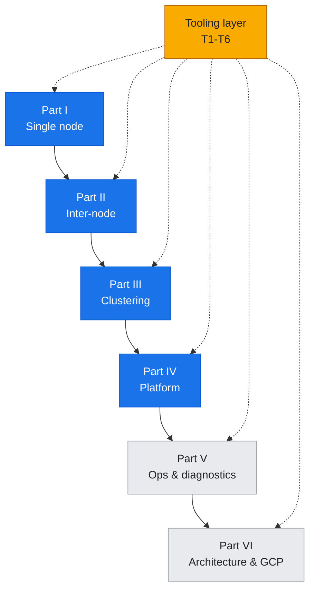
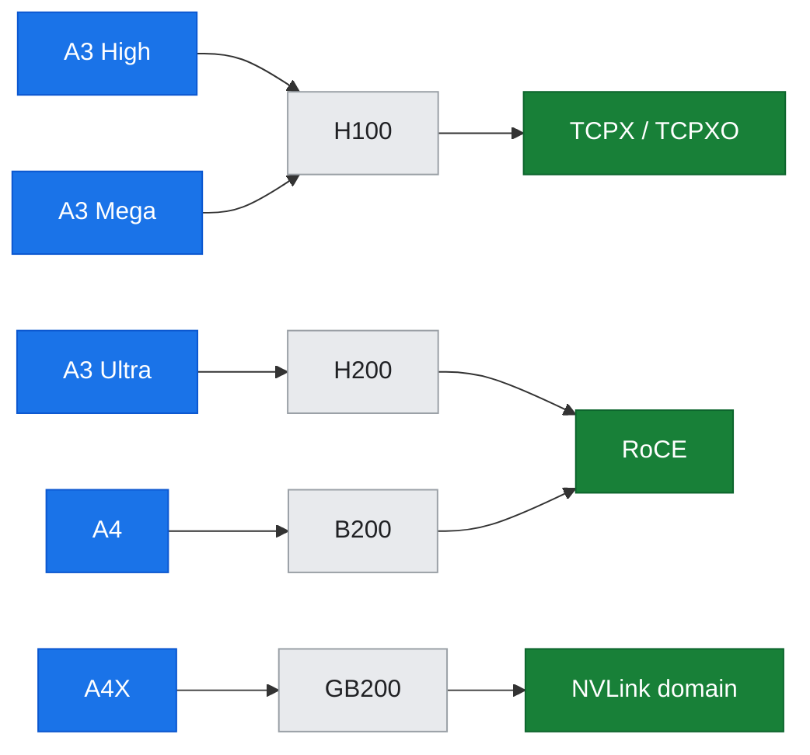
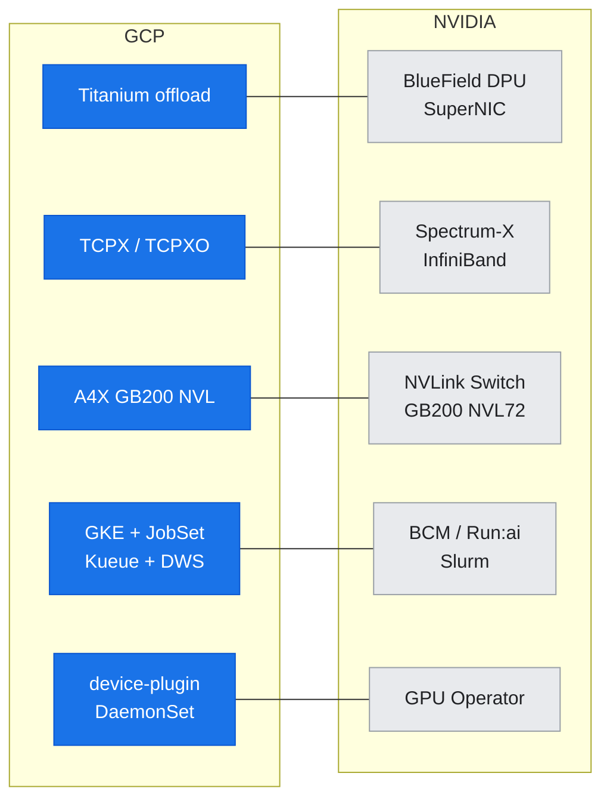

# Guide Overview

## What this guide is

This guide is a **standalone, comprehensive, hands-on introduction to the NVIDIA GPU and AI-infrastructure stack** — from a single GPU's silicon architecture, up through node and cluster communication, to the purpose-built AI-factory platforms NVIDIA ships (DGX/HGX systems, BlueField DPUs, Spectrum-X fabrics, DGX SuperPOD) — and on to the **operations/diagnostics** and **architecture/GCP-integration** skills engineers need to run and design real workloads. It teaches both the **mechanism** (why it works) and the **practice** (how to run, monitor, profile, benchmark, and debug) using the standard NVIDIA toolchain, backed by **labs executed live on real GKE A3 H100 clusters** — a 2-node cluster (16 × H100) and a 3-node cluster (24 × H100) that turns the inter-node cliff into a measured scaling *curve*.

### The journey: four foundational parts + two applied tracks

The guide walks one continuous, bottom-up path (Parts I–IV), then adds two applied tracks (Parts V–VI) that reuse the same stack and toolchain:

*Figure: the bottom-up spine — four stacked foundational parts plus two applied tracks, with the NVIDIA tooling layer (T1-T6) cutting across all of them.*

1. **Part I — Single node:** GPU microarchitecture (SMs, Tensor Cores, memory hierarchy), driver/CUDA stack and troubleshooting, single-GPU execution and profiling, and the 8-GPU NVLink/NVSwitch (HGX) fabric within a node.

2. **Part II — Inter-node communication:** NICs, RDMA, GPUDirect (TCPX/TCPXO/RoCE), and NCCL collectives that bind nodes into a single distributed computation. A **scaling bridge** (doc-15) extends the 2-node cliff into an 8/16/24-GPU curve on the 3-node cluster.

3. **Part III — Clustering and distributed execution:** GKE scheduling (device plugins, topology awareness, gang scheduling via JobSet/Kueue), distributed training frameworks (DDP/FSDP with `torchrun`), and fleet-scale observability (DCGM metrics pipelines, debugging stalled collectives).

4. **Part IV — Platform and reference architectures:** How NVIDIA builds AI factories — DGX/HGX systems and system-level troubleshooting (NVSM, Fabric Manager), BlueField DPUs and DOCA, Spectrum-X Ethernet vs. Quantum InfiniBand vs. cloud fabrics, and the DGX SuperPOD reference architecture. Each component is contrasted with what the GCP A3 lab demonstrates, clearly separating measured facts (from the live cluster) from reference-architecture knowledge.

5. **Part V — Operations, diagnostics & troubleshooting** *(scenario-based; **live** — captured on the 3-node cluster):* the skill Parts I–IV don't teach — **symptom → hypothesis → tool → read the output → root cause → fix**. A triage-method hub (doc-16), single-GPU/node health, inter-node comms debugging, cluster/job failure triage, and performance monitoring & day-2 operations, with the NVIDIA tools (`ncu`, `dcgmi dmon`, `nccl-tests`, `ethtool`, HTA, PromQL/Grafana) finally run *in anger*.

6. **Part VI — Architecture & GCP integration** *(design-first use-cases; docs 21–24 + labs 19–21 live, lab-18 staged):* how a GPU workload is actually architected and deployed on GCP — GKE network design as a decision (single-gVNIC measured; the GPUDirect-TCPX after staged on a new multi-network pool), the storage/data path (a live starved-vs-fed GPU swing), an end-to-end training pipeline (a 2-node/16-GPU JobSet training on GCS data), and inference serving + autoscale (a live saturation knee + near-linear 1→8-GPU scaling).

Cutting across all six parts is a **NVIDIA tooling layer** — monitoring (`nvidia-smi`, DCGM, `dcgm-exporter`), health and diagnostics (`dcgmi diag`, XID decode, `nvidia-bug-report.sh`), profiling (`nsys`, `ncu`, NVTX), benchmarking (`nvbandwidth`, `nccl-tests`), and fabric tools (`perftest`, `ethtool`, NCCL topology export) — taught in context as they appear and consolidated in cross-cutting reference docs.

---

## The clusters at a glance

Labs run on **two live GKE A3 High (H100) clusters** in project `hdlab-elideng`. They are the **same machine family** (`a3-highgpu-8g`, HGX H100 baseboard) but different clusters, so software versions can differ — which is why a scaling **curve** is always captured on a *single* cluster and any cross-cluster numbers are labelled as such, never spliced.

| Property | Documented lab cluster | Scaling / 3-node cluster |
| :--- | :--- | :--- |
| Cluster | `hypercomputer-a3-cluster` (GKE `v1.33`) | `hypercomputer-a3-asiaeast1` (GKE `v1.34`) |
| Region / zone | `us-central1` | `asia-east1-c` |
| GPU pool | `a3-h100-dws-pool` — **2 × `a3-highgpu-8g`** = **16 × H100 80GB** | `a3-high-flex-pool` — **3 × `a3-highgpu-8g`** = **24 × H100 80GB** |
| Provisioning | Dynamic Workload Scheduler (DWS) queued, 7-day holds | **Flex-start**, 7-day expiry (scarce; held, not drained) |
| Used by | Parts I–IV (labs 01–11), Part V/VI scenarios where either cluster fits | The 8/16/24-GPU scaling curve (labs 12–13, doc-15); cluster-failure & straggler scenarios needing room |

Each node = an HGX H100 8-GPU baseboard, exposing `nvidia.com/gpu: 8`. Auxiliary `default-pool` (e2-standard-4) carries control/CPU workloads.

Key facts verified during execution:
- **Both clusters are single-gVNIC / TCP today** — inter-node NCCL traverses the standard gVNIC/VPC TCP path (~28.6 GB/s floor), *not* GPUDirect. No multi-network CRDs, no TCPX/TCPXO/RDMA DaemonSets. Characterizing this actual path is a core Part II thread; **Part VI `lab-18` provisions a new multi-network node pool to enable GPUDirect-TCPX and measure the before/after**.
- No tenant-visible BlueField DPU, Spectrum-X SuperNIC, or DGX Fabric Manager is present on either cluster (this contrast is explored in Part IV).
- Flex capacity on the 3-node cluster is scarce and hard to re-grab, so resilience exercises inject faults at the **job/pod level** — no node is ever drained or deleted (the "always hold the GPU" posture).

Every documented measurement is traceable via the `VERIFICATION.md` provenance log, which records what was run, when, on which **cluster/nodes**, and which artifact resulted.

---

## GCP AI Hypercomputer GPU portfolio and product mapping

While the concrete labs run on the **A3 High (`a3-highgpu-8g`, H100)** cluster, the guide's scope covers the **full GCP AI Hypercomputer GPU landscape**, matching each concept to the specific product or family it applies to:

### GCP machine families

*Figure: the GCP GPU portfolio fans out family → GPU → inter-node fabric (TCPX vs TCPXO detail is in the table below).*

| GCP machine family | GPU | Inter-node GPU networking | Where it appears in the guide |
| :--- | :--- | :--- | :--- |
| A3 High (`a3-highgpu-8g`) — **the lab** | H100 80GB | GPUDirect-**TCPX** (gVNIC) | Parts I–III, measured live |
| A3 Mega (`a3-megagpu-8g`) | H100 80GB | GPUDirect-**TCPXO** | Part II/III contrast |
| A3 Ultra (`a3-ultragpu-8g`) | H200 141GB | **RoCE / GPUDirect-RDMA** (CX-7) | Part II + Part IV fabric contrast |
| A4 (`a4-highgpu-8g`) | Blackwell B200 | RoCE / GPUDirect-RDMA | Part I arch + Part IV |
| A4X (`a4x-highgpu-4g`) | GB200 (Grace-Blackwell) | RoCE + **NVLink domain** | Part IV (NVLink Switch System / NVL72) |

### GCP ↔ NVIDIA product mapping

The mechanisms and tools taught here are **platform-agnostic** and transfer to on-premises DGX/SuperPOD deployments, other clouds, bare metal, and Slurm or Kubernetes orchestration. Every GCP-specific step is flagged with its generic and cross-product equivalent:

*Figure: each GCP capability (left) maps to its NVIDIA purpose-built equivalent (right).*

- **Host/network offload:** GCP **Titanium** offload & custom fabric ↔ NVIDIA **BlueField DPU / SuperNIC** (explored in Part IV, section 12).
- **Inter-node GPU fabric:** GCP **GPUDirect-TCPX/TCPXO** (A3) and **GPUDirect-RDMA/RoCE** (A3 Ultra/A4) ↔ NVIDIA **Spectrum-X Ethernet** and **Quantum InfiniBand** (Part IV, section 13).
- **NVLink scale-up domains:** A4X **GB200 NVL** domains ↔ NVIDIA **NVLink Switch System / GB200 NVL72** (Part IV, section 14).
- **Cluster orchestration & scheduling:** **GKE + JobSet + Kueue + DWS** ↔ **Base Command Manager / Run:ai / Slurm** on DGX SuperPOD (Parts III and IV, sections 7–8, 14).
- **Managed drivers:** GKE **device-plugin DaemonSets** ↔ **NVIDIA GPU Operator** / DGX OS driver stack (Part I, section 2).

Part IV makes the cloud-vs-purpose-built-platform contrast explicit and always attributes each capability to the correct product on both sides.

---

## Running the labs safely

All lab work on the live GKE cluster follows these rules:

1. **Never touch DWS capacity holders.** The cluster uses Dynamic Workload Scheduler 7-day holds to keep GPU nodes provisioned. All lab workloads are separate, additive, and leave the holders untouched.

2. **All changes are additive and reversible.** Labs create new Pods, Jobs, JobSets, DaemonSets, and ConfigMaps with distinct names. Teardown instructions are provided at the end of each lab; follow them to clean up resources.

3. **Teardown after each lab.** Unless otherwise specified, delete the workloads you created before moving to the next lab to avoid resource contention and quota issues.

4. **Cluster state is shared.** If you see unexpected workloads or DaemonSets running (e.g., `nccl-fastsocket-installer`, `dcgm-exporter`), they may be left over from a prior lab or session. Follow the teardown steps in the relevant lab to clean them up, or check `VERIFICATION.md` for provenance.

---

## Reading order and the three-way spine

Each layer of the guide is built on a **three-way spine** that connects conceptual docs, hands-on labs, and tool references:

- **Docs** (in `docs/`) explain the mechanism: why it works, what the components are, how they interact, and where they fit in the stack.
- **Labs** (in `labs/`) provide step-by-step practice with real commands, manifests, and captured output, interpreting the results in light of the mechanism.
- **Toolkit references** (in `docs/toolkit/`) are cross-cutting deep-dives on the NVIDIA tools themselves — what they measure, how to invoke them, how to interpret their output, and when to use each one.

### Recommended reading order

**Start here:**
1. This overview doc (`docs/00-guide-overview.md`)
2. The README (`README.md`) for the repository map and setup instructions

**Then proceed layer by layer through the four foundational parts, then the two applied tracks:**

**Part I — Single Node:**
- Read: `docs/part1-single-node/01-gpu-microarchitecture.md`
- Practice: `labs/lab-01-gpu-arch-inspect/`
- Tools: `docs/toolkit/T1-monitoring-inventory.md`
- Repeat for sections 02 (drivers/CUDA), 03 (single-GPU profiling), and 04 (NVLink/HGX)

**Part II — Inter-node Communication:**
- Read: `docs/part2-inter-node/05-nic-rdma-gpudirect.md`
- Practice: `labs/lab-05-network-path-inspect/`
- Tools: `docs/toolkit/T5-networking-fabric-tools.md`
- Repeat for section 06 (NCCL collectives)
- **Scaling bridge:** `docs/15-scaling-shape-of-the-cliff.md` + `labs/lab-12-scaling-sweep/` — the 8/16/24-GPU curve on the 3-node cluster *(in build)*

**Part III — Clustering and Distributed Execution:**
- Read: `docs/part3-clustering-execution/07-gke-scheduling-topology.md`
- Practice: `labs/lab-07-gke-gang-schedule/`
- Proceed through sections 08 (JobSet/Kueue), 09 (DDP/FSDP), and 10 (observability); `labs/lab-13-topology-resilience/` covers 24-GPU gang placement + Flex-safe node-loss *(in build)*

**Part IV — Platform and Reference Architectures (knowledge-first):**
- Read: `docs/part4-platform-reference-arch/11-dgx-hgx-systems.md`
- Practice: `labs/lab-11-platform-compare/` (observe-and-compare exercises, contrasting the A3 lab with DGX/SuperPOD)
- Proceed through sections 12 (BlueField DPUs), 13 (Spectrum-X fabrics), and 14 (DGX SuperPOD)

**Part V — Operations, Diagnostics & Troubleshooting** *(scenario-based; **live** — captured on the 3-node cluster):*
- Start at the triage hub: `docs/part5-operations-diagnostics/16-diagnostic-method.md`
- Practice each scenario: `labs/lab-14-single-gpu-health-triage/`, `lab-15-internode-comms-debug/`, `lab-16-cluster-job-failure-triage/`, `lab-17-perf-monitoring-day2-ops/`
- Docs 17–20 pair with those labs; every scenario ends in a root cause or an operational decision

**Part VI — Architecture & GCP Integration** *(design-first; docs 21–24 + labs 19–21 live, lab-18 staged):*
- Read: `docs/part6-architecture-gcp-integration/21-gke-network-design.md`
- Practice: `labs/lab-19-storage-data-path/` (starved-vs-fed GPU), `lab-20-training-pipeline/` (2-node/16-GPU JobSet, data+code+ckpt on GCS), `lab-21-inference-serving/` (serving knee + 1→8-GPU scaling) — all live; `lab-18-enable-gpudirect-tcpx/` is staged (before measured; TCPX after blocked on a new multi-network pool)
- Docs 22–24 cover the storage/data path, the end-to-end pipeline, and inference serving + autoscale

**Cross-cutting toolkit references** are listed in each doc's "Tools in this layer" section and are consolidated under `docs/toolkit/`. Read them when a tool first appears or as needed.

**Quick references** (under `reference/`) provide look-up tables: the glossary, XID error codes, NCCL tunables, GPU driver matrix, tool command cheat-sheets, and the reference architecture cheat-sheet.

### Portability: GCP lab vs. generic NVIDIA platforms

While the labs execute on GCP, the guide is designed to be **platform-agnostic in its concepts**:
- GCP-specific commands (e.g., `gcloud`, GKE manifests with GKE-specific annotations) are flagged and paired with their generic equivalents (e.g., `kubectl`, standard Kubernetes device-plugin patterns, NVIDIA GPU Operator, Slurm `gres`).
- Purpose-built platform material (Part IV: DGX/HGX, BlueField, Spectrum-X, SuperPOD) is attributed to the correct NVIDIA and GCP products and contrasted with what the live cluster demonstrates, so the knowledge transfers correctly.
- The NVIDIA tools layer (monitoring, diagnostics, profiling, benchmarking, fabric tools) is the same on GCP, DGX, bare metal, and other clouds — the guide teaches it in depth once and applies it everywhere.

Refer to `docs/toolkit/T6-portability-matrix.md` for a comprehensive cross-platform reference.

---

## What's next

After reading this overview, proceed to the README for repository setup and environment instructions, then begin Part I with the GPU microarchitecture doc and lab.
