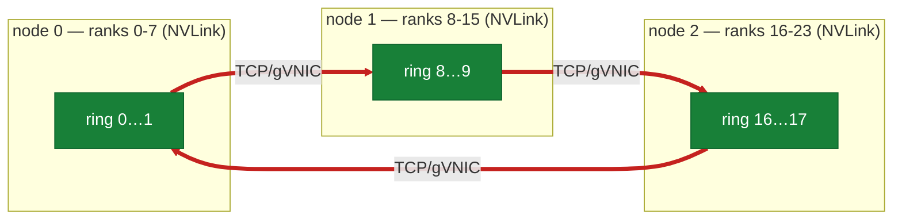
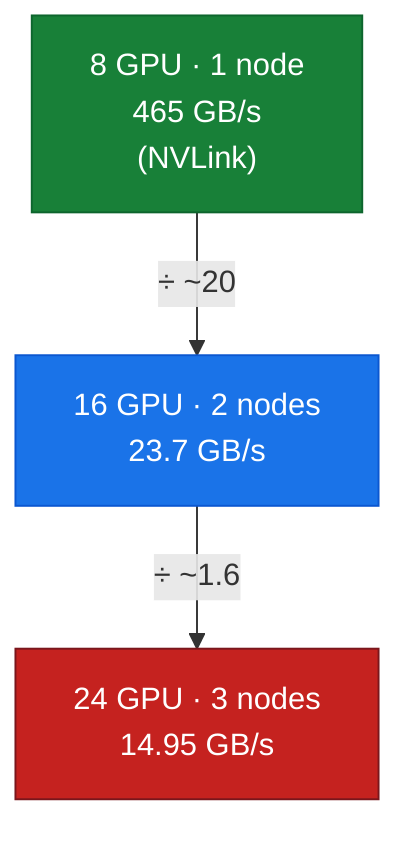
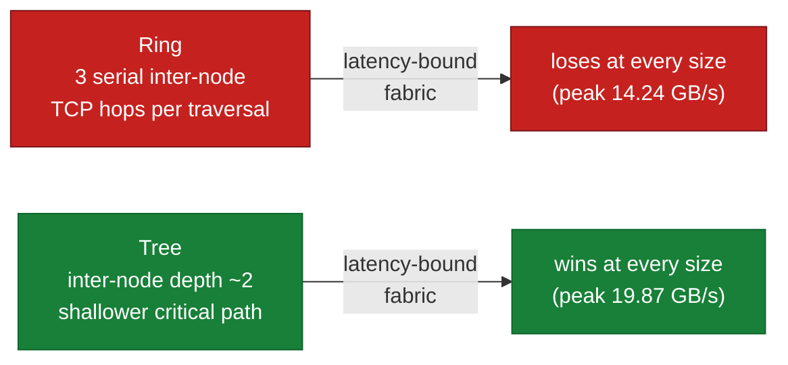

# 15 — Scaling: the Shape of the Cliff

## Overview

Part II established *the cliff*: the instant a collective's ring leaves a single node, all-reduce bandwidth falls ~17× from the NVLink world (~480 GB/s) to plain TCP (~28 GB/s). That is proven with **two** points on the node axis — 1 node and 2 nodes. Two points prove a cliff *exists*. They cannot show its **shape**.

This doc adds a **third** node (24 × H100 on `asia-east1-c`) and asks the questions two points cannot answer: as the ring gains a third inter-node hop, does peak busbw *hold* at a floor, or keep *descending*? Does the small-message latency floor keep climbing? Is the ring-vs-tree tradeoff — which doc-06 said "matters far less than the link" at 2 nodes — measurable once tree depth grows? Every number here is read off the live 3-node cluster.

**What you'll learn:**
- Why the inter-node number is a **descending curve** in node count, not a fixed floor
- How the **latency floor** grows with every node added to the ring
- Why the **8/16/24-GPU curve must live on one cluster** — and how to compare across clusters honestly
- Where **ring vs. tree** and **strong/weak scaling efficiency** become measurable (and where they don't)

**Hands-on practice:** [lab-12: scaling the cliff](../labs/lab-12-scaling-sweep/) (all-reduce sweep at 8/16/24 GPUs)

**Prerequisites:** the inter-node floor and busbw definition ([doc-06](part2-inter-node/06-nccl-collectives.md)); the intra-node ceiling ([doc-04](part1-single-node/04-intranode-nvlink-nvswitch-hgx.md)); distributed training step structure ([doc-09](part3-clustering-execution/09-distributed-training-ddp-fsdp.md)).

---

## The capture target: a second, larger cluster

The 3-node pool is a **different cluster** from the guide's documented 2-node lab. That is a first-class methodology fact, because a scaling curve that mixed clusters would confound *node count* with *software version*.

| Property | Guide's 2-node lab | This doc's 3-node target |
| :--- | :--- | :--- |
| Cluster | `hypercomputer-a3-cluster` | `hypercomputer-a3-asiaeast1` |
| Region / zone | `us-central1` | `asia-east1-c` |
| Pool | `a3-h100-dws-pool` — 2 × `a3-highgpu-8g` | `a3-high-flex-pool` — **3 ×** `a3-highgpu-8g` = **24 × H100** |
| Fabric (measured) | TCP / single gVNIC, no RDMA | TCP / single gVNIC, no RDMA |

**Therefore the 8/16/24-GPU curve is captured entirely on `asia-east1-c`.** The `us-central1` numbers appear only as a **labeled cross-cluster comparison**, never spliced into the same curve.

---

## Transport first: read it, don't assume it

Before any bandwidth number, lab-12 captures the `NCCL_DEBUG=INFO` transport at 24 GPUs. It is the same TCP path as the 2-node lab — no fabric appears with more nodes — but the ring is longer and crosses **three** node boundaries (`assets/lab-12/nccl_transport_24gpu.txt`, verbatim):

```
NCCL INFO NET/IB : No device found.
NCCL INFO NET/Socket : Using [0]eth0:10.140.0.7<0>
NCCL INFO Using network Socket
NCCL INFO NET/Socket : GPU Direct RDMA Disabled for HCA 0 'eth0'
NCCL INFO Channel 00/16 :  0 7 6 5 4 3 2 1  8 15 14 13 12 11 10 9  16 23 22 21 ...
```

*Figure: the 24-rank ring — three 8-GPU NVLink islands stitched by THREE TCP/gVNIC hops. Two nodes have one crossing; three nodes have three serial crossings, each staged GPU→host→NIC with no RDMA.*



`Channel 00/16` visits ranks `0..7` (node 0), `8..15` (node 1), `16..23` (node 2). The three crossings — `1→8`, `9→16`, `17→0` — are Ethernet; every other hop is NVLink. Three serial TCP hops now set the pace for all 24 GPUs.

---

## The curve: peak busbw *descends* with node count

lab-12's all-reduce sweep, all on `asia-east1-c`, `busbw = algbw·2(n-1)/n`, peak at 1 GiB:

| GPUs | Nodes | Fabric in play | Peak busbw (GB/s) | Latency floor (ms, 8 B) |
| ---: | ---: | :--- | ---: | ---: |
| 8 | 1 | NVLink4 / NVSwitch | **465.43** | 0.040 |
| 16 | 2 | + 1 TCP hop | 23.70 | 0.175 |
| 24 | 3 | + 3 TCP hops | **14.95** | 0.325 |

*Figure: the shape two points hide — an ~20× collapse leaving the node, then a further ~37% decline as the third TCP hop joins the ring. Not a floor; a slope.*



Three findings, none of which a 2-node pool can produce:

1. **The inter-node number is a descending curve, not a floor.** 2→3 nodes drops peak busbw a *further* ~37% (23.70 → 14.95 GB/s). A ring all-reduce is paced by its slowest link and **serializes through every inter-node hop**; a third TCP crossing adds another serial bottleneck, not parallel bandwidth. Anyone who saw only the 2-node point would model inter-node bandwidth as a constant — it is not.

2. **The latency floor climbs with every node.** 0.040 → 0.175 → 0.325 ms. Each node lengthens the ring and adds a TCP round-trip to the critical path. Small-message collectives degrade monotonically as the gang grows, which is exactly why frameworks bucket and fuse gradients before communicating ([doc-09](part3-clustering-execution/09-distributed-training-ddp-fsdp.md)) — and why that pressure *increases* with scale.

3. **This is genuine fabric inefficiency, not a data-volume artifact.** Because busbw already normalizes out the ring's inherent `2(n-1)/n` traffic growth, the 23.70 → 14.95 decline is the fabric getting less efficient *per byte* as hops accumulate — not merely "more GPUs move more data."

---

## Cross-cluster comparison (labeled, never spliced)

The 2-node point on this curve (16 GPU, **23.70 GB/s** on `asia-east1-c`) is *not* the same as lab-06's 2-node run (**~28.6 GB/s** on `us-central1`). Both are the same fabric class — plain TCP over a single gVNIC, no GPUDirect — but different clusters, possibly different GKE/driver/NCCL builds.

| 2-node all-reduce, 1 GiB | Cluster | Peak busbw |
| :--- | :--- | ---: |
| lab-06 | `us-central1` (`a3-h100-dws-pool`) | ~28.6 GB/s |
| lab-12 (16-GPU point) | `asia-east1-c` (`a3-high-flex-pool`) | 23.70 GB/s |

That ~20% gap is a **cross-cluster artifact**, not a point on the node-scaling curve. This is the discipline: node-count curves stay on one cluster; cross-cluster numbers are always labeled as such.

---

## Ring vs. tree at three nodes: tree wins *everywhere*

doc-06 noted that at 2 nodes the algorithm "matters far less than the link" — true, because 2 nodes share a single inter-node hop, so ring and tree traverse the same one crossing and land within noise of each other. At **three** nodes that equivalence breaks, and lab-12b measures how. Forcing `NCCL_ALGO=Ring` then `NCCL_ALGO=Tree` at 24 GPUs (same `NCCL_PROTO=Simple`, same sweep — so the only variable is the algorithm; the ~40% divergence in the curves below is itself the proof the forcing took effect):

| Message size | Ring busbw (GB/s) | Tree busbw (GB/s) | Tree advantage |
| ---: | ---: | ---: | ---: |
| 128 KB | 0.07 | 0.46 | ~6.6× |
| 512 KB | 0.13 | 1.44 | ~11× |
| 4 MB | 1.01 | 4.54 | ~4.5× |
| 32 MB | 5.48 | 14.45 | ~2.6× |
| 128 MB | 10.25 | 17.33 | ~1.7× |
| 512 MB | 13.67 | 19.87 | ~1.5× |
| 1 GB | 14.24 | 17.98 | ~1.3× |

*Figure: at 3 nodes on this TCP fabric there is no textbook crossover — Tree beats Ring at every message size, by ~11× in the mid-range and still ~1.3× at 1 GiB.*



Two things a 2-node pool cannot surface:

1. **No crossover — tree dominates across the whole range.** The classic story (tree wins small messages, ring wins large ones) does *not* hold here. On a latency-bound TCP fabric, ring's pipeline threads every chunk through **three serial inter-node hops**, while tree's inter-node reduction has depth ~2 and a shallower critical path. That advantage is largest where latency dominates (mid-range, ~11×) and narrows but never reverses as messages grow (still ~1.3× at 1 GiB). The link is *not* the only thing that matters once there are ≥3 nodes — the algorithm's inter-node hop count does too.

2. **NCCL's default leaves bandwidth on the table.** The auto-selected 24-GPU run (§ the curve above, 14.95 GB/s peak) tracks **ring**, not tree — so on this fabric the default all-reduce is ~20–30% slower than an explicit `NCCL_ALGO=Tree` at large sizes. That is an actionable tuning finding that only appears at ≥3 nodes: at 2 nodes there was nothing to tune because both algorithms shared the one hop.

*(Captured in `assets/lab-12/ringtree_{ring,tree}.txt` and `ringtree_crossover.csv`; run via `labs/lab-12-scaling-sweep/run_ringtree.sh`.)*

## Strong / weak scaling efficiency: the curve reaches training

Scaling *efficiency* is a slope, and a single 2-node step-time is one point. lab-12c runs the same 1B-parameter synthetic model (reused from lab-09) under DDP and FSDP at 8/16/24 GPUs, so the communication curve above can be tied to real training throughput. The efficiency does not just drop — it **collapses**, and the collapse is a *curve*.

**Weak scaling** (per-rank batch fixed at 16; global batch grows with GPU count; ideal = linear samples/s):

| Mode | 8 GPU | 16 GPU | 24 GPU |
| :--- | ---: | ---: | ---: |
| DDP — step time | 58 ms | 375 ms | 713 ms |
| DDP — efficiency | 100% | **15.5%** | **8.2%** |
| FSDP — step time | 37 ms | 551 ms | 644 ms |
| FSDP — efficiency | 100% | 6.7% | 5.7% |

**Strong scaling** (global batch fixed at 384; per-rank batch shrinks; ideal = step time falls 1/N):

| Mode | 8 GPU | 16 GPU | 24 GPU |
| :--- | ---: | ---: | ---: |
| DDP — step time | 60 ms | 436 ms | 728 ms |
| DDP — efficiency | 100% | 6.8% | 2.7% |

*Figure: training-throughput scaling efficiency is a collapsing curve — the ~6.5× step-time jump at 8→16 GPUs is the ~4.3 GB gradient all-reduce leaving NVLink for the ~24 GB/s TCP fabric; the 16→24 decline is the same fabric getting worse with a third hop.*


What only three points can show:

1. **Efficiency is a slope, not a step.** DDP weak-scaling efficiency falls 100% → 15.5% → 8.2%. A 2-node run gives you the 15.5% and nothing else — you could not tell whether adding a third node would recover (compute amortizing comms) or keep falling. It keeps falling, because the added node adds a slower fabric hop (12a), not more effective bandwidth. The step-time arithmetic matches: a ~4.3 GB fp32 gradient all-reduce at ~13 GB/s effective algbw is ~340 ms, which is essentially the entire 375 ms 16-GPU step.

2. **FSDP is hit harder than DDP across the node boundary.** FSDP trades DDP's single gradient all-reduce for an all-gather (forward) **plus** a reduce-scatter (backward) — more inter-node traffic per step — so its efficiency craters faster (6.7% vs 15.5% at 2 nodes). On a fast fabric FSDP's memory savings dominate; on this TCP floor the extra collectives dominate instead. That trade only becomes visible once the collectives cross the node boundary.

3. **Strong scaling is worse than weak.** Fixing the global batch (strong) shrinks each GPU's compute while the comms grows, so there is even less compute to hide the all-reduce behind: 6.8% at 2 nodes, 2.7% at 3. The comms-bound regime is laid bare.

> **Honest framing.** These are deliberately comms-bound numbers: a communication-heavy model on a plain-TCP fabric with small per-step compute, chosen to *isolate* the fabric's effect on scaling. Production training overlaps comms with compute, uses larger batches, and — crucially — a faster fabric (TCPX/RDMA) that lifts 12a's busbw ceiling. The absolute efficiencies would improve; the **shape** (a descending curve driven by inter-node bandwidth) is the transferable lesson, and it is exactly what a third node makes measurable.

*(Captured in `assets/lab-12/train_{weak,strong}_scaling.csv` and `train_*_{ddp,fsdp}_*gpu.txt`; run via `labs/lab-12-scaling-sweep/run_training.sh`.)*

---

## Summary

**Key takeaways:**
1. The inter-node all-reduce number is a **descending curve** in node count (465 → 23.7 → 14.95 GB/s across 1/2/3 nodes), because a ring serializes through every inter-node hop — not a fixed floor.
2. The **latency floor grows** with every node (0.040 → 0.175 → 0.325 ms); small-message collectives get monotonically worse with scale.
3. **busbw normalizes** the ring's traffic growth, so the decline is real per-byte fabric inefficiency.
4. At **≥3 nodes the algorithm matters again**: forced Tree beats Ring at every message size (~11× mid-range), and NCCL's default (ring-like) leaves ~20–30% unclaimed — invisible at 2 nodes.
5. **Training efficiency collapses as a curve**: DDP weak-scaling efficiency 100% → 15.5% → 8.2%; FSDP falls faster (extra collectives); strong scaling worse still (2.7% at 24 GPU). The comms curve reaches real throughput.
6. Node-scaling curves are captured on **one cluster**; the ~28.6 GB/s `us-central1` figure is a labeled cross-cluster comparison, not a curve point. The transport is **read off the wire** at every step — still plain TCP/gVNIC at 24 GPUs.

**Next steps:**
- [lab-12](../labs/lab-12-scaling-sweep/) — reproduce the curve; run the ring/tree and training-efficiency sweeps
- [doc-06](part2-inter-node/06-nccl-collectives.md) — the 2-node cliff this curve extends
- [doc-09](part3-clustering-execution/09-distributed-training-ddp-fsdp.md) — the collective inside a real training step
