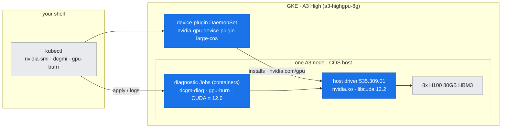
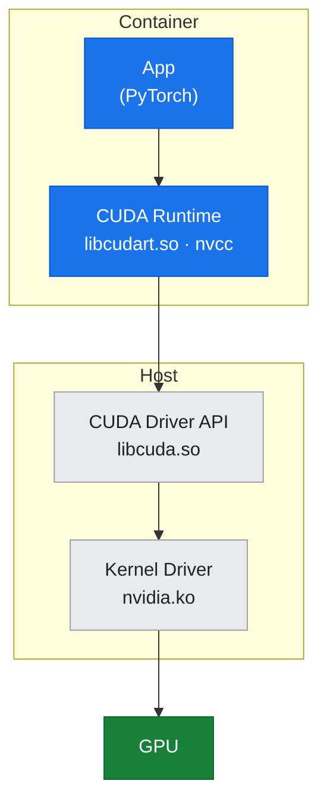
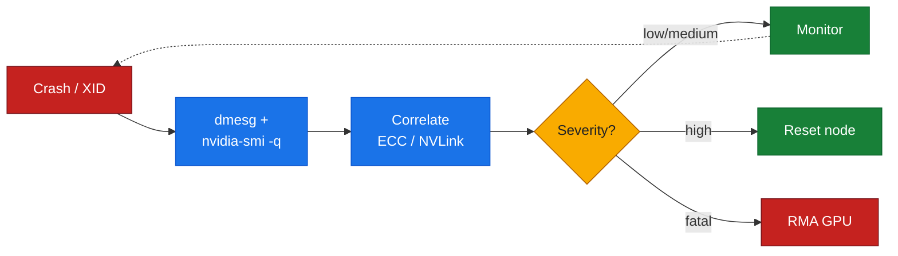
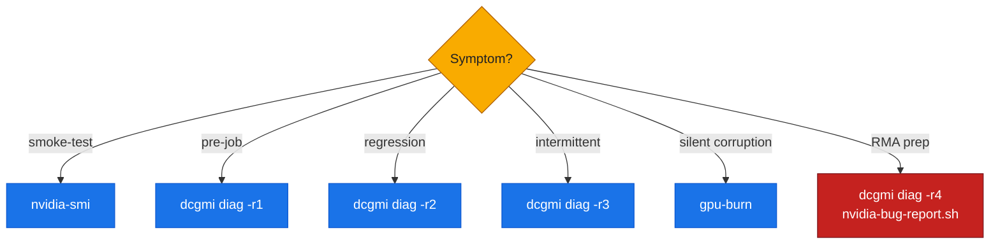

# 02: Driver and CUDA Stack — Installation, Troubleshooting, and Health Diagnostics

## Overview

This document covers the NVIDIA GPU driver and CUDA stack on GCP, focusing on:
- **Driver branches** (LTSB, PB, NFB) and GCP's recommended versions
- **Installation models**: GKE managed (device-plugin DaemonSets) vs. GCE manual (`.run` installer) vs. GPU Operator
- **CUDA toolkit vs. driver compatibility**
- **Health diagnostics workflow**: `nvidia-smi` → DCGM → `gpu-burn` → `nvidia-bug-report.sh`
- **XID error taxonomy** and troubleshooting

All examples are validated against live diagnostics from a GKE **A3 High** (`a3-highgpu-8g`) H100 cluster (Lab 02).

---

## Where this fits (the environment)

*Where this fits: the GKE-managed driver stack on one A3 node — a device-plugin DaemonSet installs driver 535.309.01 on the COS host, and this doc's diagnostics (`nvidia-smi`, DCGM, `gpu-burn`) run as containers/Jobs against it.*



---

## Driver Branches and Version Selection

NVIDIA provides three driver branches with different support lifecycles and update cadences. Choosing the right branch is critical for production stability.

### NVIDIA Driver Branches

| Branch | Name | Focus | Support Lifecycle | Use Case |
|:-------|:-----|:------|:------------------|:---------|
| **LTSB** | Long-Term Support Branch | Stability, minimal changes | **3 years** | Production workloads, regulated environments, clusters requiring stable driver baselines |
| **PB** | Production Branch | Performance, new hardware support | **~1 year** | Bleeding-edge hardware, performance-critical workloads, early access to new GPU features |
| **NFB** | New Feature Branch | Experimental features, beta APIs | **No production support** | Testing, development, feature preview only |

**Recommendation for GCP AI workloads:** **LTSB (R580)** or its predecessor **R535** (current on many GKE clusters). LTSB prioritizes stability over feature velocity, which aligns with long-running training jobs and multi-month model development cycles.

---

### GCP Driver Matrix

The table below (from GCP documentation) shows the recommended driver versions for each GPU machine type. The full matrix is maintained in `../../reference/driver-matrix.md`.

| Machine Type | GPU Model | Recommended Branch | Min Driver Version (Linux) |
|:-------------|:----------|:-------------------|:---------------------------|
| **A3 Ultra** | H200 (141GB HBM3e) | R580 | 580.95.05 |
| **A3 Mega/High/Edge** | H100 (80GB HBM3) | R580 | 580.95.05 |
| **A2 Standard/Ultra** | A100 | R580 | 580.95.05 |
| **G2** | L4 | R580 | 580.95.05 |
| **N1** | T4, V100, P100, P4 | R580 | 580.95.05 |

**Verified on live cluster (Lab 02, 2026-07-21):**  
The GKE **A3 High** (`a3-highgpu-8g`) H100 cluster used in this guide is running:
- **Driver:** 535.309.01 (R535 LTSB, predecessor to R580)
- **CUDA Driver API:** 12.2
- **CUDA Runtime** (from container): 12.6

**Note:** The live cluster runs R535 instead of the recommended R580. This is expected in production GKE clusters that have not yet upgraded to the latest driver. R535 is fully functional and stable for H100 workloads; GKE managed driver upgrades will transition clusters to R580 over time. The guide documents the observed reality.

---

## Installation Models

How the NVIDIA driver is installed depends on the compute environment: GKE managed clusters, GCE VMs, or GPU Operator (for self-managed Kubernetes).

### 1. GKE Managed Driver (Recommended for GKE)

**How it works:**  
GKE automatically installs and manages the NVIDIA driver via a **device-plugin DaemonSet** (`nvidia-gpu-device-plugin-large-cos` or similar). The driver is pre-installed on GKE node images (Container-Optimized OS or Ubuntu), and the device plugin exposes GPUs to the kubelet as the `nvidia.com/gpu` resource.

**Verified on live cluster (Lab 02):**
```bash
$ kubectl get daemonset -n kube-system | grep nvidia
nvidia-gpu-device-plugin-large-cos   2         2         2       2            2           <none>          4d12h
```

**Advantages:**
- **Zero-touch installation:** Driver is pre-installed and version-matched to the node OS and GPU model.
- **Automatic upgrades:** GKE manages driver updates during node-pool upgrades.
- **Integrated with GKE lifecycle:** Driver health is monitored by GKE control plane.

**Disadvantages:**
- **Limited driver version control:** You cannot pin a specific driver version; GKE chooses the driver based on node image and GPU model.
- **Opaque upgrade path:** Driver upgrades happen during node-pool version upgrades; you cannot test driver updates independently.

**When to use:** Default choice for GKE. Only override if you need a specific driver version not yet available in GKE node images (rare).

**Device Plugin Spec:**
The device plugin runs as a DaemonSet on GPU nodes and performs these tasks:
1. Detects GPUs via NVML (NVIDIA Management Library)
2. Registers GPUs with the kubelet as `nvidia.com/gpu` resources
3. Monitors GPU health (XIDs, ECC errors) and reports failures to the control plane
4. Allocates GPUs to pods via environment variables (`NVIDIA_VISIBLE_DEVICES`)

**Observing the device plugin:**
```bash
kubectl logs -n kube-system daemonset/nvidia-gpu-device-plugin-large-cos
```

---

### 2. GCE Manual Installation (`.run` Installer)

**How it works:**  
On GCE VMs (Compute Engine instances, not GKE), you manually download and run the NVIDIA `.run` installer:

```bash
# Download driver (example: R535 LTSB)
wget https://us.download.nvidia.com/tesla/535.309.01/NVIDIA-Linux-x86_64-535.309.01.run

# Install
sudo sh NVIDIA-Linux-x86_64-535.309.01.run --silent --dkms

# Verify
nvidia-smi
```

**Advantages:**
- **Full control:** You choose the exact driver version and build flags.
- **DKMS integration:** Driver is rebuilt automatically when kernel updates.
- **Supports older GPUs:** Can install legacy drivers not available in GKE node images.

**Disadvantages:**
- **Manual lifecycle:** You are responsible for driver upgrades, kernel compatibility testing, and rollback.
- **No health monitoring:** GCE does not monitor driver health; you must implement your own monitoring (DCGM, custom scripts).

**When to use:**
- GCE VMs (not GKE)
- Custom kernel configurations
- Specific driver versions required for application compatibility

**Installation checklist:**
1. Install kernel headers: `sudo apt-get install linux-headers-$(uname -r)`
2. Disable Nouveau (open-source NVIDIA driver): add `blacklist nouveau` to `/etc/modprobe.d/blacklist-nouveau.conf`, rebuild initramfs
3. Reboot
4. Run installer with `--dkms` flag (builds driver for current kernel)
5. Enable persistence mode: `sudo nvidia-smi -pm 1`
6. Verify: `nvidia-smi`

---

### 3. NVIDIA GPU Operator (Self-Managed Kubernetes)

**How it works:**  
The **NVIDIA GPU Operator** is a Kubernetes operator that automates driver installation, device plugin deployment, and DCGM setup. It is the **community-standard** approach for self-managed Kubernetes (e.g., on-prem clusters, EKS, AKS).

**Components:**
- **NVIDIA Driver DaemonSet:** Installs the driver on each GPU node (via a privileged container)
- **NVIDIA Device Plugin:** Exposes GPUs to the kubelet
- **DCGM Exporter:** Exports GPU telemetry to Prometheus
- **Node Feature Discovery (NFD):** Labels nodes with GPU capabilities

**Advantages:**
- **Declarative driver management:** Driver version is specified in a Helm chart; upgrades are Kubernetes-native (change chart, apply).
- **Built-in observability:** DCGM exporter is bundled; no separate installation required.
- **Cross-platform:** Works on any Kubernetes distribution (EKS, AKS, Rancher, OpenShift, bare-metal).

**Disadvantages:**
- **Not needed on GKE:** GKE provides managed drivers; installing GPU Operator adds complexity.
- **Privilege escalation:** Driver installation requires privileged containers and host filesystem access; increases security surface.

**When to use:**
- Self-managed Kubernetes on GCE, AWS, Azure, or on-prem
- When you need declarative driver lifecycle management
- When you want integrated DCGM observability

**Not recommended for GKE:** GKE's managed driver model is simpler and better integrated with GKE control plane.

**Installation (Helm):**
```bash
helm repo add nvidia https://helm.ngc.nvidia.com/nvidia
helm install gpu-operator nvidia/gpu-operator \
  --set driver.version=535.309.01 \
  --namespace gpu-operator --create-namespace
```

---

## CUDA Toolkit vs. Driver

Understanding the difference between the **CUDA Toolkit** (application-level) and the **CUDA Driver** (kernel-level) is critical for troubleshooting version mismatches.

### CUDA Stack Layers

*Figure: the CUDA stack — the top two layers ship in the container, the bottom two live on the host.*



| Layer | Component | Installed Where | Version Managed By |
|:------|:----------|:----------------|:-------------------|
| **Application** | Your code (PyTorch, TensorFlow, custom CUDA kernels) | Container or VM filesystem | You (via Dockerfile or `pip install`) |
| **CUDA Runtime** | `libcudart.so`, `nvcc` (compiler) | Container or VM filesystem | You (via CUDA Toolkit installer or base image) |
| **CUDA Driver API** | `libcuda.so` (kernel-mode driver interface) | Host OS (mounted into container) | GKE (via device plugin) or you (on GCE) |
| **Kernel Driver** | `nvidia.ko` (GPU kernel module) | Host OS | GKE (via node image) or you (on GCE) |

**Key insight:** The **CUDA Runtime** (toolkit) is forward-compatible with the **CUDA Driver**. A container with CUDA 12.6 can run on a host with CUDA driver 12.2 or later. The driver version is the **minimum** required; newer runtimes work on older drivers (within the same major version).

---

### Verified from Lab 02

```bash
$ nvidia-smi
Driver Version: 535.309.01    CUDA Version: 12.2

$ nvcc --version
Cuda compilation tools, release 12.6, V12.6.77
```

**Interpretation:**
- **Driver:** 535.309.01 (installed on host by GKE)
- **CUDA Driver API:** 12.2 (exposed by the driver)
- **CUDA Runtime:** 12.6 (from container image `nvcr.io/nvidia/pytorch:24.10-py3`)

**Compatibility:** ✓ CUDA Runtime 12.6 is compatible with CUDA Driver 12.2 (12.6 ≥ 12.2).

---

### Compatibility Rules

1. **Major version match:** CUDA Runtime major version must match CUDA Driver major version (e.g., Runtime 12.x requires Driver 12.x).
2. **Minor version forward-compatibility:** CUDA Runtime minor version can be **greater than or equal to** CUDA Driver minor version (Runtime 12.6 works with Driver 12.2).
3. **Reverse compatibility (limited):** Older CUDA Runtimes (e.g., 12.0) work with newer drivers (e.g., 12.6), but you lose access to new driver features.

**Example scenarios:**

| Runtime | Driver | Compatible? | Notes |
|:--------|:-------|:------------|:------|
| 12.6 | 12.2 | ✓ Yes | Forward-compatible (runtime newer than driver) |
| 12.2 | 12.6 | ✓ Yes | Backward-compatible (but new driver features unavailable to runtime) |
| 12.6 | 11.8 | ✗ No | Major version mismatch |
| 11.8 | 12.2 | ✗ No | Major version mismatch |

**Troubleshooting version mismatches:**
- **Symptom:** Application fails with `CUDA driver version is insufficient for CUDA runtime version`
- **Cause:** CUDA Runtime major version > CUDA Driver major version (e.g., Runtime 13.x, Driver 12.x)
- **Fix:** Upgrade driver or downgrade runtime (typically, upgrade driver to match runtime)

---

## Health Diagnostics Workflow

This section demonstrates the **validated diagnostic workflow** from Lab 02. Every command below was executed on the live GKE A3 H100 cluster.

### Step 1: Quick Health Check (`nvidia-smi`)

**Purpose:** Verify driver is loaded, GPUs are enumerable, and no critical faults are present.

**Command:**
```bash
nvidia-smi
```

**Verified output (Lab 02):**
```
Driver Version: 535.309.01    CUDA Version: 12.2
GPU 0: NVIDIA H100 80GB HBM3 (UUID: GPU-cd96915b-9acb-ad84-aaa4-d61ddd4984d2)
```

**What to check:**
- Driver version matches expected (or is compatible)
- All GPUs are listed (8 for A3 High)
- No XIDs or ECC errors in the output
- Temperature and power are within normal range

**Detailed query (from Lab 02):**
```bash
nvidia-smi --query-gpu=driver_version,name,vbios_version --format=csv
```

**Output:**
```
driver_version, name, vbios_version
535.309.01, NVIDIA H100 80GB HBM3, 96.00.CF.00.01
```

---

### Step 2: Detailed State Query

**Purpose:** Inspect ECC errors, throttle reasons, thermal state, and power draw.

**Command:**
```bash
nvidia-smi -q -d ECC,PERFORMANCE,TEMPERATURE,POWER
```

**Key sections from Lab 02 output:**

#### ECC Status
```
ECC Mode
    Current                           : Enabled
    Pending                           : Enabled
ECC Errors
    Volatile
        SRAM Correctable              : 0
        SRAM Uncorrectable Parity     : 0
        SRAM Uncorrectable SEC-DED    : 0
        DRAM Correctable              : 0
        DRAM Uncorrectable            : 0
    Aggregate
        DRAM Correctable              : 0
        DRAM Uncorrectable            : 0
```

**Interpretation:** ✓ ECC is enabled, zero errors (healthy).

---

#### Throttle Reasons
```
Clocks Event Reasons
    Idle                              : Active
    Applications Clocks Setting       : Not Active
    SW Power Cap                      : Not Active
    HW Slowdown                       : Not Active
        HW Thermal Slowdown           : Not Active
        HW Power Brake Slowdown       : Not Active
    Sync Boost                        : Not Active
    SW Thermal Slowdown               : Not Active
```

**Interpretation:** ✓ GPU is idle (no workload); no throttling due to thermal or power constraints.

---

#### Thermal State
```
Temperature
    GPU Current Temp                  : 33 C
    GPU T.Limit Temp                  : 54 C
    Memory Current Temp               : 37 C
```

**Interpretation:** ✓ Idle temperatures are normal (33°C GPU, 37°C memory). Under load, expect 60-80°C.

---

#### Power State
```
GPU Power Readings
    Power Draw                        : 93.17 W
    Current Power Limit               : 700.00 W
    Default Power Limit               : 700.00 W
```

**Interpretation:** ✓ Idle power draw ~93W. H100 TDP is 700W; under full load, expect 500-700W.

---

### Step 3: DCGM Diagnostics

**Purpose:** Run hardware-level diagnostics (PCIe bandwidth, memory, compute stress).

**Command (via DCGM container on GKE):**
```bash
# From Lab 02: deployed as a Kubernetes Job
kubectl apply -f dcgm-job.yaml
kubectl logs job/dcgm-diag
```

**Verified output (Lab 02):**
```
Successfully ran diagnostic for group.
+---------------------------+------------------------------------------------+
| Diagnostic                | Result                                         |
+===========================+================================================+
| DCGM Version              | 3.3.8                                          |
| Driver Version Detected   | 535.309.01                                     |
|-----  Deployment  --------+------------------------------------------------|
| Denylist                  | Pass                                           |
| NVML Library              | Pass                                           |
| CUDA Main Library         | Pass                                           |
| Permissions and OS Blocks | Pass                                           |
| Persistence Mode          | Pass                                           |
| Environment Variables     | Pass                                           |
| Page Retirement/Row Remap | Pass                                           |
| Graphics Processes        | Pass                                           |
| Inforom                   | Pass                                           |
+-----  Integration  -------+------------------------------------------------+
| PCIe                      | Pass - All                                     |
+-----  Hardware  ----------+------------------------------------------------+
| GPU Memory                | Pass - All                                     |
+---------------------------+------------------------------------------------+
```

**Interpretation:** ✓ All DCGM Level 2 diagnostics passed. GPU hardware is healthy.

**Note on Persistence Mode:** DCGM reported "Persistence mode for GPU 0 is disabled." This is cosmetic; persistence mode keeps the driver loaded between jobs (reduces initialization latency). It is not required for correctness, and on GKE, driver lifecycle is managed by the device plugin.

---

### Step 4: GPU Burn (Correctness Stress Test)

**Purpose:** Validate numerical correctness under sustained compute load. Detects silent corruption not caught by DCGM.

**Command (via container on GKE):**
```bash
# From Lab 02: deployed as a Kubernetes Job
kubectl apply -f gpu-burn-job.yaml
kubectl logs job/gpu-burn-test
```

**Verified output (Lab 02):**
```
GPU 0: NVIDIA H100 80GB HBM3 (UUID: GPU-cd96915b-9acb-ad84-aaa4-d61ddd4984d2)
Burning for 60 seconds.

Killing processes.. done

Tested 1 GPUs:
	GPU 0: OK
```

**Interpretation:** ✓ GPU produced correct matrix multiplication results for 60 seconds under full load. No silent corruption detected.

**Why gpu-burn matters:** DCGM tests hardware (ECC, PCIe, memory bandwidth), but `gpu-burn` tests **numerical correctness**. A GPU can pass DCGM and still produce wrong results due to marginal SRAM, clock instability, or firmware bugs. `gpu-burn` catches these.

---

### Step 5: XID and dmesg Inspection

**Purpose:** Check kernel logs for GPU fault events (XIDs).

**Command:**
```bash
dmesg | grep -i -E 'NVRM|Xid'
```

**Challenge on GKE Container-Optimized OS:**  
On Lab 02, direct `dmesg` access was **restricted** in containers:
```
dmesg: read kernel buffer failed: Operation not permitted
```

**Workaround:**  
Use `kubectl get events` to inspect node-level GPU events:
```bash
kubectl get events --all-namespaces --field-selector involvedObject.kind=Node,involvedObject.name=<node> -o wide
```

**Verified on Lab 02:** No XID events were present (healthy cluster).

**XID Reference:** See `../../reference/xid-table.md` for the full XID taxonomy (codes 13, 31, 43, 48, 63, 64, 74, 79, 94, 95 documented).

---

### Step 6: nvidia-bug-report.sh (For RMA or Support Cases)

**Purpose:** Collect comprehensive diagnostic data for NVIDIA support or RMA.

**Command:**
```bash
sudo nvidia-bug-report.sh
```

**Output:** A `.gz` tarball containing:
- System info (CPU, memory, kernel, BIOS)
- GPU inventory (all GPUs, PCI topology, firmware)
- Driver state (modules, versions, logs)
- Error counters (ECC, XIDs, page retirement)

**When to run:**
- Before opening an NVIDIA support case or RMA
- After encountering a driver crash or XID event
- During intermittent issues (capture immediately after symptom)

**Not demonstrated in Lab 02** (cluster is healthy; no faults to report).

---

## XID Error Taxonomy

XIDs (eXception IDs) are fault codes emitted by the NVIDIA driver when a GPU anomaly is detected. They are the **primary fault-reporting mechanism** in Linux.

*Figure: the XID triage loop — from crash to action, classifying severity (fatal/RMA in red).*



### Where XIDs Appear

1. **Kernel ring buffer:** `dmesg | grep NVRM`
2. **System log:** `grep NVRM /var/log/syslog` or `journalctl -k | grep NVRM`
3. **DCGM:** `dcgmi dmon -e` (real-time XID monitoring)

**On GKE COS:** `dmesg` may be restricted in containers. Use `kubectl get events` or node-level debugging pods.

---

### Common XID Codes

The full table is in `../../reference/xid-table.md`. Key codes:

| XID | Meaning | Severity | Action |
|:----|:--------|:---------|:-------|
| **13** | Graphics Engine Exception | Medium | Check for driver/firmware mismatch, review app logs, consider driver update |
| **31** | GPU Memory Page Fault | Medium | Check app for out-of-bounds access, review CUDA error handling |
| **43** | GPU Stopped Responding (Timeout) | High | Check for infinite loop in kernel, thermal throttle, or power issue; may require reset |
| **48** | Double Bit ECC Error (Uncorrectable) | **Critical** | DRAM defect; check ECC counters, RMA GPU if errors recur |
| **63** | Row Remapping Event | Low | GPU firmware remapped a failing DRAM row; normal if infrequent |
| **64** | Row Remapping Failure | **Fatal** | GPU ran out of spare rows; RMA required |
| **74** | NVLink Error | High | NVLink CRC error; check topology, Fabric Manager, cable seating |
| **79** | GPU Fallen Off the Bus | **Fatal** | PCIe link lost; reseat GPU, inspect hardware, likely RMA |
| **94** | Contained ECC Error | Medium | ECC error isolated to app context; monitor rate |
| **95** | Uncontained ECC Error | **Severe** | ECC error propagated to system; check for corruption, RMA if persistent |

---

### Interpreting XIDs: Symptom → Cause → Action

**Example workflow:**
1. **Symptom:** Training job crashes after 2 hours
2. **Check for XID:** `dmesg | grep Xid` → finds `Xid 48` (double-bit ECC error)
3. **Correlate:** `nvidia-smi -q -d ECC` → uncorrectable error count incremented
4. **Action:** Reboot node, re-run DCGM Level 3 diagnostics; if errors recur, RMA GPU

**Lab 02 result:** No XIDs observed (healthy cluster).

---

## Thermal and Power Throttling

GPUs throttle clocks in response to thermal (temperature) or power (TDP limit) constraints. Unexpected throttling indicates a problem.

### Throttle Reasons

From `nvidia-smi -q -d PERFORMANCE` (Lab 02):

| Reason | Meaning | Typical Cause |
|:-------|:--------|:--------------|
| **Idle** | GPU is idle | Normal |
| **HW Slowdown** | Hardware-imposed throttle | Temperature or power exceeded threshold |
| **HW Thermal Slowdown** | Temperature-based throttle | Insufficient cooling, blocked airflow |
| **HW Power Brake Slowdown** | Power delivery insufficient | PSU undersized, voltage droop, cable issue |
| **SW Power Cap** | Software-imposed power limit | Intentional capping via `nvidia-smi -pl` |
| **Sync Boost** | Multi-GPU clock sync | All GPUs run at slowest GPU's clock (NVLink) |

**Lab 02 result:** All throttle reasons were "Not Active" (GPU idle, no workload).

---

## GKE-Specific Considerations

### Device Plugin DaemonSet

**Observed on Lab 02:**
```bash
kubectl get daemonset -n kube-system | grep nvidia
nvidia-gpu-device-plugin-large-cos   2         2         2       2            2
```

The device plugin runs on every GPU node and:
- Exposes GPUs to the kubelet as `nvidia.com/gpu` resources
- Monitors GPU health (XIDs, ECC errors)
- Allocates GPUs to pods via `NVIDIA_VISIBLE_DEVICES`

**Pod GPU allocation:** When a pod requests `nvidia.com/gpu: 1`, the device plugin sets `NVIDIA_VISIBLE_DEVICES` to the GPU's UUID. The CUDA runtime inside the container sees only that GPU.

---

### dmesg Restrictions

**Challenge:** On GKE Container-Optimized OS, `dmesg` is restricted in containers (requires `CAP_SYSLOG`).

**Workarounds (verified in Lab 02):**
1. **kubectl get events:** Node-level GPU events are forwarded to Kubernetes events
2. **Node debug pod:** `kubectl debug node/<node>` with a privileged image (may still be restricted)
3. **DCGM:** Use DCGM's XID monitoring (`dcgmi dmon -e`) instead of parsing `dmesg`

**Recommendation for production:** Deploy DCGM exporter (see Toolkit doc T2) and monitor XIDs via Prometheus/Grafana.

---

## Summary: Diagnostic Decision Tree

Use this decision tree (from Toolkit doc T2) to choose the right diagnostic:

*Figure: match the symptom to the right diagnostic tool (RMA prep in red).*



1. **Quick smoke-test:** `nvidia-smi` (instant)
2. **Pre-job validation:** `dcgmi diag -r 1` (30 sec)
3. **Performance regression:** `dcgmi diag -r 2` (5 min) ← **Lab 02 used this**
4. **Intermittent crashes:** `dcgmi diag -r 3` (30 min)
5. **Suspected silent corruption:** `gpu-burn` (1-60 min) ← **Lab 02 used this**
6. **Preparing for RMA:** `dcgmi diag -r 4` (1-4 hours) + `nvidia-bug-report.sh`

---

## Cross-References

- **XID Error Reference Table:** `../../reference/xid-table.md`
- **Driver Version Matrix:** `../../reference/driver-matrix.md`
- **Toolkit: Health Diagnostics:** `../toolkit/T2-health-diagnostics.md` (full DCGM, ECC, throttle reference)
- **Lab 02:** `../../labs/lab-02-driver-cuda-health/README.md` (hands-on diagnostics)
- **Fleet Observability:** `../part3-clustering-execution/10-fleet-observability.md` (DCGM + Prometheus)

---

## Lab Exercise

**Lab 02** (in `../../labs/lab-02-driver-cuda-health/`) executes the full diagnostic workflow:
- Capture driver/CUDA versions
- Run `nvidia-smi` detailed queries (ECC, PERFORMANCE, TEMPERATURE, POWER)
- Run DCGM Level 2 diagnostics
- Run `gpu-burn` (60s stress test)
- Attempt XID capture (with GKE COS fallback to `kubectl events`)

**All artifacts** from Lab 02 are in `../../assets/lab-02/` and are provenance-verified in `../../VERIFICATION.md`.

**Result:** Driver 535.309.01, CUDA 12.2, DCGM PASS, gpu-burn PASS, zero ECC errors, zero XIDs. Cluster is healthy.
