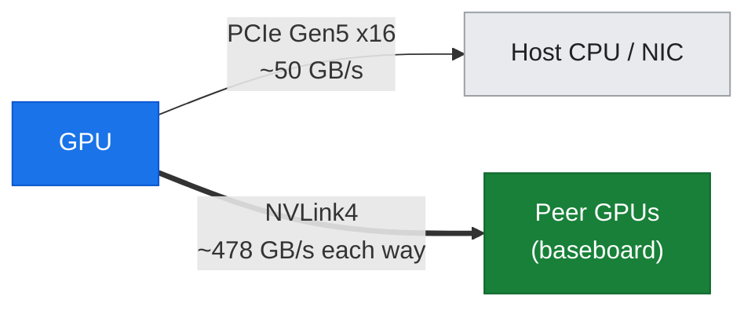
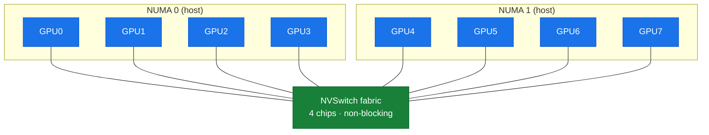
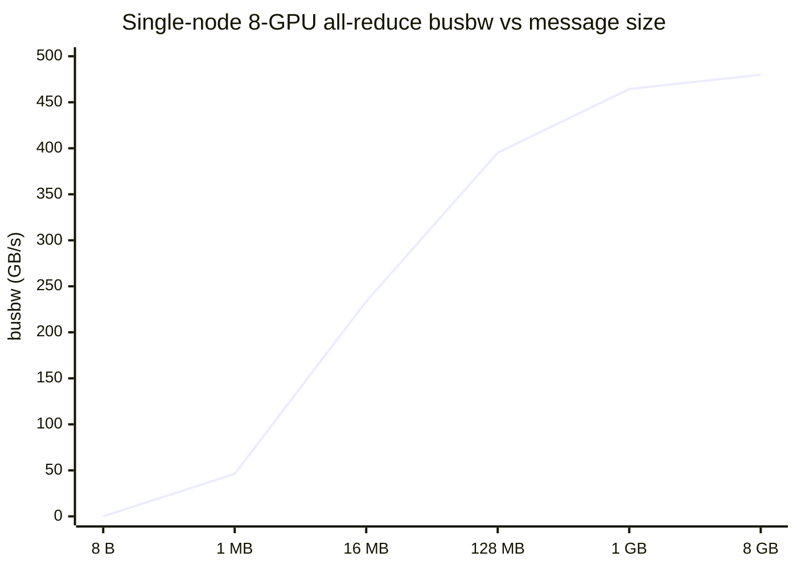
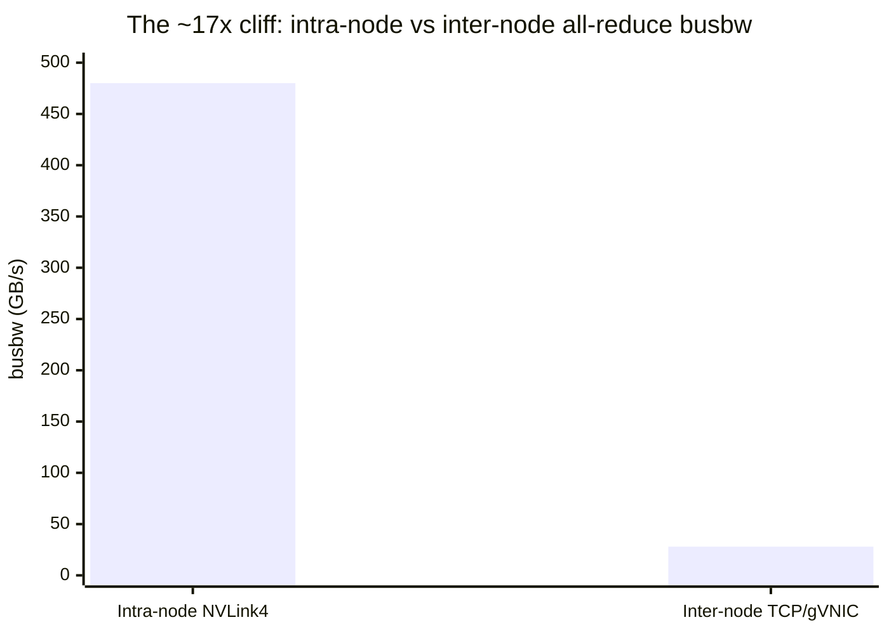

# 04 — Intra-node NVLink, NVSwitch, and the HGX H100 Baseboard

## Overview

This guide covers the **intra-node GPU interconnect** — how the 8 GPUs inside a single A3 node talk to each other. This is the fabric *below* everything in Parts II–IV: before a gradient ever crosses the network to another node, it is reduced across the 8 GPUs on the local baseboard over **NVLink4** and **NVSwitch**. Understanding this ceiling is what makes the inter-node numbers in Part II legible.

**What you'll learn:**
- What an **HGX H100 baseboard** is, and why every A3/A4 node is one
- **NVLink4** and **NVSwitch**: the all-to-all mesh, per-link and per-GPU bandwidth
- How to read `nvidia-smi topo -m`, `nvidia-smi nvlink --status`, and the GPU fabric state
- The single-node **NCCL all-reduce** bandwidth curve and how to interpret `busbw`
- **Why intra-node ≫ inter-node** — the ~17× cliff that motivates all of Part II

**Hands-on practice:** [lab-04: Intra-node NVLink/NVSwitch](../../labs/lab-04-intranode-nvlink-hgx/)

**Prerequisites:** GPU architecture ([doc-01](01-gpu-microarchitecture.md)); benchmarking methodology and the bus-vs-algorithm bandwidth distinction ([T4](../toolkit/T4-benchmarking.md)).

---

## The HGX H100 baseboard

An A3 High node is **not** eight loose PCIe GPUs. It is an **HGX H100 baseboard**: 8× H100 SXM5 modules soldered to a carrier board that also carries **4 third-generation NVSwitch** chips. This is the identical building block used inside an NVIDIA DGX H100 — the same board, the same NVLink topology (see [§11 DGX/HGX](../part4-platform-reference-arch/11-dgx-hgx-systems.md)). What differs on GCP is only the *system-management* layer around it (DGX OS, NVSM, tenant-visible Fabric Manager) — none of which is exposed to the A3 tenant.

lab-11 confirmed this from the tenant side: `lspci` enumerates 8× GH100 SXM5, and the GPU **fabric state reads `Completed / Success`** — the NVSwitch fabric has been trained by a Fabric Manager the tenant never sees.

**Attribution across the fleet.** All current GCP GPU nodes ride HGX-class baseboards: A3 High/Mega (HGX H100), A3 Ultra (HGX H200), A4 (HGX B200). A4X (GB200) goes further — it fuses multiple baseboards into a single **NVL72 NVLink domain** (72 GPUs behind an external NVLink Switch System), covered in [§14](../part4-platform-reference-arch/14-dgx-superpod.md). The intra-node fabric described here is the *within-baseboard* case.

---

## NVLink4 and NVSwitch

### NVLink vs. PCIe

Each Hopper GPU exposes two very different off-chip paths:

*Figure: two off-chip paths — NVLink4 to peer GPUs is ~10x the PCIe path and bypasses the CPU entirely.*



| Path | Role | Per-GPU bandwidth (this node) |
| :--- | :--- | :--- |
| **PCIe Gen5 x16** | Host↔GPU (H2D/D2H), NIC↔GPU | ~50 GB/s each way (lab-03 measured ~27 GB/s over the PyTorch path) |
| **NVLink4 (×18 links)** | GPU↔GPU on the baseboard | ~478 GB/s each way, ~956 GB/s bidirectional |

NVLink is roughly **an order of magnitude** faster than PCIe and, crucially, keeps GPU-to-GPU traffic **off** the CPU/PCIe complex entirely.

### The NVSwitch all-to-all mesh

With 4 NVSwitch chips on the baseboard, the 8 GPUs form a **non-blocking all-to-all mesh**: every GPU reaches every other GPU across the *same* 18-link NVLink path, with no PCIe or NUMA hop in between. lab-04 measured this directly — `nvidia-smi topo -m` shows `NV18` in **every** off-diagonal cell:

*Figure: the 8-GPU all-to-all — every GPU links to the central NVSwitch fabric (NV18 = 18 NVLink4 links); the NUMA split affects only host memory, not GPU↔GPU.*



```
      GPU0  GPU1  GPU2  GPU3  GPU4  GPU5  GPU6  GPU7
GPU0   X    NV18  NV18  NV18  NV18  NV18  NV18  NV18
 ...  (all pairs NV18) ...
GPU7  NV18  NV18  NV18  NV18  NV18  NV18  NV18   X
```

`NV18` = a bonded set of **18 NVLink4 links**. `nvidia-smi nvlink --status` confirms each link runs at **26.562 GB/s**:

```
Link 0: 26.562 GB/s
 ... (18 links) ...
Link 17: 26.562 GB/s
```

18 × 26.562 ≈ **478 GB/s per direction** → **~956 GB/s bidirectional per GPU**. This is the NVLink4 spec, and it is uniform: GPU0↔GPU7 is as fast as GPU0↔GPU1. (The `CPU Affinity` column does split the board across two NUMA nodes — GPUs 0–3 on NUMA 0, 4–7 on NUMA 1 — but that only affects *host* memory locality, not the GPU-to-GPU NVLink path.)

### Fabric Manager (trained, but invisible)

The NVSwitch mesh does not configure itself — a **Fabric Manager** daemon trains the switch routing tables at boot. On the A3 tenant node the *result* is visible:

```
Fabric
    State   : Completed
    Status  : Success
```

…but `nv-fabricmanager` itself, its logs, and its controls are Google-managed and not exposed (lab-11). On an on-prem DGX you would run and troubleshoot Fabric Manager directly — see [§11 §2.3](../part4-platform-reference-arch/11-dgx-hgx-systems.md).

---

## Single-node NCCL all-reduce: the intra-node ceiling

NVLink link rates are the *hardware* number. What a distributed workload actually gets is the **collective** bandwidth — what NCCL sustains running an all-reduce across all 8 GPUs. lab-04 ran `all_reduce_perf -b 8 -e 8G -f 2 -g 8` (NCCL 2.22.3+cuda12.6):

*Figure: busbw ramps from a latency-bound floor through a ~4-16 MB knee to a ~480 GB/s NVLink ceiling.*



| Message size | `busbw` (GB/s) | Regime |
| ---: | ---: | :--- |
| 8 B | ~0.00 | latency-bound (~34 µs floor) |
| 1 MB | 46.2 | ramping |
| 16 MB | 233.5 | ramping |
| 128 MB | 395.2 | near-ceiling |
| 1 GB | 464.4 | ceiling |
| 8 GB | **479.9** | ceiling |

**Peak busbw ≈ 480 GB/s.** Three things to read from this curve:

1. **Small messages are latency-bound.** Below ~64 KB the time is a flat ~34 µs — dominated by kernel launch and synchronization, not bandwidth. This is why frameworks *bucket* gradients (doc-09) rather than all-reducing each tensor separately.
2. **The knee is ~4–16 MB.** Above it, bandwidth dominates; the curve flattens by ~256 MB.
3. **`busbw` ≠ per-link peak.** For a ring all-reduce, `busbw = algbw × 2(n-1)/n`; ~480 GB/s sustained across an 8-GPU ring is the expected NVLink-bound result, not the ~956 GB/s per-GPU link peak. (Full derivation in [T4](../toolkit/T4-benchmarking.md) and [doc-06](../part2-inter-node/06-nccl-collectives.md).)

---

## Why intra-node ≫ inter-node

This is the pivot into Part II. The **same** collective, the **same** NCCL, the **same** GPUs — measured across a *second* node — collapses:

*Figure: the ~17x cliff at the node boundary — leaving NVLink for TCP over gVNIC drops busbw from ~480 to ~28 GB/s.*



| Collective (all-reduce, 1 GB) | Fabric | Peak `busbw` |
| :--- | :--- | ---: |
| 8-GPU, single node (lab-04) | NVLink4 / NVSwitch | **~480 GB/s** |
| 16-GPU, two nodes (lab-06) | Ethernet / TCP over gVNIC | **~28 GB/s** |

A **~17× cliff** at the node boundary. The instant a collective's ring has to hop from one baseboard to another, it leaves the ~900 GB/s NVLink world and enters the network — and on *this* cluster, that network is plain TCP over a general-purpose gVNIC (lab-06 confirms `NET/Socket` and "GPU Direct RDMA Disabled"). Everything in Part II and Part IV — GPUDirect-TCPX (A3 High), TCPXO (A3 Mega), GPUDirect-RDMA/RoCE (A3 Ultra/A4), InfiniBand + SHARP, rail-optimized topologies — exists to shrink that cliff.

---

## Summary

**Key takeaways:**
1. **Every A3/A4 node is an HGX baseboard** — 8 SXM GPUs + NVSwitch, identical to DGX; only the management layer differs on GCP.
2. **NVLink4 = 18 links × 26.562 GB/s** per GPU → ~956 GB/s bidirectional, in a **non-blocking all-to-all** NVSwitch mesh (measured: `NV18` for every GPU pair).
3. **Single-node all-reduce peaks at ~480 GB/s** (`busbw`, 8 GiB) — the intra-node ceiling; small messages are latency-bound at ~34 µs.
4. **Intra-node is ~17× faster than inter-node** on this cluster — the central fact that motivates Part II.

**Next steps:**
- [doc-05: NICs, RDMA, GPUDirect](../part2-inter-node/05-nic-rdma-gpudirect.md) — the actual inter-node data path on A3
- [doc-06: NCCL collectives, 2-node sweep](../part2-inter-node/06-nccl-collectives.md) — the ~28 GB/s inter-node measurement and the bus-vs-algo derivation
- [§11: DGX/HGX systems](../part4-platform-reference-arch/11-dgx-hgx-systems.md) — the baseboard's DGX-side management layer

**Hands-on practice:** [lab-04: Intra-node NVLink/NVSwitch](../../labs/lab-04-intranode-nvlink-hgx/)
