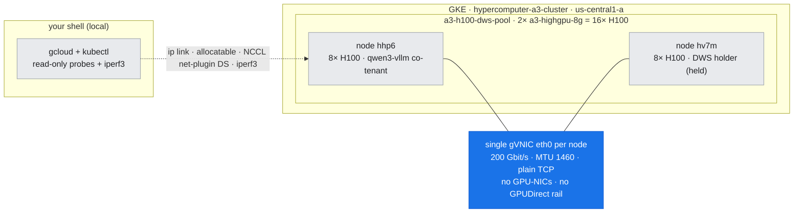
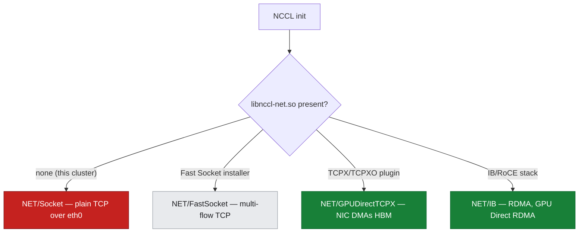

# 05 — NICs, RDMA, and GPUDirect: the Physical Inter-node Path

## Overview

Doc-06 measured the inter-node all-reduce **floor** (~28.6 GB/s) and named its cause: the transport, not the algorithm. This document is the layer underneath that number — the **physical NIC path** a byte travels when it leaves the GPU and crosses to another node, and the ladder of accelerations (GPUDirect-TCPX → TCPXO → RoCE/RDMA → InfiniBand) that each raise the floor by removing a copy or a CPU from that path.

We characterize the **actual** path on this cluster with live probes — not what the A3 datasheet promises, but what these two nodes are really provisioned with — and then map every rung of the acceleration ladder to the GCP machine family and NVIDIA fabric it belongs to.

**What you'll learn:**
- How a collective's bytes physically move: **GPU → host bounce buffer → NIC** (plain TCP) vs. **NIC DMAs GPU memory directly** (GPUDirect)
- The acceleration ladder: **gVNIC/TCP → GPUDirect-TCPX (A3 High) → TCPXO (A3 Mega) → GPUDirect-RDMA/RoCE (A3 Ultra/A4) → InfiniBand**
- The **NCCL network-plugin** model — how a DaemonSet injects `libnccl-net.so` and what extended resources appear when it does
- The `NCCL_*` environment variables that select and tune each transport
- **What this cluster actually is:** a single 200 Gbit/s gVNIC, MTU 1460, no GPU-NICs, no plugin installed — plain TCP

**Prerequisites:** the inter-node floor and transport log ([doc-06](06-nccl-collectives.md)); networking/fabric tools ([T5](../toolkit/T5-networking-fabric-tools.md)).

**Hands-on practice:** [lab-05: network-path inspect](../../labs/lab-05-network-path-inspect/)

---

## Where this fits (the environment)

*Figure: where this fits — the physical inter-node path on this cluster is the single gVNIC `eth0` (highlighted) each node carries; there are no GPU-NIC rails, so every cross-node byte rides plain TCP.*



---

## The core problem: getting a byte from GPU memory onto the wire

When rank 0 on node A must send a gradient shard to rank 8 on node B, that data starts in **HBM on a GPU** and must end in **HBM on another GPU across the network**. How many times it is copied, and whether a CPU is in the loop, is the whole story of inter-node performance.

*Figure: the two data paths — plain TCP stages through a host bounce buffer (three copies, CPU in the loop); GPUDirect lets the NIC DMA GPU memory directly (zero host copies).*


Each extra copy costs bandwidth and adds latency, and the host TCP/IP stack caps throughput at what one CPU can drive per flow. GPUDirect's premise is simple: teach the NIC to read and write GPU memory directly, and take the host out of the datapath.

---

## The acceleration ladder

Each rung removes a bottleneck from the path above it. The rung a given workload gets depends entirely on the **machine family** and whether the **network plugin** is installed.

| Rung | Mechanism | Host copy? | RDMA? | GCP family | NVIDIA equivalent |
| :--- | :--- | :--- | :--- | :--- | :--- |
| 0 | **Plain TCP / gVNIC** | Yes (bounce buffer) | No | any GPU VM w/o plugin — **this cluster** | stock kernel TCP |
| 1 | **GPUDirect-TCPX** | No (NIC DMAs HBM) | No (still TCP) | **A3 High** (`a3-highgpu-8g`) | GPUDirect over Ethernet |
| 2 | **GPUDirect-TCPXO** | No | No (optimized TCP) | **A3 Mega** (`a3-megagpu-8g`) | tuned GPUDirect-TCPX |
| 3 | **GPUDirect-RDMA / RoCE** | No | Yes (RoCEv2) | **A3 Ultra**, **A4** (CX-7 SuperNIC) | Spectrum-X Ethernet + RoCE |
| 4 | **InfiniBand + SHARP** | No | Yes (native IB) | (on-prem / DGX) | Quantum InfiniBand, in-network reduction |

Rungs 1–4 all need **dedicated GPU-facing NICs** (one NIC rail per pair of GPUs on A3), not just the host gVNIC. Rung 0 is what you get with only the host NIC — and, as the probes below show, that is exactly this cluster.

---

## What this cluster actually is (live probes — lab-05)

The lab runs four read-only probes plus an iperf3 baseline. None request a GPU, so they run safely alongside the DWS holders.

### 1. One host gVNIC, MTU 1460 — no GPU-NICs — `assets/lab-05/links.txt`

```
eth0            speed=200000  mtu=1460  DRIVER=gve
gke7ead1e36a16  speed=10000   mtu=1460  (pod veth)
gke860e357b7c9  speed=10000   mtu=1460  (pod veth)
docker0 / lo    ...
```

A single physical NIC — `eth0`, Google's virtual NIC (`gve` driver), 200 Gbit/s, **MTU 1460**. The other interfaces are pod veth pairs and bridges. A fully-provisioned A3 High node for GPUDirect-TCPX would additionally expose **four dedicated GPU-NICs** (one per GPU pair, typically MTU 8244 for jumbo frames). **They are not here** — so there is no GPUDirect rail to bind NCCL to, and no jumbo-frame path.

### 2. Only `nvidia.com/gpu` is advertised — no GPU-NIC resource — `assets/lab-05/allocatable.txt`

```
Allocatable:
  cpu:             207410m
  memory:          1885812064Ki
  nvidia.com/gpu:  8
```

If GPUDirect-TCPX were enabled, the node would carry the multi-network plumbing that a Pod attaches to via the `networking.gke.io/interfaces` annotation — 4 extra NICs at MTU 8244 backed by `Network`/`GKENetworkParamSet` CRDs. Its **absence** is the machine-checkable proof that no GPUDirect path is wired. (A tier detail worth knowing: `/dev/aperture_devices` is a **TCPXO** requirement; on a *working* TCPX node it is legitimately absent — verified in lab-18 — so don't use it as a TCPX health check.)

### 3. The NCCL network-plugin DaemonSets exist but schedule zero pods — `assets/lab-05/net-daemonsets.txt`

```
kube-system   nccl-fastsocket-installer            DESIRED=0  CURRENT=0  ...
gke-managed…  networking-dra-driver (dranet)       DESIRED=0  CURRENT=0  ...
```

`nccl-fastsocket-installer` — the DaemonSet that would drop NCCL Fast Socket's `libnccl-net.so` onto each node — is present in the cluster spec but has **0 desired pods**: its node selector matches no node here, so it never installs the plugin. The `dranet` DRA driver (dynamic resource allocation for NICs) is likewise dormant. **No `tcpx`/`tcpxo` installer exists at all.**

### 4. iperf3 baseline over the single gVNIC — `assets/lab-05/iperf3-*.txt`

| Test | Throughput | Notes |
| :--- | :--- | :--- |
| 1 TCP stream | **22.3 Gbit/s** | one flow is CPU/latency-bound on the host stack |
| 8 TCP streams | **~163 Gbit/s** aggregate | ~82% of the 200 Gbit/s line rate |

This is the **raw** node-to-node TCP ceiling: ~20 GB/s of goodput across the single eth0. NCCL's inter-node all-reduce (doc-06) reports **~28.6 GB/s busbw**, which corresponds to ~15 GB/s algorithm bandwidth (`algbw = busbw · n/2(n-1)`) — the same order of magnitude as the iperf3 goodput, because both are ultimately funneled through that one gVNIC per node, staged through host memory. The transport, not the collective algorithm, is the wall.

---

## The NCCL network-plugin model

NCCL discovers its network backend at init by loading a plugin library `libnccl-net.so`. The backend it finds decides the transport:

*Figure: NCCL picks a transport at init based on which plugin the node's DaemonSet installed.*



On this cluster NCCL finds no plugin, so it prints `NET/Socket` and `GPU Direct RDMA Disabled` — exactly the transport line captured in [doc-06](06-nccl-collectives.md) (`assets/lab-06/nccl_transport.txt`).

### NCCL environment variables that select and tune the transport

| Variable | Effect | Relevant rung |
| :--- | :--- | :--- |
| `NCCL_SOCKET_IFNAME` | Which host interface carries control/data (e.g. `eth0`) | 0 (TCP) |
| `NCCL_NSOCKS_PERTHREAD`, `NCCL_SOCKET_NTHREADS` | Parallel TCP flows (Fast Socket saturates the NIC) | 0–1 |
| `NCCL_GPUDIRECTTCPX_SOCKET_IFNAME` | The dedicated GPU-NIC rails for TCPX | 1–2 |
| `NCCL_GPUDIRECTTCPX_CTRL_DEV` | Control NIC for the TCPX plugin | 1–2 |
| `NCCL_IB_HCA` | Which IB/RoCE HCAs to use | 3–4 |
| `NCCL_NET_GDR_LEVEL` | How aggressively to use GPUDirect RDMA (PIX/SYS) | 3–4 |
| `NCCL_DEBUG=INFO`, `NCCL_DEBUG_SUBSYS=INIT,NET,GRAPH` | Print the chosen transport and ring graph | all |

See [reference/nccl-tunables.md](../../reference/nccl-tunables.md) for the full table.

---

## What enabling GPUDirect-TCPX changes — **measured**, on a purpose-built cluster (not this one)

This cluster is single-gVNIC and cannot be upgraded in place (Dataplane V2 + multi-networking are create-time-only), so [lab-18](../../labs/lab-18-enable-gpudirect-tcpx/) built a second cluster and measured the delta. On a properly-provisioned A3 High cluster you would:

1. Create the node pool with **five NICs** (1 host + 4 GPU rails) and the TCPX network stack.
2. Deploy the **`nccl-tcpx-installer` DaemonSet**, which lands `libnccl-net.so` and the NIC binaries on each node.
3. See a new **extended resource** appear in `kubectl describe node` (the GPU-NIC devices), which GPU pods must request.
4. Launch workloads with the `NCCL_GPUDIRECTTCPX_*` env set to the rail interfaces.

NCCL then prints `Using network GPUDirectTCPX_v7` and the inter-node busbw climbs from **23.70 GB/s** to **83.27 GB/s** at 16 GPUs — **3.5×**, measured with the same harness on 2 × `a3-highgpu-8g`, with all 4 rails carrying traffic within 0.05% of each other and **zero** `NET/Socket` lines.

> **Calibrate your expectations to that number, not to a datasheet.** An earlier version of this section predicted "the multi-hundred-GB/s regime the four rails allow" — that regime belongs to **TCPXO/FasTrak on A3 Mega with 8 rails** (317.84 GB/s, [lab-22](../../labs/lab-22-fabric-diagnostics/)), not to A3 High. Four TCPX rails deliver ~83 GB/s untuned. Tuning (NUMA/rail pinning, per-size chunking) would raise it, but not by a factor of four.

**This cluster is still not provisioned that way** (single gVNIC, no rails, installer dormant) and the DWS-held pool is never modified to force it — the measurement lives on the sibling TCPX cluster instead.

---

## Portability & product attribution

| If you are on… | The path is… | To go faster… |
| :--- | :--- | :--- |
| **This cluster / any GPU VM w/o plugin** | plain TCP over one gVNIC | add GPU-NICs + a network plugin |
| **A3 High** | GPUDirect-TCPX over 4 Ethernet rails | already GPUDirect; tune `NCCL_GPUDIRECTTCPX_*` |
| **A3 Mega** | GPUDirect-TCPXO (tuned TCPX) | highest Ethernet-TCP tier on GCP |
| **A3 Ultra / A4** | GPUDirect-RDMA / RoCE over CX-7 | RDMA already; this is the Spectrum-X-class path (§13) |
| **On-prem DGX / SuperPOD** | native InfiniBand + SHARP | in-network reduction (§13, §14) |

The **mechanism** (remove copies, take the CPU out of the path, let the NIC touch HBM) is identical everywhere; only the wire and the plugin differ.

---

## Summary

1. A byte leaving a GPU either **stages through host memory** (plain TCP — this cluster) or is **DMA'd straight off HBM by the NIC** (GPUDirect).
2. This cluster is **rung 0**: one 200 Gbit/s gVNIC, MTU 1460, no GPU-NICs, `nccl-fastsocket-installer` at 0 pods, only `nvidia.com/gpu` advertised — machine-checkable proof of a plain-TCP path.
3. iperf3 measures the raw ceiling: **22.3 Gbit/s** single-stream, **~163 Gbit/s** at 8 streams — the same order as NCCL's ~15 GB/s algbw, because both funnel through that one NIC.
4. The acceleration ladder (TCPX → TCPXO → RoCE → IB) maps cleanly onto GCP families (A3 High → A3 Mega → A3 Ultra/A4) and NVIDIA fabrics (§13).
5. NCCL's transport is chosen by which **plugin DaemonSet** installed `libnccl-net.so`; env vars tune it.

**Next steps:**
- [doc-06: NCCL collectives](06-nccl-collectives.md) — the collective that rides this path and the measured floor
- [§13: Spectrum-X and fabrics](../part4-platform-reference-arch/13-spectrum-x-and-fabrics.md) — the RDMA/RoCE and InfiniBand rungs in depth
- [doc-07: GKE scheduling & topology](../part3-clustering-execution/07-gke-scheduling-topology.md) — how pods land on GPU nodes and rails

**Hands-on practice:** [lab-05: network-path inspect](../../labs/lab-05-network-path-inspect/)
**Climbing the ladder (Part VI) →** [doc-21: GKE network design](../part6-architecture-gcp-integration/21-gke-network-design.md) turns this ladder into a design decision, and [lab-18](../../labs/lab-18-enable-gpudirect-tcpx/) provisions a new multi-network pool to move off rung 0 to GPUDirect-TCPX.
**Tools in this layer →** [T5: Networking & Fabric Tools](../toolkit/T5-networking-fabric-tools.md)
