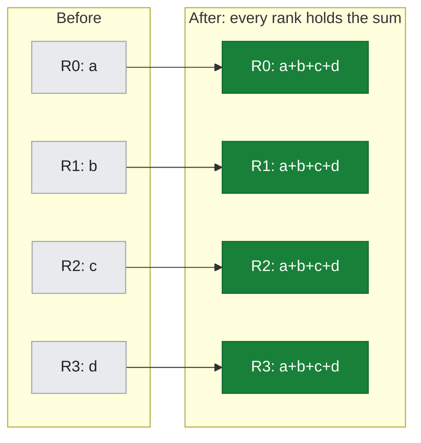
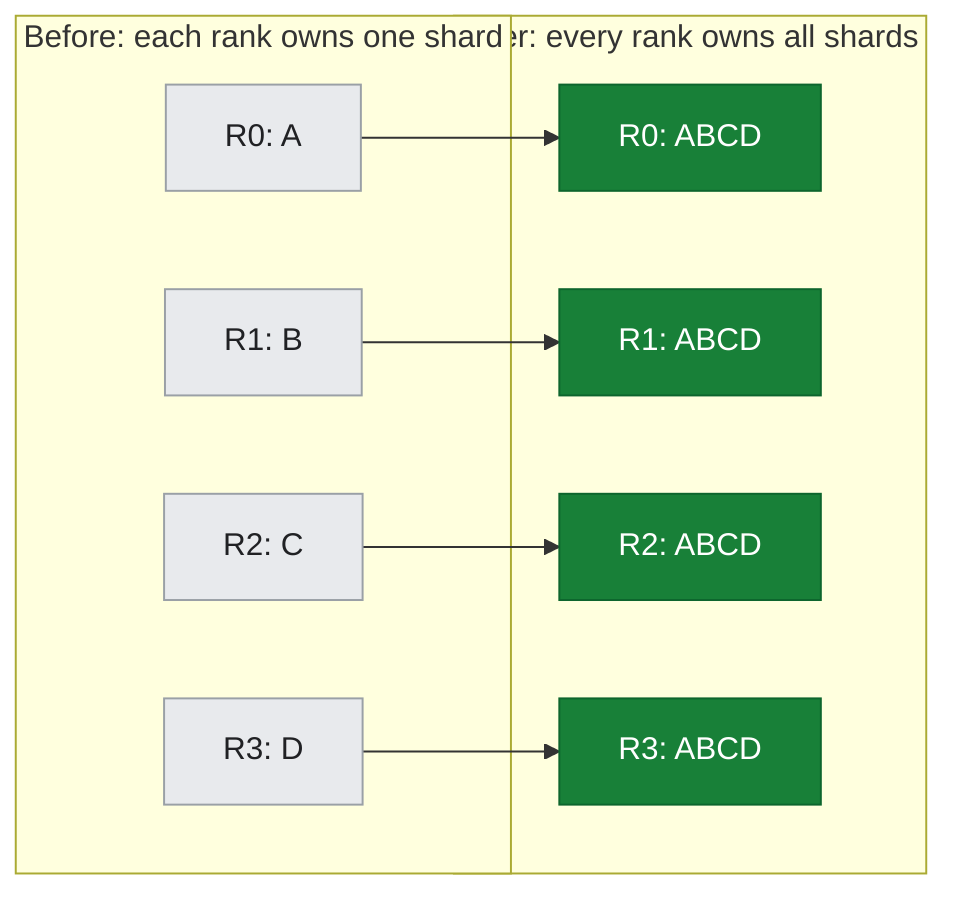
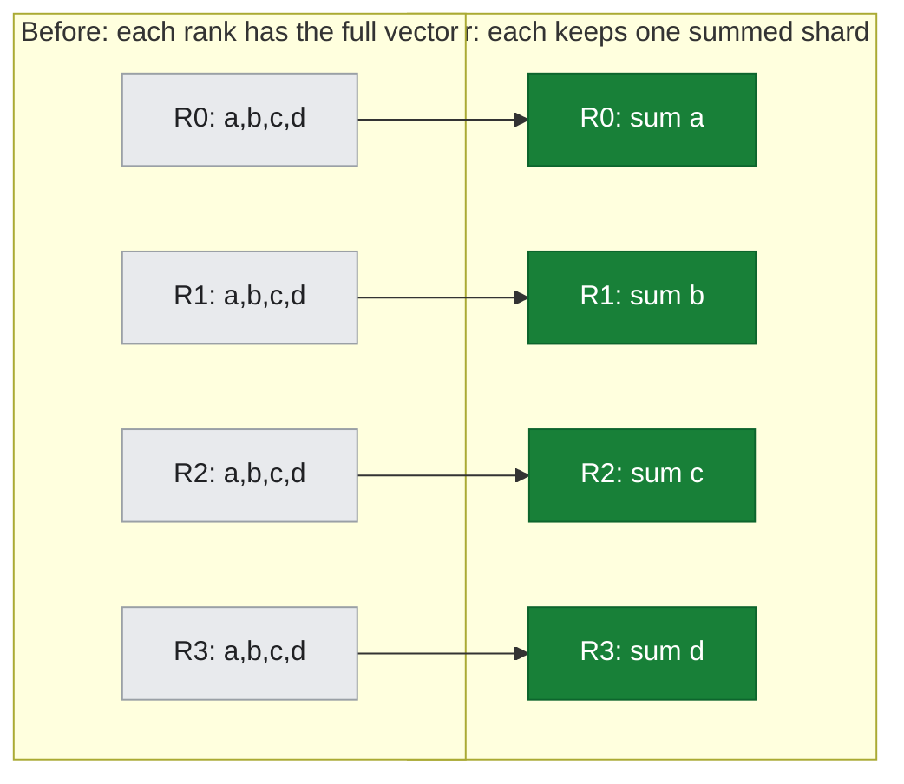
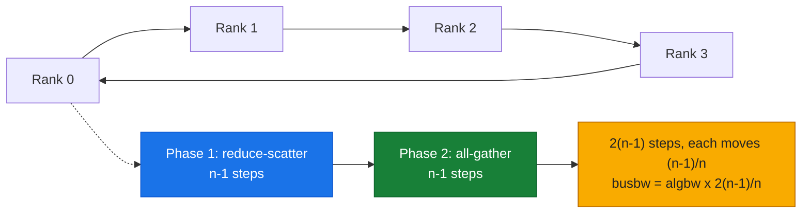
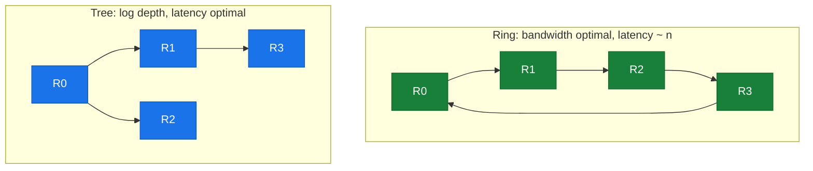
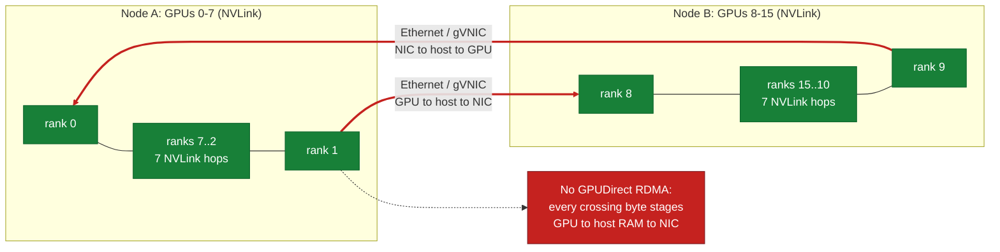

# 06 — NCCL Collectives and the Inter-node Bandwidth Floor

## Overview

This is the pivot of the whole guide: the point where a collective's ring leaves the ~480 GB/s NVLink world of a single baseboard (doc-04) and crosses onto the network. We measure a real **all-reduce across two A3 nodes (16 GPUs)**, read the **actual NCCL transport** off the wire, and derive why the number lands where it does. Everything in Part II about NICs, RDMA, and GPUDirect exists to raise this floor.

**What you'll learn:**
- What NCCL **collectives** are (all-reduce, all-gather, reduce-scatter) and why training is built on them
- The **ring** and **tree** algorithms, and the `busbw = algbw · 2(n-1)/n` bus-bandwidth definition
- How to read the **NCCL transport log** (`NET/IB`, `NET/Socket`, `GPU Direct RDMA`) to prove the data path
- The measured **~28 GB/s inter-node floor** on this (TCP-only) cluster and the **~17× cliff** vs. intra-node
- Why the transport — not the algorithm — is the ceiling here

**Hands-on practice:** [lab-06: 2-node NCCL collectives](../../labs/lab-06-2node-nccl-collectives/)

**Prerequisites:** the intra-node ceiling ([doc-04](../part1-single-node/04-intranode-nvlink-nvswitch-hgx.md)); benchmarking / bus-vs-algorithm bandwidth ([T4](../toolkit/T4-benchmarking.md)). The physical NIC path (gVNIC, GPUDirect-TCPX, RDMA) is [doc-05](05-nic-rdma-gpudirect.md).

---

## Collectives: the vocabulary of distributed training

A **collective** is a communication primitive over a *group* of ranks (here, 16 GPUs). Three carry almost all of distributed training:

*Figure: all-reduce over 4 ranks — before, each rank holds its own value; after, every rank holds the sum.*



*Figure: all-gather — each rank contributes one shard; after, all ranks hold the full tensor.*



*Figure: reduce-scatter — sum across ranks, then each rank keeps a single result shard.*



| Collective | What it does | Where it shows up |
| :--- | :--- | :--- |
| **all-reduce** | sum a tensor across all ranks, every rank gets the result | DDP gradient sync (doc-09) |
| **all-gather** | each rank contributes a shard, all ranks get the full tensor | FSDP forward (materialize params) |
| **reduce-scatter** | sum across ranks, each rank keeps one shard of the result | FSDP backward (shard grads) |

NCCL (NVIDIA Collective Communications Library) implements these. It picks an **algorithm** (ring, tree) and a **protocol** (Simple, LL, LL128) per collective, per message size, per topology — you saw it choose `AllReduce_Sum_f32_TREE_LL` for the 2-node shape in lab-09.

### Ring all-reduce and the `busbw` definition

The classic algorithm is the **ring**: `n` ranks in a logical loop, the tensor split into `n` chunks, and `2(n-1)` steps (a reduce-scatter phase + an all-gather phase). Each rank sends and receives `(n-1)/n` of the tensor in each phase.

*Figure: ring all-reduce — n ranks in a loop run a reduce-scatter phase then an all-gather phase, 2(n-1) steps total.*



That factor is exactly why we report **bus bandwidth** (`busbw`) rather than raw **algorithm bandwidth** (`algbw = message_size / time`):

```
busbw = algbw · 2(n-1)/n
```

`busbw` normalizes out the collective's inherent traffic multiplier so numbers are comparable across different rank counts and against the hardware link rate. (Full derivation in [T4](../toolkit/T4-benchmarking.md).) Both lab-04 and lab-06 use this identical definition, which is what makes the 480-vs-28 comparison fair.

### Ring vs. tree

*Figure: ring (bandwidth-optimal, latency grows with n) vs. tree (log-depth, latency-optimal) — NCCL picks TREE for the 2-node shape.*



- **Ring** maximizes bandwidth (every link busy) but latency grows with `n`.
- **Tree** (log-depth) minimizes latency for small messages and few nodes — which is why NCCL selected TREE for the 2-node/16-rank all-reduce. On a bandwidth-starved link, algorithm choice matters far less than the link itself, as the numbers below show.

---

## Read the transport, don't assume it

The single most important habit in inter-node work: **make NCCL tell you the data path.** Set `NCCL_DEBUG=INFO` (optionally `NCCL_DEBUG_SUBSYS=INIT,NET`) and read the init lines. From lab-06 (`assets/lab-06/nccl_transport.txt`, verbatim):

```
NCCL INFO NCCL version 2.22.3+cuda12.6
NCCL INFO NET/IB : No device found.
NCCL INFO NET/Socket : Using [0]eth0:10.128.0.52<0>
NCCL INFO Using network Socket
NCCL INFO NET/Socket : GPU Direct RDMA Disabled for HCA 0 'eth0'
NCCL INFO Channel 00/16 :  0  7  6  5  4  3  2  1  8 15 14 13 12 11 10  9
```

*Figure: the 16-GPU ring — 14 NVLink hops within the two nodes, 2 slow Ethernet/gVNIC hops crossing the boundary (staged GPU to host to NIC, no GPUDirect RDMA).*



Line by line:

- **`NET/IB : No device found`** — NCCL looked for an InfiniBand / RDMA verbs device and found none.
- **`Using network Socket` + `eth0`** — it fell back to its **TCP socket** transport over the standard **gVNIC** (`10.128.0.x`). There is **no GPUDirect-TCPX plugin** on this cluster; if there were, you'd see `NET/GPUDirectTCPX` here instead.
- **`GPU Direct RDMA Disabled`** — data cannot move NIC↔GPU directly; every inter-node byte stages **GPU → host RAM → NIC → … → NIC → host RAM → GPU**. Those extra copies are latency and bandwidth you pay on every collective.
- **`Channel 00/16`** — the 16-GPU ring. Ranks 0–7 are on node A, 8–15 on node B; the ring crosses the node boundary at `1→8` and `9→0`. **14 of 16 hops are NVLink; 2 are Ethernet** — and those 2 set the pace for all 16.

> This is the honesty discipline of the whole repo: we don't *claim* a fabric, we read it off NCCL's own init log and paste it in.

---

## The measurement: ~28 GB/s, and why

lab-06's all-reduce sweep (16 ranks, 2 nodes, NCCL 2.22.3), `busbw` vs. size:

| Message size | `algbw` (GB/s) | `busbw` (GB/s) | Regime |
| ---: | ---: | ---: | :--- |
| 8 B | ~0.00 | ~0.00 | latency floor ~**257 µs** |
| 1 MB | 2.18 | 4.09 | ramping |
| 16 MB | 7.58 | 14.21 | ramping |
| 128 MB | 11.70 | 21.93 | near-ceiling |
| 512 MB | 15.19 | 28.48 | ceiling |
| 1 GB | 15.26 | **28.60** | ceiling |

**Peak busbw ≈ 28.6 GB/s.** Two features to read:

1. **Latency floor ≈ 257 µs** for tiny messages — vs. ~34 µs single-node (doc-04). Crossing the node boundary is **~7.6× higher latency** before bandwidth even enters the picture. This is why frameworks bucket/fuse small tensors before communicating (doc-09).
2. **Bandwidth ceiling ≈ 28.6 GB/s** — set by the two TCP hops in the ring, and consistent with plain TCP over a single gVNIC flow with host-staging (no GPUDirect). This is *not* the algorithm's fault: NCCL is doing the right thing; the pipe is the limit.

### The ~17× cliff

| all-reduce, 1 GB | Fabric | Peak `busbw` |
| :--- | :--- | ---: |
| 8-GPU, single node (doc-04 / lab-04) | NVLink4 / NVSwitch | **~480 GB/s** |
| 16-GPU, two nodes (this doc / lab-06) | TCP over gVNIC | **~28.6 GB/s** |

**≈ 17× slower** the instant the ring crosses a node boundary. This single fact is the reason the rest of Part II and Part IV exist. The ladder for closing the gap:

- **GPUDirect-TCPX** (A3 High) — NIC↔GPU DMA over TCP, NCCL plugin; multiple NICs/rails.
- **GPUDirect-TCPXO** (A3 Mega) — the optimized successor, higher achievable bandwidth.
- **GPUDirect-RDMA / RoCE** (A3 Ultra, A4) — RDMA verbs, `NET/IB` device present, `GPU Direct RDMA Enabled`.
- **InfiniBand + SHARP** (reference DGX SuperPOD, [§14](../part4-platform-reference-arch/14-dgx-superpod.md)) — in-network reduction offloads the all-reduce itself.

On *this* cluster none are enabled, so we honestly measure the TCP floor. When you run the same lab on a TCPX/RDMA-enabled cluster, the transport line changes and the ~28 GB/s rises accordingly — the lab is written to make that change self-evident.

---

## Summary

**Key takeaways:**
1. Distributed training rides three collectives — **all-reduce** (DDP), **all-gather** + **reduce-scatter** (FSDP) — implemented by NCCL over ring/tree algorithms.
2. Always report **`busbw = algbw·2(n-1)/n`** so numbers compare across rank counts and against link rates.
3. **Read the transport** (`NCCL_DEBUG=INFO`): this cluster shows `NET/Socket`/`eth0`, `NET/IB: No device found`, `GPU Direct RDMA Disabled` — **plain TCP over gVNIC**.
4. Measured inter-node all-reduce peaks at **~28.6 GB/s** with a **~257 µs** latency floor — a **~17× cliff** below the intra-node ceiling.
5. That cliff is a **transport** limit, not an algorithm limit; GPUDirect-TCPX/TCPXO/RDMA/SHARP exist to close it.

**Next steps:**
- [doc-05: NICs, RDMA, GPUDirect](05-nic-rdma-gpudirect.md) — the physical NIC path and what each acceleration tier changes
- [doc-09: Distributed training — DDP & FSDP](../part3-clustering-execution/09-distributed-training-ddp-fsdp.md) — this collective inside a real training step (89.63% of GPU time)
- [§13: Spectrum-X and fabrics](../part4-platform-reference-arch/13-spectrum-x-and-fabrics.md) — the Ethernet-fabric side of closing the cliff

**Hands-on practice:** [lab-06: 2-node NCCL collectives](../../labs/lab-06-2node-nccl-collectives/)
