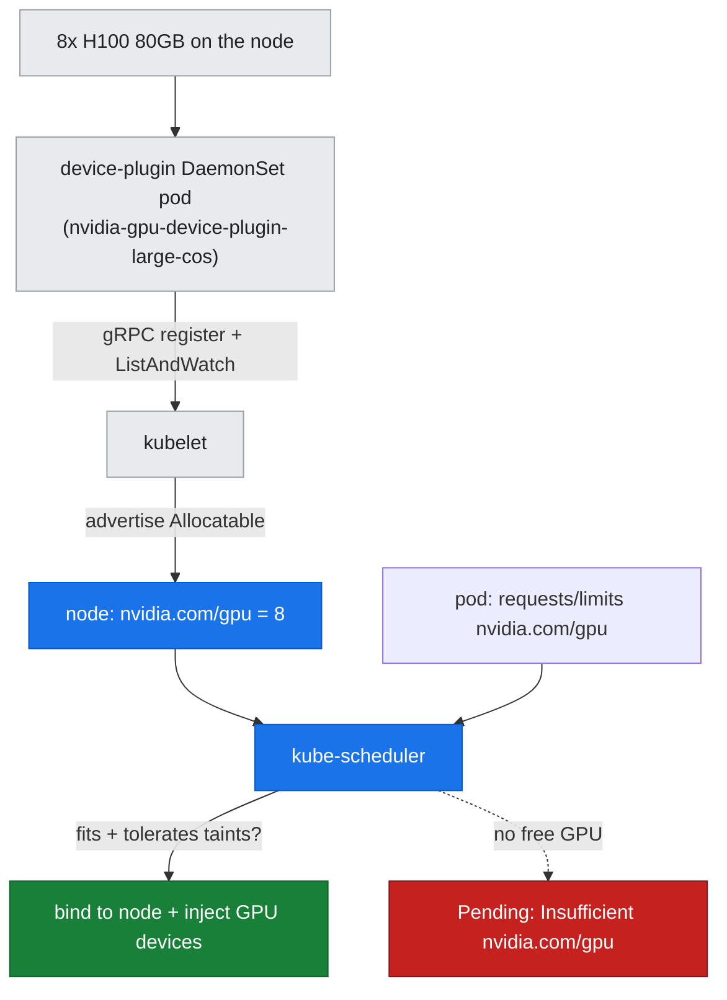
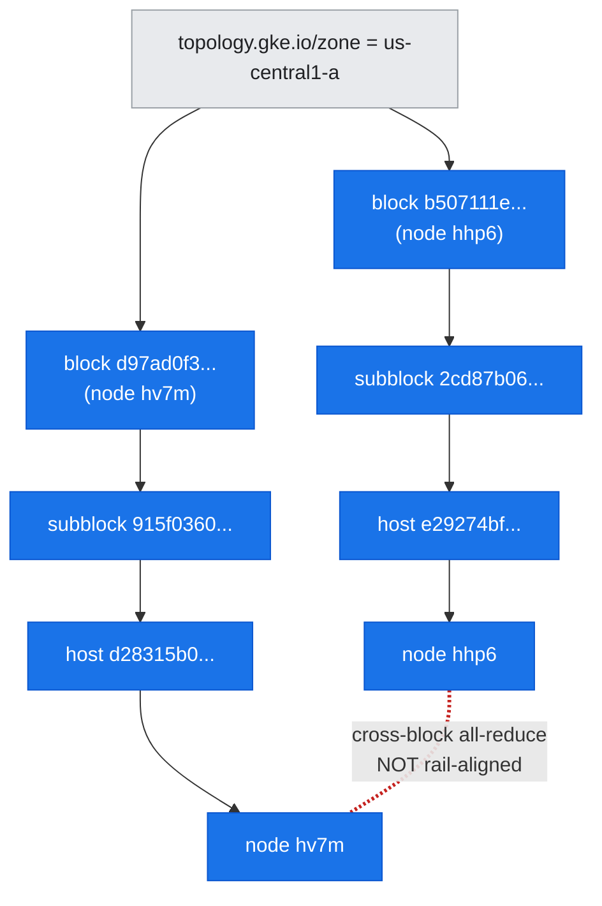
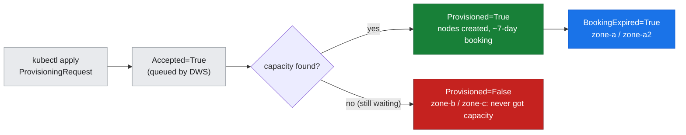

# 07 — GKE GPU Scheduling, Topology, and Gang Admission

## Overview

Doc-06 measured *what happens once 16 GPUs are already running a collective*; this document is the layer above that — **how a pod ever lands on a GPU node at all**, and why on a scarce, queued-provisioned A3 pool that is a scheduling problem, not just a resource-request problem. We trace the full admission path: the device plugin that turns physical H100s into a schedulable `nvidia.com/gpu` resource, the two taints that fence GPU nodes off, the GCE topology labels that decide whether nodes are co-located for fast collectives, and the Dynamic Workload Scheduler (DWS) queued-provisioning machinery that keeps this pool alive.

Everything here is read off the **live** cluster with read-only probes plus one deliberately-unschedulable demo Job. That Job **never ran a workload and consumed no GPU** — it was submitted only to capture the scheduler's rejection, then deleted.

**What you'll learn:**
- The **kubelet device-plugin** model: how physical GPUs become the extended resource `nvidia.com/gpu`, and why requests must equal limits
- The **two taints** on a DWS GPU node (`nvidia.com/gpu` and `cloud.google.com/gke-queued`) and the exact toleration a GPU pod needs
- **Topology-aware scheduling**: the GCE `gce-topology-block/subblock/host` hierarchy, and the honest finding that our two nodes are **not** in the same block
- **DWS queued provisioning**: the `ProvisioningRequest` object, its `Accepted → Provisioned → BookingExpired` lifecycle, and the capacity-holder pattern
- Why distributed jobs need **gang (all-or-nothing) admission** and why the default scheduler does not provide it

**Prerequisites:** the inter-node collective floor ([doc-06](../part2-inter-node/06-nccl-collectives.md)); networking/fabric tools ([T5](../toolkit/T5-networking-fabric-tools.md)).

**Hands-on practice:** [lab-07: GKE gang scheduling & topology](../../labs/lab-07-gke-gang-schedule/)

---

## The device-plugin model: from silicon to `nvidia.com/gpu`

Kubernetes does not natively understand GPUs. The kubelet only knows about `cpu` and `memory`; every other consumable — a GPU, a NIC rail, a FPGA — reaches the scheduler as an **extended resource** advertised by a **device plugin**. A device plugin is a small agent (run as a DaemonSet, one pod per node) that registers with the kubelet over a gRPC socket, enumerates the physical devices it manages, and reports a count. The kubelet folds that count into the node's `Allocatable`, and from then on the scheduler treats `nvidia.com/gpu` like any other quantity to bin-pack.

*Figure: the device plugin turns physical H100s into the schedulable resource `nvidia.com/gpu`, which the scheduler then bin-packs against pod requests.*



Two rules follow from this being an *extended* resource:

1. **Requests must equal limits.** Extended resources are integer, non-overcommittable, and non-burstable. You cannot ask for "0.5 GPU" or set a request below the limit; the API server rejects it. A pod that wants a GPU writes `limits: nvidia.com/gpu: <n>` (and Kubernetes copies it into requests).
2. **The count is opaque.** The scheduler only knows there are 8 of them; the plugin, not the scheduler, decides *which* physical devices a pod gets and injects them into the container.

On GKE this plugin is **managed** — you do not install it. GKE ships size/OS variants of the DaemonSet (small/medium/large × COS/Ubuntu) and activates the one matching the node's shape and image. Only **`large-cos`** is active on this a3-highgpu-8g/COS pool.

### What this cluster reports — `assets/lab-07/device-plugin.txt`

```
NAME                                     DESIRED   CURRENT   READY   ...
nvidia-gpu-device-plugin-large-cos       2         2         2      ...
nvidia-gpu-device-plugin-large-ubuntu    0         0         0      ...
nvidia-gpu-device-plugin-medium-cos      0         0         0      ...
nvidia-gpu-device-plugin-small-cos       0         0         0      ...
...
### running device-plugin pods:
nvidia-gpu-device-plugin-large-cos-9hpbr   3/3  Running  ... gke-...-hhp6
nvidia-gpu-device-plugin-large-cos-ndsz7   3/3  Running  ... gke-...-hv7m
```

Only `large-cos` has non-zero desired/current (2/2 Running, one pod per GPU node); every other size/OS variant sits at 0. That is GKE selecting the correct plugin for an a3-highgpu-8g COS node. Each running pod is what advertises **`nvidia.com/gpu: 8`** for its node — the same `8` you saw as the *only* extended resource in [doc-05](../part2-inter-node/05-nic-rdma-gpudirect.md) (`assets/lab-05/allocatable.txt`), confirming there is no GPU-NIC resource alongside it.

---

## Taints and tolerations: fencing off the GPU nodes

A GPU node is expensive and special-purpose; you do not want a random logging pod scheduled onto it, and on a **queued-provisioned** pool you additionally do not want *anything* scheduled until DWS has confirmed the node is really booked. GKE enforces both with **taints** — a node-side "keep off unless you explicitly tolerate me" mark. A pod only schedules onto a tainted node if it carries a matching **toleration**.

The two GPU nodes each carry **two** taints (`assets/lab-07/node-topology.txt`):

```
 taints:
  nvidia.com/gpu=present:NoSchedule
  cloud.google.com/gke-queued=true:NoSchedule
```

- **`nvidia.com/gpu=present:NoSchedule`** — the standard GPU fence. GKE auto-adds a toleration for this to any pod that *requests* `nvidia.com/gpu`, so ordinary GPU pods clear it transparently; non-GPU pods stay off.
- **`cloud.google.com/gke-queued=true:NoSchedule`** — the DWS **queued-provisioning** gate. It is present because this pool is provisioned through ProvisioningRequests (below). A pod must tolerate this one *explicitly* — GKE does not add it automatically for you.

So a pod that wants to run on this pool must tolerate **both**:

```yaml
tolerations:
  - key: nvidia.com/gpu
    operator: Equal
    value: present
    effect: NoSchedule
  - key: cloud.google.com/gke-queued
    operator: Equal
    value: "true"
    effect: NoSchedule
```

Miss the `gke-queued` toleration and the pod is rejected with a node-affinity/taint mismatch even though GPUs are free — a common first-day surprise on DWS pools.

---

## Topology-aware scheduling: co-location decides collective bandwidth

Doc-06 showed that the moment a ring crosses a node boundary, busbw collapses ~17× to ~28.6 GB/s. *Which* two nodes cross that boundary therefore matters enormously: two machines wired into the same rack / same network block share far more bisection bandwidth than two machines chosen at random across a zone. GKE surfaces the physical layout through **GCE compact-placement topology labels**, a strict hierarchy:

*Figure: the GCE compact-placement hierarchy — zone ⊃ block ⊃ subblock ⊃ host. Same-block nodes share high-bandwidth fabric; our two nodes are in different blocks.*



The labels form the chain `cloud.google.com/gce-topology-block` ⊃ `-subblock` ⊃ `-host`, all inside a `topology.gke.io/zone`. A scheduler (or a capacity request) that wants maximum collective bandwidth asks for nodes in the **same block** — that is what GKE compact placement and DWS `--placement-policy` deliver.

### The honest finding — `assets/lab-07/node-topology.txt`

Our two GPU nodes are **in different blocks**:

| Node | `gce-topology-block` | subblock | zone / instance-type |
| :--- | :--- | :--- | :--- |
| `...-hhp6` | `b507111e53ee24d6bd15dd9720d58829` | `2cd87b06...` | us-central1-a / `a3-highgpu-8g` |
| `...-hv7m` | `d97ad0f3cdd5ab02d889f5cf5e31a25d` | `915f0360...` | us-central1-a / `a3-highgpu-8g` |

They share the zone (`us-central1-a`) and the accelerator (`nvidia-h100-80gb`), but their blocks, subblocks, and hosts are all distinct. In other words these two nodes are **not co-located in one compact-placement domain** — they are not rail-aligned. This is the real, slightly-imperfect provisioning outcome of two independent ProvisioningRequests (zone-a and zone-a2) landing wherever capacity was available, and it is one more reason the inter-node all-reduce in [doc-06](../part2-inter-node/06-nccl-collectives.md) sits at the plain-TCP ~28.6 GB/s floor rather than a rail-optimized figure: neither the transport (single gVNIC, no GPUDirect) nor the placement (cross-block) is optimized for cross-node collectives here.

---

## DWS queued provisioning: the ProvisioningRequest lifecycle

A3 H100 capacity is scarce and bursty. Rather than hold on-demand VMs 24/7, this cluster uses **Dynamic Workload Scheduler (DWS) queued provisioning**: you file a request for a *gang* of nodes, DWS queues it until it can allocate the whole gang atomically, and only then are the nodes created and the `gke-queued` taint cleared. The request is a first-class Kubernetes object, the **`ProvisioningRequest`** (CRD `provisioningrequests.autoscaling.x-k8s.io`).

*Figure: the ProvisioningRequest lifecycle — Accepted, then either Provisioned (nodes created, ~7-day booking) leading to BookingExpired, or stuck Provisioned=False waiting on capacity.*



The lifecycle runs through **status conditions**: `Accepted` (DWS has queued it) → `Provisioned` (the whole gang of nodes was allocated and created; the booking is held ~7 days) → `BookingExpired` (the reservation window has elapsed — the nodes may already have been reclaimed, but the request object records that it *did* provision). A request that never finds capacity stays `Accepted=True, Provisioned=False` indefinitely.

### What this cluster reports — `assets/lab-07/provisioning-requests.txt`

```
NAME                  ACCEPTED   PROVISIONED   FAILED   AGE
a3-h100-req-zone-a    True       True                   5d17h
a3-h100-req-zone-a2   True       True                   2d5h
a3-h100-req-zone-b    True       False                  5d17h
a3-h100-req-zone-c    True       False                  5d17h

### conditions:
  a3-h100-req-zone-a:  [('Accepted','True'),('Provisioned','True'),('BookingExpired','True')]
  a3-h100-req-zone-a2: [('Accepted','True'),('Provisioned','True'),('BookingExpired','True')]
  a3-h100-req-zone-b:  [('Accepted','True'),('Provisioned','False')]
  a3-h100-req-zone-c:  [('Accepted','True'),('Provisioned','False')]
```

Two requests (**zone-a**, **zone-a2**) reached `Provisioned=True` and are now `BookingExpired` — these are the requests behind our two live nodes (note the `autoscaling.gke.io/provisioning-request` label on each node ties `hhp6` → zone-a, `hv7m` → zone-a2). Two more (**zone-b**, **zone-c**) are `Accepted` but `Provisioned=False`: DWS queued them 5d17h ago and **never found capacity**.

### Capacity holders: keeping scarce nodes held

Once DWS hands you a node, an idle node is a node you might lose (and re-queuing can wait days, as zone-b/c show). The operating rule on this cluster is therefore that a provisioned GPU node is **always held, never left idle** — a lightweight "holder" Deployment claims the full `nvidia.com/gpu: 8` so nothing can evict the node out from under you.

The live holder gang state (`assets/lab-07/holder-gang-state.txt`):

```
NAME                                 STATUS    NODE                       AGE
a3-holder-zone-a2-...-6hcfn          Running   gke-...-hv7m               147m
a3-holder-zone-b-...-4rdbj           Pending   <none>                     5d17h
a3-holder-zone-c-...-2jhx7           Pending   <none>                     5d17h
```

`a3-holder-zone-a2` is **Running on hv7m**, holding all 8 GPUs of that node. Holders **b** and **c** have been **Pending for 5d17h** — they can never schedule because their backing requests (`req-zone-b/c`) are `Provisioned=False`; there is simply no node for them to land on. This is exactly the queued-gang state, faithfully reflecting the standing rule that a DWS GPU node must always be held.

---

## Gang scheduling: all ranks, or none

A distributed training job of *N* ranks is only useful if **all N** start together — rank 3 sitting idle while ranks 0–2 wait wastes the whole reservation, and a half-placed job can deadlock a collective. This is **gang scheduling** (a.k.a. co-scheduling): admit the entire set atomically or admit none of it.

The default kube-scheduler does **not** do this. It places pods **one at a time, independently**, with no notion that they belong to a gang. Submit a job that cannot fully fit and you get a partially-placed, partially-Pending mess — or, as in the demo below, an entirely-Pending job whose pods each fail independently.

### The demo: a 2×8-GPU Job that cannot fit — `assets/lab-07/gang-pending-events.txt`

The lab submits a 2-replica indexed Job (`manifests/gang-pending-demo.yaml`), each pod requesting `nvidia.com/gpu: 8` — **16 GPUs total**. But the cluster has only two GPU nodes: one is fully held (holder-a2 = 8 GPUs on hv7m), and the other is running vLLM on 2 of its GPUs (see placement below). There are nowhere near 16 free GPUs, so both pods stay Pending:

```
### pods (expect Pending):
gang-pending-demo-0-l49j8   0/1   Pending   ...
gang-pending-demo-1-cwllv   0/1   Pending   ...

### describe (one pod):
Events:
  Warning  FailedScheduling   default-scheduler   0/3 nodes are available:
      1 node(s) didn't match Pod's node affinity/selector,
      2 Insufficient nvidia.com/gpu. ...
  Normal   NotTriggerScaleUp  cluster-autoscaler  Pod didn't trigger scale-up:
      3 node(s) didn't match Pod's node affinity/selector
```

Two findings, both important:

1. **`FailedScheduling ... Insufficient nvidia.com/gpu`** — the scheduler evaluated each pod against the resource it learned from the device plugin and rejected it. There is no gang logic here: each pod failed on its own.
2. **`NotTriggerScaleUp: Pod didn't trigger scale-up`** — a bare Pending pod did **not** cause the DWS pool to grow. This proves the crucial DWS property: you cannot scale a queued-provisioning pool just by creating hungry pods; you must file a **ProvisioningRequest**. A Pending pod alone waits forever.

> **The Job never ran.** It was applied, left ~15 s to generate the scheduling event, captured, and immediately deleted. No pod ever started, **no GPU was consumed**, and the running holders and vLLM were never disturbed.

True all-or-nothing gang **admission** on GKE is provided by higher-level controllers — **Kueue** (gang-admits a workload only when the whole gang can run) and **JobSet** (models a multi-pod job as one unit) — not by the default scheduler. That is the subject of [doc-08](08-job-frameworks-jobset-kueue.md).

### What is actually scheduled — `assets/lab-07/gpu-pod-placement.txt`

```
default/a3-holder-zone-a2-...   gpu=8  node=gke-...-hv7m   phase=Running
default/a3-holder-zone-b-...    gpu=8  node=-              phase=Pending
default/a3-holder-zone-c-...    gpu=8  node=-              phase=Pending
inference/qwen3-vllm-...        gpu=2  node=gke-...-hhp6   phase=Running
```

The only GPU consumers actually running are the holder on **hv7m** (8 GPUs) and qwen3-vllm on **hhp6** (2 GPUs) — which is precisely why a 16-GPU gang has no room.

---

## Portability & product attribution

The mechanisms here are GKE's surface of a pattern every GPU scheduler implements; only the object names differ.

| Concern | GKE (this cluster) | NVIDIA / generic equivalent |
| :--- | :--- | :--- |
| Advertise GPUs as a resource | managed `nvidia-gpu-device-plugin` DaemonSet → `nvidia.com/gpu` | NVIDIA **k8s-device-plugin** / **GPU Operator**; Slurm `gres:gpu` |
| Label nodes by capability | GKE built-in labels (`gke-accelerator`, instance-type) | **Node Feature Discovery (NFD)** + GPU Operator labels |
| Fence off GPU nodes | `nvidia.com/gpu` + `cloud.google.com/gke-queued` taints | GPU Operator taint / Slurm partitions & `--gres` |
| Topology for co-location | `gce-topology-block/subblock/host`, compact placement | NFD topology labels; Slurm **topology.conf** (blocks/switches); DGX SuperPOD rack/leaf hierarchy |
| Reserve a gang of nodes | **DWS ProvisioningRequest** (queued provisioning) | Slurm reservations; **Base Command Manager** job queues; cloud capacity reservations |
| Gang / all-or-nothing admission | **Kueue** / **JobSet** (doc-08) | Slurm native gang scheduling; Volcano; `sbatch -N` semantics |

The **mechanism** — turn devices into a countable resource, fence the nodes, expose topology, reserve gangs, admit atomically — is identical on a DGX SuperPOD under Slurm as on GKE under DWS; only the CRDs and CLI verbs change.

---

## Summary

1. GPUs reach the scheduler as the **extended resource `nvidia.com/gpu`**, advertised by a managed device-plugin DaemonSet (only `large-cos` active here, 2/2 Running, `nvidia.com/gpu: 8` per node); extended-resource requests **must equal limits**.
2. Each GPU node carries **two taints** — `nvidia.com/gpu` (auto-tolerated by GPU pods) and `cloud.google.com/gke-queued` (must be tolerated **explicitly**) — so a DWS GPU pod needs **both** tolerations.
3. **Topology labels** (`gce-topology-block/subblock/host`) expose physical co-location; our two nodes are in **different blocks** (`b507…` vs `d97a…`), i.e. **not rail-aligned** — reinforcing the cross-node ~28.6 GB/s floor of doc-06.
4. **DWS ProvisioningRequests** run `Accepted → Provisioned → BookingExpired`; zone-a/a2 provisioned (our two nodes), zone-b/c are stuck `Provisioned=False`. **Capacity holders** keep provisioned nodes held so they are never lost to idleness.
5. The default scheduler places pods **independently** — a 16-GPU gang on a cluster without 16 free GPUs stays **Pending** (`Insufficient nvidia.com/gpu`), and a bare Pending pod does **not** grow a DWS pool (`NotTriggerScaleUp`). True gang admission needs **Kueue/JobSet** (doc-08). The demo consumed **no GPU** and was deleted immediately.

**Next steps:**
- [doc-08: Job frameworks — JobSet & Kueue](08-job-frameworks-jobset-kueue.md) — true all-or-nothing gang admission built atop this scheduling substrate
- [doc-06: NCCL collectives](../part2-inter-node/06-nccl-collectives.md) — the collective whose floor the cross-block placement reinforces
- [doc-09: Distributed training — DDP & FSDP](09-distributed-training-ddp-fsdp.md) — the workload that a gang schedules

**Hands-on practice:** [lab-07: GKE gang scheduling & topology](../../labs/lab-07-gke-gang-schedule/)
**Tools in this layer →** [T5: Networking & Fabric Tools](../toolkit/T5-networking-fabric-tools.md) (topology/fabric context); [T1: Monitoring & Inventory](../toolkit/T1-monitoring-inventory.md) (node/resource inventory)
