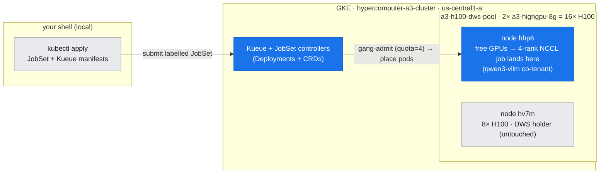
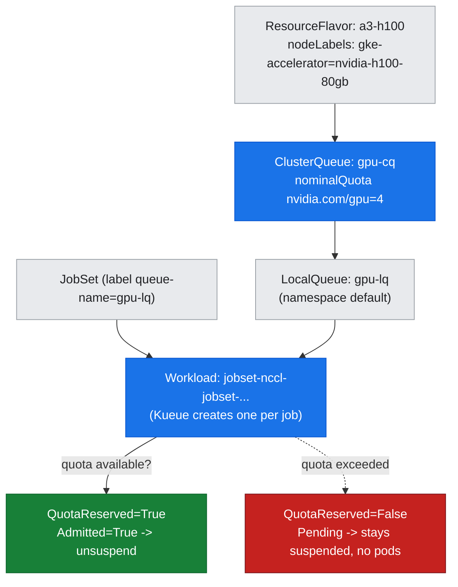
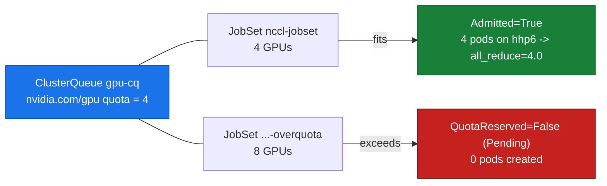

# 08 — Job Frameworks: JobSet & Kueue

## Overview

Doc-07 ended on a cliff: the default kube-scheduler places pods **one at a time**, so a distributed job with no free room for its whole gang lands in a partially-Pending mess, and a bare Pending pod does not even grow a DWS pool. Two problems remain unsolved by the raw scheduler — **how do you admit *N* ranks all-or-nothing** (gang admission), and **how do those ranks find each other** (rendezvous) once placed. This document is the layer that solves both, using the two controllers GKE recommends for GPU batch: **Kueue** for quota-gated gang admission and **JobSet** for modelling a multi-pod job as one unit with stable pod DNS.

Unlike the earlier docs, this lab **actually ran a real collective**. A 4-rank NCCL all-reduce was admitted through Kueue, scheduled by JobSet, rendezvoused over a headless service, and returned the arithmetically-correct answer — all on the free GPUs of one node, never touching the DWS holder or the running vLLM. A second, deliberately over-quota JobSet was then submitted to capture Kueue *refusing* to admit it.

**What you'll learn:**
- The **JobSet** model: a `replicatedJob` fans out to *N* child Jobs, each with a **stable, index-based pod DNS name**, joined by an auto-created **headless Service** — the rendezvous substrate for `torch.distributed`/NCCL
- The **Kueue** model: `ResourceFlavor` → `ClusterQueue` (the quota pool) → `LocalQueue` (the namespaced handle a job references), and the **`Workload`** object Kueue creates to represent an admitted job
- **Gang admission in practice**: a JobSet whose 4 GPUs fit the quota is admitted atomically (`QuotaReserved=True, Admitted=True`); an 8-GPU JobSet over the quota is **held with no pods created** (`QuotaReserved=False`)
- How **suspend/resume gating** works — Kueue admits by flipping a job's `suspend` field, which is why an un-admitted JobSet produces *zero* pods rather than Pending pods
- Reading the real **4-rank all-reduce result** (`value=4.0` on every rank) as end-to-end proof that admission + placement + rendezvous + collective all worked

**Prerequisites:** GKE scheduling substrate ([doc-07](07-gke-scheduling-topology.md)); the NCCL collective floor ([doc-06](../part2-inter-node/06-nccl-collectives.md)); workload inventory tools ([T1](../toolkit/T1-monitoring-inventory.md)).

**Hands-on practice:** [lab-08: JobSet multi-node NCCL via Kueue](../../labs/lab-08-jobset-multinode/)

---

## Where this fits (the environment)

*Figure: where this fits — Kueue + JobSet controllers (highlighted) gate and shape the gang, which lands on `hhp6`'s free GPUs; the DWS-held node `hv7m` is never touched.*



---

## The two controllers, and why you need both

Kueue and JobSet solve **orthogonal** problems, which is why they compose so cleanly:

- **JobSet** answers *"how is a distributed job shaped, and how do its pods find each other?"* It groups several Jobs into one object, gives every pod a predictable DNS name, and drives the whole set to a single terminal state.
- **Kueue** answers *"is there enough quota to run this job right now, and if not, what happens?"* It gates admission against a quota pool and refuses (rather than half-places) anything that does not fit.

You could run either alone. Together they give you the full batch story: Kueue decides *whether* the gang runs, JobSet decides *how* the gang is wired. Both are installed as ordinary controller Deployments plus CRDs.

### What this cluster reports — `assets/lab-08/controllers.txt`

```
jobset-controller-manager   1/1  ... registry.k8s.io/jobset/jobset:v0.12.0
kueue-controller-manager    1/1  ... registry.k8s.io/kueue/kueue:v0.18.3

### CRDs
clusterqueues.kueue.x-k8s.io      ...
jobsets.jobset.x-k8s.io           ...
localqueues.kueue.x-k8s.io        ...
resourceflavors.kueue.x-k8s.io    ...
workloads.kueue.x-k8s.io          ...
```

Both controllers are `1/1` Available (JobSet **v0.12.0**, Kueue **v0.18.3**), and the five CRDs that matter are registered: JobSet contributes `jobsets`, Kueue contributes `resourceflavors`, `clusterqueues`, `localqueues`, and `workloads`. These were installed **additively** for this lab and consume no GPU; teardown is documented in the lab README.

---

## Kueue's object model: flavor → cluster-queue → local-queue → workload

Kueue layers four objects between "a job exists" and "a job may run":

*Figure: Kueue's admission chain — a namespaced LocalQueue points at a ClusterQueue whose quota is expressed in a ResourceFlavor; each admitted job gets a Workload object.*



- **`ResourceFlavor`** (`a3-h100`) — names a *class* of capacity by node labels. Ours selects `cloud.google.com/gke-accelerator: nvidia-h100-80gb`, i.e. the A3 H100 nodes. Quota is always expressed *per flavor*, so Kueue can distinguish (say) H100 from L4 quota in the same cluster.
- **`ClusterQueue`** (`gpu-cq`) — the actual quota pool, cluster-scoped. We set a **deliberately small `nvidia.com/gpu` nominalQuota of 4** (alongside 64 CPU / 256Gi memory) so that a 4-GPU job fits exactly and an 8-GPU job does not — the whole point of the demo.
- **`LocalQueue`** (`gpu-lq`, in `default`) — the namespaced handle a job points at via the label `kueue.x-k8s.io/queue-name: gpu-lq`. It forwards to `gpu-cq`. Jobs never reference a ClusterQueue directly; the LocalQueue is the namespace's ticket into the shared pool.
- **`Workload`** — Kueue's internal representation of one admittable unit. When a labelled JobSet appears, Kueue **automatically creates a Workload** and decides its fate against the quota.

### What this cluster reports — `assets/lab-08/queues.txt`

```
### ClusterQueue (nominal vs used) + LocalQueue
NAME     COHORT   STRATEGY         PENDING WORKLOADS   ADMITTED WORKLOADS
gpu-cq            BestEffortFIFO   0                   0
NAME     CLUSTERQUEUE   PENDING WORKLOADS   ADMITTED WORKLOADS
gpu-lq   gpu-cq         0                   0
```

The ClusterQueue reports `Active` with `"message": "Can admit new workloads"`, using the default `BestEffortFIFO` admission strategy, and the LocalQueue `gpu-lq` correctly points at `gpu-cq`. (This snapshot was taken before submission, so both show 0 workloads; the admission itself is captured next.)

---

## JobSet's object model: replicated jobs + a headless service for DNS

A JobSet turns one spec into a *set* of Jobs plus the plumbing to make them a cluster:

- **`replicatedJobs`** — a template replicated *N* times. Ours has one replicated job named `worker` with `replicas: 4`, so JobSet creates four child Jobs: `nccl-jobset-worker-0` … `-worker-3`.
- **Stable pod DNS** — JobSet creates a **headless Service** named after the JobSet and sets each pod's `subdomain` to it. That gives every pod a deterministic name that does **not** depend on its random pod suffix:

  ```
  <jobset>-<replicatedJob>-<jobIndex>-<podIndex>.<jobset>.<ns>.svc.cluster.local
  ```

  This is exactly what a `torch.distributed` rendezvous needs: rank 0 must be reachable at a name every other rank can compute *before* any pod is running. Our workers set `MASTER_ADDR="nccl-jobset-worker-0-0.nccl-jobset"` and derive their own `RANK` from the hostname.
- **One terminal state** — JobSet aggregates its children into a single `Completed`/`Failed` condition, so you watch one object instead of four Jobs.

### What this cluster reports — `assets/lab-08/jobset-structure.txt`

```
### JobSet
NAME          TERMINALSTATE   RESTARTS   COMPLETED   SUSPENDED   AGE
nccl-jobset                   0                      false       11s

### child Jobs (one per replica)
nccl-jobset-worker-0   Running    0/1   ...   nvcr.io/nvidia/pytorch:24.10-py3
nccl-jobset-worker-1   Running    0/1   ...
nccl-jobset-worker-2   Complete   1/1   ...
nccl-jobset-worker-3   Running    0/1   ...

### headless Service (provides pod DNS)
NAME          TYPE        CLUSTER-IP   EXTERNAL-IP   PORT(S)   AGE
nccl-jobset   ClusterIP   None         <none>        <none>    12s

### pods -> node placement
nccl-jobset-worker-0-0-rjg9d   ...   10.36.0.39   gke-...-hhp6
nccl-jobset-worker-1-0-kvbps   ...   10.36.0.38   gke-...-hhp6
nccl-jobset-worker-2-0-6fszb   ...   10.36.0.37   gke-...-hhp6
nccl-jobset-worker-3-0-dxkvs   ...   10.36.0.36   gke-...-hhp6
```

Three things to read here. **First**, the JobSet fanned out to exactly four child Jobs, one per replica. **Second**, the headless Service `nccl-jobset` has `CLUSTER-IP: None` — that "None" is what makes it *headless*: DNS returns the pods' own IPs (10.36.0.36–39) rather than a single virtual IP, so `nccl-jobset-worker-0-0.nccl-jobset` resolves straight to rank 0's pod. **Third**, all four pods landed on **`hhp6`** — the node with free GPUs — never on `hv7m` (the DWS-held node). Four ranks × 1 GPU = 4 GPUs, matching both the Kueue quota and hhp6's free headroom.

> Because the collective finished in ~10 s (the container image was already cached on the node), the pods had already `Completed` by the time this snapshot ran — you can see `worker-2` reaching `Complete` first. The rendezvous DNS is proven not by a standalone probe but by the successful all-reduce below: all four ranks connected to `nccl-jobset-worker-0-0.nccl-jobset` and agreed on the result (`assets/lab-08/pod-dns.txt`).

---

## Gang admission: within quota vs over quota

Now the two behaviours that motivated this whole doc.

### Within quota — the JobSet is admitted atomically

The 4-GPU JobSet carries `kueue.x-k8s.io/queue-name: gpu-lq`. Kueue intercepts it, creates a Workload, sees that 4 GPUs ≤ the quota of 4, reserves the quota, and **unsuspends** the JobSet so its pods can be created.

`assets/lab-08/admission.txt`:

```
NAME                       QUEUE    RESERVED IN   ADMITTED   FINISHED   AGE
jobset-nccl-jobset-b8196   gpu-lq   gpu-cq        True                  8s

  jobset-nccl-jobset-b8196: cq=gpu-cq conds=[('QuotaReserved', 'True'), ('Admitted', 'True')]
```

Both conditions are `True`: `QuotaReserved` (the 4 GPUs are booked against `gpu-cq`) and `Admitted` (the job may run). Only *after* this does JobSet create pods — which is why doc-07's problem (partially-placed gangs) cannot happen here: nothing is placed until the whole gang's quota is secured.

### Over quota — the JobSet is held, with zero pods

The lab then submits a second JobSet requesting **8 GPUs** (`manifests/jobset-overquota.yaml`) into the same quota of 4. Kueue creates its Workload but cannot reserve quota, so it leaves the job **suspended**.

*Figure: two JobSets, one quota of 4 — the 4-GPU job is admitted and runs; the 8-GPU job is held suspended and creates no pods at all.*



`assets/lab-08/overquota-gate.txt`:

```
### over-quota JobSet: Kueue holds it (QuotaReserved=False), no pods created
  workload: jobset-nccl-jobset-overquota-fc214 conds= [('QuotaReserved', 'False', 'Pending')]

### pods for over-quota jobset (expect NONE):
No resources found in default namespace.
```

This is the crucial contrast with doc-07. There, an un-schedulable gang produced **Pending pods** (each failing independently on `Insufficient nvidia.com/gpu`). Here, the over-quota job produces **no pods at all** — Kueue gates *before* pod creation by keeping the JobSet suspended. That is the difference between the raw scheduler (place-then-fail, per-pod) and quota-gated gang admission (decide-then-place, per-gang). The over-quota JobSet was deleted immediately after this capture; it consumed no GPU.

---

## The payoff: a real 4-rank all-reduce

Admission and placement are only worthwhile if the collective actually runs. Each pod runs one NCCL rank: it computes `RANK` from its hostname, waits for the master's DNS to resolve, initialises the `nccl` process group against `MASTER_ADDR=nccl-jobset-worker-0-0.nccl-jobset`, and all-reduces a 1 GiB tensor of ones. With `WORLD_SIZE=4`, a correct sum-all-reduce over four ranks of `1.0` must yield exactly `4.0`.

`assets/lab-08/allreduce-result.txt`:

```
-- worker-0 --  host=nccl-jobset-worker-0-0 RANK=0 MASTER=nccl-jobset-worker-0-0.nccl-jobset
RANK 0/4 all_reduce done value=4.0 (expect 4.0)
-- worker-1 --  RANK 1/4 all_reduce done value=4.0 (expect 4.0)
-- worker-2 --  RANK 2/4 all_reduce done value=4.0 (expect 4.0)
-- worker-3 --  RANK 3/4 all_reduce done value=4.0 (expect 4.0)
```

Every rank returns `value=4.0`. That single number is a complete end-to-end proof: **Kueue** admitted the gang (quota reserved), **JobSet** placed all four pods and stood up the headless Service, the **pod DNS** let the ranks find rank 0, and **NCCL** completed a correct collective across them. The JobSet then rolled up to one terminal state (`assets/lab-08/jobset-final.txt`):

```
conditions: [('Completed', 'True')]
replicatedJobsStatus: [{'name': 'worker', 'succeeded': 4, 'failed': 0, 'active': 0}]
```

`Completed=True` with `succeeded: 4` — the whole gang finished. (This all-reduce ran across four GPUs **within a single node**, so it exercised the intra-node NVLink path, not the cross-node floor of doc-06; the point of the lab is the admission/rendezvous machinery, which is identical whether the ranks span one node or many.)

---

## Portability & product attribution

JobSet and Kueue are the CNCF/Kubernetes-native expression of a pattern every HPC scheduler has had for decades; the concepts map directly onto the platform-reference stacks in Part 4.

| Concern | GKE (this cluster) | NVIDIA / generic equivalent |
| :--- | :--- | :--- |
| Model a multi-pod distributed job as one unit | **JobSet** `replicatedJobs` | Slurm job with `-N <nodes>`; MPIJob / PyTorchJob (Kubeflow training-operator) |
| Stable rank hostnames / rendezvous | JobSet **headless Service** + index-based pod DNS | Slurm `SLURM_PROCID` + nodelist; MPI hostfile; `torchrun --rdzv` |
| Quota pool by capability class | Kueue **ResourceFlavor** + **ClusterQueue** | Slurm partitions & QOS; Base Command Manager queues |
| Namespaced handle into the pool | Kueue **LocalQueue** | Slurm account/association |
| All-or-nothing gang admission | Kueue **Workload** (suspend-gated) | Slurm gang scheduling; **Volcano** podgroups; `sbatch` reservations |
| Refuse (not half-place) an over-quota job | `QuotaReserved=False`, no pods | Slurm job stays `PENDING (QOSMaxGRES)` |

The **mechanism** — describe the gang, gate it against a quota, admit atomically, then let the members rendezvous by predictable name — is what a DGX SuperPOD does under Slurm and what GKE does under Kueue+JobSet. Only the object names and CLI verbs differ.

---

## Summary

1. **JobSet** models a distributed job as *N* replicated child Jobs joined by an auto-created **headless Service** (`CLUSTER-IP: None`), giving every pod a stable DNS name `<jobset>-<job>-<idx>-0.<jobset>` — the rendezvous substrate for NCCL/`torch.distributed`. Our JobSet fanned out to 4 workers, all placed on **hhp6** (never the DWS-held node).
2. **Kueue** gates admission through `ResourceFlavor → ClusterQueue → LocalQueue`, creating a **Workload** per job. We set a deliberately small quota of `nvidia.com/gpu: 4`.
3. **Within quota**, the 4-GPU JobSet was admitted **atomically** (`QuotaReserved=True, Admitted=True`) before any pod was created — so the partial-placement failure of doc-07 cannot occur.
4. **Over quota**, the 8-GPU JobSet was **held suspended with zero pods** (`QuotaReserved=False, Pending`) — the decisive contrast with the raw scheduler's per-pod Pending failures.
5. The end-to-end payoff: a 4-rank NCCL all-reduce returned **`value=4.0` on every rank**, and the JobSet rolled up to **`Completed=True, succeeded: 4`** — proof that admission, placement, DNS rendezvous, and the collective all worked. The over-quota job and the completed JobSet were torn down; **no GPU beyond hhp6's free headroom was ever used, and the holder and vLLM were untouched.**

**Next steps:**
- [doc-09: Distributed training — DDP & FSDP](09-distributed-training-ddp-fsdp.md) — the real training workload that a JobSet gang schedules and Kueue admits
- [doc-10: Observability & debugging](10-observability-debugging.md) — watching GPU/collective health once the gang is running
- [doc-07: GKE scheduling & topology](07-gke-scheduling-topology.md) — the scheduling substrate this admission layer sits on

**Hands-on practice:** [lab-08: JobSet multi-node NCCL via Kueue](../../labs/lab-08-jobset-multinode/)
**Tools in this layer →** [T1: Monitoring & Inventory](../toolkit/T1-monitoring-inventory.md) (pod/node/workload inventory); [T6: Portability Matrix](../toolkit/T6-portability-matrix.md) (scheduler-equivalents mapping)
