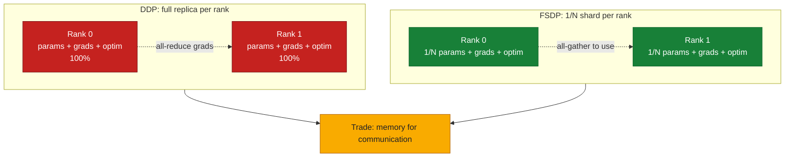
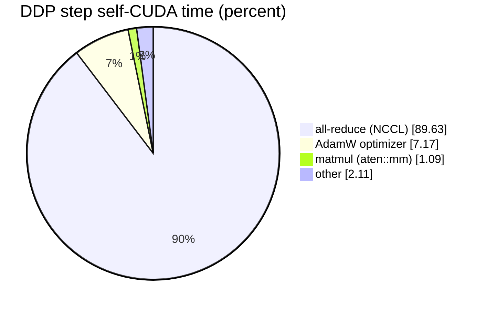
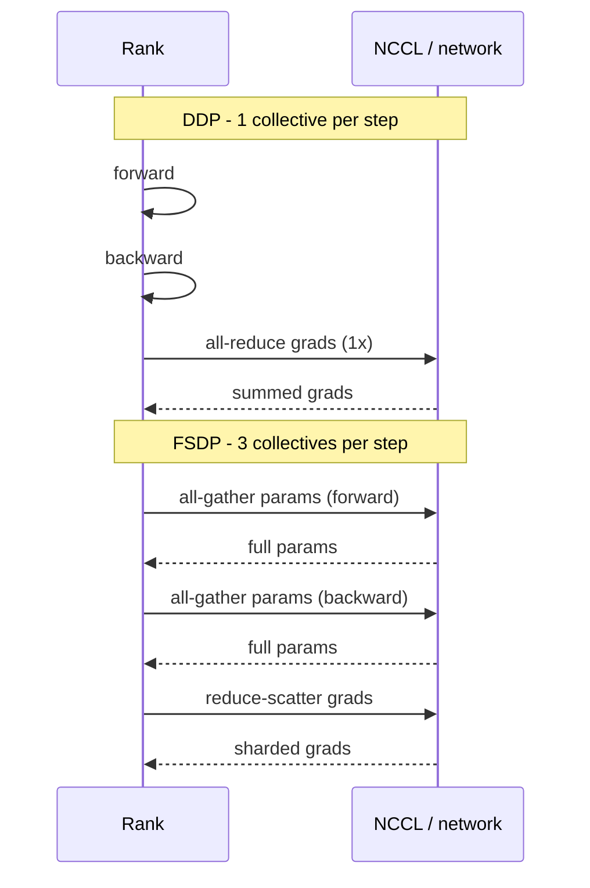

# 09 — Distributed Training: DDP and FSDP

## Overview

Parts I–II built the picture of the fabric; this is where a real workload runs on it. We train the **same model** across two A3 nodes (16 GPUs) under the two dominant data-parallel strategies — **DDP** and **FSDP** — and use a profiler trace to show that on this cluster the training step is **89.63% inter-node all-reduce**. The ~28 GB/s floor from doc-06 stops being a microbenchmark and becomes the thing that decides throughput.

**What you'll learn:**
- **DDP** vs. **FSDP**: what each replicates vs. shards, and the exact collectives each issues per step
- The **memory ↔ communication** trade-off, and why the network sets the exchange rate
- How to profile a step (`torch.profiler`) and read which op dominates GPU time
- Why **FSDP can be *slower* than DDP** on a slow fabric — and why you still need it
- How **gradient bucketing** and compute/comm overlap fight the latency floor

**Hands-on practice:** [lab-09: 2-node DDP vs FSDP](../../labs/lab-09-ddp-fsdp/)

**Prerequisites:** NCCL collectives and the inter-node floor ([doc-06](../part2-inter-node/06-nccl-collectives.md)); the intra-node ceiling ([doc-04](../part1-single-node/04-intranode-nvlink-nvswitch-hgx.md)); profiling/tracing ([T3](../toolkit/T3-profiling-tracing.md)).

---

## Two ways to go data-parallel

Both DDP and FSDP process different data on each rank and keep the model mathematically synchronized. They differ in **what lives on each GPU**:

*Figure: DDP keeps a full model replica on every rank; FSDP keeps a 1/N shard — trading memory for communication.*



| | **DDP** (DistributedDataParallel) | **FSDP** (FullyShardedDataParallel) |
| :--- | :--- | :--- |
| Parameters | **full replica** on every rank | **sharded** 1/N across ranks |
| Gradients | full, then all-reduced | sharded via reduce-scatter |
| Optimizer state | full replica | sharded |
| Collectives / step | **1× all-reduce** (gradients) | **all-gather** (fwd) + **all-gather** + **reduce-scatter** (bwd) |
| Per-rank memory | high (whole model) | low (~1/N) |
| Communication volume | lower | higher |

**DDP** replicates the model on all 16 GPUs; after backward, gradients are summed across ranks with **one all-reduce** and every rank steps its optimizer identically. **FSDP** shards parameters, so it must **all-gather** each layer's parameters just-in-time before using them (forward and again in backward), and **reduce-scatter** gradients — more collectives, more bytes on the wire, but a fraction of the memory.

The trade is **memory for communication.** Which one wins on wall-clock depends entirely on how expensive communication is — i.e., the fabric.

---

## What we measured (lab-09, 2 nodes / 16 GPUs)

Same synthetic model (8-block MLP stack, dim 4096), batch 16/rank:

| mode | params **per rank** | steady-state ms/step | global samples/s |
| :--- | ---: | ---: | ---: |
| **DDP** | ~1090.8 M (full replica) | **390.26** | **656.0** |
| **FSDP** | ~68.2 M (sharded 1/16) | 537.56 | 476.2 |

### FSDP is slower here — and that's the lesson

FSDP cut per-rank parameter memory **16×** (1090.8 M → 68.2 M) but ran **~38% slower**. Why: FSDP issues **more inter-node collectives per step** than DDP, and every one of them is throttled to the **~28 GB/s TCP floor** (doc-06). When communication is expensive, the strategy that communicates *less* (DDP) wins on speed.

This is the counterintuitive result the guide exists to make concrete:

- **On a slow fabric (this cluster, TCP):** DDP > FSDP on throughput, *if the model fits*.
- **On a fast fabric (TCPX/TCPXO/RDMA):** the extra FSDP collectives get cheap, and the gap shrinks or reverses.
- **When the model doesn't fit in one GPU:** DDP is simply impossible; FSDP (or tensor/pipeline parallelism) is the only option, and its memory savings are the entire point.

FSDP's value is **fitting bigger models**, not going faster. The network decides how much that memory saving costs you.

---

## The step is the all-reduce

The DDP profiler trace (`assets/lab-09/ddp_profiler_top_ops.txt`, sorted by CUDA time) is unambiguous:

```
                                   Name              Self CUDA   Self CUDA %   # of Calls
                        c10d::allreduce_                 1.902s       89.63%           85
ncclDevKernel_AllReduce_Sum_f32_TREE_LL(...)             1.902s       89.63%           85
              Optimizer.step#AdamW.step               152.077ms        7.17%            5
                               aten::mm                23.105ms        1.09%          165
Self CUDA time total: 2.122s
```

*Figure: DDP step self-CUDA time — the gradient all-reduce dwarfs compute (values from the trace above).*



- **Gradient all-reduce = 89.63% of GPU time** (1.902 s, 85 calls, ~22.4 ms each).
- **Actual compute (`aten::mm`) = 1.09%.** The matmuls are almost free; the GPUs spend the step **waiting on the network**.
- AdamW optimizer = 7.17%.
- NCCL chose `AllReduce_Sum_f32_TREE_LL` — the **TREE** algorithm, **LL** (low-latency) protocol — for the 2-node shape, matching lab-06's transport log.

Open the trace (`assets/lab-09/ddp_trace_rank0.json.gz` → `chrome://tracing` / Perfetto) and the NCCL stream visibly gates the backward pass. When the network is the bottleneck, more/faster GPUs don't help — a bigger pipe does.

*Figure: collectives per step — DDP does one all-reduce; FSDP adds two all-gathers plus a reduce-scatter, so more inter-node round-trips.*



---

## Fighting the floor (what frameworks actually do)

Given a 257 µs latency floor and 28 GB/s bandwidth, both strategies lean on the same tricks:

*Figure: compute/comm overlap — each gradient bucket's all-reduce launches as soon as its grads are ready, running while backward continues; FSDP prefetches the next all-gather.*

```mermaid
gantt
  title Overlap - buckets launch as grads become ready
  dateFormat X
  axisFormat %s
  section Backward compute
    bucket 3 : 0, 3
    bucket 2 : 3, 6
    bucket 1 : 6, 9
  section NCCL all-reduce
    reduce bucket 3 : 3, 6
    reduce bucket 2 : 6, 9
    reduce bucket 1 : 9, 11
  section FSDP prefetch
    all-gather next layer : 2, 5
```



1. **Gradient bucketing (DDP).** Rather than all-reduce each parameter tensor (each paying the 257 µs floor), DDP fuses gradients into large buckets (default ~25 MB) and all-reduces those — trading many latency-bound small collectives for a few bandwidth-bound large ones. This is why doc-04's small-message latency floor matters.
2. **Compute/comm overlap.** DDP kicks off a bucket's all-reduce **as soon as** that bucket's gradients are ready (during backward), overlapping communication with the still-running backward compute. FSDP prefetches the next layer's all-gather during the current layer's compute.
3. **Mixed precision / gradient compression** reduce bytes on the wire — directly attacking the bandwidth term.
4. **A faster transport** (GPUDirect-TCPX → TCPXO → RDMA/SHARP) attacks both terms at the hardware level — the Part II/IV ladder.

None of these change the arithmetic on *this* cluster enough to hide a 28 GB/s pipe behind a 1% compute workload — which is exactly why the profiler shows what it shows.

---

## Summary

**Key takeaways:**
1. **DDP** replicates and does **1 all-reduce/step**; **FSDP** shards and does **all-gather + reduce-scatter** — trading memory for communication.
2. On this **TCP-only** cluster, measured **DDP 390 ms/step (656 samples/s)** beats **FSDP 538 ms/step (476 samples/s)** — because FSDP communicates more over the ~28 GB/s floor.
3. **FSDP's payoff is memory (16× less per rank here), not speed** — essential when the model doesn't fit, and cheaper on a fast fabric.
4. The DDP step is **89.63% all-reduce, 1.09% matmul** — the GPUs wait on the network; doc-06's floor *is* the training bottleneck.
5. Bucketing + compute/comm overlap fight the latency floor; a faster transport is what actually raises the ceiling.

**Next steps:**
- [doc-06: NCCL collectives](../part2-inter-node/06-nccl-collectives.md) — the collective this step is bound by, and the ~17× cliff
- [doc-05: NICs, RDMA, GPUDirect](../part2-inter-node/05-nic-rdma-gpudirect.md) — the transport tiers that would move these numbers
- [§14: DGX SuperPOD & SHARP](../part4-platform-reference-arch/14-dgx-superpod.md) — in-network all-reduce at cluster scale

**Hands-on practice:** [lab-09: 2-node DDP vs FSDP](../../labs/lab-09-ddp-fsdp/)
