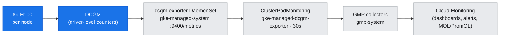
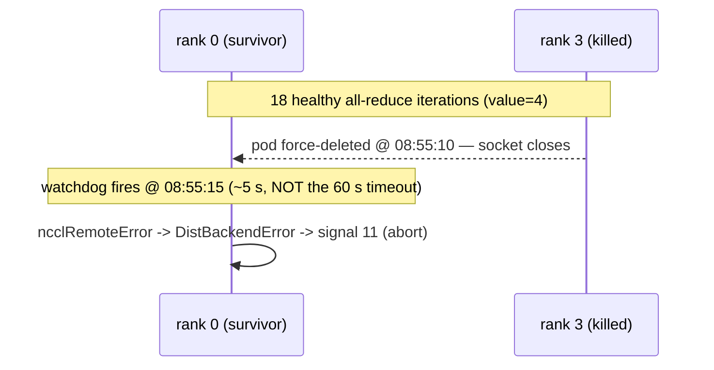
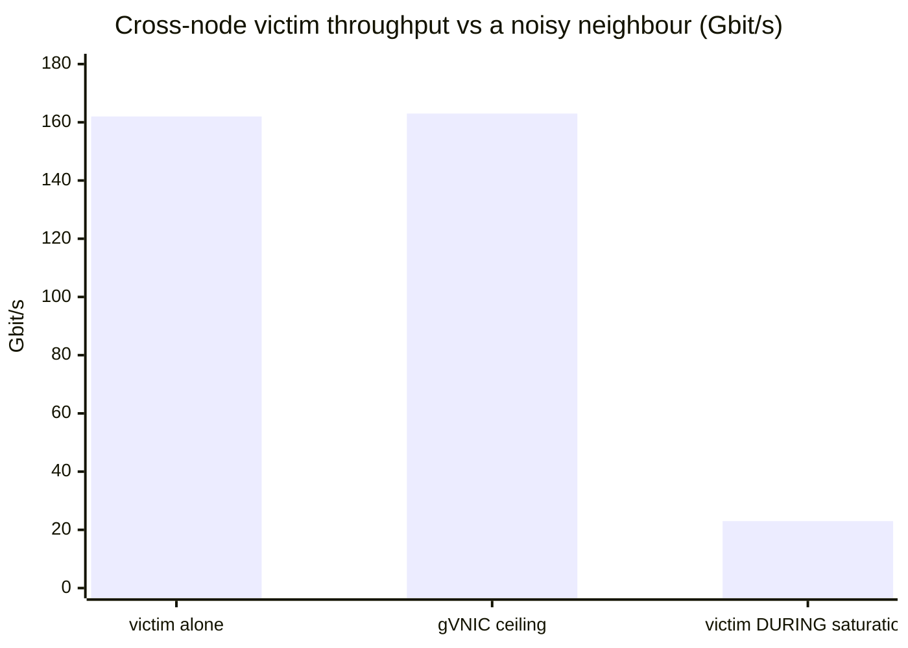
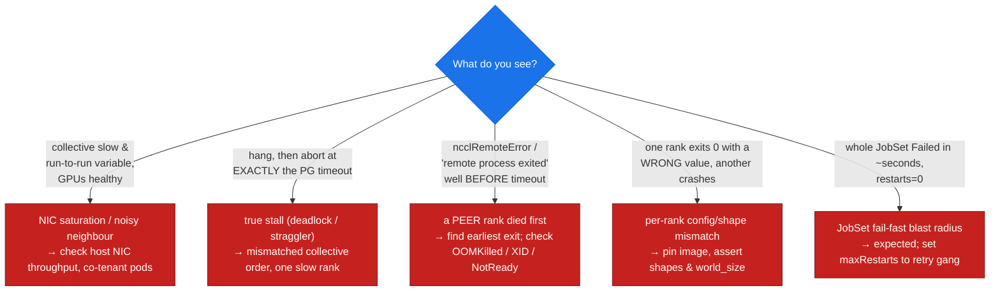

# 10 — Observability & Debugging: Watching GPU & Collective Health

## Overview

Docs 07–09 got a distributed gang admitted, placed, and training. This document is the other half of running one: **how do you see what the fleet is doing, and how do you read a failure when the gang dies?** On this GKE cluster the metrics pipeline is already wired for you — GKE ships a managed **DCGM exporter** and **Google Managed Prometheus (GMP)** out of the box, so per-GPU health flows to Cloud Monitoring without deploying anything. We first read that live pipeline (with genuine nonzero metrics from the running vLLM workload), then inject four **real, reversible faults** and capture the exact signature each one leaves — so you can go symptom → signature → root cause → fix.

Every fault below was run for real on the free GPUs of one node (`hhp6`), captured, and deleted within seconds. The DWS capacity holder on `hv7m` and the `qwen3-vllm` inference workload were never touched.

**What you'll learn:**
- The **GKE-managed metrics pipeline**: DCGM → `dcgm-exporter` DaemonSet (`gke-managed-system`) → GMP `ClusterPodMonitoring` → Cloud Monitoring — and how the exporter **joins each GPU to its consuming pod**
- Which **DCGM fields** actually diagnose a workload (why `FB_USED` + `SM_CLK` reveal a resident job that `GPU_UTIL` alone would hide)
- **Fault (a) — a rank dies:** two signatures — JobSet's **fail-fast** blast radius, and the **`ncclRemoteError`** the *surviving* ranks print (and why it points at a *different* rank)
- **Fault (c) — mismatched config:** the most dangerous class — a **silent wrong answer** (`value=2`, exit 0) on one rank while another crashes (exit 139)
- **Fault (b) — NIC saturation:** a noisy neighbour collapses cross-node bandwidth **~7×** (162 → 23 Gbit/s) with the GPUs perfectly healthy
- A **triage decision tree**: slow-but-healthy → network; hang to full timeout → true stall; `ncclRemoteError` → a peer already died; half-success → config mismatch

**Prerequisites:** the gang machinery ([doc-08](08-job-frameworks-jobset-kueue.md)); the NCCL collective floor ([doc-06](../part2-inter-node/06-nccl-collectives.md)); the shared-gVNIC network path ([doc-05](../part2-inter-node/05-nic-rdma-gpudirect.md)); monitoring tools ([T1](../toolkit/T1-monitoring-inventory.md), [T2](../toolkit/T2-health-diagnostics.md)).

**Hands-on practice:** [lab-10: Fleet observability & fault debugging](../../labs/lab-10-observability-fleet-debug/)

---

## The GKE-managed metrics pipeline

You do **not** deploy Prometheus + Grafana + a DCGM exporter yourself on GKE. The platform runs them for you: a DCGM exporter DaemonSet in `gke-managed-system` scrapes every GPU on every node, and GMP collectors in `gmp-system` pull that exporter and ship it to Cloud Monitoring.

*Figure: the managed observability path — one exporter pod per GPU node, scraped by GMP on a 30 s interval, landing in Cloud Monitoring.*



### What this cluster reports — `assets/lab-10/managed-stack.txt`

```
### dcgm-exporter DaemonSet (GKE-managed)
dcgm-exporter   2/2   ...   gke-dcgm-exporter:4.4.1-4.6.0-gke.17   (port 9400/metrics)

### scrape config CRs
clusterpodmonitoring   gke-managed-dcgm-exporter   ...
```

The exporter is a **DaemonSet, 2/2 ready** — one pod per GPU node (`hhp6`, `hv7m`) — running GKE's `gke-dcgm-exporter` image and exposing `:9400/metrics`. A `ClusterPodMonitoring` CR named `gke-managed-dcgm-exporter` tells the GMP collectors to scrape it. The scrape interval (`assets/lab-10/scrape-config.txt`) is **30 s** against the `metrics` port. Nothing here was installed by the lab — it is the default GKE GPU-node posture.

---

## Reading real GPU metrics: util is a trap, FB + clock tell the truth

A raw scrape of the exporter on `hhp6` returns one series per GPU, and — crucially — **each GPU is labelled with the pod consuming it**. That GPU→pod join is what turns "GPU 5 is busy" into "the `qwen3-vllm` pod is busy."

### What this cluster reports — `assets/lab-10/dcgm-per-gpu-summary.txt`

```
GPU  SM_CLK   PWR_W    UTIL%  FB_USED_MiB  POD
0    345      71.7     0      0            —
...  345      ~70      0      0            —   (GPUs 0–4, 7 idle)
5    1980     126.6    0      77581        qwen3-vllm-...
6    1980     122.4    0      77581        qwen3-vllm-...
7    345      70.6     0      0            —
```

Read this carefully, because it is a classic observability trap. **Every GPU reports `GPU_UTIL = 0` at the instant of the scrape** — if you alerted on utilization alone, you'd conclude the node is idle. But GPUs 5 and 6 are plainly *not* idle:

- **`SM_CLK 1980 MHz`** (vs 345 MHz idle) — the SMs are boosted to max clock.
- **`PWR ~125 W`** (vs ~70 W idle) — real power draw.
- **`FB_USED 77581 MiB`** — ~76 GiB of the 80 GB HBM is resident, i.e. a large model is loaded (the vLLM `qwen3` weights + KV cache).

`GPU_UTIL` is a coarse, instantaneous sample of "was a kernel running in the last window"; an inference server between requests can read 0 while holding the whole model in memory at boosted clocks. **The reliable "is this GPU in use" signal is `FB_USED` + `SM_CLK` + `POWER`, not `GPU_UTIL` alone** — and for real occupancy you want the profiling fields (`DCGM_FI_PROF_GR_ENGINE_ACTIVE`, `PIPE_TENSOR_ACTIVE`) which sample the SMs far more finely. The GPU→pod labels (`pod="qwen3-vllm-…"`) then tell you *whose* job it is.

---

## Fault (a): a rank dies — two signatures

The most common distributed failure is one rank going away (OOM-killed, node preemption, segfault). What you *see* depends on **who is watching** — the gang controller, or the surviving ranks' NCCL runtime.

### Signature #1 — JobSet fail-fast: the whole gang dies in seconds

`assets/lab-10/fault-kill-rank-jobset-signature.txt`: a 4-rank JobSet was looping an all-reduce; we force-deleted `worker-3`.

```
(rank 3 pod force-deleted)
~3s later:  jobset terminalState = Failed,  reason = FailedJobs,  restarts = 0
```

JobSet's **default `failurePolicy` is fail-fast**: the moment one child Job fails, the JobSet drives the entire set to `Failed` — here in **~3 seconds**, with `restarts: 0`. This is the *correct* default for a tightly-coupled collective (a gang with a dead rank can only hang), but it means **the blast radius of one rank is the whole job**. If you want the gang to retry as a unit, you must set `failurePolicy.maxRestarts` (doc-08); otherwise budget for the fact that any single-rank death is a full-job restart.

### Signature #2 — `ncclRemoteError` on the *survivors*

The JobSet reaped the survivors so fast (~3 s) that we never saw NCCL's *own* error path. To capture that, the lab re-ran with **raw Pods + a headless Service** (no gang controller), so the survivors persist and reach NCCL's error handling. `assets/lab-10/fault-nccl-hang-signature.txt`:

*Figure: the killed peer's socket closes, so rank 0 aborts in ~5 s — long before the 60 s collective timeout would have fired.*



```
[rank0]:[E722 08:55:15 ProcessGroupNCCL.cpp:1605] ... Process group watchdog thread
  terminated with exception: NCCL error: remote process exited or there was a network
  error, NCCL version 2.22.3
ncclRemoteError: A call failed possibly due to a network error or a remote process
  exiting prematurely.
  (WorkNCCL SeqNum=19, OpType=ALLREDUCE, NumelIn=268435456, Timeout(ms)=60000)
terminate called ... c10::DistBackendError
[nccl-hang-0:1 :0:98] Caught signal 11 (Segmentation fault)  <- process aborts
```

Two subtleties that trip people up:

1. **The error names the wrong culprit.** Rank 0 prints `ncclRemoteError`, but rank 0 is *fine* — it's reporting that a *peer* (rank 3, the one we killed) vanished. **`ncclRemoteError` / "remote process exiting prematurely" on a surviving rank almost always means a *different* rank died first.** Triage by finding the rank that exited **earliest** or has a **non-NCCL** error (an OOMKilled pod, a node `NotReady`, an XID on that GPU) — that rank is the root cause; everyone else is just reporting the broken socket.
2. **It did *not* wait the full 60 s timeout.** The dead peer's socket *closed*, so NCCL surfaced a remote error in ~5 s. That distinguishes it from a **true hang** (peer alive but stuck), which instead burns the *entire* `Timeout(ms)=60000` and prints `Watchdog caught collective operation timeout`. Fast abort → a peer *crashed*; slow timeout → a peer is *stuck*.

---

## Fault (c): mismatched config — the silent wrong answer

The most dangerous failure doesn't crash cleanly. The lab ran a 2-rank all-reduce where rank 0 built a tensor of 2²⁸ elements and rank 1 built only 2²⁷ — a **count mismatch** (a stand-in for mismatched images / NCCL versions / model-shard shapes). `assets/lab-10/fault-env-mismatch-signature.txt`:

```
rank 1 (2^27 elems):  all_reduce returned value=2   ... exit 0   (Succeeded)
     NCCL WARN [Service thread] Could not receive type from localRank 0
rank 0 (2^28 elems):  ncclCommWatchdog ... signal 11 ... exit 139 (Failed)
```

Rank 1 **returned a plausible but wrong answer (`value=2`) and exited 0** — it reduced only its own smaller buffer and reported success — while rank 0 **crashed (exit 139)**. A job that half-succeeds with corrupted numbers is *worse* than one that dies, because a scheduler sees "1 of 2 succeeded" and the bad value silently poisons a checkpoint or a metric. The `Could not receive type from localRank 0` NCCL WARN on rank 1 is the tell that the two ranks disagreed on the collective's shape.

**Guard against it before it happens:** pin **one** container image / NCCL / CUDA version across all ranks, **assert equal shapes and `world_size`** at startup, and log the NCCL version + key `NCCL_*` env on every rank so a mismatch is visible in line 1 of the logs, not in a corrupted result three hours later.

---

## Fault (b): NIC saturation — healthy GPUs, collapsing bandwidth

Doc-05 established that on A3-High a **single ~200 Gbit/s gVNIC** carries *all* inter-node NCCL over plain TCP — there is no GPUDirect rail to isolate collective traffic. So a bandwidth-hungry co-tenant on the same node directly steals from your collective. The lab measured this with two `hostNetwork` iperf3 probes (0 GPU) over the identical gVNIC. `assets/lab-10/fault-nic-saturation.txt`:

```
victim flow ALONE (8 streams):                 162 Gbit/s
background 32-stream load (noisy neighbour):   163 Gbit/s   <- NIC at its ceiling
SAME victim flow DURING saturation:             23 Gbit/s   <- ~7× collapse
```

*Figure: the victim flow runs at line rate alone, but collapses to ~1/7 once a neighbour pegs the shared gVNIC.*



The victim flow — standing in for a cross-node collective — drops from **162 to 23 Gbit/s, a ~7× collapse**, purely because a neighbour saturated the shared NIC. The GPUs are untouched and perfectly healthy the whole time; only the network is contended.

> **Scope note:** a *live concurrent cross-node NCCL* run is deliberately not performed here, because the second GPU node (`hv7m`) is fully held by the DWS capacity holder (doc-07) and must never be disturbed. iperf3 over the identical gVNIC is the faithful, GPU-free proxy; the collective figure it maps onto is the measured cross-node busbw floor from lab-06. This is exactly why A3 **Ultra** / A4 add CX-7 RoCE / InfiniBand rails — to separate GPU fabric from the host NIC (Part 4).

---

## Triage: symptom → signature → root cause

Put the four faults together and you get a decision tree that turns a vague "my job is broken" into a named root cause.

*Figure: reading the symptom to reach the root cause.*



The single most useful habit: **before blaming your code, read the metrics.** Healthy DCGM (normal clock/power/temp, no XID) plus a slow collective means the problem is *between* the GPUs — network or a dead/straggling peer — not inside them.

---

## Portability & product attribution

| Concern | GKE (this cluster) | NVIDIA / generic equivalent |
| :--- | :--- | :--- |
| Per-GPU driver metrics | **DCGM** (`dcgm-exporter`) | DCGM everywhere (vendor-standard); `nvidia-smi` for spot checks |
| Metric collection & storage | GMP `ClusterPodMonitoring` → **Cloud Monitoring** | Prometheus + `kube-prometheus-stack`; NVIDIA Base Command dashboards |
| GPU→pod attribution | exporter's `pod`/`namespace`/`container` labels | DCGM Kubernetes integration (same labels) |
| Dead-rank detection | JobSet terminal state + pod `OOMKilled`/exit code | Slurm `sacct` exit codes; MPI `PMIx` error events |
| Collective hang/abort | NCCL watchdog (`Timeout(ms)`, `ncclRemoteError`) | identical NCCL runtime (portable across schedulers) |
| Network contention | host NIC throughput, VPC flow metrics | fabric counters (IB `perfquery`, RoCE congestion) |

DCGM and the NCCL watchdog are **the same everywhere** — they are runtime/driver-level, not GKE-specific. What GKE changes is the *collection* layer (managed DCGM exporter + GMP instead of a self-run Prometheus) and the fact that, on A3-High, network contention shows up on the shared gVNIC rather than on isolated RDMA rails.

---

## Summary

1. GKE runs the metrics pipeline **for you**: a managed `dcgm-exporter` **DaemonSet (2/2)** in `gke-managed-system` → GMP `ClusterPodMonitoring` (**30 s**) → Cloud Monitoring. The exporter **joins each GPU to its consuming pod**.
2. **`GPU_UTIL` is a trap.** Our live scrape showed *every* GPU at `UTIL=0`, yet GPUs 5–6 were clearly busy — `SM_CLK 1980`, `~125 W`, `FB_USED 77581 MiB`, labelled `qwen3-vllm`. Trust **FB + clock + power** (and the `PROF_*` fields) for occupancy.
3. **A dead rank has two faces:** JobSet **fail-fast** kills the whole gang in ~3 s (`restarts=0`), and the surviving ranks print **`ncclRemoteError`** — which names a *peer's* death, not their own; the fast abort (well before the timeout) distinguishes a *crash* from a *hang*.
4. **Config mismatch is the most dangerous** class: one rank returned a **wrong `value=2` and exited 0** while another crashed (**exit 139**) — a silent-corruption failure to guard against by pinning images and asserting shapes/`world_size`.
5. **NIC saturation** collapsed a victim flow **162 → 23 Gbit/s (~7×)** with the GPUs healthy — the direct consequence of A3-High's single shared gVNIC and the reason RDMA rails exist on A3 Ultra / A4.
6. All four faults were injected on `hhp6`'s free GPUs, captured, and deleted; **the DWS holder and vLLM were never touched.**

**Next steps:**
- [doc-08: Job frameworks — JobSet & Kueue](08-job-frameworks-jobset-kueue.md) — the gang machinery whose failures this doc reads
- [doc-06: NCCL collectives](../part2-inter-node/06-nccl-collectives.md) — the cross-node busbw floor the NIC-saturation fault degrades
- Part 4: platform reference architectures — A3 Ultra / A4 RDMA rails that isolate GPU traffic from the host NIC

**Hands-on practice:** [lab-10: Fleet observability & fault debugging](../../labs/lab-10-observability-fleet-debug/)
**Tools in this layer →** [T1: Monitoring & Inventory](../toolkit/T1-monitoring-inventory.md) (DCGM fields, GMP scrape); [T2: Health & Diagnostics](../toolkit/T2-health-diagnostics.md) (XID / fault triage); [T3: Profiling & Tracing](../toolkit/T3-profiling-tracing.md) (per-kernel occupancy beyond DCGM)
