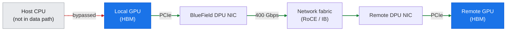
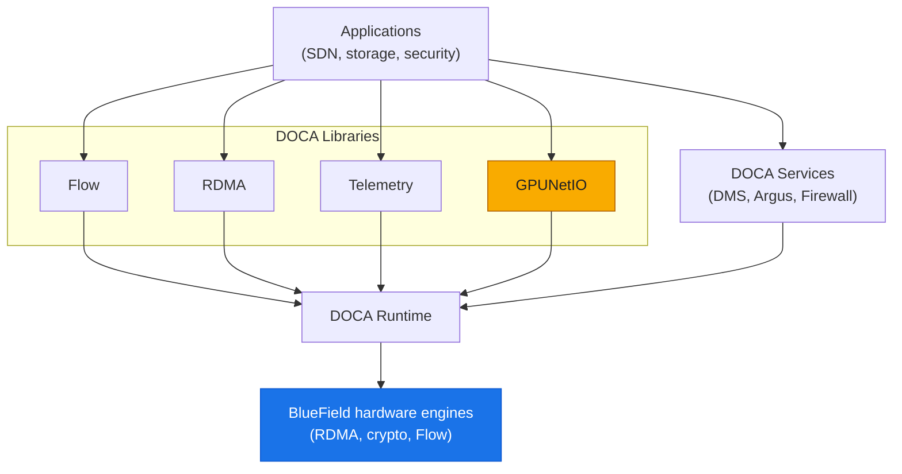
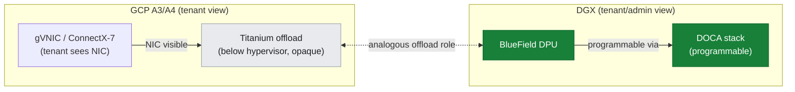

# 12: BlueField DPUs & DOCA

**Knowledge-first / reference architecture.** No BlueField DPU is present on this GCP A3 cluster; GCP's Titanium offload plays the analogous role. This document never claims DPU hardware was run here. For hands-on BlueField/DOCA work, see NVIDIA's dedicated DOCA skills.

---

## Overview

This document covers **NVIDIA BlueField Data Processing Units (DPUs)** and the **DOCA (Data Center Infrastructure on a Chip Architecture)** software stack — a foundational component of NVIDIA's purpose-built AI infrastructure platforms (DGX systems, DGX SuperPOD, and Spectrum-X fabrics). A DPU is a programmable network accelerator that offloads networking, storage, and security functions from the host CPU, enabling the CPU and GPU to focus entirely on compute workloads while the DPU handles infrastructure tasks at line rate.

**Why DPUs matter for AI clusters:**
- **CPU offload** — moves OVS/routing, RDMA, NVMe-oF, IPsec encryption, and telemetry off the host CPU, reclaiming 10–30% of CPU cycles for application work.
- **Isolation & security** — DPU runs its own OS (typically DPU-optimized Linux) isolated from the host; can enforce zero-trust policies, runtime security, and tenant isolation in multi-tenant clusters without host kernel involvement.
- **Consistent line-rate performance** — DPU-accelerated RDMA, packet processing, and storage protocols operate at 200/400 Gbps without stealing host CPU cycles or introducing jitter.

**GCP contrast (Titanium ↔ BlueField mapping):** On GCP A3/A4, **Titanium** is Google's custom offload subsystem that handles network virtualization (gVNIC), IPsec, load balancing, and fabric rx/tx offload. Titanium is **not a DPU in the tenant namespace** — it is a Google-managed infrastructure layer; tenants do not program or monitor it directly. The **functional role** is analogous (host offload, line-rate networking), but the **implementation, visibility, and programmability** differ. See [§T6 Portability Matrix](../toolkit/T6-portability-matrix.md#2-gcp--nvidia-product-mapping) for the detailed product mapping.

**What this document covers:**
1. **DPU architecture and offload domains** (networking, storage, security) — what a DPU offloads and how it integrates with the host.
2. **DOCA software stack** — the SDK, libraries, services, and runtime model for programming BlueField DPUs.
3. **BlueField-3 DPU and SuperNIC** — the current-generation DPU (400 Gbps Ethernet; Arm Cortex-A78 cores; hardware accelerators for crypto, RDMA, compression) and its **SuperNIC variant** (the DPU-accelerated endpoint for Spectrum-X fabrics).
4. **Where DPUs sit in an AI cluster** — north-south vs east-west separation, tenant isolation, and disaggregated storage.
5. **Contrast with GCP Titanium** — what the A3 tenant sees (and does not see) vs. what a DGX tenant with BlueField DPUs can access.
6. **Practice: lab-11 platform compare** — observe-and-compare exercise confirming no DPU is present on this cluster.

**Cross-references:**
- [§13: Spectrum-X and AI Fabrics](./13-spectrum-x-and-fabrics.md) — BlueField-3 SuperNIC is the Spectrum-X endpoint; this doc focuses on the DPU itself; §13 covers the full fabric (switches + SuperNICs).
- [§T5: Networking and Fabric Tools](../toolkit/T5-networking-fabric-tools.md) — RDMA/RoCE diagnostics and NCCL transport verification; applies to DPU-accelerated fabrics.
- [§T6: Portability Matrix](../toolkit/T6-portability-matrix.md) — GCP Titanium ↔ NVIDIA BlueField product mapping and cross-platform equivalents.

**For hands-on BlueField/DOCA programming:** This doc provides reference-architecture knowledge. For **actual BlueField deployment, DOCA application development, DMS (DOCA Management Services), and Argus telemetry**, reference **NVIDIA's dedicated DOCA skills** rather than duplicating them here. Links to NVIDIA DOCA documentation and skills are provided at the end.

---

## 1. What is a DPU? The Offload Model

### 1.1 Definition and Purpose

A **Data Processing Unit (DPU)** is a specialized processor (typically Arm-based, with hardware accelerators) that offloads **networking, storage, and security** tasks from the host CPU. In an AI cluster, the host CPU and GPUs are expensive, power-hungry, and optimized for compute; spending 10–30% of host CPU cycles on networking (TCP/IP, RDMA connection management, OVS forwarding) or storage (NVMe-oF initiator, erasure coding) is wasteful. A DPU handles these infrastructure tasks at line rate (200/400 Gbps) **without burdening the host**.

**Key characteristics:**
- **Programmable** — runs a full Linux OS (DPU OS) or DOCA runtime; can execute user applications, SDN agents (OVS, P4), storage protocols (NVMe-oF target/initiator), and security services (firewall, intrusion detection).
- **Hardware-accelerated** — offloads RDMA (RoCE), crypto (AES-GCM, IPsec), packet parsing, regular expression matching (for DPI), compression (zlib, LZ4), and GPUDirect RDMA descriptor management to fixed-function engines.
- **Isolated from host** — DPU has its own CPU cores, memory (4–16 GB DRAM), and storage (eMMC); it can monitor/firewall the host without relying on the host kernel, enabling zero-trust architectures.
- **SmartNIC form factor** — the BlueField DPU is a PCIe card plugged into the host; one or more Ethernet/InfiniBand ports connect to the network fabric.

**DPU vs SmartNIC vs SuperNIC terminology:**
- **SmartNIC** — general term for any NIC with programmable logic (FPGA, NPU, or CPU) beyond a fixed-function NIC; BlueField is NVIDIA's SmartNIC product line.
- **DPU** — NVIDIA's branding for BlueField SmartNICs emphasizing the data-center-scale offload role (not just NIC acceleration but full infrastructure offload).
- **SuperNIC** — the **BlueField-3 SuperNIC** is a specific DPU variant optimized as the endpoint for **Spectrum-X** fabrics (see [§13](./13-spectrum-x-and-fabrics.md)); it pairs BlueField-3 DPU acceleration with Spectrum-4 Ethernet switches for AI-optimized RoCE fabric.

### 1.2 The Three Offload Domains

A DPU offloads infrastructure work in three major domains. The signature networking case is the GPUDirect host-bypass path, where GPU-to-GPU RDMA never touches the host CPU:

*Figure: GPUDirect host-bypass path — local GPU to DPU NIC across the fabric to the remote GPU; the host CPU is never in the data path.*

#### 1.2.1 Networking Offload

**What it offloads:**
- **Packet forwarding and switching** — OVS (Open vSwitch) data plane runs on the DPU; VXLAN/Geneve encapsulation, flow table lookups, and NAT performed in hardware or on DPU CPU cores, not the host.
- **RDMA transport** — RoCE (RDMA over Converged Ethernet) connection management, reliable transport (retransmissions, ACKs), and memory registration handled by the DPU's RDMA engine (hardware offload).
- **GPUDirect RDMA** — DPU manages GPU memory registration and RDMA descriptors; GPU-to-GPU RDMA transfers bypass the host CPU entirely (DMA path: GPU → PCIe → DPU NIC → network → remote DPU → remote GPU).
- **Load balancing and NAT** — DPU can perform L3/L4 load balancing (ECMP, consistent hashing) and stateful NAT without host CPU involvement.
- **Network telemetry** — line-rate packet sampling, flow tracking, and telemetry export (sFlow, IPFIX) via DPU's packet-processing pipeline or software agents on DPU CPU.

**Why it matters for AI:** In a multi-node GPU training job, NCCL's inter-node all-reduce over RDMA generates sustained 200–400 Gbps bidirectional traffic. Without a DPU, the host CPU must manage RDMA queue pairs, process RoCE ACKs, and handle retransmissions — consuming 10–20 CPU cores at saturation. With a DPU, the RDMA engine handles this in hardware, and NCCL sees zero host CPU overhead for transport.

#### 1.2.2 Storage Offload

**What it offloads:**
- **NVMe-oF target** — DPU runs an NVMe-over-Fabrics target (NVMe-oF/TCP or NVMe-oF/RDMA), exposing local NVMe SSDs to remote hosts over the network; the host CPU never handles the storage protocol stack.
- **NVMe-oF initiator** — DPU can also act as an initiator, accessing remote storage on behalf of the host; the host sees a local block device, but the DPU handles the network transport.
- **Storage services** — erasure coding, compression, deduplication, and encryption can run on the DPU (CPU + crypto/compression accelerators), offloading these compute-intensive tasks from the host.
- **Disaggregated storage** — in a DGX SuperPOD or large-scale cluster, storage nodes (NVMe SSDs or all-flash arrays) are often separate from compute nodes; DPUs on compute nodes act as NVMe-oF initiators, and DPUs on storage nodes act as targets, enabling a **composable infrastructure** where storage capacity is pooled and allocated dynamically.

**Why it matters for AI:** Checkpointing large models (hundreds of GBs every few minutes) to remote storage can saturate the host CPU if the storage protocol (NFS, NVMe-oF) runs on the host. A DPU-offloaded NVMe-oF initiator achieves line-rate writes (50–100 GB/s with multiple NVMe-oF connections) without CPU overhead, keeping the host CPU available for data preprocessing or gradient accumulation.

#### 1.2.3 Security Offload

**What it offloads:**
- **IPsec encryption/decryption** — DPU's crypto engine performs AES-GCM or ChaCha20-Poly1305 encryption at line rate (400 Gbps); the host never sees plaintext packets traversing untrusted networks.
- **Firewall and access control** — DPU enforces stateful firewall rules (L3/L4 ACLs, connection tracking) and microsegmentation policies (per-tenant VLANs, security groups) in hardware or on DPU CPU cores.
- **Runtime security and intrusion detection** — DPU can monitor host memory, PCIe transactions, and network traffic from a privileged vantage point isolated from the host OS; rootkits or kernel compromises on the host do not affect the DPU's visibility.
- **Tenant isolation in multi-tenant clusters** — in a shared GPU cluster (e.g., multiple teams sharing a DGX SuperPOD), the DPU enforces network isolation between tenants (VLANs, VXLANs, or SR-IOV virtual functions) and prevents one tenant from snooping another's traffic, even if they share the same physical network.

**Why it matters for AI:** Training proprietary models on shared infrastructure (cloud or on-prem multi-tenant clusters) requires strong isolation. A DPU-enforced firewall guarantees that tenant A's GPU-to-GPU RDMA traffic cannot be intercepted by tenant B, and that tenant B cannot spoof tenant A's network identity — even if tenant B has root access to their own host.

---

## 2. DOCA: The Software Stack for BlueField DPUs

DOCA is to the BlueField DPU what CUDA is to the GPU — applications call domain libraries and services that run on a runtime over the DPU's hardware engines.

*Figure: the DOCA stack — applications call DOCA libraries (Flow, RDMA, Telemetry, GPUNetIO) and services, running on the DOCA runtime over BlueField hardware engines.*

### 2.1 What is DOCA?

**DOCA (Data Center Infrastructure on a Chip Architecture)** is NVIDIA's SDK and runtime for programming BlueField DPUs. It provides:
- **Libraries** — high-level APIs for networking (Flow, RDMA, TCP), storage (NVMe-oF, GPUDirect Storage), security (IPsec, regex DPI), and telemetry (NetFlow, packet capture).
- **Services** — pre-built infrastructure services (DOCA Management Services, Argus telemetry, firewall) that run on the DPU and integrate with orchestrators (Kubernetes, OpenStack).
- **Runtime** — the DOCA runtime manages DPU hardware accelerators, memory, and scheduling; applications use DOCA APIs to submit work to hardware engines (RDMA, crypto, Flow).
- **Interoperability** — DOCA integrates with standard protocols (OVS, DPDK, SPDK, P4) and orchestration frameworks (Kubernetes CNI plugins, Multus, SR-IOV device plugin).

**Analogy:** DOCA is to the BlueField DPU what CUDA is to the GPU — a software layer that abstracts hardware accelerators and provides a programmable interface for applications. Just as you write CUDA kernels to offload compute to the GPU, you write DOCA applications to offload networking/storage/security to the DPU.

### 2.2 DOCA Libraries

DOCA provides domain-specific libraries for common DPU offload tasks:

#### 2.2.1 DOCA Flow

**Purpose:** Hardware-accelerated packet matching and classification (equivalent to OVS offload or eBPF XDP, but with DPU hardware acceleration).

**What it does:**
- Define **flow tables** (match rules: 5-tuple, VXLAN VNI, VLAN, TCP flags) and **actions** (forward, mirror, encap/decap, modify header, drop).
- Offload these flows to the DPU's **hardware flow table** (programmable match-action pipeline in the NIC ASIC).
- Process packets at line rate (400 Gbps) without DPU CPU involvement — only exceptions (table misses, packets requiring deep inspection) are punted to the DPU CPU.

**Use case in AI clusters:** In a multi-tenant GPU cluster, DOCA Flow enforces per-tenant VLANs and QoS (rate limiting for background traffic, priority queues for NCCL all-reduce). The DPU applies these policies in hardware, ensuring tenant A's checkpoint writes to storage do not interfere with tenant B's inter-GPU communication.

#### 2.2.2 DOCA RDMA

**Purpose:** Programmatic access to the DPU's RDMA engine (RoCE or InfiniBand) for custom RDMA applications.

**What it does:**
- Create/destroy RDMA queue pairs (QPs), register memory regions, post send/receive/RDMA-write/read operations.
- Manage RDMA connection state (connection manager, address resolution) via DOCA APIs.
- Leverage DPU's hardware RDMA offload (retransmissions, ACKs, inline data) without host CPU overhead.

**Use case in AI clusters:** A custom distributed storage system (e.g., a key-value store for model checkpoints) can use DOCA RDMA to achieve <10 µs latency RDMA reads from remote NVMe SSDs, bypassing the kernel networking stack entirely. The DPU handles the RDMA transport; the host CPU only processes cache misses.

#### 2.2.3 DOCA Telemetry

**Purpose:** Line-rate network telemetry — packet sampling, flow tracking, and export to analytics systems (Prometheus, Elasticsearch, Splunk).

**What it does:**
- **sFlow / NetFlow export** — sample 1-in-N packets, extract headers (5-tuple, VXLAN VNI, timestamps), and export flow records to collectors.
- **Per-flow counters** — track bytes/packets per flow (identified by 5-tuple or VXLAN VNI); export to time-series databases.
- **Deep packet inspection (DPI)** — use DPU's regex engine to match packet payloads against patterns (e.g., detect NFS or HTTP traffic in a nominally RDMA-only network).

**Use case in AI clusters:** DOCA Telemetry can detect **misconfigured NCCL transports** (e.g., NCCL falling back to TCP instead of RDMA) by sampling inter-GPU traffic and verifying RoCE headers are present. It can also identify **elephant flows** (single GPU-to-GPU streams consuming >100 Gbps) that should use dedicated QoS classes.

#### 2.2.4 DOCA GPUNetIO

**Purpose:** Direct GPU-to-network communication — GPU kernels can send/receive packets or RDMA operations without CPU involvement.

**What it does:**
- GPU kernel invokes DOCA GPUNetIO APIs to post RDMA writes or read packets from a ring buffer **directly from the GPU** (no round-trip to host CPU).
- DPU and GPU coordinate via **GPUDirect RDMA** — the DPU's RDMA engine DMAs into GPU memory, and the GPU polls RDMA completion queues from within a CUDA kernel.

**Use case in AI clusters:** A custom distributed training framework can implement **in-kernel gradient reduction** — each GPU computes local gradients, then a CUDA kernel directly RDMA-writes them to a central aggregator GPU, eliminating the CPU from the critical path. Latency: ~5 µs (vs. ~20 µs for CPU-mediated RDMA).

### 2.3 DOCA Services

DOCA Services are **pre-built applications** that run on the DPU and expose REST/gRPC APIs or Kubernetes CRDs for orchestration:

#### 2.3.1 DOCA Management Services (DMS)

**Purpose:** Centralized management plane for DPU configuration, firmware updates, and lifecycle operations.

**What it does:**
- **Inventory and discovery** — DMS catalogs all DPUs in a cluster (serial numbers, firmware versions, link state, PCIe topology).
- **Firmware updates** — orchestrates DPU firmware flashing (UEFI, NIC firmware, DPU OS image) without requiring manual SSH to each DPU.
- **Configuration templates** — apply consistent network/storage/security policies (VLANs, IPsec, OVS flows) across 100s or 1000s of DPUs.

**Analogy:** DMS is to BlueField DPUs what **Base Command Manager (BCM)** is to DGX systems — a fleet management tool for infrastructure at scale.

#### 2.3.2 DOCA Argus

**Purpose:** Real-time telemetry and observability for DPU operations.

**What it does:**
- **Metrics export** — Prometheus-compatible metrics for DPU CPU utilization, RDMA throughput, packet drop counters, crypto offload usage.
- **Alerting** — detect anomalies (sudden spike in RDMA retransmissions, DPU CPU saturation, link flaps) and trigger alerts.
- **Integration with cluster monitoring** — Argus exports telemetry to the same Prometheus/Grafana stack used for GPU monitoring (DCGM), providing a unified observability plane.

**Use case in AI clusters:** Argus can correlate **GPU underutilization** (from DCGM) with **RDMA retransmissions** (from Argus) — if a GPU's utilization drops during a training step and Argus shows RoCE retransmission storms on the DPU, the root cause is network congestion, not GPU performance.

#### 2.3.3 DOCA Firewall

**Purpose:** Stateful firewall service running on the DPU, enforcing L3/L4 ACLs and connection tracking.

**What it does:**
- **Stateful filtering** — allow established TCP connections, block unsolicited inbound traffic, enforce per-tenant ACLs.
- **Integration with Kubernetes Network Policies** — DOCA Firewall can be deployed as a Kubernetes CNI plugin; Kubernetes NetworkPolicy CRDs are translated into DOCA Flow rules and enforced by the DPU in hardware.

**Use case in AI clusters:** In a multi-tenant cluster, each team's namespace is isolated by DOCA Firewall rules — team A's pods can only communicate with team A's storage, and team B cannot access team A's checkpoint data, even though both teams share the same physical network.

---

## 3. BlueField-3 DPU and SuperNIC

### 3.1 BlueField-3 Architecture

**NVIDIA BlueField-3 DPU** is the current-generation (as of 2024–2025) DPU, succeeding BlueField-2. Key specs:

| Component | BlueField-3 Specification |
|:---|:---|
| **CPU** | 16 × Arm Cortex-A78 cores @ 2.6 GHz (total ~41,600 Dhrystone MIPS; enough to run OVS, storage protocols, and security services at line rate) |
| **Memory** | 16 GB LPDDR5 DRAM (for DPU OS, packet buffers, flow table cache) |
| **Network Ports** | 1 × 400 GbE or 2 × 200 GbE (QSFP-DD) or 1 × 400 Gbps InfiniBand (NDR) |
| **PCIe Host Interface** | PCIe Gen5 x16 (up to 128 GB/s bidirectional; for GPUDirect RDMA and host memory access) |
| **RDMA Engine** | Hardware offload for RoCEv2 or InfiniBand (reliable connection, unreliable datagram, RDMA write/read/atomic; <1 µs latency for 0-byte RDMA write) |
| **Crypto Engine** | AES-GCM 256, IPsec, TLS inline (up to 400 Gbps line-rate encryption/decryption) |
| **Packet Processing** | 1 Tpps (packets per second) forwarding capacity; programmable match-action pipeline (DOCA Flow) |
| **GPUDirect RDMA** | Supports NVIDIA GPUDirect RDMA (GPU memory registration, DMA to/from GPU without host CPU copy) |
| **Storage Offload** | NVMe-oF target/initiator (RDMA and TCP transports); SPDK integration |
| **Compression** | Hardware-accelerated zlib, LZ4 (for storage or network compression) |
| **Regex Engine** | DPI (deep packet inspection) via regular expressions at line rate |

**Form factor:** BlueField-3 is a **dual-slot PCIe card** (standard or OCP 3.0) that plugs into the host server. One or two QSFP-DD ports on the bracket connect to the network fabric.

### 3.2 BlueField-3 SuperNIC — The Spectrum-X Endpoint

**BlueField-3 SuperNIC** is a variant of the BlueField-3 DPU optimized as the **endpoint for Spectrum-X Ethernet fabrics** (see [§13: Spectrum-X and AI Fabrics](./13-spectrum-x-and-fabrics.md) for the full Spectrum-X architecture).

**What makes it "Super":**
- **Tight integration with Spectrum-4 Ethernet switches** — SuperNIC and Spectrum-4 switches cooperate on **adaptive routing** (per-packet load balancing), **congestion control** (PFC + ECN + hardware retransmission), and **QoS** (priority flow control for NCCL all-reduce vs. background traffic).
- **GPU-optimized RoCE stack** — hardware-accelerated RoCE with lossless Ethernet (PFC), ECN-based congestion control, and NCCL-aware flow scheduling.
- **Line-rate 400 Gbps per port** — two SuperNICs per DGX H100 node (total 800 Gbps bidirectional) provide the inter-node bandwidth for large-scale training.

**Architectural role:** In a DGX H100 system with Spectrum-X, the **BlueField-3 SuperNIC** handles all inter-node GPU communication (NCCL over RDMA) and offloads the RoCE transport from the host CPU. The **Spectrum-4 switch** provides the fabric-level adaptive routing and in-network congestion control. Together, they deliver near-lossless, low-jitter RDMA for AI workloads at 400 Gbps per link.

**Contrast with standard BlueField-3 DPU:** A standard BlueField-3 DPU can be used with **any** Ethernet or InfiniBand fabric (Cisco, Arista, Mellanox Quantum IB); it is not tied to Spectrum-X. The SuperNIC variant is specifically tuned for Spectrum-X and includes firmware optimizations for the Spectrum-4 switch's adaptive routing and telemetry protocols. In practice, the difference is primarily in firmware and switch interoperability; the hardware (Cortex-A78 cores, RDMA engine, crypto engine) is the same.

---

## 4. Where DPUs Sit in an AI Cluster

### 4.1 North-South vs. East-West Traffic Separation

In a large AI cluster (e.g., DGX SuperPOD with 100+ nodes), network traffic has two main patterns:

- **East-West** — GPU-to-GPU communication (NCCL all-reduce, all-gather, peer-to-peer transfers). This is **latency-sensitive** (10–50 µs target) and **bandwidth-intensive** (sustained 200–400 Gbps per link). It dominates the fabric during training.
- **North-South** — control plane traffic (pod orchestration, logging, monitoring), storage I/O (checkpoints, dataset loading), and external access (SSH, Jupyter notebooks). This is **bursty** and **less latency-sensitive** but must not interfere with east-west GPU traffic.

**DPU's role:**
- **East-west offload** — DPU accelerates RDMA for NCCL (RoCE transport, GPUDirect RDMA), ensuring host CPU never touches inter-GPU packets.
- **North-south offload** — DPU handles OVS forwarding, NAT, and IPsec encryption for control/storage traffic, again reclaiming host CPU cycles.
- **QoS enforcement** — DPU applies **traffic shaping** and **priority queues** — NCCL all-reduce gets dedicated high-priority queues (low latency, high bandwidth), while checkpoint writes and logs use best-effort queues (can tolerate 10–100 ms latency spikes).

In Spectrum-X fabrics, **two separate networks** are sometimes deployed:
1. **Compute fabric** (east-west) — Spectrum-4 switches + BlueField-3 SuperNICs, 400 Gbps per port, rail-optimized topology (see [§13.3](./13-spectrum-x-and-fabrics.md#3-rail-optimized-topologies-and-nccl)), exclusively for inter-GPU RDMA.
2. **Management/storage fabric** (north-south) — separate Ethernet switches (Spectrum-2 or Spectrum-3), 100 Gbps per node, for orchestration, NVMe-oF storage, and external access.

**GCP contrast:** On GCP A3, **no physical north-south/east-west separation** exists in the tenant namespace. The gVNIC (A3 High/Mega) or ConnectX-7 (A3 Ultra/A4) handles both inter-GPU NCCL (over GPUDirect-TCPX or RDMA) and storage/control traffic on the same logical interface. GCP's Titanium offload and VPC routing handle QoS and isolation transparently.

### 4.2 Tenant Isolation in Multi-Tenant Clusters

In a multi-tenant GPU cluster (e.g., a university research cluster or cloud GPU instances), **tenant isolation** is critical:
- Tenant A's training job must not see tenant B's packets (confidentiality).
- Tenant A must not consume tenant B's RDMA bandwidth (fairness).
- Tenant A must not be able to spoof tenant B's network identity (security).

**DPU-enforced isolation mechanisms:**
1. **SR-IOV virtual functions** — each tenant gets a dedicated SR-IOV VF (virtual NIC); the DPU enforces VLAN tagging, MAC filtering, and bandwidth limits per VF in hardware.
2. **VXLAN/Geneve overlays** — the DPU encapsulates each tenant's traffic in separate VXLAN tunnels (unique VNI per tenant); tenants cannot see each other's Layer 2 broadcast domains.
3. **Firewall ACLs** — DOCA Firewall enforces per-tenant ACLs at the DPU; even if tenant A has root access on their host, they cannot bypass the firewall (it runs on the isolated DPU).

**GCP contrast:** GCP enforces tenant isolation via **Andromeda** (Google's SDN) and **Titanium** offload. Each VM sees a gVNIC or ConnectX-7 VF with pre-configured MAC/VLAN; the VPC control plane enforces isolation and routing. Tenants cannot program or inspect the isolation logic (it is below the VM hypervisor). In contrast, a DGX cluster admin with BlueField DPUs can inspect and customize isolation policies via DOCA APIs or Kubernetes NetworkPolicies.

### 4.3 Disaggregated Storage

**Disaggregated storage** decouples compute and storage — instead of local NVMe SSDs in each compute node, a cluster has dedicated **storage nodes** (servers with 10–20 NVMe SSDs each), and compute nodes access storage over the network via **NVMe-oF** (NVMe over Fabrics).

**DPU's role:**
- **Compute node DPU (initiator)** — runs NVMe-oF initiator; the host OS sees a local `/dev/nvme0` block device, but the DPU actually fetches data from a remote storage node over RDMA. The host CPU never handles the NVMe-oF protocol stack.
- **Storage node DPU (target)** — runs NVMe-oF target; exposes local NVMe SSDs to remote compute nodes. The DPU handles RDMA completions, block I/O scheduling, and (optionally) erasure coding or compression.

**Benefits for AI:**
- **Capacity pooling** — a 32-node GPU cluster can share 4 storage nodes (128 NVMe SSDs, ~500 TB total) instead of provisioning 16 × 4 TB per compute node (wasteful if not all nodes write checkpoints simultaneously).
- **Bandwidth aggregation** — a single compute node can read from multiple storage nodes in parallel (4 × 100 Gbps NVMe-oF connections = 50 GB/s read bandwidth), exceeding what local SSDs provide.
- **No host CPU overhead** — a 50 GB/s NVMe-oF write (for model checkpointing) consumes <1 CPU core on the compute node (DPU handles the RDMA transport and NVMe command translation).

**GCP contrast:** GCP A3 nodes use **Hyperdisk** (GCP's block storage service) for persistent storage. Hyperdisk is **not NVMe-oF over tenant RDMA** — it is a managed service with GCP-internal storage disaggregation (likely NVMe-oF or similar on the backend, but abstracted from the tenant). Tenants interact with Hyperdisk via standard block device APIs (`/dev/sdb`); there is no tenant-visible DPU running NVMe-oF initiator. The **functional outcome** (disaggregated, high-bandwidth storage with no host CPU overhead) is similar, but the implementation and visibility differ.

---

## 5. Contrast with GCP Titanium Offload

This section makes explicit the **GCP Titanium ↔ NVIDIA BlueField mapping** referenced throughout the guide. Both are **host offload subsystems** that move networking/storage/security off the host CPU, but the implementation, visibility, and programmability differ.

*Figure: Titanium vs BlueField visibility — the tenant sees gVNIC/CX-7 while Titanium sits opaque below the hypervisor; on DGX the tenant/admin sees the BlueField DPU and programs it via DOCA.*

| Dimension | GCP Titanium (A3/A4) | NVIDIA BlueField DPU (DGX) |
|:---|:---|:---|
| **Architecture** | Custom ASIC + software offload running on Google's infrastructure (below the VM/GKE tenant namespace); fronts gVNIC (A3 High/Mega) or ConnectX-7 (A3 Ultra/A4) to the tenant | Arm-based SmartNIC (BlueField-3: 16 Cortex-A78 cores + hardware accelerators) plugged into the host as a PCIe card; runs DOCA software stack visible to the tenant |
| **Tenant Visibility** | **Not visible** — tenants see gVNIC or ConnectX-7 as a standard NIC; Titanium offload is transparent. No tenant access to Titanium CPU, memory, or configuration. | **Fully visible** — tenant can SSH to the DPU (if admin-configured), run custom DOCA applications, inspect RDMA queue states, and monitor telemetry via DOCA Argus. DPU is a programmable resource. |
| **Networking Offload** | GCP's VPC routing, gVNIC/ConnectX-7 driver, and **GPUDirect-TCPX / TCPXO** plugins (A3 High/Mega) or **GPUDirect-RDMA** (A3 Ultra/A4) offload RDMA-like transport to Titanium. Host CPU sees minimal overhead for NCCL inter-GPU traffic. | BlueField DPU offloads RoCE RDMA transport (connection management, retransmissions, ACKs) to hardware. GPUDirect RDMA is standard (GPU ↔ DPU ↔ network); no plugin needed (NCCL uses `NCCL_IB_HCA` auto-detection). |
| **Storage Offload** | GCP Persistent Disk / Hyperdisk uses Google-internal storage disaggregation (tenant does not configure NVMe-oF; appears as `/dev/sdb` block device). | BlueField DPU can run NVMe-oF target/initiator (tenant-configurable via DOCA or Kubernetes CRDs); admin controls storage disaggregation topology. |
| **Security Offload** | GCP Titanium handles IPsec for inter-VM encryption (Google's Andromeda SDN enforces encryption transparently; tenant cannot disable or inspect it). | BlueField DPU runs IPsec in hardware (AES-GCM); admin configures via DOCA or Kubernetes Network Policies. Tenant can inspect/debug IPsec state on the DPU. |
| **Isolation** | GCP Andromeda SDN + Titanium enforce tenant isolation (VPC routing, firewall rules, VLAN/VXLAN encapsulation) below the VM hypervisor; immutable to tenant. | BlueField DPU enforces isolation via SR-IOV VFs, VXLAN, and DOCA Firewall; configurable by admin (e.g., Kubernetes NetworkPolicies translated to DOCA Flow rules). Tenant sees VF boundaries but cannot modify DPU firewall. |
| **Programmability** | **Not programmable** by tenant — Titanium is a closed, Google-managed subsystem. Tenant interacts only via standard NIC APIs (socket, RDMA verbs, gVNIC ethtool counters). | **Fully programmable** — tenant (or admin) can write DOCA applications (custom RDMA protocols, packet filters, telemetry collectors) and deploy them on the DPU. Use cases: custom distributed storage, in-network compute, telemetry pipelines. |
| **Telemetry** | Tenant can read gVNIC / ConnectX-7 counters via `ethtool -S` (packet counts, byte counts, error counters). No visibility into Titanium-internal telemetry (GCP monitors this for operations). | Tenant can use DOCA Argus to export DPU CPU utilization, RDMA throughput, packet drop reasons, crypto offload usage to Prometheus/Grafana. Full observability into DPU operations. |
| **Management** | Google-managed — firmware updates, configuration, and lifecycle operations are automatic and invisible to tenant. | Admin-managed via **DOCA Management Services (DMS)** — orchestrates firmware updates, configuration templates, and lifecycle operations across 100s–1000s of DPUs in a cluster. |

**Key takeaway:** GCP Titanium and NVIDIA BlueField DPUs serve the **same architectural purpose** (host offload for networking/storage/security), but GCP Titanium is a **managed, transparent service** (tenant does not configure or inspect it), while BlueField DPUs are **programmable, tenant-visible infrastructure** (admin or tenant can customize offload logic via DOCA). Both achieve **high performance with zero host CPU overhead**; the difference is in **operational model** (cloud-managed vs on-prem admin-configured) and **programmability** (fixed-function offload vs. custom DOCA applications).

**Product mapping reference:** See [§T6: Portability Matrix](../toolkit/T6-portability-matrix.md#2-gcp--nvidia-product-mapping) for the full GCP ↔ NVIDIA product mapping table.

---

## 6. Hands-On BlueField / DOCA Work — NVIDIA Skills

This document provides **reference-architecture knowledge** of BlueField DPUs and DOCA, sufficient to understand their role in an AI cluster and contrast them with GCP's Titanium offload. For **actual hands-on work** — deploying BlueField DPUs, writing DOCA applications, configuring DOCA Management Services (DMS), and using DOCA Argus telemetry — reference **NVIDIA's dedicated DOCA skills** rather than duplicating them here.

**Why separate skills?**
- **Hardware requirements** — hands-on BlueField/DOCA work requires physical BlueField DPU hardware or a DOCA SDK emulator; the GCP A3 cluster used for this guide has no BlueField DPU (GCP uses Titanium offload).
- **Complexity** — DOCA programming (RDMA, Flow, GPUNetIO) is a multi-day tutorial in itself; duplicating it here would dilute the guide's inter-node GPU communication focus.
- **Maintenance** — NVIDIA's DOCA documentation and skills are authoritative and continuously updated; deferring to them ensures accuracy.

**NVIDIA DOCA resources:**
- **DOCA Documentation** — [https://docs.nvidia.com/doca/](https://docs.nvidia.com/doca/) (SDK installation, API reference, sample applications).
- **DOCA Developer Zone** — [https://developer.nvidia.com/networking/doca](https://developer.nvidia.com/networking/doca) (whitepapers, webinars, hands-on labs).
- **DOCA SDK samples** — [https://github.com/NVIDIA/doca](https://github.com/NVIDIA/doca) (example DOCA Flow, RDMA, and telemetry applications).
- **NVIDIA DOCA skills** (if available in your environment) — skills for DOCA Management Services (DMS), DOCA Argus telemetry, and DOCA Firewall.

**What this guide covers (vs. DOCA skills):**
- **This guide (§12)** — architectural overview of DPUs, offload domains, DOCA stack, BlueField-3 hardware, and where DPUs fit in an AI cluster; **contrast with GCP Titanium**; suitable for understanding the landscape and making product decisions.
- **NVIDIA DOCA skills** — step-by-step tutorials for installing DOCA SDK, writing DOCA applications, deploying DOCA services on Kubernetes, and debugging DPU issues; suitable for hands-on implementation.

---

## 7. Practice: Lab-11 Platform Compare

**Lab:** [lab-11-platform-compare](../../labs/lab-11-platform-compare/)

**Objective:** Observe and confirm that **no BlueField DPU is present** on the GCP A3 cluster, documenting the evidence (lack of DPU PCI device, no DOCA services, no DPU-specific `ethtool` features). Contrast this with what a DGX H100 system with BlueField-3 SuperNICs would expose.

**What lab-11 demonstrates:**
1. **PCI device enumeration** — `lspci | grep -i mellanox` or `lspci | grep -i bluefield` on an A3 High node shows **only the host GPU's PCIe devices** (H100s and gVNIC); no Mellanox BlueField DPU device (which would appear as a separate PCI endpoint with vendor ID 0x15b3, device ID 0xc2d2 for BlueField-3).
2. **NIC inspection** — `ethtool -i <nic>` on A3 High shows `driver: gve` (gVNIC); on A3 Ultra/A4 shows `driver: mlx5_core` (ConnectX-7) but **no DPU firmware version** (a BlueField DPU exposes two PCIe functions: one for the host-facing NIC, one for the DPU's management interface; only the former is visible on A3 Ultra/A4).
3. **DOCA service absence** — no `doca-telemetry-service`, `doca-flow-manager`, or `dms-agent` processes running on the node; no DOCA SDK binaries in `/opt/mellanox/doca`.
4. **Contrast with DGX H100** — document what **would** be present on a DGX H100 with BlueField-3 SuperNICs: `lspci` shows the DPU as a separate PCIe device, `ethtool -i` shows firmware version with "BlueField" in the string, and DPU is accessible via a management IP (e.g., SSH to `bf-dpu0` hostname or `192.168.100.2` link-local).

**Outcome:** Lab-11 produces a **platform comparison table** (A3 tenant view vs. DGX tenant view) backed by real captured `lspci`, `ethtool`, and process listing output, confirming that the A3 cluster has no tenant-visible DPU and that GCP's Titanium offload plays the analogous role (but is not visible or programmable by the tenant). This table is referenced throughout Part IV to ground the knowledge-first content in observable cluster facts.

**Why this matters:** Part IV is explicitly **knowledge-first / reference architecture** — readers must never be misled into thinking a BlueField DPU was run here. Lab-11 provides the evidence trail that separates "what we measured on A3" from "what the NVIDIA platform provides."

---

## Summary

**BlueField DPUs** offload networking, storage, and security from the host CPU to a dedicated, programmable Arm-based SmartNIC, reclaiming 10–30% of host CPU cycles for application work and enabling line-rate (400 Gbps) RDMA, encryption, and storage protocols without host overhead. **DOCA** is the SDK for programming BlueField DPUs, providing libraries (Flow, RDMA, Telemetry, GPUNetIO) and services (DMS, Argus, Firewall) for infrastructure offload. **BlueField-3** is the current-generation DPU (16 Cortex-A78 cores, 400 Gbps Ethernet/InfiniBand, hardware RDMA/crypto/compression); the **BlueField-3 SuperNIC** variant is the endpoint for Spectrum-X AI fabrics (see [§13](./13-spectrum-x-and-fabrics.md)).

In an AI cluster, DPUs handle **east-west GPU-to-GPU RDMA** (NCCL over RoCE) and **north-south control/storage traffic** (OVS, NVMe-oF, IPsec) at line rate, enforce **tenant isolation** (SR-IOV, VXLAN, firewall ACLs), and enable **disaggregated storage** (NVMe-oF target/initiator). DPUs are fully programmable via DOCA APIs, allowing custom RDMA protocols, telemetry pipelines, and in-network compute.

**GCP Titanium** is the functional equivalent on GCP A3/A4 — a host offload subsystem that handles networking (gVNIC/TCPX or ConnectX-7/RDMA), storage (Hyperdisk), and security (IPsec) transparently. The key difference: **Titanium is not visible or programmable by the tenant** (it is a Google-managed service below the VM/GKE layer), while **BlueField DPUs are tenant-visible infrastructure** (admin or tenant can write DOCA applications, inspect telemetry, and customize offload logic). Both achieve high performance with zero host CPU overhead; the operational model differs (cloud-managed vs. on-prem admin-configured).

For **hands-on BlueField/DOCA programming**, see NVIDIA's DOCA documentation ([https://docs.nvidia.com/doca/](https://docs.nvidia.com/doca/)) and dedicated DOCA skills (DMS, Argus, telemetry) rather than duplicating them here. This guide provides the architectural foundation and cross-platform contrast; NVIDIA's resources provide the implementation details.

---

## Cross-References

- **Next:** [§13: Spectrum-X and AI Fabrics](./13-spectrum-x-and-fabrics.md) — the full Spectrum-X architecture (Spectrum-4 switches + BlueField-3 SuperNICs); rail-optimized topologies; contrast with Quantum InfiniBand and GCP fabric/TCPX.
- **Tools:** [§T5: Networking and Fabric Tools](../toolkit/T5-networking-fabric-tools.md) — RDMA/RoCE diagnostics (`perftest`, `ibstat`, `mlxlink`), NCCL transport verification, and fabric telemetry; applies to DPU-accelerated fabrics.
- **Portability:** [§T6: Portability Matrix](../toolkit/T6-portability-matrix.md) — GCP Titanium ↔ NVIDIA BlueField product mapping; cross-platform equivalents for driver/monitoring/networking/orchestration.
- **Practice:** [lab-11-platform-compare](../../labs/lab-11-platform-compare/) — observe-and-compare exercise confirming no DPU on this cluster; A3 vs. DGX platform comparison table.
