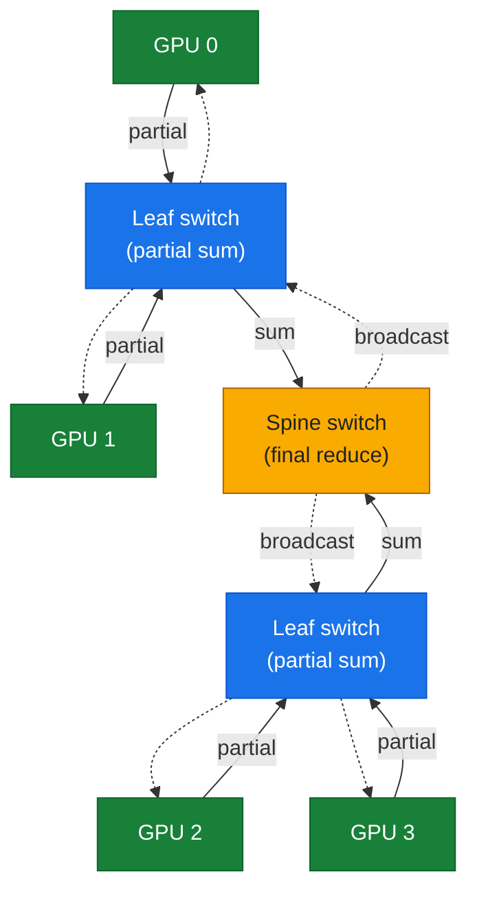
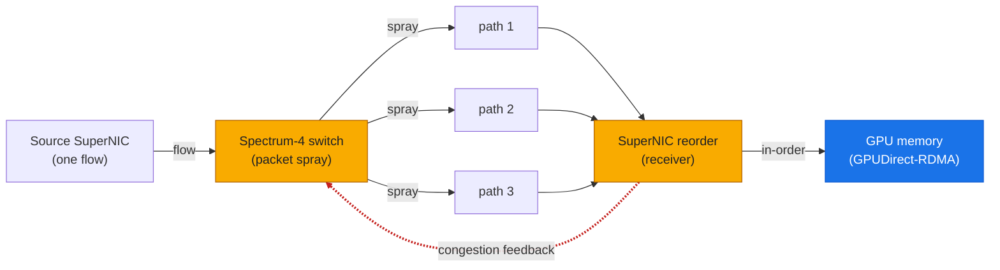
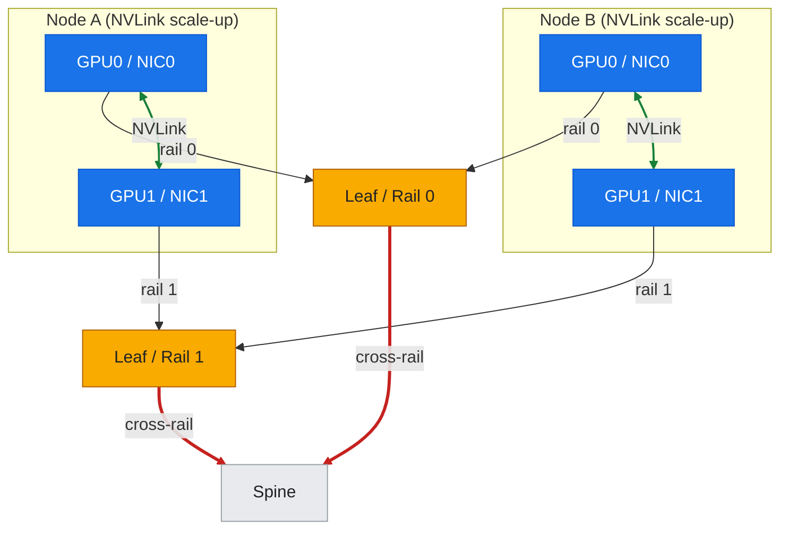

# 13: Spectrum-X and AI Fabrics

**Knowledge-first / reference architecture.** No NVIDIA Spectrum-X switch, Quantum InfiniBand switch, or BlueField-3 SuperNIC is present on this GCP A3 cluster; GCP fronts its own Ethernet/VPC fabric with GPUDirect-TCPX and its Titanium offload subsystem. This document never claims Spectrum-X or InfiniBand hardware was run here. Each capability is attributed to the correct product on both the NVIDIA and GCP sides, and observe-and-compare exercises are limited to what the live GCP lab can actually reveal.

---

## Overview

This document covers the **network fabrics that carry east-west GPU-to-GPU traffic** in large AI clusters, and how NVIDIA's purpose-built fabrics compare to the fabric under this GCP A3 lab. Training and large-scale inference are **collective-communication bound**: an all-reduce, all-gather, or reduce-scatter over hundreds or thousands of GPUs only runs as fast as the slowest path through the network. The fabric is therefore not plumbing — it is a first-class part of the accelerator, and its topology, congestion control, and in-network compute directly set the achievable model FLOP utilization (MFU).

Three fabric families dominate AI clusters today:

1. **NVIDIA Quantum InfiniBand** — a lossless, credit-flow-controlled fabric with hardware collective offload (SHARP). The historical gold standard for HPC and the fabric of most DGX SuperPOD deployments.
2. **NVIDIA Spectrum-X** — an Ethernet fabric (Spectrum-4 switches + BlueField-3 SuperNICs) engineered to deliver InfiniBand-class performance for AI over standard Ethernet, using adaptive routing and hardware congestion control.
3. **Cloud provider fabrics** — hyperscaler-custom Ethernet fabrics. On GCP A3 this is the VPC + gVNIC path with **GPUDirect-TCPX** (A3 High) / **TCPXO** (A3 Mega), and on A3 Ultra/A4 a **RoCEv2 / GPUDirect-RDMA** fabric built on ConnectX-7. All fronted by GCP's **Titanium** offload.

**GCP contrast (fabric mapping):** The A3 lab rides a GCP-managed Ethernet fabric. GCP does not expose Spectrum-X switches, an InfiniBand subnet manager, or SHARP to the tenant. The **functional goals** are the same as Spectrum-X — lossless-ish, low-tail-latency, high-bandwidth GPU-to-GPU transport — but the **implementation and tenant visibility** differ. See [§T6 Portability Matrix](../toolkit/T6-portability-matrix.md#2-gcp--nvidia-product-mapping) for the full product mapping.

**What this document covers:**
1. **Why the fabric decides AI performance** — collective bandwidth, tail latency, and incast.
2. **InfiniBand** — lossless flow control, adaptive routing, and SHARP in-network reduction.
3. **Spectrum-X** — Spectrum-4 + BlueField-3 SuperNIC, adaptive routing, and hardware congestion control over Ethernet.
4. **RoCEv2 and lossless Ethernet** — PFC, ECN, DCQCN — the mechanisms Spectrum-X hardens.
5. **Rail-optimized topologies** — how large GPU fabrics are wired, and why.
6. **GCP A3/A4 fabric contrast** — TCPX/TCPXO (A3) and RoCE/GPUDirect-RDMA (A3 Ultra/A4) vs. Spectrum-X / InfiniBand.
7. **Practice: what the A3 lab can reveal** — mapping the tenant-visible NIC/transport and confirming the absence of Spectrum-X/IB.

**Cross-references:**
- [§12: BlueField DPUs & DOCA](./12-bluefield-dpu-doca.md) — the BlueField-3 **SuperNIC** is the Spectrum-X endpoint; §12 covers the DPU itself, this doc covers the full fabric (switches + SuperNICs).
- [§14: DGX SuperPOD](./14-dgx-superpod.md) — the reference architecture that assembles these fabrics into a cluster; the compute-fabric vs. storage-fabric split.
- [§T5: Networking and Fabric Tools](../toolkit/T5-networking-fabric-tools.md) — `perftest`, `ibstat`/`ibdiagnet`, `mlxlink`, ethtool, and NCCL transport verification used to characterize any of these fabrics.
- [§T6: Portability Matrix](../toolkit/T6-portability-matrix.md) — GCP fabric ↔ NVIDIA Spectrum-X / InfiniBand mapping.
- [Part II — Inter-node Communication](../part2-inter-node/) — the NCCL/GPUDirect mechanisms these fabrics carry, measured live on A3.

---

## 1. Why the Fabric Decides AI Performance

A distributed training step ends with a gradient **all-reduce** across every data-parallel replica. Until that collective completes, no GPU can apply its optimizer step, so every GPU in the job waits on the slowest link. As models and clusters scale, the fabric — not the GPU — increasingly gates throughput. Three fabric properties dominate:

**Bandwidth (bus bandwidth, not just link rate).** Collective performance is measured in **busbw**, the effective bytes-moved-per-GPU-per-second after accounting for the collective's traffic pattern. For a ring all-reduce, `busbw = algbw × 2(n-1)/n`, which approaches `2 × algbw` for large `n` (see [Part II](../part2-inter-node/) and [§T4 Benchmarking](../toolkit/T4-benchmarking.md)). A fabric that sustains 400 Gb/s per GPU on paper but collapses under a many-to-one collective delivers a fraction of that busbw.

**Tail latency and jitter.** A collective is a barrier: its completion time is set by the **slowest** flow, i.e. the tail of the latency distribution. A fabric with excellent median latency but a heavy tail (from congestion, retransmits, or poor routing) stalls the whole job. This is why AI fabrics obsess over *predictable* latency, not just average latency.

**Incast and congestion.** All-reduce, all-to-all (MoE routing), and parameter-server patterns create **incast** — many senders converging on one receiver. On a naive Ethernet fabric this causes buffer overflow, packet drops, TCP-style backoff, and latency spikes. Handling incast without drops is the central problem that InfiniBand and Spectrum-X each solve in their own way.

The rest of this document is, in effect, three answers to one question: *how do you move all-reduce traffic across thousands of GPUs without the tail blowing up?*

---

## 2. InfiniBand: Lossless by Construction

**NVIDIA Quantum InfiniBand** (Quantum-2 delivers 400 Gb/s NDR per port) is a purpose-built HPC fabric. It differs from Ethernet in ways that matter for collectives:

**Credit-based flow control (lossless).** A sender may only transmit when the receiver has advertised buffer credits. Because the sender never overruns the receiver, InfiniBand **does not drop packets under congestion** — there is no equivalent of TCP's "drop and retransmit." Congestion turns into backpressure, not loss, which keeps the latency tail bounded.

**Adaptive routing.** The fabric spreads flows across multiple equal-cost paths and can re-route around hotspots and failed links in hardware, avoiding the hash-collision hotspots that plague naive ECMP Ethernet.

**Subnet Manager (SM).** A centralized (or distributed) SM discovers the topology, assigns LIDs (local IDs), and programs forwarding tables. It is the fabric's control plane — there is no analog visible to a GCP tenant.

**SHARP (Scalable Hierarchical Aggregation and Reduction Protocol) — in-network compute.** This is InfiniBand's signature AI feature. Instead of every GPU shipping its full gradient tensor around a ring, the **switches themselves** perform the reduction: leaf switches aggregate partial sums from their GPUs, spine switches aggregate those, and the final result is broadcast back down the tree.

*Figure: SHARP in-network reduction — leaf switches aggregate partial sums, the spine reduces, and the result is broadcast back down (dashed); no ring return trip.*



This:
- roughly **halves** the data crossing the fabric for an all-reduce (no ring return trip),
- makes the collective's cost scale with tree depth (`log`-ish) rather than the ring's `2(n-1)/n`,
- and offloads the reduction arithmetic off the GPUs.

SHARP is why InfiniBand-based SuperPODs post near-linear all-reduce scaling to thousands of GPUs. It has **no equivalent** in the GCP A3 fabric (reduction happens on the GPUs via NCCL); it is the strongest single argument for IB in the largest training runs.

**RDMA / GPUDirect-RDMA.** InfiniBand natively carries RDMA — the NIC reads/writes remote GPU memory directly (via GPUDirect-RDMA) with zero host-CPU copies. NCCL uses this as its inter-node transport. (GCP A3 Ultra/A4 achieve the same GPUDirect-RDMA over **RoCEv2** on Ethernet; see §6.)

---

## 3. Spectrum-X: InfiniBand-Class AI Performance over Ethernet

Many operators want AI-fabric performance but must (or prefer to) run **Ethernet** — for ecosystem, tooling, multi-tenancy, or cost reasons. Standard Ethernet, however, was built to drop packets under congestion and route by static hashing, both of which wreck collective tail latency. **NVIDIA Spectrum-X** is an end-to-end Ethernet platform engineered to close that gap. It is not a single chip but a **co-designed system**:

**Spectrum-4 switch (the fabric).** A high-radix Ethernet ASIC (51.2 Tb/s; 64 × 800 GbE) providing the switching capacity and, critically, the telemetry and adaptive-routing hooks Spectrum-X depends on.

**BlueField-3 SuperNIC (the endpoint).** The SuperNIC is the DPU variant tuned as a **Spectrum-X endpoint** (see [§12](./12-bluefield-dpu-doca.md)). It terminates RoCE, implements the endpoint side of congestion control, does packet reordering, and delivers GPUDirect-RDMA to GPU memory. Spectrum-X's performance claims assume **both** ends — Spectrum-4 switches *and* BlueField-3 SuperNICs — are present and co-tuned.

The two pieces together provide the mechanisms that make Ethernet behave like an AI fabric:

**Adaptive routing (per-packet spraying + reordering).** Instead of pinning a flow to one ECMP-hashed path (where two elephant flows can collide on the same link and both suffer), Spectrum-X **sprays packets of a single flow across many paths** and relies on the SuperNIC to **reorder** them at the receiver. This eliminates hash-collision hotspots and dramatically flattens the latency tail under all-to-all and all-reduce load.

*Figure: Spectrum-X packet-spray + reorder — the Spectrum-4 switch sprays one flow across many paths, the receiving SuperNIC reorders into GPU memory, and a hardware congestion-control loop feeds back to the switch.*



**Hardware congestion control.** Spectrum-4 and the SuperNIC run a closed-loop, hardware-timed congestion-control scheme purpose-built for RoCE incast — reacting far faster and more precisely than software DCQCN alone (see §4), keeping queues shallow and avoiding the PFC pathologies (head-of-line blocking, pause storms) that make naive lossless Ethernet fragile.

**Performance isolation.** In a multi-tenant cluster, one tenant's bursty traffic should not inflate another tenant's collective tail. Spectrum-X uses its telemetry and congestion machinery to isolate noisy neighbors — a property cloud AI fabrics also care deeply about.

**Where Spectrum-X sits vs. InfiniBand:** Spectrum-X targets operators who want Ethernet's openness/tooling and near-IB collective performance. InfiniBand still leads where **SHARP in-network reduction** and the very lowest, most deterministic latency matter most (the largest, most tightly-coupled training runs). NVIDIA ships both and positions them by use case rather than declaring one universally superior. See [§14](./14-dgx-superpod.md) for how SuperPOD reference architectures choose between them.

---

## 4. RoCEv2 and Lossless Ethernet: The Mechanisms Spectrum-X Hardens

Both Spectrum-X and GCP's A3 Ultra/A4 fabrics carry **RoCEv2** (RDMA over Converged Ethernet v2) — RDMA encapsulated in UDP/IP so it routes over ordinary Ethernet. RoCE needs the network to be *nearly* lossless, achieved with a stack of standard mechanisms. Understanding them explains exactly what Spectrum-X improves on:

**PFC (Priority Flow Control, 802.1Qbb).** A per-priority PAUSE: when a switch ingress buffer fills, it sends a PAUSE to the upstream port for that traffic class, stopping transmission before the buffer overflows and drops. PFC makes Ethernet lossless — but bluntly. Its failure modes are notorious: **head-of-line blocking** (one congested queue pauses unrelated traffic), **PFC storms / deadlock** (pause propagating in cycles), and **unfairness**. Tuning PFC at scale is an operational art.

**ECN (Explicit Congestion Notification) + DCQCN.** Rather than pausing, switches **mark** packets (CE codepoint) as queues build; the receiver echoes marks back (CNP), and the sender rate-limits. **DCQCN** is the standard RoCE congestion-control algorithm combining ECN marking with a rate controller. It works but reacts on network-RTT timescales and needs careful per-fabric tuning (marking thresholds, rate-increase/decrease constants).

**What Spectrum-X changes:** it replaces the fragile, hand-tuned PFC+DCQCN regime with hardware-timed, closed-loop congestion control and packet-level adaptive routing, so operators get lossless-grade behavior without living on the edge of PFC deadlock. In other words, RoCE gives you the *protocol*; Spectrum-X gives you the *engineering* to run it reliably at AI scale.

**Relevance to the A3 lab:** A3 Ultra/A4 use RoCEv2 + GPUDirect-RDMA on ConnectX-7 under GCP's managed fabric — the same protocol family, but GCP owns and tunes the switch-side congestion control (its analog of what Spectrum-X productizes). A3 High/Mega instead use **GPUDirect-TCPX/TCPXO**, which is TCP-based rather than RoCE (see §6). The tenant does not configure PFC/ECN on GCP; it is managed below the VM. [§T5](../toolkit/T5-networking-fabric-tools.md) shows the tools (`ethtool -S`, ECN/pause counters) that reveal whether these mechanisms are active on a given NIC.

---

## 5. Rail-Optimized Topologies

How the GPUs are physically wired to the fabric matters as much as the switch silicon. The dominant pattern for large GPU clusters is the **rail-optimized fat-tree**:

*Figure: rail-optimized fat-tree — NIC i of every node lands on leaf/rail i (intra-rail = 1 hop); cross-rail climbs to the spine (red). Intra-node GPUs use NVLink scale-up (green); the rail fabric is scale-out.*



- Each node has **N** NICs (one per GPU, or per GPU-pair), and NIC *i* of every node connects to the **same** leaf switch, called **rail *i***. With 8 GPUs/node you get 8 rails.
- **Intra-rail traffic** (GPU *i* on node A ↔ GPU *i* on node B) crosses a single leaf switch — one hop, lowest latency. NCCL and rail-optimized collectives are arranged so that the heaviest same-rank exchanges stay on-rail.
- **Cross-rail traffic** climbs to the spine. A **non-blocking** (1:1) fat-tree provisions enough spine bandwidth that any permutation can run at full rate; cheaper designs **oversubscribe** the spine (e.g. 2:1), trading cost for reduced worst-case bisection bandwidth.
- **Scale-up vs. scale-out:** *inside* a node, GPUs talk over **NVLink/NVSwitch** (900 GB/s+ on Hopper — see [§11](./11-dgx-hgx-systems.md)); *between* nodes they use the rail fabric (InfiniBand/Spectrum-X/RoCE). The NVLink **scale-up domain** can extend across nodes with the NVLink Switch System (GB200 NVL72 — see [§14](./14-dgx-superpod.md)), which is a different tier from the rail scale-out fabric.

Rail optimization exists precisely to keep the common collective traffic on the shortest, least-contended paths and off the oversubscribed spine — directly attacking the tail-latency problem from §1.

**GCP mapping:** GCP does not expose its physical topology or let tenants wire rails, but the A3/A4 fabric is built on the same fat-tree principles, and GCP publishes **placement policies / compact placement** so that GPU nodes for one job land close in the fabric — the cloud-managed analog of choosing a rail-optimized block. NCCL's topology detection still discovers the NVLink domain inside each node identically to on-prem.

---

## 6. GCP A3/A4 Fabric Contrast

The A3 lab's inter-node path is a GCP-managed Ethernet fabric, and it differs by machine family. Attributing each mechanism to the right product is the whole point of Part IV:

| GCP family | Inter-node GPU transport | Protocol | NVIDIA-fabric analog |
| :--- | :--- | :--- | :--- |
| **A3 High** (`a3-highgpu-8g`) — *the lab* | GPUDirect-**TCPX** (gVNIC) | TCP-based, GPU-memory zero-copy | Ethernet fabric; *no* RoCE/SHARP |
| **A3 Mega** (`a3-megagpu-8g`) | GPUDirect-**TCPXO** | Optimized TCP, higher BW | Ethernet fabric |
| **A3 Ultra** (`a3-ultragpu-8g`) | GPUDirect-**RDMA / RoCEv2** (CX-7) | RoCEv2 (§4) | Closest to Spectrum-X / RoCE fabric |
| **A4** (`a4-highgpu-8g`) | RoCEv2 / GPUDirect-RDMA | RoCEv2 | Spectrum-X-class Ethernet |
| **A4X** (`a4x-highgpu-4g`) | RoCE + **NVLink domain** | RoCE + NVLink Switch | GB200 NVL72 scale-up (§14) |

Key attributions to keep straight:

- **TCPX/TCPXO (A3 High/Mega) is not RoCE.** It achieves GPUDirect zero-copy into GPU memory over a **TCP** transport, with GCP's stack (and Titanium offload) handling the heavy lifting. So the PFC/ECN/DCQCN discussion of §4 does **not** directly apply to A3 High — that machinery lives on the RoCE families.
- **A3 Ultra/A4 are the RoCE families** — the ones whose mechanisms most closely mirror Spectrum-X, though the switch-side congestion control is GCP's own, not Spectrum-4.
- **SHARP-style in-network reduction is absent everywhere on GCP** — all reductions happen on-GPU via NCCL. This is the clearest capability gap vs. an InfiniBand SuperPOD.
- **Titanium** is the host-offload layer under all of them (the BlueField-3 analog — see [§12](./12-bluefield-dpu-doca.md)), but tenants neither program nor monitor it.

**This cluster specifically:** as documented in [§2 of the design spec](../superpowers/specs/) and confirmed in Part II, this A3 High cluster exposes only `nvidia.com/gpu` — no `tcpx`/`tcpxo` GPU-NIC extended resources and no RoCE devices — so inter-node NCCL most likely traverses the standard gVNIC/VPC TCP path unless GPUDirect-TCPX is explicitly enabled. Characterizing that actual path is a core teaching thread of Part II, not an assumption.

---

## 7. Practice: What the A3 Lab Can Reveal

This is knowledge-first: there is **no Spectrum-X switch, InfiniBand SM, or BlueField SuperNIC** to run against here. The runnable exercises are **observe-and-compare**, confirming the fabric identity and the absence of NVIDIA-fabric hardware. All of these are read-only and safe (see [lab-11](../../labs/lab-11-platform-compare/) and [§T5](../toolkit/T5-networking-fabric-tools.md)):

**Identify the NIC and transport.**
```bash
# NIC vendor/model — expect Google gVNIC on A3 High, not a Mellanox/NVIDIA CX-7
lspci | grep -i -E 'ethernet|network'
ls /sys/class/net/ && ethtool -i <iface>     # driver = gve on gVNIC
```

**Confirm absence of RoCE / InfiniBand devices.**
```bash
ls /dev/infiniband 2>/dev/null || echo "no InfiniBand/RDMA devices (expected on A3 High)"
ibstat 2>/dev/null || echo "no ibstat / no IB stack"       # present only on RoCE/IB fabrics
rdma link 2>/dev/null || echo "no rdma links"
```

**Confirm absence of a tenant-visible Spectrum-X / SHARP control plane.** There is no subnet manager, no `sharp_am`, and no fabric manager exposed to the tenant — expected, and documented as the platform contrast.

**Check for lossless-Ethernet counters (RoCE families only).** On A3 Ultra/A4 you could inspect PFC/ECN pause and marking counters; on A3 High these are typically absent or zero because the path is TCPX, not RoCE:
```bash
ethtool -S <iface> | grep -i -E 'pause|ecn|prio' || echo "no PFC/ECN counters (TCP path)"
```

**Map the intra-node scale-up fabric** (this *is* fully runnable — it is NVLink/NVSwitch, not the inter-node fabric):
```bash
nvidia-smi topo -m       # NV# links = NVLink; see §11 for HGX baseboard mapping
nvidia-smi nvlink -s
```

**Outcome:** [lab-11](../../labs/lab-11-platform-compare/) folds these probes into a **platform comparison table** — A3 tenant view vs. Spectrum-X/InfiniBand SuperPOD view — backed by real captured `lspci`/`ethtool`/`ibstat` output. The table makes the fabric contrast concrete: what carries our inter-node NCCL traffic, what an NVIDIA AI fabric would add (RoCE congestion control, adaptive routing, SHARP), and which A3/A4 family comes closest.

---

## Summary

The **fabric decides AI performance** at scale: collectives are barriers whose completion time is set by the slowest, most-congested path, so bandwidth, tail latency, and incast handling matter more than peak link rate. **NVIDIA Quantum InfiniBand** solves this by construction — credit-based lossless flow control, hardware adaptive routing, and **SHARP in-network reduction** that offloads all-reduce arithmetic onto the switches. **Spectrum-X** brings InfiniBand-class behavior to **Ethernet** by co-designing **Spectrum-4 switches** with **BlueField-3 SuperNICs**, using per-packet adaptive routing with endpoint reordering and hardware congestion control to tame RoCE incast without the fragility of hand-tuned PFC/ECN/DCQCN.

**GCP A3/A4 fabrics** pursue the same goals with a cloud-managed Ethernet fabric: **GPUDirect-TCPX/TCPXO** (TCP-based) on A3 High/Mega, and **RoCEv2 / GPUDirect-RDMA** on A3 Ultra/A4 (the families closest to Spectrum-X). **Titanium** is the host-offload analog of BlueField, but is neither tenant-programmable nor tenant-visible, and **no SHARP-equivalent in-network reduction exists on GCP** — the clearest capability gap vs. an InfiniBand SuperPOD. **Rail-optimized fat-trees** keep the heaviest collective traffic on the shortest paths; GCP's compact-placement policies are the cloud analog.

On this specific A3 High cluster, the inter-node path is gVNIC/TCP (no RoCE/IB devices, no SHARP), which the [lab-11](../../labs/lab-11-platform-compare/) observe-and-compare exercises confirm and contrast against a purpose-built NVIDIA fabric. For hands-on fabric diagnostics see [§T5](../toolkit/T5-networking-fabric-tools.md); for the SuperNIC/DPU endpoint see [§12](./12-bluefield-dpu-doca.md); for how these fabrics assemble into a cluster see [§14](./14-dgx-superpod.md).

---

## Cross-References

- **Previous:** [§12: BlueField DPUs & DOCA](./12-bluefield-dpu-doca.md) — the BlueField-3 SuperNIC is the Spectrum-X endpoint; DPU offload domains and the Titanium contrast.
- **Next:** [§14: DGX SuperPOD](./14-dgx-superpod.md) — the reference architecture that assembles Spectrum-X or InfiniBand into a full cluster; compute vs. storage fabric split; SHARP at SuperPOD scale.
- **Tools:** [§T5: Networking and Fabric Tools](../toolkit/T5-networking-fabric-tools.md) — `perftest`, `ibstat`/`ibdiagnet`, `mlxlink`, `ethtool`, `rdma`, and NCCL transport verification for characterizing any fabric.
- **Portability:** [§T6: Portability Matrix](../toolkit/T6-portability-matrix.md) — GCP fabric ↔ NVIDIA Spectrum-X / InfiniBand product mapping.
- **Mechanisms measured live:** [Part II — Inter-node Communication](../part2-inter-node/) — the NCCL/GPUDirect transport these fabrics carry, benchmarked on the A3 lab.
- **Practice:** [lab-11-platform-compare](../../labs/lab-11-platform-compare/) — observe-and-compare confirming the fabric identity and the absence of Spectrum-X/InfiniBand on this cluster.
