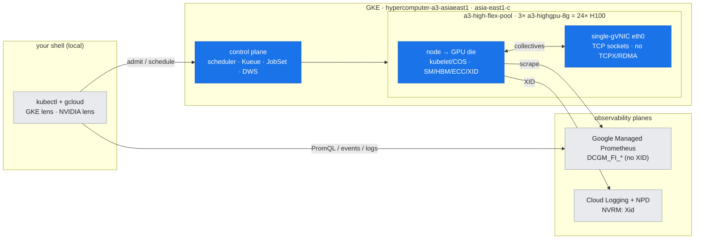
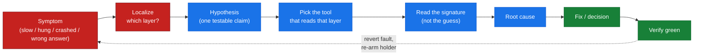
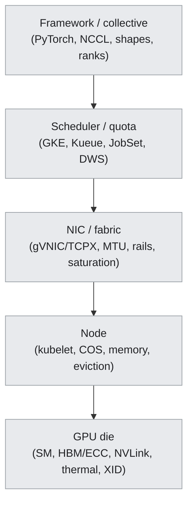

# 16 — The Diagnostic Method: A Triage Framework for GPU & Cluster Problems

## Overview

Parts I–IV taught **mechanism** and Part III's lab-10 showed the first real **fault signatures**. But almost every lab so far walks the *healthy path*: stand something up, take one honest measurement, move on. Operating a GPU cluster is the other skill — the one you only build by looking at **broken** systems: given a symptom or an operational task, reach a **root cause or a decision** using the right tool. This document is the **hub** for that skill. It generalizes lab-10's proven loop into a reusable method, and every Part V scenario lab (14–17) is one instantiation of it.

The single most important habit it teaches: **localize before you hypothesize.** A slow or dead job has a dozen plausible causes across five layers; guessing wastes a GPU-hour per guess. The method narrows *which layer* first, then picks the tool that reads that layer's signature.

**What you'll learn:**
- The **triage loop** — symptom → localize → hypothesis → tool → signature → root cause → fix → verify → revert — and why "revert" is part of the loop on held Flex capacity
- **Localize first:** the five-layer stack (GPU die → node → NIC/fabric → scheduler/quota → framework) and the one question that points you at a layer
- **Two lenses on every failure:** the **GCP/GKE** view (kubectl, events, Cloud Logging, Kueue/JobSet status) and the **NVIDIA** view (nvidia-smi/DCGM/NCCL/Nsight) — which lens answers which question
- **How to read a signature:** first error vs. cascade, and how *timing* alone distinguishes a **crash** from a **hang**
- A **generalized signature catalog** — the symptom → signature → root cause → first-check table that each lab-1x extends

**Prerequisites:** the fleet metrics pipeline and first four signatures ([doc-10](../part3-clustering-execution/10-observability-debugging.md)); the NCCL collective floor ([doc-06](../part2-inter-node/06-nccl-collectives.md)); the gang machinery ([doc-08](../part3-clustering-execution/08-job-frameworks-jobset-kueue.md)).

**Instantiated by:** [lab-14](../../labs/lab-14-single-gpu-health-triage/) (single-GPU health) · [lab-15](../../labs/lab-15-internode-comms-debug/) (inter-node comms) · [lab-16](../../labs/lab-16-cluster-job-failure-triage/) (cluster/job failure) · [lab-17](../../labs/lab-17-perf-monitoring-day2-ops/) (perf & day-2).

---

## Where this fits (the environment)

*The real place this method runs: your shell reads the 3-node asia-east1-c cluster through two lenses. Blue = the five layers this hub triages (GPU die → node → single-gVNIC `eth0` fabric → scheduler/quota control plane); grey = the lenses/planes you read them through.*

---

## The triage loop

Every scenario in Part V runs the same loop. It is deliberately *not* "read the stack trace and fix the code" — on a distributed GPU job the stack trace is usually a **symptom of a different rank's** problem (see the earliest-exit rule below).

*Figure: the triage loop. The dashed return path ("revert") is mandatory on held Flex capacity — a diagnosis that leaves a broken workload occupying GPUs is not finished.*

---

## Localize first: which layer?

A GPU workload fails somewhere in a five-layer stack. The fastest triage question is *"which layer is the symptom actually in?"* — because each layer has a different lens and a different signature.

| The question | If yes → layer | The lens that reads it |
| :--- | :--- | :--- |
| Does the pod even schedule / get admitted? | **Scheduler / quota** | GKE: `kubectl get events`, Kueue `Workload` conditions, DWS `ProvisioningRequest` |
| Does the job start but one rank exits / OOMs / crashloops? | **Framework** (per-rank) | GKE: pod `exitCode`/`reason`; NVIDIA: the rank's own log |
| Do all ranks start but the collective is slow or hangs? | **NIC / fabric** or a straggler | NVIDIA: `NCCL_DEBUG=INFO` (transport/algo), per-rank timing; GKE: host NIC throughput |
| Is one GPU hot / throttling / throwing ECC / XID? | **GPU die** | NVIDIA: `nvidia-smi -q -d`, `dcgmi diag`; GKE: NPD → Cloud Logging XID |
| Is the node itself `NotReady` / evicting pods? | **Node** | GKE: `kubectl describe node`, node events, kubelet |

**The golden shortcut (from lab-10):** *read the GPU metrics before blaming your code.* If DCGM shows the GPUs healthy (`FB`, clock, power, ECC all nominal) but the collective is slow or dead, the problem is **between** the GPUs — network, scheduler, or a peer that already died — **not inside** them. That one check eliminates the entire "GPU die" layer in seconds.

---

## Two lenses: GCP/GKE vs NVIDIA

Every GPU failure on this platform has two views, and each answers a different question. Fluent triage means knowing which lens to reach for — and cross-checking one against the other.

| Question | GCP / GKE lens | NVIDIA lens |
| :--- | :--- | :--- |
| Why won't my pod run? | events, Kueue `Workload`, DWS status, quota | — |
| Which rank died first? | pod `exitCode` / `reason` / restart count, timestamps | each rank's NCCL/PyTorch log |
| Is it the network? | host NIC throughput, co-tenant pods, `ClusterPodMonitoring` | `NCCL_DEBUG=INFO` NET/GRAPH, per-rank collective timing |
| Is the GPU itself sick? | NPD conditions, `DCGM_FI_DEV_XID_ERRORS`, node events | `nvidia-smi -q -d ECC,PERFORMANCE`, `dcgmi diag -r 3`, XID decode |
| Where do XIDs surface? | **Cloud Logging** (`NVRM: Xid`), NPD (containers can't read `dmesg`) | `dcgmi dmon -e 230` on bare metal |

**Constraints are lessons, not dead ends.** Managed GKE blocks `dmesg` and `ncu` (privilege) — that is *itself* the teaching point: you learn the GKE-native path (NPD → Cloud Logging, `DCGM_FI_DEV_XID_ERRORS`; a privileged `securityContext` for `ncu`) rather than the bare-metal one. See [xid-table.md](../../reference/xid-table.md) and lab-14.

---

## How to read a signature

Two rules do most of the work, both proven on real runs in lab-10 and lab-13b:

**1. The earliest-exit rule — the loudest error is rarely the cause.** In a gang, a healthy rank blocked on a dead peer prints a dramatic `ncclRemoteError` / `DistBackendError`. That rank is *fine* — it is reporting **someone else's** death. Find the rank that exited **first** (lowest timestamp, or the one with `OOMKilled` / an XID / `NotReady`). lab-13b's survivors screamed while the *victim* simply went silent — absence, not error, marks the real culprit.

**2. Timing distinguishes a crash from a hang.** Both look like "the job stopped," but:

| Timing of the abort | Meaning | Because |
| :--- | :--- | :--- |
| Aborts **well before** the PG timeout (seconds) | a **peer crashed** (`ncclRemoteError`) | a closed TCP socket is detected immediately by `TORCH_NCCL_ASYNC_ERROR_HANDLING=1` |
| Aborts at **exactly** the PG timeout | a true **hang / stall** | a deadlocked or straggling rank never sends — nothing to detect until the clock runs out |
| Returns **exit 0 with a wrong value** | a **config/shape mismatch** | ranks disagreed on shape/`world_size`; the collective "succeeded" on garbage |

This is why `TORCH_NCCL_ASYNC_ERROR_HANDLING=1` + a **bounded** PG timeout (see [nccl-tunables.md](../../reference/nccl-tunables.md)) is non-negotiable: it turns a silent multi-hour hang into a fast, timestamped, diagnosable failure.

---

## The signature catalog (generalized)

The starting catalog, generalized from lab-10's four faults plus lab-13b's node-loss. Each Part V lab **extends** this table with the signatures it produces (or curates + labels, where a fault is unsafe to inject live).

| Symptom | Signature (what you actually see) | Root cause | First check | Produced in |
| :--- | :--- | :--- | :--- | :--- |
| Pod never schedules | `FailedScheduling … Insufficient nvidia.com/gpu` | no free GPUs / gang can't fit | free GPUs, gang size vs quota | lab-07, lab-16 |
| Gang admitted but `Pending`, 0 pods | Kueue `Workload QuotaReserved=False` | over quota / flavor mismatch | `ClusterQueue` usage, flavor labels | lab-13a, lab-16 |
| One rank `OOMKilled` (exit 137) | pod `reason=OOMKilled`; peers throw `ncclRemoteError` | per-rank memory blowup | earliest exit; memory limits | lab-16 |
| Whole JobSet `Failed` in ~seconds, restarts=0 | `terminalState=Failed reason=FailedJobs` | JobSet **fail-fast** (expected) | set `failurePolicy.maxRestarts` | lab-10, lab-16 |
| Collective aborts **before** timeout | `ncclRemoteError: remote process exited` | a **peer died first** | earliest exit / OOMKilled / XID / NotReady | lab-10, lab-13b |
| Collective hangs to **exactly** the timeout | watchdog abort at PG-timeout ms | true stall / straggler / mismatched op order | per-rank progress, collective ordering | lab-15 |
| Init hangs, no NET line ever chosen | NCCL stuck in `bootstrap`/`init` | wrong `NCCL_SOCKET_IFNAME` / DNS / firewall | `NCCL_DEBUG=INFO` INIT/NET; the chosen iface | lab-15 |
| Slow & variable collective, GPUs healthy | throughput collapse, DCGM nominal | NIC saturation / noisy neighbour | host NIC throughput, co-tenant pods | lab-10, lab-15 |
| One rank exit 0 **wrong value**, another crashes | `value=2` (exit 0) vs signal 11 (exit 139) | per-rank shape / `world_size` mismatch | pin image; assert shapes & world_size | lab-10, lab-16 |
| One GPU hot / clocks capped | `nvidia-smi -q -d PERFORMANCE` throttle reasons set | thermal / power throttle | throttle reasons under load | lab-14 |
| ECC / row-remap / XID event | `DCGM_FI_DEV_XID_ERRORS`; `nvidia-smi -q -d ECC,ROW_REMAP` | HBM defect / driver fault | XID decode ([xid-table.md](../../reference/xid-table.md)) | lab-14 (curated for fatal XIDs) |

---

## Discipline (inherited by every scenario)

- **Flex-safe.** Faults are injected at the **job/pod/env level** — bad env var, memory blowup, mismatched collective, killed rank, artificial delay. **No node is drained or deleted**; the "always hold the GPU" posture is preserved and every scenario is reversible.
- **Real vs. curated.** Prefer live-injected faults. Where a fault is unsafe or unreproducible here (a real double-bit ECC / XID 79 fall-off-bus), use a **curated captured/synthetic signature clearly labeled as such**, with the decode + action — never fabricated as if live.
- **Both lenses, honestly.** Show the GCP/GKE *and* the NVIDIA view of each failure; when two tools disagree, reconcile before you report (the lab-01 "caught bad reading" lesson).
- **Provenance.** Every run logged to [`VERIFICATION.md`](../../VERIFICATION.md), cluster/context named.

---

**Next (scenario docs) →** [doc-17 single-GPU & node health](17-single-gpu-node-health.md) · [doc-18 inter-node comms troubleshooting](18-internode-comms-troubleshooting.md) · [doc-19 cluster & job failure triage](19-cluster-job-failure-triage.md) · [doc-20 perf monitoring & day-2 ops](20-performance-monitoring-day2-ops.md)
**Builds on →** [doc-10 observability & debugging](../part3-clustering-execution/10-observability-debugging.md) · [lab-10 fleet fault signatures](../../labs/lab-10-observability-fleet-debug/)
**Reference →** [xid-table.md](../../reference/xid-table.md) · [nccl-tunables.md](../../reference/nccl-tunables.md) · [tool-cheatsheets.md](../../reference/tool-cheatsheets.md)
