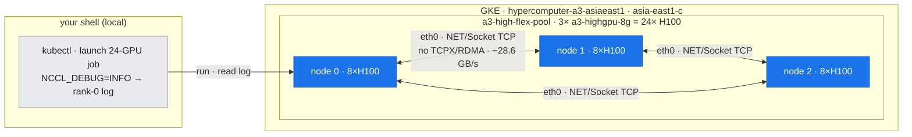
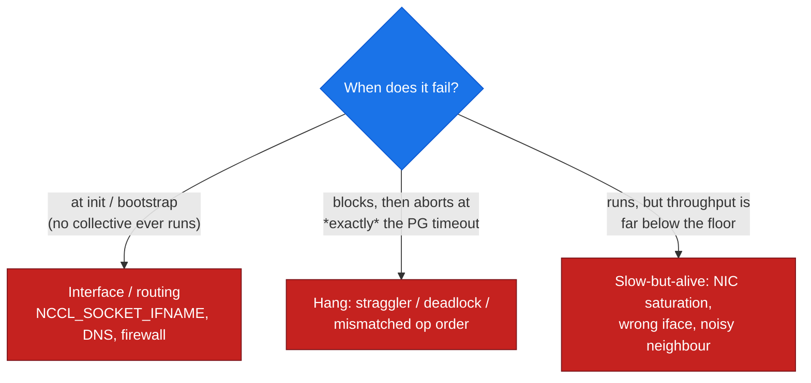
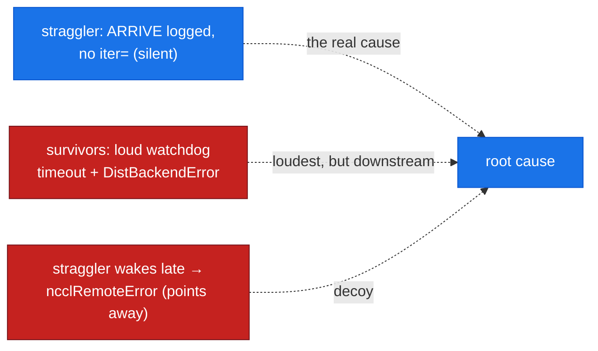

# 18 — Inter-node Comms Troubleshooting: Reading NCCL, Localizing the Fabric

## Overview

When a distributed job is **slow or hung**, the cause is very often *between* the GPUs, not inside them — the NIC, the interface selection, the routing, or a single straggling peer. This document is the **NIC/fabric-layer** instantiation of [doc-16](16-diagnostic-method.md)'s triage method. Its central skill is one the healthy-path labs never needed: **make NCCL tell you what it's doing, then read it.**

`NCCL_DEBUG=INFO` is the difference between "the collective is slow, I guess it's the network" and "NCCL chose `NET/Socket` over `eth0`, built 16 channels, and the inter-node hop is TCP — *here* is the bottleneck." Everything below is about turning NCCL's own logs into a **localized root cause**.

**What you'll learn:**
- How to **read `NCCL_DEBUG=INFO`** — the transport/algorithm/channel decisions, and the exact lines that name the fabric (`Using network Socket`, `GPU Direct RDMA Disabled`, `via NET/Socket`)
- The **comms fault taxonomy** — init/bootstrap failure vs. collective hang vs. slow-but-alive — and how *timing* separates them
- The **interface-selection** class of faults (`NCCL_SOCKET_IFNAME`, DNS, firewall) and why they fail *at init*
- The **straggler** class — a hang that aborts at *exactly* the PG timeout — and the **earliest-exit trap** it sets (the culprit reports a *remote* error)
- The **first-check** for each, and which lens (GCP/GKE vs NVIDIA) reads it

**Prerequisites:** [doc-16](16-diagnostic-method.md) (the triage loop, crash-vs-hang timing, the two lenses); [doc-06](../part2-inter-node/06-nccl-collectives.md) (the NCCL collective floor and `busbw`); the transport background in [T5 networking & fabric tools](../toolkit/T5-networking-fabric-tools.md).

**Instantiated by:** [lab-15](../../labs/lab-15-internode-comms-debug/) — a live 24-GPU healthy read + a wrong-`NCCL_SOCKET_IFNAME` init fault + a straggler hang, all on the asia-east1-c 3-node cluster.

---

## Where this fits (the environment)

*The NIC/fabric layer this doc localizes: 24 GPUs across 3 nodes of the asia-east1-c cluster, wired only by single-gVNIC `eth0`. Blue = the inter-node hop this doc reads off `NCCL_DEBUG=INFO` — plain TCP sockets (`NET/Socket`), no TCPX/RDMA, capped at the ~28.6 GB/s floor. Grey = your shell reading rank-0's log.*



---

## Step 1 — Read what NCCL chose (`NCCL_DEBUG=INFO`)

Before hypothesizing, capture the reality. Set these on every rank and read **rank 0**'s log:

```bash
NCCL_DEBUG=INFO NCCL_DEBUG_SUBSYS=INIT,NET,GRAPH   # transport + topology + graph
```

The lines that matter, and what each answers:

| Log line (rank 0) | What it tells you |
| :--- | :--- |
| `NET/IB : No device found.` | No InfiniBand/RoCE HCA present — NCCL will **not** use RDMA |
| `NET/Socket : Using [0]eth0:<ip>` / `Using network Socket` | The chosen transport is **plain TCP sockets over `eth0`** (not TCPX) |
| `GPU Direct RDMA Disabled for HCA 0 'eth0'` | No GPUDirect — host-memory staging on the inter-node path |
| `comm … nRanks 24 nNodes 3 localRanks 8` | NCCL's view of the topology (nodes × local GPUs) — check it matches reality |
| `Channel NN/MM` | **MM channels** built (parallel comm streams) |
| `Ring NN : a -> b -> c` / `Trees […]` | The ring and tree schedules NCCL will run |
| `Channel NN/0 : x[..] -> y[..] [receive] via NET/Socket/0` | The **inter-node hop** and the transport it rides — *where the cross-node bottleneck lives* |

This read is the **reference baseline**: every fault is diagnosed by *what changed* relative to it. On this cluster the answer is always "Socket over eth0, no RDMA" — the [~28.6 GB/s inter-node floor](../15-scaling-shape-of-the-cliff.md). If you expected TCPX and see `Using network Socket`, you've already found your problem before running a benchmark. (lab-15 §1 shows the full capture; enabling TCPX and re-reading these exact lines is [lab-18](../../labs/lab-18-gpudirect-tcpx/).)

---

## Step 2 — Classify the failure by *when* it dies

A comms fault lands in one of three bins, and **timing tells you which** before you read a single stack frame:



| Bin | Signature | First check | Lens |
| :--- | :--- | :--- | :--- |
| **Init / bootstrap** | `bootstrap.cc … no socket interface found`; `ncclInternalError` — **no rings, no channels** | the chosen iface: `NCCL_SOCKET_IFNAME`, `NCCL_DEBUG=INFO` INIT line; DNS/firewall between nodes | NVIDIA (NCCL log) + GKE (can pods reach each other?) |
| **Hang** | `Watchdog caught collective operation timeout: WorkNCCL(… Timeout(ms)=T) ran for ~T ms` | which rank never logged progress (its `ARRIVE` present, no `iter=`); per-rank timing | NVIDIA (per-rank log) + GKE (pod events / one node hot?) |
| **Slow-but-alive** | completes, but `busbw` ≪ floor; GPUs healthy in DCGM | host NIC throughput; co-tenant pods on the node; the `via NET` iface | GKE (NIC metrics, co-tenants) + NVIDIA (`NCCL_DEBUG=INFO`) |

The golden shortcut from [doc-16](16-diagnostic-method.md) applies first: **if DCGM shows the GPUs healthy but the collective is slow/dead, the problem is between them** — you are in this document, not the GPU-die one.

---

## Step 3a — The interface-selection fault (fails at init)

The most common "won't even start" comms fault: NCCL is pointed at the wrong (or a non-existent) network interface. It dies during `ncclCommInitRank`, before any collective:

```
NCCL INFO NCCL_SOCKET_IFNAME set to nonexistent0
bootstrap.cc:48 NCCL WARN Bootstrap : no socket interface found
ncclInternalError: Internal check failed.  →  torch.distributed.DistBackendError
```

**Why it's diagnosable instantly:** compare to the healthy baseline — the `NET/Socket : Using [0]eth0` line is *gone*, replaced by `no socket interface found`. The fix is at the iface/routing layer, never in model code. Real-world variants and their tell:

| Root cause | How it presents |
| :--- | :--- |
| `NCCL_SOCKET_IFNAME` names a missing iface | `no socket interface found` at bootstrap (fast, clean) — lab-15 §2 |
| `NCCL_SOCKET_IFNAME` names a wrong-but-*existing* iface (mgmt NIC, wrong subnet) | init *succeeds*, then the first collective **hangs** (traffic black-holes) → the Step-3b signature |
| DNS/hostname not resolvable between pods | bootstrap can't connect rank→rank; hang or connect error at init |
| Firewall / NetworkPolicy blocks the ephemeral port range | rendezvous succeeds (MASTER_ADDR) but NCCL peer connect stalls |

**First check:** `NCCL_DEBUG=INFO` INIT line for the chosen iface; then, from a pod, confirm the interface exists and peers are reachable on it.

---

## Step 3b — The straggler (hangs, aborts at *exactly* the timeout)

One rank arrives late at a collective on an **already-established** communicator. The others block; at the PG timeout the watchdog aborts them:

```
[Rank 0] Watchdog caught collective operation timeout: WorkNCCL(SeqNum=3, OpType=ALLREDUCE,
  …, Timeout(ms)=45000) ran for 45008 milliseconds before timing out.
[Rank 0] … taking the entire process down.  →  c10::DistBackendError
```

`ran for ~45008 ms` against `Timeout(ms)=45000` is the fingerprint of a **true hang**: a straggling rank never sends, so nothing is detectable until the clock expires (contrast a peer *crash*, which aborts in seconds off a closed socket — [lab-13b](../../labs/lab-13-topology-resilience/)).

**The earliest-exit trap.** The rank that *caused* the stall reports the *least* alarming error. When the straggler finally wakes, its peers are already gone, so **it** logs `ncclRemoteError: remote process exited or there was a network error` — pointing away from itself. Triage by the loudest error and you chase the victims. The culprit is the rank whose **`ARRIVE` marker is present but which never logged an `iter=`** — *absence, not error* (lab-15 §3).



**Why the warmup matters (a real subtlety).** NCCL builds the communicator lazily on the *first* collective. A rank that is late to the *very first* collective stalls comm **init**, gated by NCCL's own long bootstrap timeout — not the PG-work timeout — so the group waits out the whole delay and then proceeds (no abort). The PG-timeout abort only appears when the straggler is late to a collective **after** the communicator is up. *Init hangs and collective hangs run on different clocks* — lab-15 forms the comm with a warmup all-reduce first to demonstrate the collective-hang signature cleanly.

**First check:** per-rank progress markers / timing — find the rank that entered the collective but never returned; then look at *that* rank's node (thermal throttle, a slow input pipeline, a contended NIC).

---

## Step 3c — Slow-but-alive (the hardest to notice)

The job completes, but `busbw` is far under the floor and variable. GPUs are nominal in DCGM. This is NIC saturation, a noisy co-tenant, or a wrong-but-working interface. It has no crash to grep for — you find it by **comparing measured `busbw` to the known floor** ([doc-15](../15-scaling-shape-of-the-cliff.md)) and reading host NIC throughput (the lab-10 fleet pipeline; `ethtool -S` deltas). This is where the [doc-16 golden shortcut](16-diagnostic-method.md) earns its keep: healthy GPUs + slow collective ⇒ look at the wire, not the code.

---

## The comms signature catalog (extends doc-16)

| Symptom | Signature | Root cause | First check | Produced in |
| :--- | :--- | :--- | :--- | :--- |
| Job dies at init, no collective | `bootstrap … no socket interface found`; `ncclInternalError` | wrong/missing `NCCL_SOCKET_IFNAME`, DNS, firewall | `NCCL_DEBUG=INFO` INIT iface; peer reachability | lab-15 §2 |
| Collective hangs → abort at ≈ PG timeout | `WorkNCCL(… Timeout(ms)=T) ran for ~T ms`; `DistBackendError` | straggler / deadlock / mismatched op order | per-rank progress; the rank with no `iter=` | lab-15 §3 |
| Culprit reports a *remote* error | `ncclRemoteError` on the rank that was actually late | earliest-exit trap (see above) | earliest/silent rank, not loudest | lab-15 §3 |
| Runs but `busbw` ≪ floor, GPUs healthy | throughput collapse, DCGM nominal | NIC saturation / noisy neighbour / wrong iface | host NIC throughput; co-tenants; `via NET` iface | lab-10, lab-15 §1 |
| "Am I even on the fast fabric?" | `Using network Socket` + `GPU Direct RDMA Disabled` | plain TCP/gVNIC, no TCPX | the `NET/*` + `via NET` lines | lab-15 §1 (TCPX in lab-18) |

---

## Discipline (inherited from doc-16)

- **Flex-safe.** Every fault is a per-run **env var** or a **job-level sleep** — never a node drain/cordon/delete. The `gpu-holder` is verified back at 3/3 after the run.
- **Measured, not asserted.** The transport is *read off* `NCCL_DEBUG=INFO`; the hang time is *read off* the watchdog message (`ran for 45008 ms`), not claimed.
- **Both lenses.** NCCL's log (which iface/algo/channel) reconciled against the GKE view (pod reachability, NIC throughput, co-tenants).
- **Bounded.** A bounded PG timeout + `TORCH_NCCL_ASYNC_ERROR_HANDLING=1` turn a silent multi-hour hang into a fast, timestamped, diagnosable failure — the non-negotiable from [doc-16](16-diagnostic-method.md).

---

**Next (scenario docs) →** [doc-19 cluster & job failure triage](19-cluster-job-failure-triage.md) · [doc-20 perf monitoring & day-2 ops](20-performance-monitoring-day2-ops.md)
**Builds on →** [doc-16 the diagnostic method](16-diagnostic-method.md) · [doc-06 NCCL collectives](../part2-inter-node/06-nccl-collectives.md) · [lab-15 inter-node comms debug](../../labs/lab-15-internode-comms-debug/)
**Reference →** [nccl-tunables.md](../../reference/nccl-tunables.md) · [tool-cheatsheets.md](../../reference/tool-cheatsheets.md) · [T5 networking & fabric tools](../toolkit/T5-networking-fabric-tools.md)
