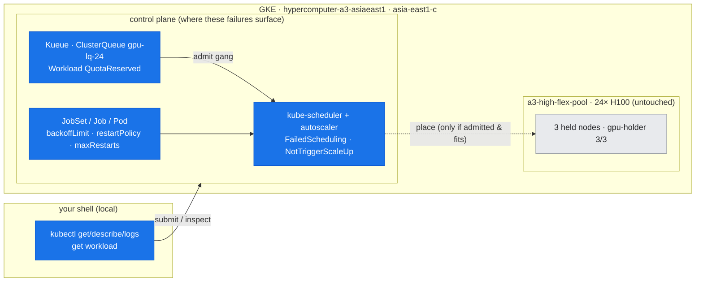

# 19 — Cluster & Job Failure Triage: When the Job Won't Run, Crashes, or Gives Up

## Overview

doc-17 read a GPU's health and doc-18 localized the fabric — but a huge share of day-2 incidents never reach the GPU at all. *"My job won't start."* *"It keeps restarting."* *"It's stuck Pending."* *"It ran three times and gave up."* These are the **scheduler / quota / framework-layer** failures, and their signatures live in **`kubectl`, Kueue, and JobSet state** — not in `nvidia-smi`. This document is that layer's instantiation of [doc-16](16-diagnostic-method.md)'s triage method. Its central habit: **read the object's status and events before you read any GPU** — the answer is almost always in `kubectl describe` / a `Workload` condition / a `Job` condition.

The trap this layer sets is the opposite of doc-17's false alarm: here the loud symptom (a pod stuck `Pending`, a container restarting forever) tells you *that* something is wrong but not *which layer*, and the instinct to `exec` in and poke at the GPU wastes the incident. The skill is a short, ordered read — `get` → `describe`/events → `logs` → the framework's own condition — that names the layer in seconds.

**What you'll learn:**
- The **five canonical job-lifecycle failures** and the exact string each one prints: `OOMKilled`/exit 137, `CrashLoopBackOff`, `FailedScheduling … Insufficient`, Kueue `QuotaReserved=False`, and `Job … BackoffLimitExceeded`
- **Where each signature lives** — pod `State`/`lastState`, pod events, the `Workload` condition, the `Job` condition — and the ordered read that gets you there
- The distinction between **unschedulable** (the scheduler can *never* place it) and **inadmissible** (Kueue *gates* it before a pod is ever created) — two very different "it's not running" failures
- **`restartPolicy` vs. `backoffLimit` vs. JobSet `failurePolicy.maxRestarts`** — the three retry mechanisms and which one produced the symptom
- Why this whole layer needs **zero GPU** to reproduce — and what that tells you about where to look first

**Prerequisites:** [doc-16](16-diagnostic-method.md) (the triage loop, the two lenses, the earliest-exit rule); [doc-07](../part3-clustering-execution/07-gke-scheduling-topology.md) (GKE scheduling, taints, device plugin, DWS); [doc-08](../part3-clustering-execution/08-job-frameworks-jobset-kueue.md) (JobSet gangs and Kueue quota admission).

**Instantiated by:** [lab-16](../../labs/lab-16-cluster-job-failure-triage/) — five live failures on the asia-east1-c 3-node cluster (OOMKilled + fix, CrashLoopBackOff, unschedulable, a Kueue-gated 32-GPU gang, and a Job retried to `BackoffLimitExceeded`), captured with **no GPU-borrow window at all**.

---

## Where this fits (the environment)

*The scheduler / quota / framework layer — where these failures surface, one layer above the GPU. Blue = the control-plane objects this doc reads (kube-scheduler + autoscaler, Kueue's `ClusterQueue gpu-lq-24` / `Workload`, JobSet/Job/Pod retry state). Grey = the pool: this whole layer reproduces at **zero GPU**, so the `gpu-holder` stays 3/3 and the 24 H100 are never touched.*



---

## Step 0 — The ordered read (before you touch a GPU)

Every failure below is diagnosed with the same four-command read, in order. You stop at the first one that names the cause:

```bash
kubectl get pod|job|jobset <name> -o wide        # phase / status / restarts — the headline
kubectl describe pod|job <name>                  # State + lastState + Events — the "why"
kubectl logs <pod> [--previous]                  # the app's own last words (--previous = the crashed instance)
kubectl get workload -n <ns>                      # Kueue: was it even admitted? (gang / quota layer)
```

The **golden shortcut from doc-16 applies inverted here**: if the pod isn't `Running` yet, there is *no* GPU signal to read — the entire "GPU die / node / fabric" half of the stack is irrelevant, and the answer is in scheduler/quota/framework state. Reaching for `nvidia-smi` on a `Pending` pod is the classic wasted incident.

---

## Step 1 — `OOMKilled` (exit 137): a container over its memory limit

The most common "it crashed" that isn't a code bug. A container that allocates past its `limits.memory` is killed by the kernel OOM killer; the pod's container `State` records it exactly (lab-16, Phase A — a process allocating 4 GiB under a `256Mi` limit):

```
State:      Terminated
  Reason:   OOMKilled
  Exit Code: 137
Limits:   memory: 256Mi
```

**Read it:** `Reason: OOMKilled` + **`Exit Code: 137`** (128 + SIGKILL 9) is unambiguous — the container was killed for exceeding its memory limit, *not* a segfault (139) or an app error (1). The fix is a one-liner and you can prove it: the **same workload under a `6Gi` limit runs to `Completed`** (Phase A's `oom-fixed`). That before/after is the teaching point — the code never changed; the *limit* was the bug.

> **Distributed twist (the earliest-exit rule, doc-16):** in a multi-rank job, the rank that OOMs simply dies, and its **healthy peers** throw the loud `ncclRemoteError` / `DistBackendError`. Don't debug the screaming rank — grep the pods for `reason=OOMKilled` to find the one that went quiet first.

---

## Step 2 — `CrashLoopBackOff`: a container that keeps exiting non-zero

A container that starts, fails, and is restarted by the kubelet — repeatedly — lands in `CrashLoopBackOff` with an **exponential back-off** between attempts. lab-16 Phase B (a container that `exit 1`s two seconds after start, `restartPolicy: Always`):

```
STATUS             RESTARTS      AGE
CrashLoopBackOff   1 (15s ago)   20s

State:       Waiting   Reason: CrashLoopBackOff
Last State:  Terminated  Reason: Error  Exit Code: 1
Events:  Warning  BackOff  ... Back-off restarting failed container
```

**Read it:** the headline is `STATUS=CrashLoopBackOff` with a **climbing `RESTARTS`** count; the *cause* is in **`Last State: Terminated`** (`--previous` logs show the same). `CrashLoopBackOff` itself is not the error — it is the kubelet's *reaction*; the real signal is the `lastState` `Reason`/`Exit Code` and the previous container's logs. Note the two knobs: the back-off is why a crashing pod's restarts *slow down* over time (up to ~5 min between tries), and `restartPolicy` is *why it restarts at all* — a `Job` (`restartPolicy: Never`) would instead go to Step 5.

---

## Step 3 — Unschedulable vs. inadmissible: two different "it won't run"

Both leave you with a job that isn't running and no logs to read — but they fail at **different layers**, and conflating them sends you down the wrong path.

### 3a — Unschedulable (`Pending` forever): the scheduler can never place it

A pod whose resource request no single node can satisfy stays `Pending`; the scheduler says why in an event. lab-16 Phase C requests **9 GPUs** on nodes that have 8:

```
STATUS: Pending
Events:
  Warning  FailedScheduling   default-scheduler   0/4 nodes are available:
    1 node(s) didn't match Pod's node affinity/selector, 3 Insufficient nvidia.com/gpu.
  Normal   NotTriggerScaleUp  cluster-autoscaler   Pod didn't trigger scale-up:
    1 max node group size reached
```

**Read it:** `FailedScheduling … Insufficient nvidia.com/gpu` is the scheduler telling you *no node fits*, and the `NotTriggerScaleUp` line is the autoscaler confirming it *can't grow its way out* (9 > 8/node is unsatisfiable at any node count). This is the same class as an over-large CPU/memory request, an unschedulable `nodeSelector`, or a taint with no toleration — always read the **`FailedScheduling` event**, not just the `Pending` phase. (This is also why the fault is Flex-safe with no borrow: an unsatisfiable request *can never* trigger scale-up, so the pool never grows and the held GPUs are never touched.)

### 3b — Inadmissible gang (`QuotaReserved=False`, **zero pods**): Kueue gates it first

When a job runs under Kueue, quota is checked **before any pod is created**. A gang that exceeds the `ClusterQueue` quota is held as a `Workload` in a *not-admitted* state and **produces no pods at all**. lab-16 Phase D submits a **32-GPU** JobSet (4 × 8) against a **24-GPU** `ClusterQueue`:

```
NAME                              QUEUE       RESERVED IN   ADMITTED   AGE
jobset-lab16-overquota-32-5f7a6   gpu-lq-24                            12s

workload: jobset-lab16-overquota-32-5f7a6
  ('QuotaReserved', 'False', 'Pending',
     "couldn't assign flavors to pod set worker: insufficient quota for nvidia.com/gpu in flavor")

### pods for the gated JobSet:
No resources found in default namespace.
```

**Read it — and note how it differs from 3a.** The unschedulable pod (3a) *exists* and shows a `FailedScheduling` event; the inadmissible gang (3b) has **no pod to describe** — the signal lives one layer up, in the **`Workload` condition** (`kubectl get workload`). `QuotaReserved=False` with reason `Pending` and the "insufficient quota" message is Kueue doing exactly its job: gang-gating the whole 32-GPU request atomically rather than scheduling a partial, deadlock-prone gang. This is the failure that **genuinely needs the multi-node cluster + a real quota** to show — a single node can't express a 24-GPU quota or a 32-GPU gang — which is why lab-16 keeps it while running everything else at zero GPU. (The *at-quota* 24-GPU gang **is** admitted and runs — that's lab-13a; not re-run here so the holder stays 3/3.)

---

## Step 4 — Retry mechanisms: `Job … BackoffLimitExceeded`

A `Job` with `restartPolicy: Never` doesn't crashloop the *container* (Step 2) — it creates a **new pod per attempt**, up to `backoffLimit`, then declares the Job `Failed`. lab-16 Phase E (`backoffLimit: 2` → 3 attempts, each `exit 1`):

```
NAME          STATUS   COMPLETIONS   DURATION
retry-fault   Failed   0/1           43s

Failed=True  reason=BackoffLimitExceeded  msg=Job has reached the specified backoff limit

### one pod per attempt (all Error):
retry-fault-6t47q   Error   ...
retry-fault-gqzm5   Error   ...
retry-fault-xx6gg   Error   ...
```

**Read it:** the **`Job` condition** `Failed=True reason=BackoffLimitExceeded` is the verdict; the **three `Error` pods** (one per attempt) are the evidence trail — `kubectl logs` each to see the failure evolve (or confirm it's deterministic). This is the third distinct retry mechanism, and telling them apart is the skill:

| Mechanism | Set by | What retries | Terminal signature |
| :--- | :--- | :--- | :--- |
| Container restart | Pod `restartPolicy: Always`/`OnFailure` | the **container** in place (back-off) | `CrashLoopBackOff` (Step 2) |
| Job retry | `Job.spec.backoffLimit` | a **new pod** per attempt | `Job Failed / BackoffLimitExceeded` (Step 4) |
| Gang restart | JobSet `failurePolicy.maxRestarts` | the **whole gang** (all replicas) | JobSet `Failed` after N restarts (doc-08, lab-10) |

Picking the wrong knob is a real bug: a `backoffLimit` on a gang member doesn't restart its peers; only a JobSet `failurePolicy` restarts the gang as a unit.

---

## Signature catalog — the scheduler / quota / framework layer

Extends the [doc-16 catalog](16-diagnostic-method.md#the-signature-catalog-generalized). "First check" is the fastest lens for that row.

| Symptom | Signature (where you read it) | Likely root cause | First check |
|---|---|---|---|
| Container killed, exit 137 | pod `State: Terminated / Reason: OOMKilled` | over `limits.memory` | `describe pod` → limits vs. usage; raise limit |
| Pod restarts forever | `STATUS CrashLoopBackOff`, climbing `RESTARTS` | app exits non-zero on start | `lastState` reason + `logs --previous` |
| Pod stuck `Pending` | `FailedScheduling … Insufficient <res>` event | no node fits the request | the `FailedScheduling` event; `NotTriggerScaleUp` |
| `Pending`, and autoscaler won't grow | `NotTriggerScaleUp … max node group size` | request unsatisfiable at any scale | request vs. per-node capacity |
| Gang submitted, **0 pods** | Kueue `Workload QuotaReserved=False (Pending)` | gang > `ClusterQueue` quota / flavor mismatch | `kubectl get workload`; `ClusterQueue` usage |
| Job stops after N tries | `Job Failed / reason=BackoffLimitExceeded` | deterministic failure hitting `backoffLimit` | the per-attempt `Error` pods' logs |
| Gang restarts as a unit / gives up | JobSet `Failed` after `failurePolicy.maxRestarts` | one replica fails → whole gang restarts | JobSet status; `failurePolicy` config |

---

## Key takeaways

- **Read the object before the GPU.** If the pod isn't `Running`, the cause is in scheduler/quota/framework state — `get` → `describe`/events → `logs --previous` → `get workload` — not in `nvidia-smi`.
- **The status is the reaction; the `lastState`/condition is the cause.** `CrashLoopBackOff` and `Pending` are *symptoms*; the `Terminated` reason, the `FailedScheduling` event, and the `Workload`/`Job` condition are the *diagnosis*.
- **Unschedulable ≠ inadmissible.** A `Pending` pod with a `FailedScheduling` event failed at the **scheduler**; a gang with `QuotaReserved=False` and **no pods** failed at **Kueue admission** one layer up.
- **Three retry knobs, three signatures.** Container `restartPolicy` → `CrashLoopBackOff`; Job `backoffLimit` → `BackoffLimitExceeded`; JobSet `failurePolicy.maxRestarts` → gang restart. Match the knob to the failure.
- **This whole layer reproduces at zero GPU** — which is itself the localization lesson: these failures never consumed a device, so they can never be *read* on one.

---

**Next (scenario docs) →** [doc-20 perf monitoring & day-2 ops](20-performance-monitoring-day2-ops.md)
**Builds on →** [doc-16 the diagnostic method](16-diagnostic-method.md) · [doc-07 GKE scheduling & topology](../part3-clustering-execution/07-gke-scheduling-topology.md) · [doc-08 job frameworks: JobSet & Kueue](../part3-clustering-execution/08-job-frameworks-jobset-kueue.md) · [lab-16 cluster & job failure triage](../../labs/lab-16-cluster-job-failure-triage/)
**Reference →** [tool-cheatsheets.md](../../reference/tool-cheatsheets.md) · [lab-build-gotchas.md](../../reference/lab-build-gotchas.md)
