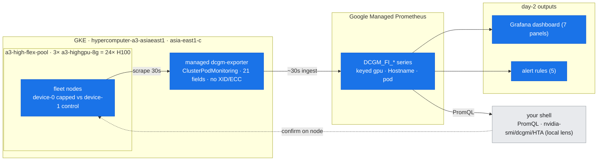

# 20 — Performance Monitoring & Day-2 Operations: Catch the Regression Before It Crashes

## Overview

docs 17–19 each answered a *reactive* question: a GPU is slow, the fabric is stalled, a job won't run — read the tool, name the layer, fix it. This document is the **proactive** counterpart, and it closes Part V: how you *watch* a fleet so the next incident shows up as a **line moving on a dashboard** instead of a 3 a.m. page. The shift is from **one tool at a point in time** (every prior lab's read) to the **pipeline over time** — a baseline, a dashboard, alert rules, regression detection, and trace analysis.

The through-line is doc-16's **two lenses**, but reframed for steady state. The **local lens** (`nvidia-smi`, `dcgmi dmon`) is what you reach for *once you're already looking at a node*; the **pipeline lens** (DCGM-exporter → Prometheus/GMP → Grafana + alerts) is what tells you *which node to look at* — across a fleet, continuously, with history. The day-2 skill is reading a regression off the **pipeline** and only *then* dropping to the local lens to confirm. This doc's centerpiece is doing exactly that for a **silent throttle**: a GPU doing real work at a collapsed clock — invisible to a liveness probe, obvious on the right query.

**What you'll learn:**
- The **metrics pipeline** on managed GKE — the managed `dcgm-exporter` → Google Managed Prometheus (GMP) → PromQL / Grafana / alert rules — and the **exact fields it exports** (and the ones it doesn't)
- How to take a **fleet baseline** with PromQL, and why a baseline is the thing every alert is defined *against*
- The **silent-throttle signature** and how to detect it **from the pipeline**: `GR_ENGINE_ACTIVE` high **while** `SM_CLOCK` collapsed **and** power pinned — the query, the alert rule, and the local-lens cross-check
- Reading **where step time goes** with **Holistic Trace Analysis** (HTA): temporal breakdown + communication/computation overlap on real per-rank traces
- A **day-2 routine**: the four portable artifacts (dashboard, alert rules, baseline, trace pass) and how they compose into a health runbook — including the **cost** signature the always-hold posture must guard against

**Prerequisites:** [doc-16](16-diagnostic-method.md) (the triage loop, the two lenses); [doc-10 / lab-10](../part3-clustering-execution/10-observability-debugging.md) (the metrics stack this builds on); helpful: [doc-17](17-single-gpu-node-health.md) (the local-lens throttle read this detects remotely) and [doc-19](19-cluster-job-failure-triage.md) (the OOM the `GPUMemoryNearFull` rule predicts).

**Instantiated by:** [lab-17](../../labs/lab-17-perf-monitoring-day2-ops/) — a fleet baseline via live PromQL against GMP, `dcgmi` in anger, a **reversible 700→200 W throttle detected from the pipeline** (capped GPU vs. an uncapped control under identical load), and a real HTA pass on a profiled 7-GPU DDP run — plus two validated portable artifacts (`grafana-dashboard.json`, `prometheus-alert-rules.yaml`).

---

## Where this fits (the environment)

*The day-2 monitoring environment on the 3-node asia-east1-c cluster. Blue = the pipeline lens this doc lives in: per-node managed `dcgm-exporter` → GMP `DCGM_FI_*` series → dashboards + alert rules (and PromQL from your shell). Grey = the local lens (`nvidia-smi`/`dcgmi`/HTA) you drop to only after the pipeline names which node. Step 0 details this same path as a tree.*



---

## Step 0 — The pipeline, and what it actually exports

On managed GKE the metrics path is mostly turnkey, and knowing its shape tells you what you *can* alert on:

```
per-node dcgm-exporter (gke-managed-system DaemonSet)
   └─ ClusterPodMonitoring "gke-managed-dcgm-exporter"  (scrape :metrics every 30s)
        └─ Google Managed Prometheus (GMP)   ← query with PromQL
             ├─ Grafana / Cloud Monitoring dashboards
             └─ alert rules (self-hosted rule_files, or a GMP `Rules` CR)
```

Query GMP with any Prometheus client against its API endpoint, authenticated with a GCP token:

```bash
curl -s -G "https://monitoring.googleapis.com/v1/projects/$PROJECT/location/global/prometheus/api/v1/query" \
  -H "Authorization: Bearer $(gcloud auth print-access-token)" \
  --data-urlencode 'query=DCGM_FI_DEV_SM_CLOCK'
```

**The fields it exports are finite — build your alerts on what's there.** lab-17 captured the live catalog (`assets/lab-17/dcgm_prof_fields.txt`): **21 fields**, 10 `DCGM_FI_DEV_*` (FB free/total/used, GPU + memory temp, GPU + mem-copy util, power, SM clock, energy) and 11 `DCGM_FI_PROF_*` (DRAM / GR-engine / SM active, the FP16/FP32/FP64 + tensor pipes, NVLink & PCIe RX/TX). **There is no XID or ECC field** (gotcha G11) — those surface via **Node Problem Detector → Cloud Logging** (doc-19/doc-17), *not* the exporter. Every series is keyed by `gpu` and `Hostname`, **and** by the Kubernetes attribution labels `namespace`/`pod`/`container` — which lets you ask "which *workload* owns this GPU" (the basis of the cost alert below).

---

## Step 1 — The baseline (what "normal" reads as)

An alert threshold is meaningless without the baseline it's defined against. The fastest baseline is a fleet-wide instant query. At idle, lab-17's `DCGM_FI_DEV_SM_CLOCK` returns **every GPU in the fleet at 345 MHz** — the H100 idle clock floor (`assets/lab-17/baseline_promql.txt`):

```
# status=success  series=…      (all 24 GPUs, keyed by Hostname + gpu)
  …lq6m gpu 0  DCGM_FI_DEV_SM_CLOCK = 345
  …lq6m gpu 1  DCGM_FI_DEV_SM_CLOCK = 345
  …d7j7 gpu 0  DCGM_FI_DEV_SM_CLOCK = 345
  …                                    (idle floor, fleet-wide)
```

That flat floor is the reference: under real load these ride to ~1365 MHz at the 700 W TDP governor (doc-17, Phase B — `SW Power Cap: Active` is *normal* there). Severity is always read from the **delta against the baseline**, never from an absolute. The three baseline dimensions worth pinning: **clock** (throughput), **power** (headroom / governor), and **`GR_ENGINE_ACTIVE`** (is the GPU actually working). The next step shows why you need all three *together*.

---

## Step 2 — Detecting a silent throttle *from the pipeline*

The marquee day-2 skill. A **silent throttle** is a GPU doing real work at a collapsed clock — throughput quietly halved, no crash, no failed probe, nothing in the logs. A liveness check passes. A single metric lies: high `GR_ENGINE_ACTIVE` alone looks healthy; low `SM_CLOCK` alone looks idle. **Only the combination, over time, names it.**

lab-17 induces it deterministically (lab-14's reversible cap): drive fp16 GEMM load on two GPUs, cap **device-0** to its 200 W floor, leave **device-1** uncapped as the control, and read both back off GMP over the window (`assets/lab-17/regression_promql.txt`):

| Signal (read from GMP) | GPU 0 — **capped** | GPU 1 — control (same load) |
|---|---|---|
| `DCGM_FI_DEV_SM_CLOCK` | boost 1980 → **collapses to 345 MHz** | holds **1365–1380 MHz** |
| `DCGM_FI_DEV_POWER_USAGE` | **pins at ~215 W** (the 200 W cap) | ~700 W |
| `DCGM_FI_PROF_GR_ENGINE_ACTIVE` | **stays ~1.0** (SMs busy) | ~1.0 |

The signature is unmistakable *because* all three are read together: **engine busy + clock collapsed + power pinned at a cap**. Idle would show `GR_ENGINE_ACTIVE ≈ 0`; a healthy loaded GPU shows a high clock. The control GPU, under identical load, proves the collapse is the *cap*, not the workload. The alert that fires on it (`prometheus-alert-rules.yaml`):

```yaml
- alert: GPUSilentThrottle
  expr: (DCGM_FI_PROF_GR_ENGINE_ACTIVE > 0.5) and (DCGM_FI_DEV_SM_CLOCK < 1000)
  for: 2m
```

**Then confirm with the local lens (doc-16's two-lens discipline).** Dropping to the capped node, `nvidia-smi -q` (`throttle_local_crosscheck.txt`) reads `SW Power Cap: Active`, `HW Slowdown / HW Thermal: Not Active`, `Current Power Limit: 200.00 W`, SM 345 MHz — same conclusion from the other side: **power-capped, not thermal, not idle.** The pipeline told you *which* GPU and *when*; the local lens told you *the exact cap value* to fix.

> **Ingestion lag is real.** GMP scrapes every 30 s and ingests with a further short delay, so a transient must persist ~2–3 min to appear in a range query — which is *why* alert rules use `for: 2m` rather than firing on a single sample. lab-17 held the throttle ~2.5 min for this reason. (Useful corollary: GMP **retains** the series, so you can range-query an incident window *after the fact* for a post-mortem — lab-17 re-queried the exact window to rebuild its capture after a parser bug, gotcha G15.)

> **Attribution subtlety.** A GPU that changes hands (a borrow/return, a pod reschedule) returns **two** series per metric, split by `pod`/`container`. Filter by the owning pod to isolate the workload you mean — and note the same label makes `DCGM_FI_*{pod="…"}` a per-workload attribution tool.

---

## Step 3 — Where the step time goes: Holistic Trace Analysis

Throughput tells you a job is slow; it doesn't tell you *why*. For that you profile a few steps and analyze the trace. **HTA** (facebookresearch/HolisticTraceAnalysis) reads a directory of per-rank Kineto traces and answers the two day-2 questions a scalar can't: *how is each rank's time split* and *how much communication is hidden behind compute*. lab-17 profiled a 7-GPU DDP run and ran HTA on the 7 traces (`assets/lab-17/hta_analysis.txt`):

- **Comm/compute overlap ≈ 28%** on every rank — only 28% of communication is hidden behind computation; the rest is **exposed** and directly costs step time. For a real model this is the number you push up (bucket sizing, `all_reduce` scheduling, compute/comm interleave).
- **Kernel breakdown:** COMMUNICATION **43.7%**, COMPUTATION **26.7%**, compute-overlapping-comm **20.1%**, comm-overlapping-memory 6.7%, memory 2.9% — **communication-dominated**, exactly as expected for a tiny model with large gradient all-reduces on a single node (it's a technique demo, not a tuned workload).
- **Temporal breakdown:** ranks 2–5 spend ~7–13% idle while ranks 0/1/6 sit 68–73% idle — a real **rank imbalance** (peers blocked in NCCL waiting on the critical-path ranks).

```
### communication vs computation overlap (%):
   rank  comp_comm_overlap_pctg
0     0                   28.39
…      …                     …
6     6                   28.88
```

This is the analysis half of doc-16's "measure, don't guess" applied to *performance*: the trace, not intuition, says whether you are compute-bound, comm-bound, or imbalanced. **Caveat (honest, from the real run):** `profiled_ddp.py` profiles a plain step loop with no `torch.profiler.schedule()` step markers, so HTA reports `ProfilerStep not found` and buckets over the whole profiled region rather than per optimizer step; add a `schedule=`/`prof.step()` for step-accurate attribution.

---

## Step 4 — The day-2 runbook (the four artifacts, composed)

Monitoring is only operational when it's **standing infrastructure**, not a one-off query. lab-17 ships the reusable pieces:

| Artifact | What it is | When it earns its keep |
|---|---|---|
| **Baseline** (PromQL) | fleet idle/loaded reference for clock/power/engine | defining any threshold; post-change sanity check |
| **Dashboard** (`grafana-dashboard.json`) | 7 DCGM panels, templated on `$node` | the "which node, what's it doing" glance; the silent-throttle correlate panel |
| **Alert rules** (`prometheus-alert-rules.yaml`) | 5 rules on real exported fields | unattended detection — before the page |
| **Trace pass** (HTA) | temporal + overlap on profiled steps | a job is slow but *healthy* — find the stall |

The five alert rules map to the failure classes across Part V — each grounded in a field the exporter *actually* exports:

| Rule | Fires on | Catches (see) |
|---|---|---|
| `GPUSilentThrottle` | engine high **and** clock < 1000 MHz | the Step-2 throttle (doc-17) |
| `GPUThermalRisk` | GPU > 85 °C or HBM > 95 °C | cooling / rack issues before HW slowdown |
| `GPUMemoryNearFull` | FB used / total > 95% | the imminent `OOMKilled` (doc-19) |
| `GPUIdleButAllocated` | engine < 2% **and** FB in use, 30 m | **stranded capacity** — the always-hold cost guard |
| `DCGMExporterDown` | `up{job="gke-managed-dcgm-exporter"} == 0` | flying blind — the monitoring plane itself |

The last two are the day-2 tells reactive triage never surfaces: `GPUIdleButAllocated` is the **cost** signature the [always-hold posture](../../labs/lab-17-perf-monitoring-day2-ops/) must watch (a held GPU doing nothing is exactly what you're paying for), and `DCGMExporterDown` guards the observability pipeline itself — because an alert stack you can't see through is worse than none.

---

## Key takeaways

- **Pipeline lens vs. local lens.** The pipeline (DCGM-exporter → GMP → PromQL/Grafana/alerts) tells you *which* node and *when*, across a fleet with history; `nvidia-smi`/`dcgmi` tell you the *exact* state once you're there. Day-2 = read the regression off the pipeline, confirm on the node.
- **Alert on fields that exist.** The managed exporter exports ~21 DCGM fields and **no XID/ECC** (G11) — XID rides NPD → Cloud Logging. Build rules on the real catalog, not a wished-for one.
- **A silent throttle needs three metrics together.** `GR_ENGINE_ACTIVE` high **and** `SM_CLOCK` collapsed **and** power pinned — no single one names it; a control GPU under the same load proves it's the cap.
- **Respect ingestion lag.** 30 s scrape + delay ⇒ `for: 2m` on rules and range windows ≥ a few minutes; and GMP's retention makes after-the-fact incident windows queryable.
- **Traces answer "why slow," scalars don't.** HTA's temporal breakdown and comm/compute overlap turn "it's slow" into "comm-bound / imbalanced / exposed-comm" — the performance form of measure-don't-guess.
- **Watch cost and the watcher.** `GPUIdleButAllocated` catches stranded held GPUs; `DCGMExporterDown` catches a blind monitoring plane. Both are day-2-only signals.

---

**Next (Part VI) →** [doc-21 GKE network design](../part6-architecture-gcp-integration/21-gke-network-design.md) *(in build)*
**Builds on →** [doc-16 the diagnostic method](16-diagnostic-method.md) · [doc-10 observability & debugging](../part3-clustering-execution/10-observability-debugging.md) · [doc-17 single-GPU & node health](17-single-gpu-node-health.md) · [doc-19 cluster & job failure triage](19-cluster-job-failure-triage.md) · [lab-17 perf monitoring & day-2 ops](../../labs/lab-17-perf-monitoring-day2-ops/)
**Reference →** [tool-cheatsheets.md](../../reference/tool-cheatsheets.md) · [lab-build-gotchas.md](../../reference/lab-build-gotchas.md)
