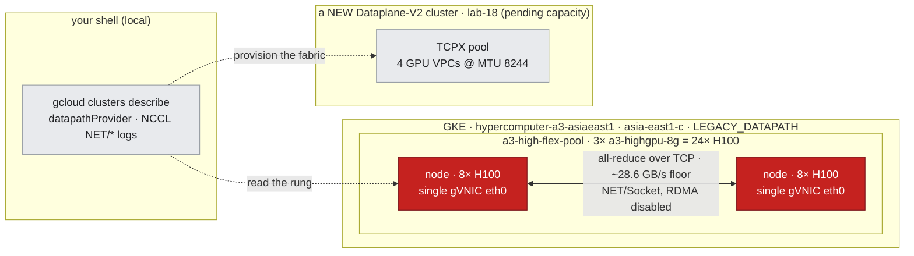
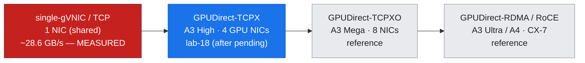
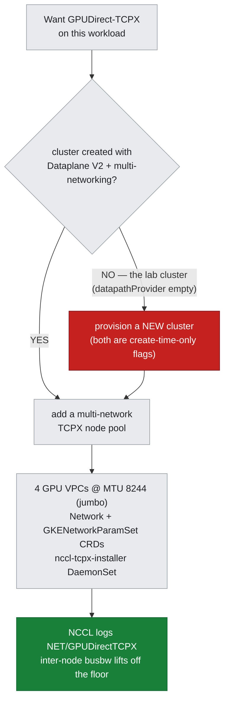

# 21 — GKE Network Design for GPU Workloads: the Fabric Is a Decision

## Overview

Part VI opens the guide's second applied track: **architecture & GCP integration** — the *design* skill, the horizontal axis to Parts I–V's vertical stack. And the first design decision, the one that sets the ceiling on every distributed job, is the **inter-node fabric**.

Parts II–III measured that fabric honestly and found a cliff: NCCL all-reduce falls from **~480 GB/s** inside a node (NVLink) to **~28.6 GB/s** across nodes (lab-06), and *down a curve* — **465 → 23.7 → 14.95 GB/s** at 1/2/3 nodes (lab-12). That floor is **not physics**. It is the consequence of an architecture choice made — usually by default — at cluster-creation time: the nodes talk over a **single gVNIC / TCP** path, and NCCL logs `NET/Socket`, `GPU Direct RDMA Disabled`. This document is about making that choice **deliberately**: single-gVNIC vs GPUDirect-TCPX vs TCPXO vs RDMA, what each costs to stand up, and what each buys — tied to the [lab-18](../../labs/lab-18-enable-gpudirect-tcpx/) before/after that measures the cliff closing.

**What you'll learn:**
- The **GPU-fabric ladder** on GCP — single-gVNIC → TCPX → TCPXO → RDMA/RoCE — each mapped to its A3/A4 machine family and its measured-or-referenced bandwidth
- Why the fabric is a **create-time** decision: multi-networking ⇒ Dataplane V2, and the 4-GPU-NIC / jumbo-MTU / `Network`-CRD anatomy of a TCPX pool
- The surrounding network-design choices a real GPU cluster forces: **VPC-native**, **private cluster + Cloud NAT**, **Shared VPC**, and **compact placement / rail alignment**
- Where **serving** networking differs from training (Gateway API / Inference Gateway — forward-ref to [doc-24](24-inference-serving-autoscale.md))
- How to read the payoff **on the wire** (`NET/GPUDirectTCPX` vs `NET/Socket`) rather than trusting a spec sheet

**Prerequisites:** [doc-05](../part2-inter-node/05-nic-rdma-gpudirect.md) (NICs/RDMA/GPUDirect mechanism) and [doc-06](../part2-inter-node/06-nccl-collectives.md) (the measured gVNIC curve this closes); helpful: [doc-16](../part5-operations-diagnostics/16-diagnostic-method.md) (read the transport, don't assume it).

**Instantiated by:** [lab-18](../../labs/lab-18-enable-gpudirect-tcpx/) — provision the multi-network TCPX pool and measure gVNIC→TCPX. *(The **before** is captured live; the **after** is pending A3 Flex capacity + a Dataplane-V2 cluster — see Step 2. The design and provisioning are complete and honest; the after-number lands when capacity does.)*

---

## Where this fits (the environment)

*Figure — where this fits: the current lab cluster is **single-gVNIC** (`LEGACY_DATAPATH`), so every inter-node all-reduce rides one `eth0` at the **~28.6 GB/s floor** (red); TCPX (grey) can only live in a **NEW Dataplane-V2 cluster** lab-18 provisions — never an in-place upgrade.*



---

## Step 0 — The GPU-fabric ladder (the decision, in one table)

Every GCP GPU platform sits on a rung of an inter-node fabric ladder. The rung is chosen with the **machine family** and **fixed at pool/cluster creation** — you don't toggle it later.

| Rung | Machine family | Inter-node fabric | Per-node GPU NICs | Where in this guide |
|---|---|---|---|---|
| **single-gVNIC / TCP** | any A3 (default) | standard VPC TCP over one gVNIC | 1 (shared w/ host) | **measured** — lab-06/12 (~28.6 GB/s floor) |
| **GPUDirect-TCPX** | A3 High (`a3-highgpu-8g`) | TCP + GPU-Direct DMA over 4 dedicated NICs | 4 | **lab-18** (before/after; after pending) |
| **GPUDirect-TCPXO** | A3 Mega (`a3-megagpu-8g`) | TCPX-optimized over 8 NICs (higher ceiling) | 8 | reference-arch (no A3 Mega on the lab) |
| **GPUDirect-RDMA / RoCE** | A3 Ultra (`a3-ultragpu-8g`), A4 | RoCEv2 over CX-7, `NET/IB` present | 8 (CX-7) | reference-arch (Part IV fabric contrast) |

*Figure: the fabric ladder — each rung removes the host/TCP bottleneck of the one below and lifts the inter-node ceiling. Only the red rung is where this cluster sits (measured); TCPX is the rung lab-18 provisions; TCPXO/RDMA are reference.*



**The honesty line (inherited from the whole guide):** only the rungs we can run are claimed as measured. This lab's cluster is single-gVNIC; TCPX is the rung we *provision* to close the cliff; **TCPXO and RDMA are reference-architecture** — described as the ladder above TCPX and contrasted, never asserted as run here (they need A3 Mega / A3 Ultra / A4 hardware — see [doc-13](../part4-platform-reference-arch/13-spectrum-x-and-fabrics.md)).

---

## Step 1 — Why the fabric is a *create-time* decision

The single most important architecture fact in this doc: **you cannot upgrade a cluster's GPU fabric in place.** GPUDirect-TCPX needs each GPU NIC on its own **network**, and Kubernetes multi-networking on GKE requires **Dataplane V2** (`--enable-dataplane-v2`) **and** multi-networking (`--enable-multi-networking`) — and **both are create-time-only flags.** A cluster created without them (like the lab's `hypercomputer-a3-asiaeast1`) can never host a TCPX pool; the only path to TCPX is a **new cluster**.

*Figure: the create-time gate. The fabric rung is decided when the cluster is born; a cluster without Dataplane V2 can never host a TCPX pool — the only path forward is a new cluster.*



Verify any cluster's rung in one command (this is the doc-16 "read it, don't assume" discipline applied to the fabric):

```bash
gcloud container clusters describe "$CLUSTER" --zone "$ZONE" \
  --format='value(networkConfig.datapathProvider)'
#   ADVANCED_DATAPATH  → Dataplane V2 present (multi-networking possible)
#   <empty>            → LEGACY_DATAPATH → single-gVNIC only, no TCPX (the lab cluster)
```

The anatomy of the enabled fabric — what [`scripts/provision_tcpx_pool.sh`](../../scripts/provision_tcpx_pool.sh) actually builds:

```
NEW GKE cluster:  --enable-dataplane-v2 --enable-multi-networking   ← the create-time gate
  ├─ 4 GPU VPCs + subnets, MTU 8244 (jumbo)         ← one per a3-highgpu-8g GPU NIC
  ├─ A3 node pool: --additional-node-network ×4 (Flex-start, ≤3 nodes)
  ├─ Network + GKENetworkParamSet CRDs               ← bind VPC → k8s Network
  └─ nccl-tcpx-installer DaemonSet + tcpx-daemon     ← the NCCL plugin + receive datapath
```

**Jumbo frames matter.** GPUDirect-TCPX assumes **MTU 8244** on the GPU networks; a default 1460-MTU subnet silently caps throughput. MTU is set on the VPC/subnet at creation — another reason the fabric is baked in early.

---

## Step 2 — Reading the payoff on the wire (before/after)

The whole point of the design is a *measured* delta, read from NCCL itself — not a datasheet. The **before** is live (lab-06):

```
NET/IB : No device found.
NET/Socket : Using [0]eth0:10.128.0.52<0>
Using network Socket
NET/Socket : GPU Direct RDMA Disabled for HCA 0 'eth0'
```
→ 2-node 16-GPU busbw **~28.6 GB/s**; the 1/2/3-node curve **465 → 23.7 → 14.95 GB/s**.

The **after** (TCPX) is expected to log `NET/GPUDirectTCPX`, enumerate the 4 GPU NICs, and lift the inter-node busbw materially — the number lab-18 will capture the moment a Dataplane-V2 cluster + A3 Flex capacity exist.

> ### Honest status (why this doc doesn't quote an "after" number)
> This project's existing cluster is single-gVNIC and **can't** be upgraded (Step 1), and it has **no on-demand H100 quota** — its A3 nodes came via scarce **Flex-start**. So the TCPX after-capture is **pending capacity**, and the guide's honesty rule forbids quoting a fabric number not read off a live run. What *is* complete: the full, reversible provisioning path and the TCPX workload manifests, validated and ready ([lab-18](../../labs/lab-18-enable-gpudirect-tcpx/), [`assets/lab-18/blocker_dataplane_v2.txt`](../../assets/lab-18/blocker_dataplane_v2.txt)). Design + provisioning is the deliverable; the number is one `provision_tcpx_pool.sh up` away.

---

## Step 3 — The rest of the GPU network design

The fabric rung is the headline, but a production GPU cluster forces four more decisions — each with a GPU-specific twist:

- **VPC-native (alias IPs), always.** GPU clusters run VPC-native so Pod IPs are first-class VPC addresses — required for multi-networking and for the pod-ranges the additional GPU networks carry. Route-based clusters can't do TCPX.
- **Private cluster + Cloud NAT.** GPU nodes should have **no public IPs** (attack surface, and you're not serving from them); egress for pulling images/checkpoints goes through **Cloud NAT**. Plan NAT IP/port allocation for large pulls (every node dragging a multi-GB CUDA image at once).
- **Shared VPC.** In real orgs the GPU cluster lives in a service project attached to a host-project Shared VPC; the 4 GPU networks and their firewall rules are then a **host-project** concern. Design the subnet/secondary-range layout with the network team before pool creation (it's create-time).
- **Compact placement & rail alignment.** For inter-node collectives, nodes should be **physically close** (a compact-placement policy / the GKE `topology` scheduling) so the fabric isn't crossing the datacenter — the cloud analogue of DGX SuperPOD **rail alignment** ([doc-14](../part4-platform-reference-arch/14-dgx-superpod.md)). This is why the [lab-13a](../../labs/lab-13-topology-resilience/) gang places one pod per node with topology awareness.

**Serving is a different network problem.** Everything above is **east-west** (GPU↔GPU, bandwidth-bound). Inference is **north-south** (client→model, latency- and routing-bound): a Gateway API / **GKE Inference Gateway** front end, health-based routing, and autoscaling — covered in [doc-24](24-inference-serving-autoscale.md) and [lab-21](../../labs/lab-21-inference-serving/). Designing one fabric for both is a common mistake; they have opposite optimization targets.

---

## Key takeaways

- **The inter-node fabric is a create-time architecture decision, not a runtime tunable.** TCPX/TCPXO/RDMA are chosen with the machine family and the cluster's Dataplane-V2 + multi-networking flags — pick the rung before you create the cluster.
- **The gVNIC floor is a choice.** ~28.6 GB/s (and the 465→23.7→14.95 curve) is what you get by *default*; TCPX exists to close it, at the cost of a multi-network cluster + 4 GPU VPCs + jumbo MTU + the NCCL plugin.
- **Read the rung on the wire.** `datapathProvider` for the cluster, `NET/Socket` vs `NET/GPUDirectTCPX` in NCCL — never trust the spec sheet over the log.
- **Honesty holds even for the flagship.** The TCPX before is measured; the after is provisioned-and-pending, not fabricated — the guide would rather ship a complete design with a documented blocker than a made-up bandwidth.
- **The fabric is only the headline decision.** VPC-native, private + Cloud NAT, Shared VPC, and compact placement / rail alignment are the rest of the GPU network design — and serving inverts the whole optimization target.

---

**Next (Part VI) →** [doc-22 storage & the data path](22-storage-and-data-path.md)
**Builds on →** [doc-05 NICs, RDMA & GPUDirect](../part2-inter-node/05-nic-rdma-gpudirect.md) · [doc-06 NCCL collectives](../part2-inter-node/06-nccl-collectives.md) · [doc-15 scaling: the shape of the cliff](../15-scaling-shape-of-the-cliff.md) · [lab-18 enable GPUDirect-TCPX](../../labs/lab-18-enable-gpudirect-tcpx/)
**Reference →** [reference-arch-cheatsheet.md](../../reference/reference-arch-cheatsheet.md) · [lab-build-gotchas.md](../../reference/lab-build-gotchas.md)
