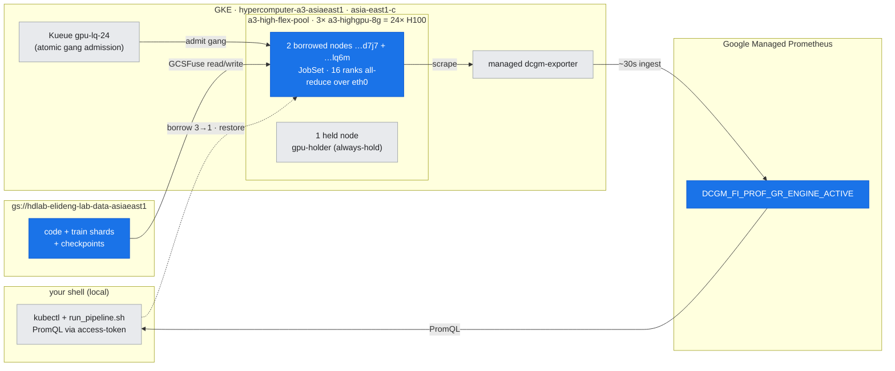
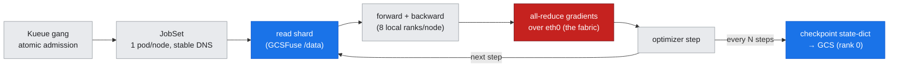

# 23 — The End-to-End Training Pipeline: Gang + Data Path + Checkpoints as One Job

## Overview

Every prior training lab measured one piece in isolation: [lab-06/12/13](../../labs/) proved the **gang** (a multi-node job placed and admitted atomically), [lab-19](../../labs/lab-19-storage-data-path/) proved the **data path** (bytes off a real bucket). But a production training job is not any one of those — it is the **whole loop** running at once: read a shard from object storage, forward/backward across every rank, all-reduce the gradients over the fabric, step, and every N steps write a checkpoint back to storage. This document is about assembling those pieces into **one real distributed run** and reading the four signals it emits — because the failure modes only appear when the pieces are connected.

The lab so far cheated twice: it fed the GPUs from `torch.randn` (no data path) and never checkpointed (no write path). [lab-20](../../labs/lab-20-training-pipeline/) removes both cheats — a **2-node / 16-GPU JobSet gang** trains a real DDP model on a **learnable** dataset read from **GCS**, checkpoints back to **GCS**, and its GPU activity is confirmed on **GMP/DCGM** — so the loss genuinely falls and every stage is measured, not asserted.

**What you'll learn:**
- The **anatomy of a distributed training job on GKE** — JobSet (topology) + Kueue (atomic admission) + GCSFuse (data) + DDP (compute) + checkpoints (state) — and how the pieces compose
- Why **code and data both come from GCS**, and how a pod pulls its own training script from the bucket
- How the **checkpoint write** becomes a first-class throughput and consistency concern once it's in the loop
- How to read the run on the **managed pipeline** — a sustained `DCGM_FI_PROF_GR_ENGINE_ACTIVE` plateau — and why a healthy multi-node job can plateau **below** saturation
- The honest lesson that at 16 GPUs the **fabric is already a first-order term** — the bridge back to [doc-21](21-gke-network-design.md) / lab-18

**Prerequisites:** [doc-22](22-storage-and-data-path.md) (the GCSFuse data path this job reads/writes through) and the gang concepts from Part IV; helpful: [doc-20](../part5-operations-diagnostics/20-performance-monitoring-day2-ops.md) (the GMP/DCGM pipeline) and [doc-21](21-gke-network-design.md) (the fabric the all-reduce rides).

**Instantiated by:** [lab-20](../../labs/lab-20-training-pipeline/) — a 2-node/16-GPU JobSet training a learnable DDP model on GCS data, checkpointing to GCS, cross-checked on GMP.

---

## Where this fits (the environment)

*Figure — where this fits: Kueue admits a **2-node / 16-GPU JobSet gang** (blue) onto the borrowed A3 nodes; code + data + checkpoints all live in one **GCS bucket**, and the run's DCGM plateau is read back on GMP. The 16 ranks all-reduce over `eth0` — the single-gVNIC fabric that makes the job comms-bound (Step 4).*

---

## Step 0 — The anatomy of a training job on GKE

A production training job is five concerns, each solved by a different GKE object. The value is in seeing them as **one stack**, not five features:

| Concern | Solved by | What breaks if it's missing |
|---|---|---|
| **Topology** — N pods, one per node, stable identities | **JobSet** (`replicatedJobs`, headless DNS) | ranks can't find each other; pods pile onto one node |
| **Atomic admission** — all N nodes or none | **Kueue** gang (ClusterQueue quota) | a half-scheduled job burns GPUs waiting for the rest |
| **Data** — the dataset, bigger than any disk | **GCSFuse** mount (WIF or, here, userspace) | the GPUs starve (doc-22) |
| **Compute** — gradients coupled across ranks | **DDP / c10d** all-reduce over the fabric | no distributed training; just N solo jobs |
| **State** — survive preemption / finish | **checkpoints** to GCS every N steps | a preempted Flex job loses everything |

lab-20 wires all five: a JobSet of 2 replicated Jobs (one pod per node), admitted atomically by Kueue `gpu-lq-24`, each pod mounting the bucket and launching 8 local ranks (WORLD_SIZE=16) that all-reduce over `eth0`, with rank 0 checkpointing to the same bucket.

*Figure: the five concerns are not five features — they are one loop. Kueue admits the gang, JobSet places it, then every step reads → computes → all-reduces → steps, and every N steps writes state back through the same data path.*

The **all-reduce** edge is drawn red on purpose: at 16 GPUs over single-gVNIC it is the step's first-order cost (Step 4).

> **Manual ranks, not torchrun.** As in lab-13, each pod sets `RANK/LOCAL_RANK/WORLD_SIZE` by hand and rendezvous on the JobSet's headless DNS (`train-pipeline-worker-0-0.train-pipeline`). This c10d-direct path is more robust across pods than torchrun's multi-node rendezvous, and it makes the rank math explicit: `RANK = NODE_RANK*8 + local`.

---

## Step 1 — Code *and* data from the bucket

A production pipeline treats the training script as an artifact, not something baked into a base image you rebuild for every one-line change. lab-20 makes this literal: `run_pipeline.sh` stages `train_pipeline.py` to `gs://…/code/`, and each worker — after mounting the bucket — runs `python3 /data/code/train_pipeline.py`. The dataset lives beside it at `gs://…/train/`. One mount, both concerns.

The dataset is deliberately **learnable** — `y = X·w* + b* + 0.1·noise` for a fixed ground-truth `w*` — so the MLP regressor has something real to fit and the loss curve is a genuine signal, not a flat synthetic number. Each rank owns a disjoint slice of the shards (shard `rank % 8`, rows strided by `rank // 8`), so all 16 ranks train on different data, the way `DistributedSampler` would arrange it.

> **The auth reality (doc-22's G20, again).** The production mount is the managed **GCSFuse CSI + Workload Identity**. On this pre-WIF **Flex** pool that needs a node-level switch that recreates nodes, so lab-20 mounts GCSFuse **in userspace** with a GSA-key Secret — identical data path, zero node changes. The point of the lab is the *pipeline shape*; the mount mechanism is the doc-22 footnote.

---

## Step 2 — The loss curve (the run is real)

The headline is a genuine training curve on real hardware:

| step | 1 | 50 | 200 | 1000 | 2000 | 4000 |
|---|---|---|---|---|---|---|
| **loss** | 262.95 | 0.598 | 0.089 | 0.046 | 0.016 | **0.0076** |

**Measured live** (lab-20, nodes `…d7j7` + `…lq6m`, WORLD_SIZE=16): loss falls from **263 → 0.0076** over 4000 steps in **165.8s**, sustaining **~3.2 M samples/s** across the 16 GPUs. Occasional up-spikes are ordinary mini-batch noise, not divergence.

 This is the thing every earlier lab faked, now real: gradients from 16 GPUs on 2 nodes, all-reduced each step, converging on data read from an object store.

---

## Step 3 — Checkpoints in the loop (the write path, for real)

doc-22 measured a checkpoint write in isolation; here it happens **inside the training loop**, which changes its character. Rank 0 `torch.save`s the state-dict to `/data/checkpoints/pipeline/step_NNNN.pt` every 1000 steps — a **264 MiB** object written at **~3.0s** each through GCSFuse, verified as real bucket objects. Three consequences the loop makes concrete:

- **It's a synchronous stall.** For those ~3s the training loop blocks — with 4 checkpoints in a 166s run that's a measurable tax. Real jobs at scale (tens of GiB, all ranks) make it async or stage to Local SSD first (doc-22 Step 3).
- **One writer, many readers on restart.** lab-20 has only rank 0 write — the simplest correct choice; the recovery *read* on restart is gated by the doc-22 read ceiling.
- **It's what makes a Flex job survivable.** A preempted Flex node ([doc-19](../part5-operations-diagnostics/19-cluster-job-failure-triage.md)) loses only back to the last checkpoint — the write path *is* the fault-tolerance story, not a nice-to-have.

---

## Step 4 — Reading the run on the managed pipeline

The same GMP/DCGM pipeline from [doc-20](../part5-operations-diagnostics/20-performance-monitoring-day2-ops.md) confirms the run from the outside. `DCGM_FI_PROF_GR_ENGINE_ACTIVE` across both training nodes over the run window:

| training node | avg engine-active | peak |
|---|---|---|
| `…d7j7` | **0.385** | 0.666 |
| `…lq6m` | **0.319** | 0.500 |

A **sustained plateau** across 15 samples — the managed pipeline sees the same training the log does, and (lab-20 gotcha **G22**) only *because* the run was sized to several minutes: a first 33-second pass finished inside a single GMP scrape and looked idle. When you want a dashboard to show a job, the job has to outlast the scrape interval.

> **Why ~0.4 and not ~1.0 — the honest lesson (G23).** A plateau well below saturation on a *healthy* job is not a throttle and not a starve. Each step all-reduces a **268 M-parameter (≈1 GiB) gradient** across 16 ranks over the node's **single gVNIC `eth0`** — this cluster has no TCPX/RDMA (lab-18). So the step is **compute interleaved with inter-node communication**, and the GPU idles during the exchange. This is [doc-16](../part5-operations-diagnostics/16-diagnostic-method.md)'s discipline applied one more time: a mid-range `GR_ENGINE_ACTIVE` has *three* causes now — a throttled GPU (lab-17), a **starved** GPU (lab-19), and a **comms-bound** gang (here) — and you tell them apart by reading the whole path, not the one meter.

**This is the bridge back to the fabric.** The pipeline honestly shows that at 16 GPUs the network is already a first-order term — which is precisely why [doc-21](21-gke-network-design.md) and lab-18's TCPX/TCPXO ladder exist. The end-to-end job is where every axis of this guide — compute, storage, and fabric — finally shows up in the same number.

---

## Key takeaways

- **A training pipeline is a stack, not a feature** — JobSet (topology) + Kueue (atomic admission) + GCSFuse (data) + DDP (compute) + checkpoints (state) — and the interesting failures only appear when they're connected.
- **Code and data both come from the bucket** — the training script is an artifact you stage to GCS, not something baked into an image.
- **Checkpointing is in the loop** — a synchronous stall, a consistency decision, and the entire reason a preempted Flex job is survivable.
- **Read the run on the managed pipeline** — a sustained DCGM plateau confirms the job, but size the run to outlast the scrape (G22).
- **A healthy multi-node job can plateau below saturation** — comms-bound on single-gVNIC is a third cause of mid-range engine-active, distinct from throttle and starve, and the honest bridge back to the fabric ladder.

---

**Next (Part VI) →** [doc-24 inference serving & autoscale](24-inference-serving-autoscale.md)
**Builds on →** [doc-22 storage & the data path](22-storage-and-data-path.md) · [doc-20 perf monitoring & day-2 ops](../part5-operations-diagnostics/20-performance-monitoring-day2-ops.md) · [doc-21 GKE network design](21-gke-network-design.md)
**Reference →** [reference-arch-cheatsheet.md](../../reference/reference-arch-cheatsheet.md) · [lab-build-gotchas.md](../../reference/lab-build-gotchas.md)
