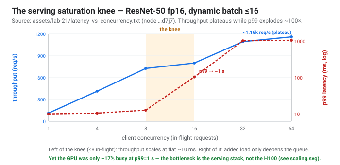
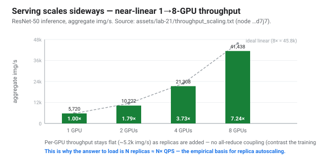
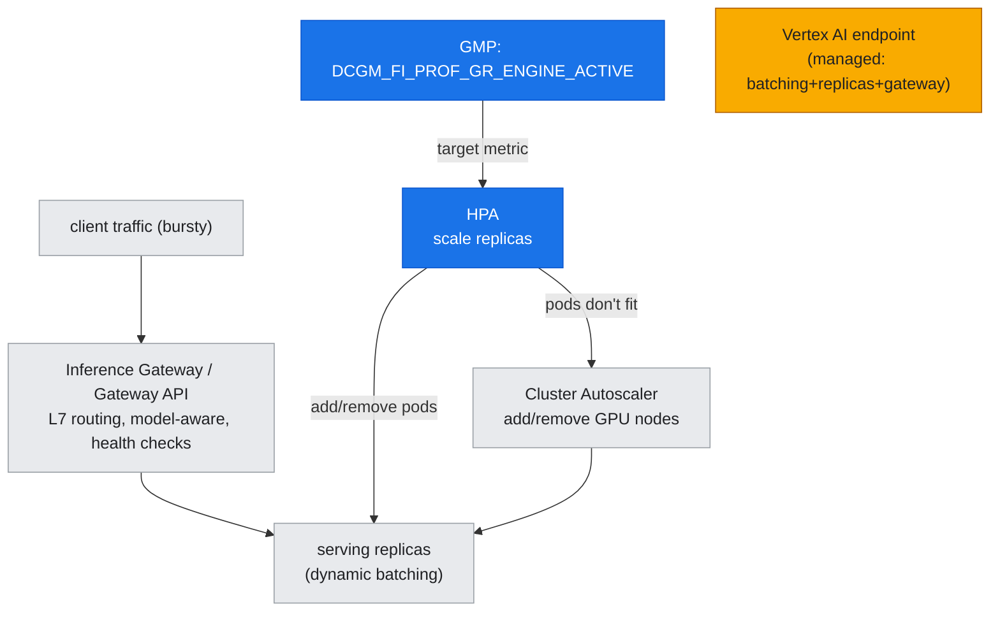

# 24 — Inference Serving & Autoscale: the Other Workload, and Why It Scales Sideways

## Overview

Everything in this guide up to now has been about **training**: pack the GPUs, feed them bytes, couple them over the fabric, run one long throughput-bound job to convergence. **Serving** — running a trained model against live traffic — is a fundamentally different workload, and getting it wrong is one of the most expensive mistakes in production GPU infrastructure. Serving is **latency-bound**, not throughput-bound; its load is **bursty and unpredictable**, not a fixed job size; and its correctness metric is **p99 under an SLO**, not samples/sec. The architecture that answers those properties — dynamic batching, horizontal replicas, autoscaling, and a model-aware gateway — is the subject of this document.

The through-line is one measured, slightly surprising fact: **a serving latency crisis usually isn't a GPU problem.** [lab-21](../../labs/lab-21-inference-serving/) shows a real ResNet-50 server whose p99 climbs to ~1 second under load while the GPU sits at ~17% utilization — because the bottleneck is the serving *stack*, and the fix is to **scale sideways** (more replicas), which the same lab proves scales throughput ~linearly across GPUs.

**What you'll learn:**
- Why serving is a **different workload** than training, and which metrics actually govern it
- **Dynamic batching** — the first and cheapest serving knob, and its throughput/latency tradeoff
- The **saturation knee**: what it looks like, and why past it you only queue, never serve faster
- Why serving **scales horizontally** — near-linear throughput per replica — and how that makes **autoscaling** the right lever
- The GKE autoscale stack: **HPA on a GPU metric (DCGM)** → **cluster autoscaler** for nodes → **Inference Gateway** for routing — and the **Vertex AI** managed contrast
- The diagnostic trap: **low GPU utilization + terrible latency means scale the server, not the silicon**

**Prerequisites:** [doc-23](23-training-pipeline-jobset.md) (the training workload this contrasts with) and [doc-20](../part5-operations-diagnostics/20-perf-monitoring-day2.md) (the DCGM/GMP signal the autoscaler reads); helpful: [doc-16](../part5-operations-diagnostics/16-diagnostic-method.md) (read the whole path).

**Instantiated by:** [lab-21](../../labs/lab-21-inference-serving/) — a real GPU model server measured for its saturation knee + 1→8-GPU throughput scaling + DCGM under load, with the autoscale/gateway topology as a server-validated reference.

---

## Step 0 — Serving is not training

| | Training (doc-23) | Serving (this doc) |
|---|---|---|
| **Shape of work** | one long job, fixed size | many short requests, unpredictable rate |
| **Bound by** | throughput (samples/sec) | latency (p99 under SLO) |
| **Scaling question** | how fast to convergence? | how many replicas to hold the SLO at this QPS? |
| **Failure mode** | slow / diverges | tail latency blows the SLO |
| **Right lever** | bigger gang, better fabric | dynamic batching + autoscaled replicas |
| **Cost model** | fixed run to completion | pay for peak unless you autoscale down |

The single most important consequence: a training job wants to **fill** the GPU; a serving deployment wants to **hold a latency SLO at minimum cost**, which usually means running the GPU *below* saturation and adding replicas as load rises. Confusing the two — provisioning serving like training — either burns money on idle peak capacity or misses the SLO.

---

## Step 1 — Dynamic batching: the first knob

A single inference request underuses a GPU built for wide parallelism. **Server-side dynamic batching** coalesces requests that arrive close in time into one forward pass: the server waits up to a few milliseconds to collect up to `BATCH_MAX` requests, runs them together, and returns each result. lab-21's server does exactly this (`BATCH_MAX=16`, `BATCH_DELAY_MS=5`).

The tradeoff is the whole game: **bigger batches raise throughput but add queueing latency**, and the delay window trades tail latency for efficiency. Batching is the cheapest serving optimization and the one to reach for first — but it has a ceiling, and past that ceiling you need more replicas.

---

## Step 2 — The saturation knee (what the load curve actually looks like)

Sweeping client concurrency against the server traces a characteristic curve. **Measured live** (lab-21, ResNet-50 fp16, node `…d7j7`):

| concurrency | throughput | p50 | p99 |
|---|---|---|---|
| 1 → 8 | 113 → **727 req/s** | ~9–11 ms | ~10–13 ms |
| 16 | 801 req/s | 11 ms | **104 ms** |
| 32 → 64 | ~1.1k req/s | 12–21 ms | **~1030 ms** |

Below the knee (≤8 in-flight) throughput scales linearly at flat latency. Past it, **throughput plateaus (~1.1k req/s) while p99 explodes ~100×** — added load just deepens the queue. Every serving system has this knee; the job of capacity planning is to keep operating **left of it**, and the job of autoscaling is to add capacity *before* load pushes you right of it.

---

## Step 3 — The punchline: the knee is (often) not the GPU

Here is the result that reframes serving. Under sustained saturating load, lab-21's GPU `DCGM_FI_PROF_GR_ENGINE_ACTIVE` averaged **~0.17** — the H100 was **83% idle** while p99 sat at a full second.

The bottleneck was the **serving stack** — single-threaded request dispatch, one batching worker, Python overhead — not the silicon. This is [doc-16](../part5-operations-diagnostics/16-diagnostic-method.md)'s "read the whole path" with the highest stakes yet, because the wrong diagnosis is expensive in a specific direction:

> **"GPU utilization is low but latency is terrible" does NOT mean buy a bigger GPU.** It means the request path in front of the GPU is the bottleneck — scale the **serving layer** (more replicas, better batching, faster pre/post-processing). A bigger GPU would sit *even more* idle. This is now the **fourth** distinct reading of a low/mid engine-active signal in this guide: throttled (lab-17), starved (lab-19), comms-bound (lab-20/doc-23), and now **server-bound** (here) — four causes, one meter, told apart only by reading the rest of the path.

---

## Step 4 — Why serving scales sideways (and the basis for autoscaling)

If one replica saturates its serving stack well below the GPU's compute ceiling, the fix is more replicas — and that works only if throughput scales with replica count. lab-21 measures it directly across the node's 8 GPUs:

| GPUs / replicas | aggregate throughput | scaling |
|---|---|---|
| 1 | 5,720 img/s | 1.00× |
| 2 | 10,222 img/s | 1.79× |
| 4 | 21,308 img/s | 3.73× |
| 8 | **41,438 img/s** | **7.24×** |

**Near-linear.** Per-GPU throughput stays flat as replicas are added — serving is embarrassingly parallel across requests, with no gradient all-reduce coupling replicas (the very thing that made training comms-bound in doc-23). So the capacity rule is simple: **N replicas ≈ N× QPS**, and autoscaling just tracks load by adjusting N.

---

## Step 5 — The GKE autoscale stack (the reference topology)

*Figure: the three autoscale tiers, each answering a different "what do I scale?" — pods (HPA on the GPU metric), then nodes (cluster autoscaler), fronted by a model-aware gateway. Vertex AI is the managed alternative that hides all three.*

Given linear replica scaling, the production architecture is three tiers, each solving "what do I scale?":

1. **HPA on a GPU metric.** A HorizontalPodAutoscaler scales replicas so that mean `DCGM_FI_PROF_GR_ENGINE_ACTIVE` (exported to Cloud Monitoring by GMP, surfaced via the Custom Metrics Stackdriver Adapter) stays near a target. Scale on the signal that reflects real GPU work, with damping windows because serving load is bursty.
2. **Cluster Autoscaler for nodes.** When replicas can't fit on current nodes, the autoscaler adds GPU nodes (and removes them when load falls) — the second tier that lets the fleet, not just a node, follow demand.
3. **Inference Gateway / Gateway API.** An L7 front door with health checks and routing; the **GKE Inference Gateway** makes it model-aware — route by model name, load-balance on KV-cache / queue depth rather than round-robin — which matters most for LLM serving.

lab-21 ships this as a **server-validated reference** ([`manifests/serving/inference-autoscale.yaml`](../../manifests/serving/inference-autoscale.yaml)): the Deployment + HPA validate against the live API server; the Gateway objects require the Gateway API CRDs the cluster doesn't have. It is **not applied live** because the always-hold rule + Flex cap-of-3 leave no spare GPU capacity to scale into — the honest measured-rung / reference-rung split this guide uses wherever the safe cluster can't host the production shape ([lab-18](../../labs/lab-18-enable-gpudirect-tcpx/), [lab-19](../../labs/lab-19-storage-data-path/)).

> **The Vertex AI contrast.** Everything above is the *self-managed* path on GKE. **Vertex AI endpoints** are the fully-managed alternative: upload a model, get an autoscaling HTTPS endpoint with the batching/replica/gateway machinery handled for you. The tradeoff is the classic one — Vertex trades the control and cost-tuning of self-managed GKE serving for operational simplicity. Choose GKE when you need custom serving runtimes, tight cost control, or co-location with training; choose Vertex when time-to-serve and managed ops win.

---

## Key takeaways

- **Serving is a different workload than training** — latency-bound, bursty, SLO-governed — and provisioning it like training wastes money or misses the SLO.
- **Batch first, then scale replicas.** Dynamic batching is the cheapest knob; horizontal replicas are the answer past the batching ceiling.
- **The saturation knee is real** — keep operating left of it; autoscale *before* load pushes you right of it.
- **A serving latency crisis is often not a GPU problem** — low GPU util + high p99 means scale the serving layer, the fourth distinct reading of a low engine-active signal.
- **Serving scales ~linearly across replicas** (no all-reduce coupling), which is exactly what makes HPA-on-DCGM → cluster-autoscaler → gateway the right production stack — with Vertex AI as the managed contrast.

---

**Part VI complete.** ← [doc-21 GKE network design](21-gke-network-design.md) · [doc-22 storage & data path](22-storage-and-data-path.md) · [doc-23 training pipeline](23-training-pipeline-jobset.md)
**Builds on →** [doc-23 training pipeline](23-training-pipeline-jobset.md) · [doc-20 perf monitoring & day-2 ops](../part5-operations-diagnostics/20-perf-monitoring-day2.md) · [doc-16 diagnostic method](../part5-operations-diagnostics/16-diagnostic-method.md)
**Reference →** [reference-arch-cheatsheet.md](../../reference/reference-arch-cheatsheet.md) · [lab-build-gotchas.md](../../reference/lab-build-gotchas.md)
