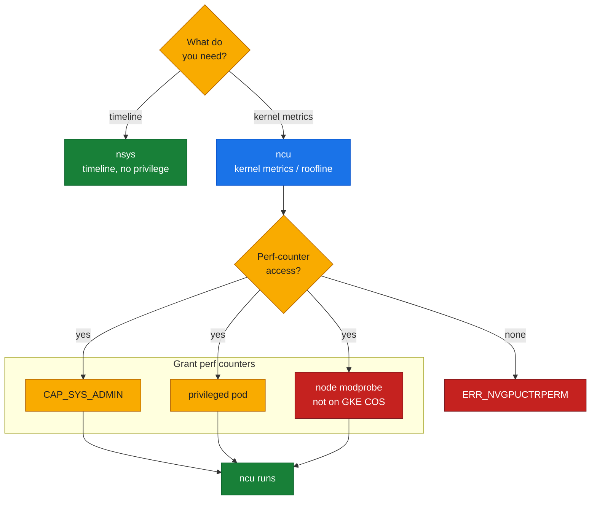
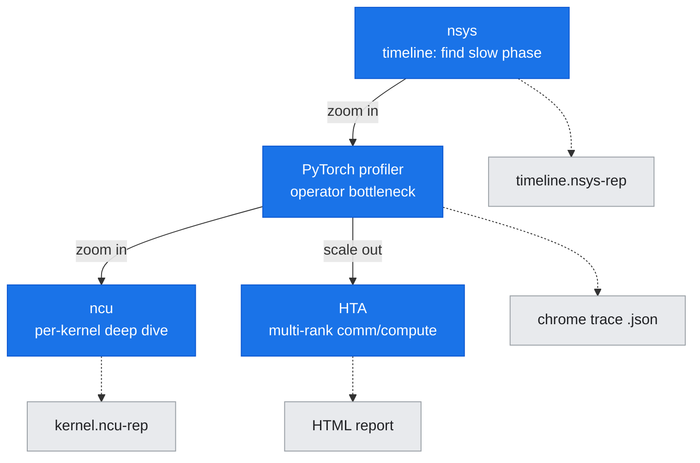

# T3: Profiling and Tracing

## What this document covers

This reference covers the **profiling and tracing tools** used to analyze GPU execution, distributed communication, and application performance at the kernel, system, and multi-rank levels. All tools described here are demonstrated in the hands-on labs (lab-03 for single-GPU profiling, lab-09 for multi-rank distributed tracing).

**Tools covered:**
- **Nsight Systems (`nsys`)** — system-wide timeline profiling (CUDA API, kernels, memcpy, NCCL, NVTX ranges)
- **Nsight Compute (`ncu`)** — per-kernel deep profiling (metrics, roofline, performance counters) with privilege requirements
- **CUPTI and NVTX** — CUDA Profiling Tools Interface and NVIDIA Tools Extension Library for annotating code
- **PyTorch Profiler** — framework-level profiling (`torch.profiler`, Kineto backend, Chrome trace export)
- **Holistic Trace Analysis (HTA)** — multi-rank trace analysis (communication vs. compute, idle time, kernel breakdown)

---

## Nsight Systems (`nsys`)

### What it is

**Nsight Systems** is a **system-wide timeline profiler** that captures a holistic view of application execution, including CPU activity, CUDA API calls, GPU kernels, memory operations, NCCL communication, and user-defined NVTX ranges. It is the **first profiling tool** you should reach for when investigating GPU workload behavior, distributed training bottlenecks, or host-GPU interaction.

Unlike Nsight Compute (which profiles individual kernels in depth), Nsight Systems shows the **overall timeline** — what launched when, how long it took, and how CPU and GPU activities overlap.

### When to use it

Use Nsight Systems to:
- Understand the **execution timeline** of a GPU workload (what operations ran, in what order, and for how long)
- Identify **host-GPU synchronization bottlenecks** (e.g., CPU waiting on GPU, GPU idle waiting for CPU)
- Profile **NCCL collectives** in distributed training (communication start/end times, overlap with compute)
- Correlate **NVTX ranges** (user-defined annotations) with GPU kernels and API calls
- Capture **multi-process timelines** for distributed jobs (e.g., multi-rank PyTorch with `torchrun`)
- Diagnose **launch overhead**, unexpected synchronization, or inefficient API usage

Do **not** use Nsight Systems for:
- Deep per-kernel analysis (use Nsight Compute instead)
- Roofline model or detailed SM/memory metrics (use Nsight Compute)

### How to use it

#### Basic invocation

```bash
nsys profile -t cuda,nvtx,nccl -o timeline ./app
```

**Flags:**
- `-t cuda,nvtx,nccl` — trace CUDA API + kernels, NVTX ranges, and NCCL communication
- `-o timeline` — output file basename (produces `timeline.nsys-rep`)
- `./app` — the application to profile

**Additional useful flags:**
- `-t osrt` — trace OS runtime (pthread, file I/O)
- `-t cudnn,cublas` — trace cuDNN and cuBLAS library calls (shown as NVTX ranges if libraries are built with NVTX)
- `--cuda-memory-usage=true` — track CUDA memory allocations
- `--sample=cpu` — CPU sampling (useful for host bottlenecks)
- `-s none` — disable post-processing (faster, analyze later with `nsys stats`)

For **multi-rank distributed jobs**, prefix with `torchrun` or `mpirun`:

```bash
# PyTorch DDP with torchrun (profiles all ranks)
nsys profile -t cuda,nvtx,nccl -o timeline_%h_%p \
    torchrun --nproc_per_node=8 train.py

# Output: timeline_<hostname>_<pid>.nsys-rep for each rank
```

**Note:** The `%h` and `%p` placeholders expand to hostname and process ID, ensuring each rank writes a separate trace file.

#### Analyzing the trace

**Option 1: Nsight Systems GUI (recommended for interactive exploration)**

Download the `.nsys-rep` file to your workstation and open it in the Nsight Systems GUI (available at [https://developer.nvidia.com/nsight-systems](https://developer.nvidia.com/nsight-systems)).

The timeline view shows:
- **CUDA HW rows** — GPU kernels executing on each stream
- **CUDA API row** — host-side CUDA API calls (cudaMemcpy, cudaLaunchKernel, cudaStreamSynchronize, etc.)
- **NCCL row** — NCCL collective operations (AllReduce, AllGather, etc.)
- **NVTX rows** — user-defined ranges (see NVTX section below)
- **OS Threads rows** — CPU activity per thread

You can zoom, filter by time range, measure kernel duration, and correlate CPU and GPU activity.

**Option 2: Command-line summary**

For a quick text summary without downloading the trace:

```bash
nsys stats timeline.nsys-rep
```

This prints:
- **CUDA Kernel Summary** — kernel name, count, total time, average time
- **CUDA Memory Operation Summary** — memcpy types (HtoD, DtoH, DtoD), sizes, duration
- **CUDA API Summary** — API call counts and durations
- **NCCL Summary** — collective counts and durations (if NCCL tracing was enabled)

You can also export to SQLite for custom queries:

```bash
nsys export --type sqlite timeline.nsys-rep
sqlite3 timeline.sqlite "SELECT name, dur FROM CUPTI_ACTIVITY_KIND_KERNEL ORDER BY dur DESC LIMIT 10;"
```

### Timeline concepts

Understanding the timeline rows is key to reading Nsight Systems traces:

#### CUDA API row

Shows **host-side CUDA API calls**. Each bar represents a call (e.g., `cudaMalloc`, `cudaMemcpy`, `cudaLaunchKernel`). Long bars indicate API calls that block the host (e.g., `cudaDeviceSynchronize`, synchronous memcpy).

**Common patterns:**
- Frequent `cudaLaunchKernel` calls with no visible kernel execution → launch overhead or very short kernels
- Long `cudaStreamSynchronize` → GPU idle or host waiting unnecessarily
- Synchronous `cudaMemcpy` (blocking) vs. `cudaMemcpyAsync` (non-blocking)

#### CUDA HW (kernel execution)

Shows **GPU kernels executing** on each CUDA stream. Each bar is a kernel instance, labeled with the kernel name and duration.

**What to look for:**
- **GPU idle gaps** between kernels → investigate why (host launch overhead, synchronization, CPU bottleneck)
- **Stream concurrency** — multiple streams show kernels overlapping (good for hiding latency)
- **Kernel duration** — long kernels may be candidates for optimization (analyze with Nsight Compute)

#### CUDA Memory Operations

Shows **GPU memory copies** (host-to-device, device-to-host, device-to-device). Labeled by direction (HtoD, DtoH, DtoD) and size.

**What to look for:**
- **Synchronous memcpy during computation** → blocks GPU, should be async
- **Large transfers** — may dominate execution time, consider batching or overlapping with compute

#### NCCL row

Shows **NCCL collective operations** (AllReduce, AllGather, Broadcast, etc.). Each bar represents a collective call.

**What to look for:**
- **NCCL overhead** — time spent in NCCL relative to compute
- **Communication/compute overlap** — ideal: NCCL calls run concurrently with GPU kernels (e.g., gradient AllReduce overlapping with backward pass)
- **Communication gaps** — long idle time between collectives may indicate synchronization or scheduling issues

#### NVTX ranges

User-defined **named regions** for annotating code (see NVTX section below). NVTX ranges appear as hierarchical bars, making it easy to correlate high-level application phases (e.g., "forward pass", "backward pass", "optimizer step") with underlying GPU kernels and NCCL calls.

---

## Nsight Compute (`ncu`)

### What it is

**Nsight Compute** is a **per-kernel deep profiler** that collects detailed performance metrics for individual GPU kernels, including SM utilization, memory throughput, warp occupancy, instruction mix, and roofline analysis. It is the tool for **understanding why a kernel is slow** and what resource (compute, memory bandwidth, latency) is the bottleneck.

Unlike Nsight Systems (which shows the timeline), Nsight Compute **slows down execution** to collect metrics, making it unsuitable for profiling entire applications. Instead, use it to **zoom in on specific kernels** identified as bottlenecks via Nsight Systems.

### When to use it

Use Nsight Compute to:
- Analyze **individual kernel performance** (why is this kernel slow?)
- Identify **compute vs. memory bottlenecks** (is the kernel compute-bound or memory-bound?)
- Generate **roofline plots** (compare achieved performance to theoretical peaks)
- Inspect **warp occupancy, divergence, and stall reasons** (why are SMs underutilized?)
- Compare **before/after optimization** (did the change improve kernel performance?)

Do **not** use Nsight Compute for:
- System-wide timeline profiling (use Nsight Systems)
- Profiling entire training runs (it's too slow)

### How to use it

#### Basic invocation

```bash
ncu --set full -o kernel_profile ./app
```

**Flags:**
- `--set full` — collect all available metrics (compute, memory, scheduler, warp state, instruction mix)
- `-o kernel_profile` — output file basename (produces `kernel_profile.ncu-rep`)
- `./app` — the application to profile

**Note:** This profiles **all kernels** launched by the application. For long-running applications, this will be very slow. Use kernel filtering (see below) to profile specific kernels.

#### Kernel filtering

To profile only specific kernels by name:

```bash
ncu --set full --kernel-name-base function --kernel-name "myKernel" -o profile ./app
```

Or profile only the **first N kernel launches**:

```bash
ncu --set full --launch-count 5 -o profile ./app
```

Or profile a specific **range of kernel launches**:

```bash
ncu --set full --launch-skip 10 --launch-count 5 -o profile ./app
```

#### Sections

Instead of `--set full` (which collects everything), you can request specific **metric sections** for faster profiling:

```bash
ncu --section ComputeWorkloadAnalysis --section MemoryWorkloadAnalysis -o profile ./app
```

Useful sections:
- `ComputeWorkloadAnalysis` — compute utilization, SM efficiency
- `MemoryWorkloadAnalysis` — memory throughput, cache hit rates
- `LaunchStats` — kernel launch configuration (grid size, block size, registers, shared memory)
- `Occupancy` — theoretical and achieved occupancy, limiting factors
- `SpeedOfLight` — percentage of peak utilization (compute, memory, L1, L2)
- `WarpStateStats` — warp stall reasons (memory, execution dependency, synchronization)

#### Roofline model

Nsight Compute can generate a **roofline plot** (achieved performance vs. operational intensity, compared to hardware peaks):

```bash
ncu --set full --section SpeedOfLight_RooflineChart -o profile ./app
```

Open `profile.ncu-rep` in the Nsight Compute GUI to view the roofline chart interactively.

**Reading the roofline:**
- **Compute-bound** kernels sit near the "ridge" (high operational intensity, limited by FP32/FP64/Tensor Core throughput)
- **Memory-bound** kernels sit in the flat region (low operational intensity, limited by DRAM or L2 bandwidth)
- Optimization strategy depends on which side of the roofline the kernel falls

#### Analyzing the profile

**Option 1: Nsight Compute GUI (recommended)**

Download the `.ncu-rep` file to your workstation and open it in the Nsight Compute GUI (available at [https://developer.nvidia.com/nsight-compute](https://developer.nvidia.com/nsight-compute)).

The GUI provides:
- **Summary page** — execution time, achieved occupancy, SM utilization, memory throughput
- **Details page** — per-section metrics with guidance (yellow/red warnings for bottlenecks)
- **Source page** — source code annotated with performance metrics (requires source and line info)
- **Roofline page** — roofline plot for compute vs. memory bottleneck analysis

**Option 2: Command-line summary**

For a quick text summary:

```bash
ncu --csv --page raw profile.ncu-rep
```

This prints all collected metrics in CSV format. You can grep for specific metrics (e.g., `sm__throughput.avg.pct_of_peak_sustained_elapsed` for SM utilization).

### Privilege requirements (important for GKE COS)

**Nsight Compute requires elevated GPU performance-counter access** to collect hardware metrics. On many systems (including GKE with Container-Optimized OS), performance counters are **restricted to privileged users** via the kernel module parameter `NVreg_RestrictProfilingToAdminUsers=1`. The gate below decides which profiler you can actually run.

*Figure: nsys-vs-ncu privilege gate — timeline is free; kernel metrics need perf-counter access.*



#### The restriction

When `NVreg_RestrictProfilingToAdminUsers=1` (the default on many production systems), unprivileged processes cannot access GPU performance counters. Running `ncu` in a standard container will fail with:

```
ERR_NVGPUCTRPERM - The user does not have permission to access NVIDIA GPU Performance Counters on the target device.
```

#### The workaround

To enable Nsight Compute profiling in a container, you must:

1. **Run the container with `CAP_SYS_ADMIN` capability** (effectively privileged mode):

```yaml
apiVersion: v1
kind: Pod
metadata:
  name: ncu-profiler
spec:
  containers:
  - name: profiler
    image: nvcr.io/nvidia/pytorch:24.07-py3
    securityContext:
      capabilities:
        add:
        - SYS_ADMIN
    resources:
      limits:
        nvidia.com/gpu: 1
```

2. Or, **run with privileged: true** (grants all capabilities):

```yaml
securityContext:
  privileged: true
```

3. Or, **change the kernel module parameter** (requires node-level access, not available in GKE COS):

```bash
# On bare metal or DGX systems (not GKE COS):
sudo nvidia-modprobe -c0 -u  # Unload driver
sudo nvidia-modprobe -c0 -m  # Reload with profiling enabled
```

#### Lab-03 limitation

**lab-03** (single-GPU profiling) documents this restriction as observed on the GKE A3 cluster. Nsight Systems (`nsys`) works without privilege elevation (it uses CUPTI tracing, not performance counters), but Nsight Compute (`ncu`) requires `CAP_SYS_ADMIN` or privileged mode. The lab will demonstrate the error and the workaround.

**Key takeaway:** On production GKE clusters with COS, plan to use `nsys` for system-wide profiling and reserve `ncu` for offline kernel analysis (by replaying kernels in a privileged container) or local/DGX development environments where you have node access.

---

## CUPTI and NVTX

### CUPTI: CUDA Profiling Tools Interface

**CUPTI** is the low-level API that profiling tools (Nsight Systems, Nsight Compute, PyTorch profiler) use to collect GPU activity traces. It provides:
- **Activity tracing** — records of kernel launches, memory operations, and API calls (used by `nsys`)
- **Event/metric APIs** — access to hardware performance counters (used by `ncu`)
- **Callback APIs** — hooks for CUDA API calls

As an end user, you typically **do not call CUPTI directly** — profiling tools wrap it for you. However, understanding CUPTI helps clarify what tools can and cannot capture (e.g., why `nsys` doesn't need privilege elevation but `ncu` does: activity tracing via CUPTI does not require performance counters, but metric collection does).

### NVTX: NVIDIA Tools Extension Library

**NVTX** is a **user-facing annotation API** for marking regions of code with human-readable labels, making profiler timelines easier to navigate. NVTX ranges appear in Nsight Systems as named bars, correlating high-level application logic (e.g., "data loading", "forward pass", "loss computation") with low-level GPU activity.

#### Why annotate with NVTX

Without NVTX, a profiler timeline shows raw GPU kernels and API calls, but no semantic meaning:

```
Kernel: volta_fp16_s884cudnn_fp16_128x128_ldg8_...  [2.1 ms]
Kernel: void at::native::...                       [1.8 ms]
Kernel: ampere_fp16_s1688cudnn_...                 [3.2 ms]
```

With NVTX, you see:

```
[Forward Pass]
    [Conv Layer 1]
        Kernel: volta_fp16_s884cudnn_fp16_128x128... [2.1 ms]
    [Conv Layer 2]
        Kernel: ampere_fp16_s1688cudnn_...          [3.2 ms]
[Backward Pass]
    ...
```

#### How to annotate with NVTX (C++/CUDA)

Include `nvtx3/nvToolsExt.h` and wrap code with `nvtxRangePush`/`nvtxRangePop`:

```cpp
#include <nvtx3/nvToolsExt.h>

nvtxRangePushA("Forward Pass");
// ... forward computation ...
nvtxRangePop();

nvtxRangePushA("Backward Pass");
// ... backward computation ...
nvtxRangePop();
```

Compile with `-lnvToolsExt` (CUDA Toolkit includes the library).

**Nested ranges** are supported:

```cpp
nvtxRangePushA("Training Iteration");
nvtxRangePushA("Data Loading");
// ...
nvtxRangePop();  // Data Loading
nvtxRangePushA("Forward Pass");
// ...
nvtxRangePop();  // Forward Pass
nvtxRangePop();  // Training Iteration
```

#### How to annotate with NVTX (PyTorch)

PyTorch provides a Python wrapper for NVTX:

```python
import torch.cuda.nvtx as nvtx

nvtx.range_push("Forward Pass")
output = model(input)
nvtx.range_pop()

nvtx.range_push("Backward Pass")
loss.backward()
nvtx.range_pop()
```

Or use context managers for cleaner code:

```python
from contextlib import contextmanager
import torch.cuda.nvtx as nvtx

@contextmanager
def nvtx_range(name):
    nvtx.range_push(name)
    try:
        yield
    finally:
        nvtx.range_pop()

# Usage:
with nvtx_range("Forward Pass"):
    output = model(input)

with nvtx_range("Backward Pass"):
    loss.backward()
```

**Note:** PyTorch also has a built-in `torch.profiler.record_function` (see PyTorch profiler section) which serves a similar purpose but integrates with the PyTorch profiler instead of NVTX. For compatibility with both Nsight Systems and PyTorch profiler, use `torch.profiler.record_function` (it emits both NVTX and Kineto annotations).

#### Capturing NVTX in Nsight Systems

Ensure `nsys` is invoked with `-t nvtx`:

```bash
nsys profile -t cuda,nvtx,nccl -o timeline python train.py
```

NVTX ranges appear as colored bars in the timeline, making it easy to identify application phases.

---

## PyTorch Profiler

### What it is

The **PyTorch profiler** (`torch.profiler`) is a **framework-level profiler** built into PyTorch that captures:
- **CPU operators** (PyTorch ops, autograd, data loading)
- **GPU kernels** (via CUPTI/Kineto backend)
- **CUDA memory events** (allocations, frees)
- **NCCL collectives** (if `record_shapes=True` and `with_stack=True` are enabled, NCCL calls are attributed to Python source)

It exports traces in **Chrome Trace JSON format** (viewable in `chrome://tracing`) or **TensorBoard format** for analysis.

### When to use it

Use PyTorch profiler to:
- Profile **PyTorch training loops** with minimal code changes (no external profiler needed)
- Identify **operator-level bottlenecks** (which PyTorch ops are slow?)
- Analyze **CPU-GPU interaction** (data loading, tensor movement, autograd overhead)
- Capture **multi-rank traces** for distributed training (each rank writes its own trace)
- Export to **TensorBoard** for side-by-side comparison of training runs

Use Nsight Systems instead if you need:
- System-wide timeline (non-PyTorch applications, C++/CUDA code)
- NCCL internal timeline (Nsight Systems shows NCCL kernels; PyTorch profiler only shows high-level NCCL calls)

### How to use it

#### Basic invocation

Wrap the code to profile with `torch.profiler.profile`:

```python
import torch
import torch.profiler

model = ...
data_loader = ...

with torch.profiler.profile(
    activities=[
        torch.profiler.ProfilerActivity.CPU,
        torch.profiler.ProfilerActivity.CUDA,
    ],
    record_shapes=True,
    profile_memory=True,
    with_stack=True,
) as prof:
    for batch in data_loader:
        output = model(batch)
        loss = criterion(output, target)
        loss.backward()
        optimizer.step()

print(prof.key_averages().table(sort_by="cuda_time_total", row_limit=10))
prof.export_chrome_trace("trace.json")
```

**Activities:**
- `ProfilerActivity.CPU` — CPU operators
- `ProfilerActivity.CUDA` — GPU kernels
- (Optional) `ProfilerActivity.XPU` — Intel XPU (not relevant for NVIDIA GPUs)

**Options:**
- `record_shapes=True` — record input shapes for operators (useful for identifying bottlenecks by shape)
- `profile_memory=True` — track CUDA memory allocations/frees
- `with_stack=True` — capture Python stack traces (helps attribute kernels to source lines, but adds overhead)

#### Analyzing the trace

**Option 1: Chrome Trace Viewer**

Open `chrome://tracing` in Google Chrome, click "Load", and load `trace.json`.

The timeline shows:
- **CPU row** — PyTorch operators executing on CPU
- **CUDA streams** — GPU kernels executing on each CUDA stream
- **Correlation** — click a CPU op to see which GPU kernels it launched

**Option 2: TensorBoard**

Export to TensorBoard format:

```python
with torch.profiler.profile(
    activities=[torch.profiler.ProfilerActivity.CPU, torch.profiler.ProfilerActivity.CUDA],
    on_trace_ready=torch.profiler.tensorboard_trace_handler("./log"),
) as prof:
    # ... training loop ...
    prof.step()  # Call prof.step() at the end of each iteration
```

Then launch TensorBoard:

```bash
tensorboard --logdir=./log
```

Navigate to the "PyTorch Profiler" tab to view:
- **Overview** — operator distribution (CPU time, CUDA time, memory)
- **Kernel view** — top kernels by duration
- **Trace view** — interactive timeline (similar to Chrome Trace Viewer)
- **Memory view** — memory allocations over time

**Option 3: Print summary table**

```python
print(prof.key_averages().table(sort_by="cuda_time_total", row_limit=10))
```

Example output:

```
---------------------------------  ------------  ------------  ------------
                             Name    Self CPU %      Self CPU   CPU total %
---------------------------------  ------------  ------------  ------------
                 model_inference        10.00%      50.000ms        90.00%
                  aten::addmm         40.00%     200.000ms        60.00%
                  aten::copy_          5.00%      25.000ms         5.00%
---------------------------------  ------------  ------------  ------------
```

Sort options:
- `"cpu_time_total"` — total CPU time (includes subcalls)
- `"cuda_time_total"` — total CUDA time
- `"self_cpu_time_total"` — CPU time excluding subcalls
- `"cpu_memory_usage"` — CPU memory allocated
- `"cuda_memory_usage"` — CUDA memory allocated

#### Profiling multiple iterations

For multi-iteration profiling (e.g., warm up for 5 iterations, profile for 2, skip the rest):

```python
with torch.profiler.profile(
    activities=[torch.profiler.ProfilerActivity.CPU, torch.profiler.ProfilerActivity.CUDA],
    schedule=torch.profiler.schedule(wait=1, warmup=5, active=2, repeat=1),
    on_trace_ready=torch.profiler.tensorboard_trace_handler("./log"),
) as prof:
    for step, batch in enumerate(data_loader):
        # ... training step ...
        prof.step()  # Must call prof.step() at the end of each iteration
```

**Schedule parameters:**
- `wait=1` — skip the first iteration (wait for data loading to stabilize)
- `warmup=5` — warm up for 5 iterations (profiling disabled, just running)
- `active=2` — profile for 2 iterations (profiling enabled)
- `repeat=1` — repeat the cycle 1 time

This reduces profiling overhead and avoids capturing one-time initialization costs.

#### Recording NCCL collectives

To attribute NCCL collectives to PyTorch operators, use:

```python
with torch.profiler.profile(
    activities=[torch.profiler.ProfilerActivity.CPU, torch.profiler.ProfilerActivity.CUDA],
    record_shapes=True,
    with_stack=True,  # Enables NCCL attribution
) as prof:
    # ... distributed training loop ...
```

**Note:** This captures high-level NCCL calls (e.g., "nccl:all_reduce"), not internal NCCL kernels. For detailed NCCL kernel timelines, use Nsight Systems with `-t nccl`.

---

## Holistic Trace Analysis (HTA)

### What it is

**Holistic Trace Analysis (HTA)** is a **multi-rank trace analyzer** developed by Meta for distributed PyTorch workloads. It ingests PyTorch profiler traces from multiple ranks and generates aggregated visualizations and statistics, including:
- **Communication vs. compute breakdown** (how much time is spent in NCCL collectives vs. GPU kernels?)
- **Idle time analysis** (which ranks are idle, waiting for communication?)
- **Kernel duration distribution** (across ranks, which kernels have high variance?)
- **Temporal breakdown** (how do communication and compute overlap over time?)

HTA is essential for **debugging distributed training performance**, especially when scaling to multiple nodes.

### When to use it

Use HTA to:
- Analyze **multi-rank PyTorch profiler traces** (traces from `torch.profiler` for each rank)
- Identify **communication bottlenecks** (e.g., one rank dominating AllReduce time, load imbalance)
- Diagnose **idle time** (why is a rank waiting? Is there a synchronization issue?)
- Compare **communication/compute overlap** (is gradient communication overlapping with backward pass?)
- Benchmark **scaling efficiency** (how does comm/compute ratio change with more ranks?)

Do **not** use HTA for:
- Single-rank profiling (use PyTorch profiler summary table or TensorBoard)
- Detailed per-kernel analysis (use Nsight Compute)

### How to use it

#### Installation

```bash
pip install HolisticTraceAnalysis
```

(Or install from source: [https://github.com/facebookresearch/HolisticTraceAnalysis](https://github.com/facebookresearch/HolisticTraceAnalysis))

#### Collecting traces

Run your distributed training job with PyTorch profiler enabled on **all ranks**:

```python
import torch
import torch.profiler

with torch.profiler.profile(
    activities=[torch.profiler.ProfilerActivity.CPU, torch.profiler.ProfilerActivity.CUDA],
    schedule=torch.profiler.schedule(wait=1, warmup=5, active=2),
    on_trace_ready=torch.profiler.tensorboard_trace_handler(f"./log/rank_{torch.distributed.get_rank()}"),
) as prof:
    for step, batch in enumerate(data_loader):
        # ... training step ...
        prof.step()
```

This writes one trace file per rank:

```
./log/rank_0/...
./log/rank_1/...
./log/rank_2/...
...
```

#### Analyzing with HTA

```python
from hta.trace_analysis import TraceAnalysis

# Load traces from all ranks
analyzer = TraceAnalysis(trace_dir="./log")

# Generate temporal breakdown (communication vs. compute over time)
analyzer.get_temporal_breakdown()

# Generate idle time analysis
analyzer.get_idle_time_breakdown()

# Generate kernel duration distribution
analyzer.get_kernel_breakdown()

# Generate communication computation overlap
analyzer.get_comm_comp_overlap()
```

HTA generates **HTML reports** and **matplotlib plots** showing:

1. **Temporal breakdown** — stacked bar chart showing compute (GPU kernels), communication (NCCL), and idle time per rank over time
2. **Idle time breakdown** — per-rank idle time (why is a rank waiting?)
3. **Kernel breakdown** — box plot of kernel durations across ranks (high variance indicates load imbalance)
4. **Comm/compute overlap** — percentage of communication that overlaps with computation (higher is better for training throughput)

#### Example: interpreting the temporal breakdown

An **ideal** temporal breakdown looks like:

```
Rank 0: [Compute    ][Comm+Compute][Compute    ][Comm+Compute]
Rank 1: [Compute    ][Comm+Compute][Compute    ][Comm+Compute]
Rank 2: [Compute    ][Comm+Compute][Compute    ][Comm+Compute]
```

A **poor** temporal breakdown (load imbalance) looks like:

```
Rank 0: [Compute        ][Idle][Comm][Idle]
Rank 1: [Idle][Compute  ][Comm][Idle][Compute]
Rank 2: [Compute][Idle][Comm][Idle][Compute  ]
```

Rank 1 is waiting for Rank 2 to finish compute before starting communication, leading to high idle time.

#### Example: interpreting comm/compute overlap

If HTA reports:
- **50% overlap** → half of communication time overlaps with compute (e.g., gradient AllReduce overlapping with backward pass for next layer)
- **0% overlap** → no overlap; communication is fully synchronous (poor performance, should enable gradient bucketing / communication overlap)

To improve overlap in PyTorch DDP:
- Enable gradient bucketing (enabled by default in PyTorch ≥ 1.10)
- Use `torch.distributed.DistributedDataParallel` with `gradient_as_bucket_view=True`
- Ensure backward pass is compute-heavy enough to overlap with communication (very short backward passes may not provide enough compute to hide communication)

---

## Summary: when to use which tool

The tools form a funnel: each stage zooms in further, and each emits its own artifact.

*Figure: profiling funnel — progressive zoom-in from system timeline to per-kernel and multi-rank views.*



| Tool | Use case | Output | Overhead |
| :--- | :--- | :--- | :--- |
| **Nsight Systems (`nsys`)** | System-wide timeline, CUDA API, kernels, NCCL, NVTX | `.nsys-rep` (GUI or `nsys stats`) | Low (10-20%) |
| **Nsight Compute (`ncu`)** | Per-kernel deep profiling, roofline, metrics | `.ncu-rep` (GUI or `--csv`) | High (10-100×) |
| **PyTorch profiler** | Framework-level profiling, operator bottlenecks | Chrome trace, TensorBoard, table | Medium (20-50%) |
| **HTA** | Multi-rank trace analysis, comm/compute breakdown | HTML reports, matplotlib plots | Post-processing (no runtime overhead) |

**Recommended workflow:**
1. Start with **Nsight Systems** to capture the overall timeline and identify which kernels or phases are slow
2. Use **PyTorch profiler** for operator-level analysis (which PyTorch ops are bottlenecks?)
3. Zoom in on slow kernels with **Nsight Compute** to understand compute vs. memory bottlenecks
4. For distributed jobs, collect **PyTorch profiler traces** from all ranks and analyze with **HTA** to identify communication bottlenecks and load imbalance
5. Annotate code with **NVTX ranges** to make profiler timelines easier to navigate

---

## Practice

- **lab-03**: Hands-on profiling with Nsight Systems and Nsight Compute on a single-GPU workload. Documents the `ncu` privilege requirement and workaround on GKE COS.
- **lab-09**: Multi-rank distributed training with PyTorch profiler and HTA for communication/compute analysis.

Both labs include example traces, interpretation guidance, and troubleshooting tips.
