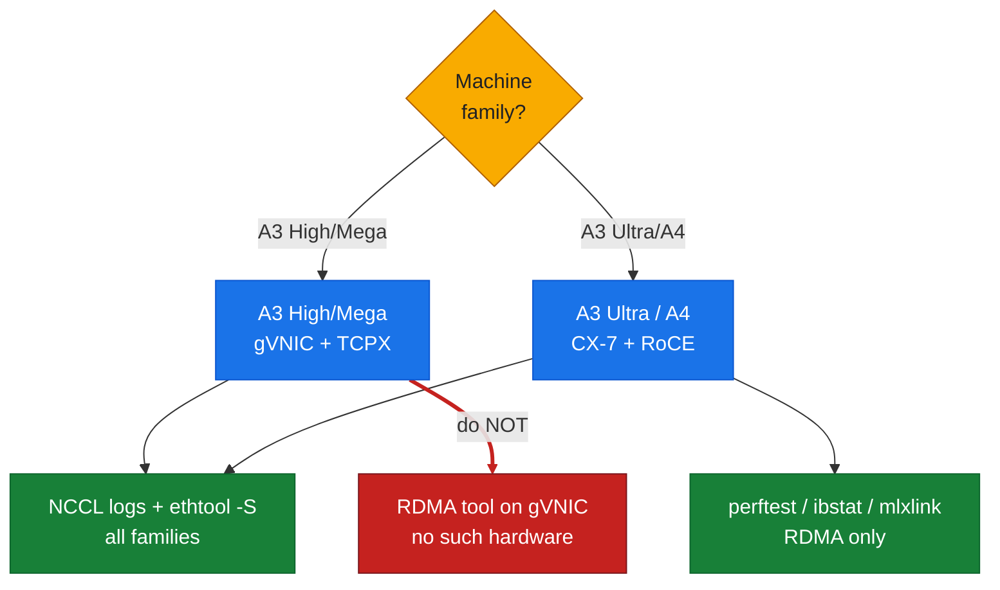
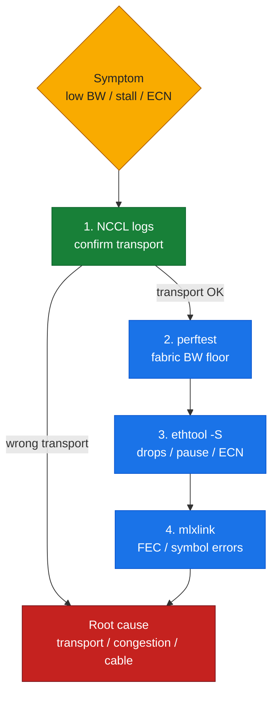

# T5: Networking and Fabric Tools

## Overview

This reference covers the **networking and fabric diagnostic tools** used to characterize, verify, and debug **inter-node GPU communication paths** — from transport-layer verification (NCCL debug logs, topology export) to physical-fabric measurements (RDMA microbenchmarks, NIC counters, RoCE/ECN statistics).

**Critical product context:** The GCP AI Hypercomputer GPU portfolio uses **different inter-node networking technologies** depending on machine family. Tools must be matched to the right family — reaching for an RDMA tool on a gVNIC node has no hardware to talk to.

*Figure: machine-family to tool-applicability tree — RDMA tools apply only on CX-7/RoCE families.*



| GCP machine family | GPU | Inter-node GPU networking | Fabric tools applicability |
| :--- | :--- | :--- | :--- |
| A3 High (`a3-highgpu-8g`) — **the lab** | H100 80GB | GPUDirect-**TCPX** (gVNIC) | NCCL logs, `ethtool`, gVNIC-specific counters |
| A3 Mega (`a3-megagpu-8g`) | H100 80GB | GPUDirect-**TCPXO** | NCCL logs, `ethtool`, TCPXO-specific counters |
| A3 Ultra (`a3-ultragpu-8g`) | H200 141GB | **RoCE / GPUDirect-RDMA** (CX-7) | NCCL logs, `perftest`, `ethtool`, `ibstat`, `mlxlink` |
| A4 (`a4-highgpu-8g`) | Blackwell B200 | RoCE / GPUDirect-RDMA | NCCL logs, `perftest`, `ethtool`, `ibstat`, `mlxlink` |

**Tagging convention:** Each tool below is tagged with its applicability:
- `[all families]` — applies universally (NCCL logs, gVNIC `ethtool` basics)
- `[RDMA families only]` — A3 Ultra (H200), A4 (B200) with Mellanox CX-7 NICs and RoCE
- `[A3 High/gVNIC]` — A3 High/Mega with gVNIC and TCPX/TCPXO

**Where this fits:** Used primarily in **Part II** (inter-node communication) to characterize the GPU network path and verify GPUDirect transports. Labs: **lab-05** (network path inspection), **lab-06** (NCCL collectives and transport verification).

---

## 1. NCCL Debug Logs — Transport and Topology Verification

### 1.1 Purpose

**NCCL debug logs** are the **primary source of truth** for understanding which transport NCCL selected (Socket vs NET/IB vs FastSocket/TCPX), the detected topology (intra-node NVLink graph, inter-node network paths), and the communication algorithms (ring, tree, collnet) that will be used.

**Applicability:** `[all families]` — every NCCL-backed workload (PyTorch DDP/FSDP, Megatron-LM, JAX/NCCL, TensorFlow/Horovod, native `nccl-tests`).

### 1.2 Enabling NCCL Debug Output

Set environment variables in your workload manifest or shell:

```bash
export NCCL_DEBUG=INFO
export NCCL_DEBUG_SUBSYS=INIT,NET,GRAPH
```

**What each controls:**
- `NCCL_DEBUG=INFO` — enables informational logging (default is `WARN`; `VERSION` logs only the NCCL version, `TRACE` is verbose).
- `NCCL_DEBUG_SUBSYS=INIT,NET,GRAPH` — restricts output to initialization, network plugin detection, and graph/algorithm selection. Omit to log all subsystems (very verbose).

For distributed workloads (e.g., `torchrun`), set these in the container spec (Kubernetes Pod `env:` section) or export them in the entrypoint script so **all ranks** emit logs.

### 1.3 Reading NCCL Logs — Key Patterns

#### Transport selection (Socket vs NET/IB vs FastSocket/TCPX)

Look for lines prefixed with `NCCL INFO NET/...` during initialization. Example patterns:

**Pattern 1: Socket transport (baseline TCP, no GPUDirect)**
```
NCCL INFO NET/Socket : Using [0]eth0:10.128.0.23<0>
NCCL INFO Using network Socket
```
→ NCCL is using the standard **Socket** plugin over the default network interface (`eth0`, gVNIC, or similar). **No GPUDirect** — data traverses host memory and kernel TCP stack.

**Pattern 2: NET/IB (RDMA/RoCE — A3 Ultra, A4)**
```
NCCL INFO NET/IB : Using [0]mlx5_0:1/RoCE [1]mlx5_1:1/RoCE ...
NCCL INFO Using network IB
```
→ Mellanox ConnectX (e.g., CX-7) NIC detected; NCCL is using **GPUDirect-RDMA over RoCE**. Data flows GPU → NIC without host CPU involvement.

**Pattern 3: GPUDirect-TCPX (A3 High, plugin DaemonSet installed)** — *measured, lab-18*
```
NCCL INFO Using network GPUDirectTCPX_v7
NCCL INFO NET/GPUDirectTCPX : ...            <- 920 lines across 16 ranks
grep -c 'NET/Socket' -> 0                     <- the number that matters
```
→ NCCL loaded the **GPUDirect-TCPX** plugin over the 4 dedicated GPU NICs (`eth1–eth4`). The
**payload still travels over host TCP sockets**; what GPUDirect removes is the *host memory*
bounce — the NIC DMAs to/from GPU HBM via dmabuf. Do **not** describe TCPX as "kernel bypass";
that is TCPXO/FasTrak (Pattern 4), and the distinction decides whether NIC counters can see
your traffic (§`ethtool` below).

**Pattern 4: GPUDirect-TCPXO / FasTrak (A3 Mega)** — *measured, lab-22*
```
NCCL INFO Using network FasTrak
NCCL INFO Initializing network FasTrak, version: 1.0.17
```
→ The FasTrak plugin over 8 GPU NICs, with a **userspace datapath**: this one genuinely bypasses
the kernel network stack.

> **`FastSocket` is a different, older thing.** GKE's NCCL Fast Socket is a TCP optimisation, not
> GPUDirect. If you see `NET/FastSocket` on an A3 High node you expected to be on TCPX, that is a
> **finding, not a success** — the GPUDirect plugin did not load.

#### Topology discovery

NCCL logs the detected **intra-node** and **inter-node** topology during `INIT`:

**Intra-node NVLink graph (HGX baseboard):**
```
NCCL INFO Channel 00/32 :    0   1   2   3   4   5   6   7
NCCL INFO Trees [0] -1/-1/-1->4->3 [1] -1/-1/-1->4->3
```
→ Shows the NVLink connectivity (ring and tree structures) among the 8 GPUs on a single node. On an HGX H100, all GPUs are fully connected via NVSwitch (detected by NCCL as a clique).

**Inter-node network paths:**
```
NCCL INFO Channel 00/32 :    0   8
NCCL INFO Ring 00 : 0[0] -> 8[100000] via NET/FastSocket
```
→ GPU 0 (local rank 0, node 0) communicates with GPU 8 (remote rank 0, node 1) via the **NET/FastSocket** transport. The bracketed values are NCCL's internal GPU numbering.

#### Algorithm selection (ring, tree, collnet)

```
NCCL INFO comm 0x... rank 0 nranks 16 cudaDev 0 busId 400000 - Init COMPLETE
NCCL INFO AllReduce: opCount 1 sendbuff 0x... recvbuff 0x... count 1048576 datatype 0 op 0 root 0 comm 0x... [nranks=16] stream 0x... COMPLETE
NCCL INFO Using 32 channels, 2 tree(s), 2 collnet graph(s)
```
→ NCCL allocated **32 channels** (bidirectional communication pipelines), **2 tree algorithms**, and **2 collnet graphs** (for collectives like AllReduce). More channels = higher bandwidth utilization (each channel uses a separate network connection).

### 1.4 Common Issues and Interpretation

| Log pattern | Interpretation | Action |
| :--- | :--- | :--- |
| `Using network Socket` on A3 High after TCPX DaemonSet install | TCPX library not loaded, path wrong, or the rail list is unset | Verify `libnccl-net.so` is in **`/usr/local/nvidia/lib64/`** (measured location), that `LD_LIBRARY_PATH` includes it, and that `NCCL_GPUDIRECTTCPX_SOCKET_IFNAME` names real NICs — TCPX ships **no** env-profile script to generate that list (G28) |
| DaemonSet `0 ready` but plugin actually installed | the idle `pause` sidecar's image 404s while the `initContainer` already `Completed` | Check **which container** is stuck before touching `nodeSelector` labels (G27/G30); the fabric may already be working |
| `ioctl get dma_buf frags: Inappropriate ioctl for device` → `gpu_tx_reg_mr failed -5` | plugin `:latest` is a 2023 build incompatible with an R580 driver | Pin `:v3.1.12`; note `NCCL_USE_DMA_BUF` is the real control (the `NCCL_GPUDIRECTTCPX_USE_DMABUF` spelling is silently ignored) — G29 |
| `NET/IB : No device found` on A3 Ultra | Mellanox drivers/libs missing | Verify `ibstat` shows active ports, install `libibverbs`, `librdmacm` |
| `Channel 00/32 : 0 8` but bandwidth lower than expected | Correct transport selected, but physical link degraded | Check `ethtool -S`, RoCE counters, or `perftest` results (see sections 4, 5) |
| No inter-node channels created (only intra-node GPUs listed) | Network unreachable or firewall blocking | Verify pod IPs routable, `nc -zv <peer-ip> 41000` succeeds |

---

## 2. NCCL Topology Dump — Exporting the Graph

### 2.1 Purpose

**`NCCL_TOPO_DUMP_FILE`** exports the **NCCL-detected topology graph** to an XML file. Useful for:
- Debugging why NCCL chose a suboptimal path or algorithm.
- Comparing expected vs. actual intra-node NVLink connectivity.
- Feeding the topology to NCCL simulators or tuning tools.

**Applicability:** `[all families]`.

### 2.2 Usage

Set the environment variable before launching the workload:

```bash
export NCCL_TOPO_DUMP_FILE=/tmp/nccl-topo-rank-%r.xml
```

The `%r` token is replaced with the **local rank** (0–7 on an 8-GPU node). Each rank writes its own topology file.

**Kubernetes Pod spec example:**
```yaml
env:
- name: NCCL_TOPO_DUMP_FILE
  value: "/tmp/nccl-topo-rank-%r.xml"
- name: NCCL_DEBUG
  value: "INFO"
- name: NCCL_DEBUG_SUBSYS
  value: "INIT,GRAPH"
```

### 2.3 Reading the Topology XML

The file is an XML graph with nodes for each **GPU**, **NIC**, **CPU**, and **PCI switch**, and edges representing **links** (NVLink, PCIe, network).

**Example fragment (schematic):**
```xml
<system version="1">
  <cpu numaid="0" affinity="0000ffff">
    <pci busid="0000:00:1f.0" class="0x060400" link_speed="32 GT/s" link_width="16">
      <gpu dev="0" sm="90" rank="0" gdr="1">
        <nvlink target="1" count="18" />
        <nvlink target="2" count="18" />
        ...
      </gpu>
    </pci>
    <pci busid="0000:00:1e.0" class="0x060400">
      <nic>
        <net name="eth0" speed="200000" port="0" gdr="1" />
      </nic>
    </pci>
  </cpu>
</system>
```

**Key fields:**
- `<gpu dev="0" gdr="1">` — GPU 0, **GPUDirect capable** (`gdr="1"` means the NIC or interconnect supports direct GPU memory access).
- `<nvlink target="1" count="18" />` — 18 NVLinks connect GPU 0 to GPU 1 (HGX H100: 18 NVLink 4.0 lanes via NVSwitch).
- `<net name="eth0" speed="200000" gdr="1" />` — NIC with 200 Gbps speed, GPUDirect enabled.

Compare this graph to the expected topology (e.g., HGX baseboard diagrams, GCP machine family specs) to detect missing NVLinks, PCIe bottlenecks, or GPUDirect disabled on NICs.

---

## 3. GPUDirect Verification Checklist

Use the tools in sections 1 and 2, combined with runtime inspection, to verify GPUDirect is active:

### 3.1 From NCCL Logs

1. **Transport line:** must say `NET/IB` (RDMA families) or `NET/FastSocket` (A3 High/Mega), not `NET/Socket`.
2. **`[GPU direct]` annotation** (FastSocket only) in the `Using [0]eth0:...` line.
3. **Inter-node channels created** (see `Channel 00/32 : 0 8` lines).

### 3.2 From Topology XML

- `gdr="1"` on the `<net>` element → NIC supports GPUDirect.
- `gdr="0"` → GPUDirect disabled or unavailable; NCCL will fall back to Socket.

### 3.3 From Kernel/System Inspection

**A3 Ultra/A4 (RDMA families):**
```bash
# Verify nvidia_peermem kernel module loaded (enables GPU memory registration for RDMA)
lsmod | grep nvidia_peermem
# Expected output: nvidia_peermem 16384 0

# Check RDMA device has GPU memory registered
ls /sys/class/infiniband/mlx5_0/device/
# Should include 'nvidia-peermem' symlink or reference
```

**A3 High/Mega (TCPX/gVNIC)** — paths below are the **measured** ones (lab-18), not the ones the
older GKE recipes suggest:
```bash
# Verify the plugin library the DaemonSet actually installed
ls -l /usr/local/nvidia/lib64/libnccl-net.so
# measured: -rwxr-xr-x 1 root root 14348008 ... libnccl-net.so   (plugin v3.1.12)

# Check LD_LIBRARY_PATH includes it
echo "$LD_LIBRARY_PATH" | tr ':' '\n' | grep -i nvidia

# The rails themselves (4 on A3 High, 8 on A3 Mega) — sysfs, since CUDA images lack iproute2
for i in /sys/class/net/eth*; do echo "$(basename $i) mtu=$(cat $i/mtu)"; done
# measured: eth0 mtu=1460 · eth1-4 mtu=8244

# TIER CHECK: TCPXO ships an env profile, TCPX does NOT (G28)
ls /usr/local/nvidia/lib64/*env* 2>/dev/null | wc -l    # 0 on TCPX is CORRECT
```

> **`/var/lib/tcpx` is not where the library lands** on the current installer — earlier drafts of
> this reference said it did. Check `/usr/local/nvidia/lib64/`.
> Logged as **D3** in [lab-build-gotchas.md](../../reference/lab-build-gotchas.md), alongside **D4**
> (this reference also used to describe a "FastSocket / TCPX" transport pattern that does not exist).

**Smoking-gun absence:** If NCCL logs show `NET/Socket` after you've installed TCPX or configured RDMA, GPUDirect is not active. Check DaemonSet logs, driver versions, and the verification steps above.

---

## 4. `perftest` — RDMA Fabric Microbenchmarks

### 4.1 Purpose and Applicability

**`perftest`** is a suite of **RDMA performance microbenchmarks** that measure raw bandwidth and latency over **InfiniBand or RoCE** transports, bypassing higher-level protocols (NCCL, MPI). Used to verify the physical fabric is delivering expected throughput and to detect cabling, congestion, or configuration issues.

**Applicability:** `[RDMA families only]` — A3 Ultra (H200 + CX-7 RoCE), A4 (B200 + CX-7 RoCE). **NOT applicable to A3 High/Mega** (gVNIC + TCPX/TCPXO is not RDMA — there is no `ibv_devinfo`, no `mlx5` device, and `NET/IB : No device found` is the *expected* line). Use an NCCL all-reduce over the fabric instead, as lab-18/lab-22 do.

**Common tools in the suite:**
- `ib_write_bw` — RDMA Write bandwidth test (one-sided, most common).
- `ib_read_bw` — RDMA Read bandwidth.
- `ib_send_bw` — RDMA Send bandwidth (two-sided, requires both sides to post receives).
- `ib_write_lat` / `ib_send_lat` — latency tests.

### 4.2 Installation (RDMA families)

```bash
# On Ubuntu/Debian (in container or node)
apt-get update && apt-get install -y perftest

# Verify
ib_write_bw --version
```

On GKE, install in a privileged Pod or DaemonSet with `hostNetwork: true` and access to the Mellanox NIC (`/dev/infiniband`).

### 4.3 Basic Usage — Two-Node Bandwidth Test

**Server (node 1):**
```bash
ib_write_bw -d mlx5_0 -i 1 -F --report_gbits
```
- `-d mlx5_0` — use RDMA device `mlx5_0` (the Mellanox CX-7 NIC; verify with `ibstat`).
- `-i 1` — port 1.
- `-F` — disable CPU frequency scaling check (often needed in cloud/VM environments).
- `--report_gbits` — report in Gbps instead of MB/s.

**Client (node 2):**
```bash
ib_write_bw -d mlx5_0 -i 1 -F --report_gbits <server-ip>
```

**Expected output (schematic):**
```
---------------------------------------------------------------------------------------
                    RDMA_Write BW Test
 Dual-port       : OFF          Device         : mlx5_0
 Number of qps   : 1            Transport type : IB
 Connection type : RC           Using SRQ      : OFF
 TX depth        : 128
 CQ Moderation   : 100
 Mtu             : 4096[B]
 Link type       : Ethernet
 GID index       : 3
 Outstand reads  : 16
 rdma_cm QPs     : OFF
 Data ex. method : Ethernet
---------------------------------------------------------------------------------------
 #bytes     #iterations    BW peak[Gb/sec]    BW average[Gb/sec]   MsgRate[Mpps]
 2          5000           0.32               0.31                 19.44
 4          5000           0.64               0.63                 19.69
 8          5000           1.28               1.26                 19.69
 ...
 1048576    5000           198.72             198.45               0.024
 2097152    5000           199.12             198.98               0.012
---------------------------------------------------------------------------------------
```

**Key fields:**
- **Message size** (`#bytes`): sweeps from small (2B) to large (2MB+).
- **BW peak/average:** achieved bandwidth in Gbps. For A3 Ultra/A4 with **200 Gbps CX-7 NICs**, expect ~**195–200 Gbps** at large message sizes (near line rate).
- **Transport type:** should be `IB` (even over RoCE — the RDMA verbs API is InfiniBand-derived).
- **Link type:** `Ethernet` confirms RoCE (RDMA over Converged Ethernet).

### 4.4 Interpreting Results

| Observed bandwidth | Interpretation | Action |
| :--- | :--- | :--- |
| ~200 Gbps (large messages) | Near line rate, fabric healthy | Baseline established |
| 150–190 Gbps | Possible congestion, ECN marking, or suboptimal MTU | Check `ethtool -S` for drops, `mlxlink` for errors, verify MTU=9000 |
| <100 Gbps | Severe issue: cabling, NIC degraded mode, or misconfiguration | Inspect `ibstat` for link state, `mlxlink` for physical errors, check switch logs |
| High latency (`ib_write_lat` >10 µs) | Congestion or CPU frequency scaling throttle | Check `ethtool -S` pause frames, verify CPU governor set to `performance` |

### 4.5 Caveats

- **`perftest` is a microbenchmark:** it saturates a single RDMA queue pair. Real workloads (NCCL, MPI) use many QPs and benefit from multi-path, so `perftest` results are a **floor, not a ceiling**.
- **Does not test GPU memory paths:** `perftest` uses host memory. For **GPU-to-GPU** bandwidth over RDMA, use **`nccl-tests`** with GPUDirect enabled (see `docs/toolkit/T4-benchmarking.md`).
- **Not a substitute for NCCL logs:** `perftest` confirms the fabric is capable, but does not verify NCCL selected the right transport. Always pair with NCCL debug logs (section 1).

---

## 5. `ethtool -S` — NIC Counters and Statistics

### 5.1 Purpose

**`ethtool -S <interface>`** dumps **per-NIC hardware counters** — packets/bytes transmitted/received, errors, drops, pause frames, and (on RoCE NICs) RDMA-specific counters (ECN marked packets, RoCE congestion events).

**Applicability:** `[all families]` — useful on **any** Ethernet-based NIC (gVNIC on A3 High/Mega, CX-7 on A3 Ultra/A4). The **set of counters** differs by NIC type (gVNIC exposes different counters than Mellanox).

### 5.2 Basic Usage

```bash
# Dump all counters for interface eth0 (gVNIC on A3 High/Mega)
ethtool -S eth0

# Dump counters for Mellanox NIC (A3 Ultra/A4)
ethtool -S eth1  # or eth2, eth3 — depends on NIC enumeration
```

**Typical output (gVNIC, schematic):**
```
NIC statistics:
     rx_packets: 1234567890
     rx_bytes: 9876543210000
     tx_packets: 1234567890
     tx_bytes: 9876543210000
     rx_dropped: 0
     tx_dropped: 0
     rx_errors: 0
     tx_errors: 0
     rx_queue_0_packets: 308641972
     tx_queue_0_packets: 308641972
     ...
```

**Typical output (Mellanox CX-7, RoCE, schematic):**
```
NIC statistics:
     rx_packets: 5000000000
     rx_bytes: 8000000000000
     tx_packets: 5000000000
     tx_bytes: 8000000000000
     rx_discards_phy: 0
     tx_discards_phy: 0
     rx_prio0_pause: 0
     tx_prio0_pause: 0
     rx_prio0_ecn_marked_pkts: 12345
     rx_out_of_buffer: 0
     roce_adp_retrans: 0
     roce_slow_restart: 0
     ...
```

### 5.3 Key Counters to Monitor

#### 5.3.1 General (all NICs)

| Counter | Meaning | Healthy value | Concern threshold |
| :--- | :--- | :--- | :--- |
| `rx_packets`, `tx_packets` | Total packets sent/received | Increasing during workload | — |
| `rx_bytes`, `tx_bytes` | Total bytes sent/received | Increasing during workload | — |
| `rx_dropped`, `tx_dropped` | Packets dropped (buffer overflow, congestion) | 0 | Any drops → investigate |
| `rx_errors`, `tx_errors` | Link-layer errors (CRC, alignment) | 0 | Any errors → physical issue |

#### 5.3.2 RoCE/RDMA-specific (Mellanox CX-7 on A3 Ultra/A4)

| Counter | Meaning | Healthy value | Concern threshold |
| :--- | :--- | :--- | :--- |
| `rx_prio0_pause`, `tx_prio0_pause` | PFC (Priority Flow Control) pause frames sent/received | 0 or low | High count → congestion |
| `rx_prio0_ecn_marked_pkts` | Packets with ECN (Explicit Congestion Notification) bit set | 0 or low | High count → congestion |
| `rx_out_of_buffer` | NIC ran out of receive buffers | 0 | Any → increase RX ring size or reduce traffic burst |
| `roce_adp_retrans` | RoCE adaptive retransmissions (congestion-triggered) | 0 or low | High → congestion or packet loss |
| `roce_slow_restart` | RoCE slow restart events (severe congestion) | 0 | Any → serious congestion |

#### 5.3.3 gVNIC-specific (A3 High/Mega)

gVNIC counters are **Google-specific** and less standardized. Key patterns to watch:
- `rx_queue_<n>_dropped` — per-queue drops (if non-zero, traffic exceeds queue capacity).
- `tx_timeout` — transmit timeout events (if non-zero, investigate kernel/driver logs).

### 5.4 Continuous Monitoring — Delta Over Time

Counters are **cumulative since boot or NIC reset**. To detect issues during a specific workload, **capture a before and after snapshot** and compute the delta:

```bash
# Before workload
ethtool -S eth1 > /tmp/nic-before.txt

# Run workload (e.g., nccl-tests AllReduce)

# After workload
ethtool -S eth1 > /tmp/nic-after.txt

# Compare (manually or with a script)
diff /tmp/nic-before.txt /tmp/nic-after.txt | grep -E 'pause|ecn|drop|error|retrans'
```

**Red flags in the delta:**
- **New drops or errors** → physical or congestion issue during the workload.
- **High ECN marked packets or pause frames** → network congestion (may be expected under heavy load, but sustained high values indicate tuning needed — see DCQCN/ECN tuning in Part II, section 05).
- **RoCE retransmissions** → packet loss or congestion (degrades latency and throughput).

---

## 6. `ibstat` and `mlxlink` — Mellanox NIC Physical Inspection

### 6.1 Purpose and Applicability

**`ibstat`** and **`mlxlink`** (part of **Mellanox Firmware Tools / MFT**) provide **low-level physical-layer diagnostics** for Mellanox NICs (ConnectX series). Use them to verify:
- Link state (up/down).
- Physical speed and width (e.g., 200 Gbps, 4×50G lanes).
- Firmware version.
- Physical-layer errors (symbol errors, FEC errors, link downed events).

**Applicability:** `[RDMA families only]` — A3 Ultra (H200 + CX-7), A4 (B200 + CX-7). **NOT present on A3 High/Mega** (gVNIC is a paravirtualized NIC; no Mellanox hardware or MFT tools).

### 6.2 Installation (RDMA families)

```bash
# On Ubuntu/Debian
wget https://www.mellanox.com/downloads/MFT/mft-<version>-x86_64-deb.tgz
tar -xzf mft-<version>-x86_64-deb.tgz
cd mft-<version>-x86_64-deb
./install.sh

# Start MFT service
mst start

# Verify
ibstat
mlxlink -d /dev/mst/mt4129_pciconf0 -e  # device path from `mst status`
```

On GKE, install in a privileged Pod with `hostNetwork: true` and access to `/dev/mst`.

### 6.3 `ibstat` — Quick Link Status

```bash
ibstat
```

**Example output:**
```
CA 'mlx5_0'
        CA type: MT4129
        Number of ports: 1
        Firmware version: 28.39.1002
        Hardware version: 0
        Node GUID: 0x506b4b03009e1234
        System image GUID: 0x506b4b03009e1234
        Port 1:
                State: Active
                Physical state: LinkUp
                Rate: 200 Gb/sec (4X HDR)
                Base lid: 0
                LMC: 0
                SM lid: 0
                Capability mask: 0x00010000
                Port GUID: 0x526b4b03009e1234
                Link layer: Ethernet
```

**Key fields:**
- **State: Active** — link is up and ready for traffic.
- **Rate: 200 Gb/sec (4X HDR)** — link speed. For CX-7 on A3 Ultra/A4, expect **200 Gbps** (4 lanes × 50 Gbps per lane).
- **Link layer: Ethernet** — confirms RoCE (not native InfiniBand).
- **Firmware version** — useful for support cases; check against Mellanox compatibility matrix.

**If State is not Active:**
- **Physical state: Polling** → link training in progress (wait, or check cabling).
- **Physical state: LinkDown** → no physical signal (check cable, switch port).

### 6.4 `mlxlink` — Detailed Physical-Layer Diagnostics

```bash
# Query device (identify PCIe device path first with `mst status`)
mst status
# Output: /dev/mst/mt4129_pciconf0  pci device: 0000:01:00.0 (ConnectX-7)

# Dump link info
mlxlink -d /dev/mst/mt4129_pciconf0 -e
```

**Example output (schematic):**
```
Operational Info
----------------
State                           : Active
Physical state                  : LinkUp
Speed                           : 200Gb/s (4x 50G)
Width                           : 4x
FEC mode (active)               : RS-FEC (544,514)
Auto Negotiation                : ON
Link Up Time                    : 2024-07-21 10:23:45

Errors and Counters
-------------------
Symbol errors                   : 0
Physical link downed            : 0
Effective errors                : 0
RS-FEC corrected blocks         : 12345
RS-FEC uncorrectable blocks     : 0
```

**Key fields:**
- **Speed / Width:** confirms the expected 200 Gbps (4×50G). If lower, check cable or switch port config.
- **FEC mode:** Forward Error Correction. **RS-FEC (544,514)** is standard for 200G/400G Ethernet. Corrected blocks > 0 is normal; **uncorrectable blocks > 0 indicates a failing link** (replace cable/transceiver).
- **Symbol errors / Link downed:** should be **0**. Non-zero → physical layer issue (bad cable, dirty connector, switch port problem).
- **Effective errors:** high-level error count (BER threshold crossings). Should be 0.

**Interpreting FEC counters:**
- **RS-FEC corrected blocks:** MODERATE count (< 10^6 over hours) is normal (FEC is doing its job, fixing occasional bit flips).
- **RS-FEC uncorrectable blocks > 0:** RED FLAG. The link is experiencing bit errors faster than FEC can correct. This degrades throughput and causes retransmissions. Action: replace cable, clean connectors, or contact support.

### 6.5 Continuous Monitoring

Capture `mlxlink` output before and after a workload, similar to `ethtool -S`:

```bash
# Before
mlxlink -d /dev/mst/mt4129_pciconf0 -e > /tmp/mlxlink-before.txt

# Run workload

# After
mlxlink -d /dev/mst/mt4129_pciconf0 -e > /tmp/mlxlink-after.txt

# Compare error counters
diff /tmp/mlxlink-before.txt /tmp/mlxlink-after.txt | grep -E 'error|downed|uncorrectable'
```

**If new errors appeared during the workload:** the physical link is degraded. Isolate the bad cable or port before proceeding.

---

## 7. Applicability Summary — Tool × Machine Family Matrix

| Tool | A3 High (gVNIC + TCPX — netdev counters **usable**) | A3 Mega (gVNIC + TCPXO — netdev counters **blind**) | A3 Ultra (CX-7 + RoCE) | A4 (CX-7 + RoCE) |
| :--- | :---: | :---: | :---: | :---: |
| **NCCL debug logs** (`NCCL_DEBUG=INFO`) | ✅ | ✅ | ✅ | ✅ |
| **NCCL topology dump** (`NCCL_TOPO_DUMP_FILE`) | ✅ | ✅ | ✅ | ✅ |
| **`ethtool -S`** (general counters) | ✅ | ✅ | ✅ | ✅ |
| **`ethtool -S`** (RoCE/ECN counters) | ❌ | ❌ | ✅ | ✅ |
| **`perftest`** (`ib_write_bw`, etc.) | ❌ | ❌ | ✅ | ✅ |
| **`ibstat`** | ❌ | ❌ | ✅ | ✅ |
| **`mlxlink`** | ❌ | ❌ | ✅ | ✅ |

**Legend:**
- ✅ — Tool is applicable and useful.
- ❌ — Tool is not applicable (hardware/driver not present).

**Key takeaway:** When characterizing a GCP GPU cluster, **first identify the machine family** (check `gcloud compute instances describe <node>`), then apply the matching tools. Using RDMA tools (`perftest`, `ibstat`, `mlxlink`) on A3 High/Mega will fail (no InfiniBand/RoCE hardware); using them on A3 Ultra/A4 is essential.

---

## 8. Workflow — Fabric Characterization and Debugging

### 8.1 Initial Characterization (Part of Lab-05)

1. **Identify machine family and NIC type:**
   ```bash
   # On GKE node
   curl -H "Metadata-Flavor: Google" http://metadata.google.internal/computeMetadata/v1/instance/machine-type
   # Returns: projects/<project>/machineTypes/a3-highgpu-8g (or a3-ultragpu-8g, etc.)
   
   # List network interfaces
   ip link show
   lspci | grep -i network
   ```

2. **Check for the GPUDirect plugin DaemonSet (A3 High/Mega):**
   ```bash
   kubectl get ds -n kube-system | grep -E 'tcpx|tcpxo|fastsocket'
   ls -l /usr/local/nvidia/lib64/libnccl-net.so     # in-Pod: where it really lands
   ```
   If the DaemonSet shows `0 ready`, find out **which container** is stuck before blaming labels —
   a dead `pause` sidecar leaves the plugin correctly installed (G27/G30). Better: run
   `scripts/verify_gpu_fabric.sh`, which now discriminates the two cases.

3. **Check for RDMA devices (A3 Ultra/A4):**
   ```bash
   ibstat  # should list mlx5_0, mlx5_1, etc.
   ls /dev/infiniband/
   ```

4. **Run a minimal NCCL test with debug logs:**
   ```bash
   export NCCL_DEBUG=INFO
   export NCCL_DEBUG_SUBSYS=INIT,NET,GRAPH
   # Launch nccl-tests AllReduce across 2 nodes (lab-06)
   ```

5. **Confirm transport from logs:**
   - Look for `Using network Socket` vs `FastSocket` vs `IB`.
   - If wrong transport selected, revisit DaemonSet install or RDMA config.

### 8.2 Performance Validation (Part of Lab-05 or Lab-06)

**For RDMA families (A3 Ultra/A4):**
1. Run `ib_write_bw` between two nodes (section 4). Expect ~195–200 Gbps.
2. Capture `ethtool -S` and `mlxlink` snapshots before/after a `nccl-tests` run (sections 5, 6).
3. Check for drops, errors, ECN marks, FEC uncorrectable blocks.

**For A3 High/Mega (gVNIC + TCPX)** — done for real in [lab-18](../../labs/lab-18-enable-gpudirect-tcpx/):
the before/after is **23.70 → 83.27 GB/s** busbw at 16 GPUs (**3.5×**), with `GPUDirectTCPX_v7`
and zero `NET/Socket` lines. Steps:
1. Run the all-reduce with TCPX enabled, capture NCCL logs.
2. Capture `ethtool -S eth0` before/after, check for drops/errors.
3. Compare bus bandwidth (`nccl-tests` busbw output) with and without TCPX to quantify speedup.

### 8.3 Debugging Workflow (When Bandwidth Is Low or NCCL Stalls)

The golden rule is start high and drill down: confirm the transport with NCCL logs first, then descend to the fabric layer only if needed.

*Figure: fabric-debug drill-down — start at NCCL logs, descend to perftest, ethtool, mlxlink.*



| Symptom | Root cause candidates | Tools to use |
| :--- | :--- | :--- |
| NCCL selects Socket instead of TCPX/RDMA | DaemonSet not installed, lib path wrong, rail list unset | NCCL logs, `ls /usr/local/nvidia/lib64/`, `LD_LIBRARY_PATH`, `env \| grep NCCL_GPUDIRECTTCPX` |
| Low inter-node bandwidth (< 50% expected) | Physical link degraded, congestion, wrong transport | `perftest`, `ethtool -S`, `mlxlink`, NCCL logs |
| NCCL AllReduce stalls (hangs) | Firewall blocking, routing broken, NIC down | NCCL logs (look for "Connection refused"), `ping`, `nc -zv`, `ibstat` |
| High latency, pause frames, ECN marks | Network congestion (oversubscribed, no ECN tuning) | `ethtool -S` (RoCE counters), `mlxlink`, switch logs (if accessible) |
| Gradual bandwidth degradation over time | FEC uncorrectable blocks accumulating, cable failing | `mlxlink` (capture over time), replace cable |

**Golden rule:** Start with **NCCL logs** (section 1) to confirm the transport. Then drill down to the fabric layer (`perftest`, `ethtool`, `mlxlink`) to isolate physical or congestion issues.

---

## 9. Limitations and Forward References

### 9.1 Missing Measurements (Lab Backfill)

This reference describes the **format and interpretation** of NCCL logs, `perftest` output, and NIC counters. **Actual measured values from the live GKE A3 High cluster** (e.g., TCPX transport lines, `ethtool -S` delta during a `nccl-tests` run) will be captured during:
- **Lab-05** (network path inspection) — characterizes gVNIC, verifies TCPX, captures baseline `ethtool -S`.
- **Lab-06** (NCCL collectives) — runs `nccl-tests` with NCCL debug logs, confirms transport selection, measures inter-node bandwidth.

Lab outputs are **referenced here as forward pointers** (not inlined) to avoid circular dependencies. Once labs are complete, this doc will link to specific log excerpts and counter snapshots in the lab artifacts.

### 9.2 GCP-Managed Fabric Visibility

On GCP, the **physical switches, routers, and Titanium offload layer** are **not tenant-visible**. You **cannot** access:
- Switch CLI or counters (e.g., ToR switch logs, ECMP path selection).
- Titanium offload metrics (Google's host-offload layer).
- End-to-end fabric topology (Google does not publish it).

**What you CAN observe:**
- NIC-level counters (`ethtool -S`, `mlxlink`) on the VM.
- NCCL's view of the topology (via topology dump and logs).
- Application-level metrics (NCCL bandwidth, latency, stall events).

**Contrast:** On a **DGX SuperPOD** (Part IV), you have full access to **Spectrum-X switches** (Mellanox CLI, What-Just-Happened telemetry, DCQCN ECN tuning) and **Fabric Manager** (system-wide topology, health checks). This is explored in **Part IV, sections 13–14**.

---

## 10. Practice

**Hands-on exercises for these tools appear in:**
- **Lab-05** (`labs/lab-05-network-path-inspect/`) — Identify NIC type, verify TCPX DaemonSet, capture `ethtool -S` baseline, export NCCL topology.
- **Lab-06** (`labs/lab-06-nccl-collectives/`) — Run `nccl-tests` with `NCCL_DEBUG=INFO`, interpret transport selection, measure inter-node bandwidth, compare Socket vs TCPX (if both are available).

For **RDMA-family exercises** (A3 Ultra/A4 with `perftest`, `ibstat`, `mlxlink`), refer to **Part II, section 05** (supplemental exercises) or the **DGX fabric troubleshooting lab** in **Part IV, section 13** (when contrasting GCP gVNIC vs. DGX Spectrum-X).

---

## 11. References

- **NCCL documentation:** [https://docs.nvidia.com/deeplearning/nccl/](https://docs.nvidia.com/deeplearning/nccl/)
  - Environment variables: `NCCL_DEBUG`, `NCCL_DEBUG_SUBSYS`, `NCCL_TOPO_DUMP_FILE`, `NCCL_IB_*`, `NCCL_NET`, `NCCL_SOCKET_*`.
  - Tuning guide (Part II, section 06).
- **perftest:** [https://github.com/linux-rdma/perftest](https://github.com/linux-rdma/perftest)
  - Part of `libibverbs` ecosystem; precompiled in most RDMA distributions.
- **Mellanox Firmware Tools (MFT):** [https://network.nvidia.com/products/adapter-software/firmware-tools/](https://network.nvidia.com/products/adapter-software/firmware-tools/)
  - Includes `mlxlink`, `mlxconfig`, `flint`, etc.
- **ethtool man page:** `man ethtool` — see `-S` (statistics), `-i` (driver info), `-g` (ring sizes).
- **GCP GPUDirect-TCPX documentation:** [https://cloud.google.com/kubernetes-engine/docs/how-to/gpu-bandwidth-gpudirect-tcpx](https://cloud.google.com/kubernetes-engine/docs/how-to/gpu-bandwidth-gpudirect-tcpx)
- **Cross-platform portability matrix:** `docs/toolkit/T6-portability-matrix.md` (maps GCP families to DGX/bare-metal equivalents).

---

**Next:** Proceed to **Part II — Inter-node Communication** (`docs/part2-inter-node/05-nic-rdma-gpudirect.md`) to learn the **mechanism** behind these tools, then practice them in **lab-05** and **lab-06**.
