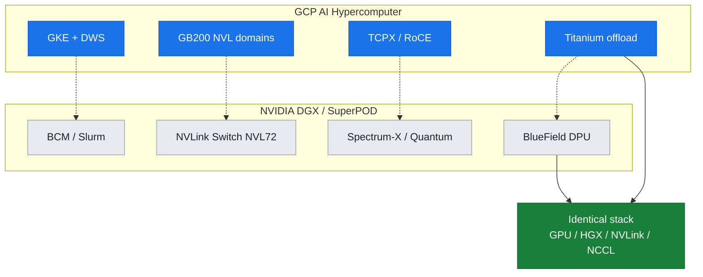
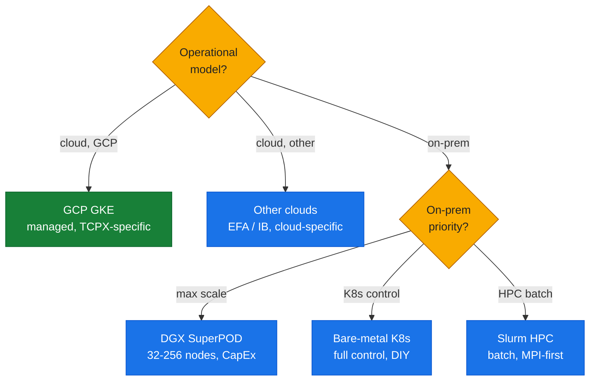

# T6: Portability Matrix — Cross-Platform NVIDIA GPU Infrastructure

**Purpose:** This reference maps each GPU infrastructure capability and tool across major deployment platforms, showing the concrete mechanism each platform provides for driver installation, monitoring, networking, scheduling, and orchestration. The matrix makes the guide's concepts platform-agnostic — what you learn on GCP A3 translates directly to on-prem DGX/HGX systems, bare-metal Kubernetes, Slurm clusters, and other clouds.

This document also carries the **GCP ↔ NVIDIA product mapping** that threads through the guide, especially Part IV, so readers can correctly attribute capabilities to the right product on both sides.

---

## 1. Platform Capability Matrix

The table below maps each infrastructure capability (rows) to the concrete mechanism provided by each platform (columns). For detailed tool documentation, see the cross-referenced toolkit docs [T1](./T1-monitoring-inventory.md)–[T5](./T5-networking-fabric-tools.md).

| Capability / Tool | GCP A3 / A4 (GKE) | On-Prem DGX / HGX Systems | Bare-Metal Kubernetes | Slurm HPC Clusters | Other Clouds (AWS, Azure) |
|:---|:---|:---|:---|:---|:---|
| **Driver Install & Management** | GKE **device-plugin DaemonSet** + GPU driver installer DaemonSet (managed by GKE control plane; specific driver version pinned per GKE release) | **DGX OS** (pre-installed, managed drivers; NVIDIA Update Manager for updates) or manual install via `apt` / `.run` on non-DGX | **NVIDIA GPU Operator** (DaemonSet-based driver container; auto-upgrades; DCGM/device-plugin/GFD bundled) | Site-managed driver modules (often via `module load` environment; admin pre-installs drivers on compute nodes; may use GPU Operator on K8s-based Slurm) | Cloud-managed images (AWS Deep Learning AMI, Azure NC-series GPU images) or GPU Operator for EKS/AKS |
| **GPU Inventory & Monitoring** | `nvidia-smi`, DCGM (`dcgmi`, device-plugin metrics), GKE-native `kubectl describe node` (extended resource `nvidia.com/gpu`) | `nvidia-smi`, **NVSM** (NVIDIA System Management on DGX; enterprise GUI + CLI), DCGM, **Base Command Manager** (fleet-scale DGX orchestration & monitoring) | `nvidia-smi`, DCGM, GPU Operator metrics, Node Feature Discovery (NFD labels) | `nvidia-smi`, `sinfo` / `scontrol show node` (Slurm gres GPU visibility), site Prometheus/Grafana + dcgm-exporter | Cloud provider GPU dashboards (CloudWatch, Azure Monitor) + `nvidia-smi`, DCGM |
| **Health Diagnostics** | DCGM diagnostics (`dcgmi diag -r 3`), `nvidia-smi` queries (`-q -d TEMPERATURE,POWER,ECC`), `nvidia-bug-report.sh` | DCGM, **NVSM health checks** (automated + on-demand system validation), `nvidia-smi`, DGX-specific BMC/IPMI sideband monitoring, **GPU Fabric Manager** logs (NVLink/NVSwitch health) | DCGM, `nvidia-smi`, GPU Operator health-check DaemonSets, `nvidia-bug-report.sh` | DCGM, `nvidia-smi`, site monitoring scripts, Slurm prolog/epilog health checks (e.g., GPU burn-in before job start) | DCGM, `nvidia-smi`, cloud instance health checks |
| **Profiling & Tracing** | Nsight Systems (`nsys`), Nsight Compute (`ncu`), PyTorch Profiler / Kineto, NVTX annotations (all run in user containers; no platform-specific layer) | Same (Nsight Systems/Compute, PyTorch Profiler, NVTX) — DGX may pre-install toolkits; **Base Command Manager** can orchestrate profiling jobs | Same (Nsight, PyTorch Profiler, NVTX) — user brings profiler binaries or installs via GPU Operator | Same (Nsight, PyTorch Profiler, NVTX) — often via `module load` for Nsight; Slurm job submission captures profiles | Same (cloud-agnostic tooling; user installs in container/AMI) |
| **Intra-Node Fabric (NVLink/NVSwitch)** | **HGX H100 baseboard** (gen4 NVLink, 4th-gen NVSwitch; ~900 GB/s bisection BW; 8-GPU full-mesh) on A3 High/Mega/Ultra; **HGX B200** on A4; **GB200 NVL** domains on A4X | **HGX baseboard** (same as GCP A3/A4) on DGX H100/H200; **DGX Fabric Manager** manages NVLink/NVSwitch topology & health (not exposed to GCP tenants); **NVLink Switch System / GB200 NVL72** on DGX B200/GB200 SuperPODs | Depends on server hardware (HGX-based servers use NVLink/NVSwitch; verify via `nvidia-smi topo -m`; no Fabric Manager unless DGX OS installed) | Same (HGX-based compute nodes have NVLink; `nvidia-smi topo` shows topology; may lack Fabric Manager outside DGX) | HGX-based instances (AWS P5, Azure ND H100 v5) use NVLink/NVSwitch; cloud does not expose Fabric Manager |
| **Inter-Node Networking — NICs** | A3 High/Mega: **gVNIC** (Google Virtual NIC; 200 Gbps per VM); A3 Ultra/A4/A4X: **Mellanox ConnectX-7** (RoCE-capable; 400 Gbps) | **Mellanox/NVIDIA ConnectX NICs** (ConnectX-6/7 on DGX H100/H200; InfiniBand or Ethernet modes); **BlueField-3 SuperNICs** (DPU-accelerated; on newer DGX systems & SuperPODs) | Depends on hardware (ConnectX-5/6/7 common; InfiniBand or RoCE Ethernet; admin-configured) | ConnectX NICs (often InfiniBand for HPC; `ibstat`/`ibv_devinfo` show IB devices); fabric-specific tuning via site admins | Cloud provider NICs (AWS EFA on P5, Azure InfiniBand on ND-series, GCP gVNIC/CX-7) |
| **Inter-Node Networking — RDMA/GPUDirect** | A3 High/Mega: **GPUDirect-TCPX** / **TCPXO** (rxdm offload to GCP Titanium; NCCL plugin `libnccl-net.so`); A3 Ultra/A4: **GPUDirect-RDMA over RoCE** (ConnectX-7); NCCL Fast Socket DaemonSet for TCPX (when enabled) | **GPUDirect-RDMA over InfiniBand** or **Spectrum-X RoCE Ethernet** (ConnectX/BlueField NICs); NCCL auto-detects via `NCCL_IB_*` / `NCCL_NET` (often no plugin needed for native IB; SHARP plugin for in-network reduction on Quantum IB) | GPUDirect-RDMA (if InfiniBand/RoCE NICs + MLNX_OFED / MOFED drivers installed); NCCL sees via `NCCL_IB_HCA`; verify with `ibv_devinfo`, `perftest` (`ib_write_bw`) | GPUDirect-RDMA over InfiniBand (standard HPC fabric); MOFED drivers; NCCL `NCCL_IB_*` tuning; site may provide NCCL topology files | Cloud-specific GPUDirect (AWS EFA uses `libnccl-plugin-efa.so`, Azure uses native RDMA, GCP uses TCPX/TCPXO plugins or RoCE) |
| **NCCL Collectives** | NCCL (bundled in PyTorch/TensorFlow containers); GCP-specific **NCCL TCPX/TCPXO plugins** (`libnccl-net.so` from `nccl-plugin-*` DaemonSets) on A3 High/Mega; native NCCL on A3 Ultra/A4 (RoCE) | NCCL (often latest via DGX containers or NVIDIA NGC); **NCCL SHARP plugin** for in-network all-reduce on Quantum InfiniBand; native IB support (no plugin needed for basic RDMA) | NCCL (user brings version in container/pip); may use IB transport (no plugin) or admin-provided NCCL plugin for fabric-specific optimization | NCCL (user module or container); InfiniBand transport (`NCCL_IB_*`); site may tune `NCCL_TOPO_FILE` for custom topology | NCCL + cloud-specific plugins (AWS `libnccl-plugin-efa.so`, Azure native, GCP TCPX/TCPXO) |
| **Benchmarking Tools** | `nccl-tests` (user runs in job), `perftest` (`ib_write_bw`, etc. — if IB/RoCE), `nvbandwidth` (intra-node P2P), GPU microbenchmarks (GEMM, `gpu-burn`) — all in user containers | Same (NCCL-tests, perftest, nvbandwidth, CUDA samples) — DGX may pre-install; **Base Command Manager** can orchestrate benchmark jobs fleet-wide | Same (user installs in container or via package manager) | Same (often via `module load` for NCCL-tests, perftest; Slurm job submission) | Same (cloud-agnostic; user brings binaries) |
| **Job Scheduling & Orchestration** | **GKE + JobSet + Kueue** (gang scheduling, multi-pod jobs); **Dynamic Workload Scheduler (DWS)** for GPU capacity reservation & auto-provisioning; Kubernetes extended resources (`nvidia.com/gpu`) | **Base Command Manager** (DGX orchestration & job queueing; integrates with Slurm/K8s); **Run:ai** (K8s-native GPU scheduler for DGX); or standalone **Slurm** (gres GPU scheduling); or bare K8s with GPU Operator | Kubernetes + **Kueue / Volcano / YARN** (gang scheduling); GPU Operator for device-plugin; taints/tolerations for GPU nodes | **Slurm** with `gres` (Generic RESource scheduling for GPUs); `srun`/`sbatch` with `--gres=gpu:N`; prolog/epilog scripts for health checks; gang scheduling via `salloc` / `sbatch --exclusive` | Cloud-managed K8s (EKS, AKS, GKE) + Kueue/JobSet, or cloud batch services (AWS Batch GPU jobs, Azure Batch), or self-managed Slurm on cloud VMs |
| **Topology Awareness & Placement** | GKE topology hints (node affinity/anti-affinity); DWS placement policy; `nvidia-smi topo -m` (intra-node); NCCL auto-discovers inter-node topology (no tenant-visible NCCL topology file on GCP A3) | NCCL topology files (generated by DGX admins or **BCM/NVSM** for rail-optimized DGX SuperPOD fabrics); Slurm topology plugin (for hierarchical scheduling); **GPU Fabric Manager** provides NVLink/NVSwitch topology | Node Feature Discovery (NFD) labels GPU/NIC topology on K8s nodes; admin-provided NCCL topology files; K8s topology-aware scheduling (zone/rack labels) | Slurm topology plugin (hierarchical tree: nodes → switches → racks); `NCCL_TOPO_FILE` for custom fabric topology; admin-managed | Cloud-provider placement groups (AWS cluster placement groups, Azure proximity placement groups); NCCL topology auto-discovery or cloud-provided topo files |
| **Fleet Observability & Metrics** | **dcgm-exporter** DaemonSet → Prometheus → Grafana (GPU metrics); GKE Monitoring & Logging (Cloud Logging for pod logs, Cloud Monitoring for node/GPU metrics); `kubectl top nodes` | **NVSM** (DGX fleet health GUI + API); **Base Command Manager** (centralized logs, metrics, alerts for DGX clusters); dcgm-exporter + Prometheus/Grafana (self-hosted or via BCM) | dcgm-exporter + Prometheus + Grafana (self-hosted); Kubernetes metrics-server (`kubectl top`); centralized logging (Fluentd/ELK, Loki) | Site Prometheus/Grafana + dcgm-exporter (if DaemonSet-based) or Slurm epilog metric collection; centralized syslog; Slurm accounting database (`sacct` for job metrics) | Cloud-native monitoring (CloudWatch, Azure Monitor, GCP Cloud Monitoring) + dcgm-exporter/Prometheus |

**Note:** The mechanisms are **functionally equivalent** across platforms — the **concepts** (driver management, DCGM diagnostics, NCCL collectives, gang scheduling) are the same; only the **concrete product or tool** differs. For detailed usage of each tool, see [T1](./T1-monitoring-inventory.md)–[T5](./T5-networking-fabric-tools.md).

---

## 2. GCP ↔ NVIDIA Product Mapping

This mapping threads through the entire guide (especially Part IV) and makes explicit which GCP AI Hypercomputer component corresponds to which NVIDIA purpose-built platform product. **Both sides are production-grade**; the architecture and trade-offs differ, but the core GPU/NVLink/NCCL stack is identical.

*Figure: GCP and NVIDIA stacks aligned by layer — the layers differ, the base GPU/HGX/NVLink/NCCL stack is identical.*

| Infrastructure Layer | GCP AI Hypercomputer (A3 / A4 families) | NVIDIA Purpose-Built Platform (DGX / SuperPOD) |
|:---|:---|:---|
| **Host & Network Offload** | **Titanium** (Google's custom offload & network virtualization; handles IPsec, load balancing, and fabric rx/tx offload; not GPU-aware but enables TCPX plugin) | **BlueField DPU** (NVIDIA data processing unit; ARM-based SmartNIC running DOCA software; offloads networking, storage, security; GPU-aware via DOCA GPUNetIO) or **BlueField-3 SuperNIC** (DPU-accelerated NIC on DGX B200 & newer) |
| **Inter-Node GPU Networking** | A3 High/Mega: **GPUDirect-TCPX** (rxdm to Titanium; 200 Gbps gVNIC; NCCL plugin) and **GPUDirect-TCPXO** (the optimized "FasTrak" variant — 8 GPU NICs vs TCPX's 4, `NCCL_FASTRAK_*` env family, `NET/FasTrak` transport; A3 Mega only; **measured 317.84 GB/s busbw @ 16 GPU** in lab-22) A3 Ultra/A4/A4X: **GPUDirect-RDMA over RoCE** (ConnectX-7; 400 Gbps Ethernet; standard RDMA stack) | **Spectrum-X Ethernet** (Spectrum-4 switches + BlueField-3 SuperNIC; adaptive routing, RoCE congestion control, GPU-optimized) or **Quantum InfiniBand** (rail-optimized HDR/NDR IB fabric; 400/800 Gbps per port; **SHARP** in-network all-reduce aggregation offload) |
| **Intra-Node NVLink Scale-Up Domains** | A4X: **GB200 NVL domains** (Grace-Blackwell NVLink domains; NVLink connects CPU+GPU; 72-GPU NVLink fabrics via NVLink Switch System on Google side; architecture mirrors NVIDIA NVL72 but Google-managed) | **NVLink Switch System** (external NVLink switches connecting multiple GPU baseboards into a single NVLink domain; e.g., **GB200 NVL72** = 72 Blackwell GPUs in one coherent NVLink fabric, ~130 TB/s bisection BW) on DGX B200 / SuperPOD |
| **Cluster Orchestration & Scheduling** | **GKE** (Google Kubernetes Engine; managed K8s control plane) + **JobSet** (Kubernetes multi-pod job CRD) + **Kueue** (gang scheduling, queue management) + **Dynamic Workload Scheduler (DWS)** (GCP-specific GPU capacity reservation & auto-provisioning with 7-day holds) | **Base Command Manager (BCM)** (NVIDIA's DGX orchestration & fleet management; job scheduler, health monitor, firmware/driver updates) or **Run:ai** (K8s-native GPU scheduler for multi-tenant DGX clusters) or **Slurm** (HPC job scheduler with GPU `gres` support; common on DGX SuperPOD for research clusters) |
| **Managed GPU Drivers & Device Plugins** | GKE **device-plugin DaemonSets** (automatic GPU discovery, `nvidia.com/gpu` extended resource, driver installer DaemonSet managed by GKE control plane; pinned driver versions per GKE release) | **NVIDIA GPU Operator** (Kubernetes operator; DaemonSet-based driver container, device-plugin, DCGM, Node Feature Discovery; auto-upgrades; used on bare-metal K8s or non-DGX systems) or **DGX OS** (pre-installed drivers, NVSM, Fabric Manager; integrated stack on DGX systems; no Operator needed) |
| **GPU Fabric Management (NVLink/NVSwitch Health)** | Not exposed to tenants (Google-managed; HGX baseboard present but **GPU Fabric Manager** not visible in user namespace; NVLink health monitored by GCP control plane) | **GPU Fabric Manager** (user-space daemon on DGX; manages NVLink/NVSwitch topology, health, error handling; logs available via `nv-fabricmanager` service; integrated with NVSM on DGX H100/H200) |
| **System-Level Health & Management** | GKE node health checks (kubelet, node-problem-detector); Cloud Monitoring (metrics, logs); no tenant access to BMC/IPMI (Google-managed) | **NVSM** (NVIDIA System Management Interface; GUI + CLI for DGX fleet health, firmware, BIOS, BMC/IPMI sideband monitoring, NVLink/NVSwitch health, power/thermal) on DGX systems; **Base Command Manager** for fleet-wide orchestration & alerts |

**Key takeaway:** GCP A3/A4 and NVIDIA DGX/SuperPOD **share the same GPU (H100/H200/B200), HGX baseboard, NVLink/NVSwitch fabric, and NCCL software stack** — the performance, algorithms, and collective behavior are identical at that layer. The **differences are in host/fabric offload, multi-node networking, system management visibility, and orchestration** — GCP uses Titanium+gVNIC/TCPX or ConnectX-7/RoCE + GKE/DWS; NVIDIA DGX uses BlueField+Spectrum-X/Quantum + BCM/Slurm. Both are production-grade; the choice depends on cloud-managed vs on-prem operational models.

---

## 3. GCP Machine Family Matrix

The table below shows which GCP AI Hypercomputer machine family uses which networking stack, so readers can map the guide's TCPX vs RDMA discussions to the correct instance type.

| GCP Machine Family | Instance Type | GPU | GPU Count | Inter-Node GPU Networking | Use in This Guide |
|:---|:---|:---|:---:|:---|:---|
| **A3 High** | `a3-highgpu-8g` | H100 80GB | 8 | **GPUDirect-TCPX** (gVNIC 200 Gbps; rxdm offload to Titanium; NCCL plugin `libnccl-net.so` from `nccl-plugin-gpudirecttcpx` DaemonSet) | **Live lab** (Parts I–III measured on this; Part II characterizes TCPX path; Part IV contrasts with DGX) |
| **A3 Mega** | `a3-megagpu-8g` | H100 80GB | 8 | **GPUDirect-TCPXO** (TCPX-optimized "FasTrak" variant; 8 GPU NICs vs TCPX's 4; `NCCL_FASTRAK_*` env family; plugin image `nccl-plugin-gpudirecttcpx-dev` in the `gpudirect-tcpxo` repo — **not** `...gpudirecttcpxo`, which does not exist) | **Live lab, MEASURED** (lab-22 — 8 GPU NICs on-node, `NET/FasTrak`, **317.84 GB/s busbw @ 16 GPU** = **≈13.4×** the single-gVNIC path; Part II/III contrast vs TCPX) |
| **A3 Ultra** | `a3-ultragpu-8g` | H200 141GB | 8 | **GPUDirect-RDMA over RoCE** (Mellanox ConnectX-7; 400 Gbps Ethernet; standard RDMA/MOFED stack; NCCL native IB transport) | Part II fabric contrast (RoCE vs TCPX; H200 HBM3e) + Part IV (maps to Spectrum-X) |
| **A4** | `a4-highgpu-8g` | B200 (Blackwell) | 8 | **GPUDirect-RDMA over RoCE** (ConnectX-7; 400 Gbps; same as A3 Ultra) | Part I architecture (Blackwell vs Hopper) + Part IV |
| **A4X** | `a4x-highgpu-4g` | GB200 (Grace-Blackwell) | 4 per node (part of larger NVLink domain) | **GPUDirect-RDMA over RoCE** (ConnectX-7) + **NVLink domain** (multi-node NVLink via NVLink Switch System; Google-managed) | Part IV (NVLink Switch System / GB200 NVL72 architecture; Grace CPU coherency) |

**Note:** All families use the **same HGX baseboard architecture** (8-GPU NVLink/NVSwitch fabric on A3/A4; NVLink domains on A4X) for intra-node communication. The **inter-node** path differs: TCPX/TCPXO (A3 High/Mega) uses a GCP-specific NCCL plugin and gVNIC; RoCE (A3 Ultra/A4/A4X) uses standard RDMA over ConnectX-7 NICs, mapping directly to NVIDIA Spectrum-X Ethernet or InfiniBand concepts.

---

## 4. Cross-Platform Toolkit Quick Reference

For hands-on usage of each tool, see the detailed toolkit docs:

- **[T1: Monitoring & Inventory](./T1-monitoring-inventory.md)** — `nvidia-smi`, DCGM, NVML, device topology, extended resources.
- **[T2: Health Diagnostics](./T2-health-diagnostics.md)** — DCGM diagnostics, XID codes, thermal/power/ECC monitoring, `nvidia-bug-report.sh`.
- **[T3: Profiling & Tracing](./T3-profiling-tracing.md)** — Nsight Systems (`nsys`), Nsight Compute (`ncu`), PyTorch Profiler, NVTX, Holistic Trace Analysis.
- **[T4: Benchmarking](./T4-benchmarking.md)** — `nccl-tests`, `nvbandwidth`, `perftest`, GPU microbenchmarks (GEMM, `gpu-burn`).
- **[T5: Networking & Fabric Tools](./T5-networking-fabric-tools.md)** — `perftest` (IB/RoCE BW tests), `ethtool`, `ibstat`/`ibv_devinfo`, NCCL debug flags, topology files.

---

## 5. Platform-Specific Quickstart Commands

Below are the platform-specific commands to accomplish common tasks, so you can translate what you learn on one platform to another.

### Check GPU inventory

| Platform | Command |
|:---|:---|
| All | `nvidia-smi -L` (lists all GPUs) |
| GKE | `kubectl get nodes -o json \| jq '.items[].status.capacity["nvidia.com/gpu"]'` |
| Slurm | `sinfo -o "%N %G"` (shows nodes + gres GPU count) |
| Bare K8s | `kubectl describe nodes \| grep nvidia.com/gpu` |

### Run DCGM diagnostics

| Platform | Command |
|:---|:---|
| All (local) | `dcgmi diag -r 3` (level-3 diagnostic) |
| GKE | Deploy DCGM DaemonSet, exec into pod: `kubectl exec -it dcgm-exporter-<pod> -- dcgmi diag -r 3` |
| Slurm | `srun --gres=gpu:1 dcgmi diag -r 3` (run on one GPU node) |

### Check NVLink topology

| Platform | Command |
|:---|:---|
| All | `nvidia-smi topo -m` (shows GPU-GPU and GPU-NIC affinity matrix) |
| DGX (with Fabric Manager) | `nv-fabricmanager --status` (NVLink/NVSwitch fabric health; requires root/admin) |

### Run multi-node NCCL benchmark

| Platform | Command / Mechanism |
|:---|:---|
| GKE | Deploy JobSet with `nccl-tests` container; headless service for rendezvous (see `labs/lab-06`) |
| Slurm | `srun -N 2 --gres=gpu:8 --mpi=pmix nccl-tests/build/all_reduce_perf -b 1M -e 8G -f 2 -g 8` |
| Bare K8s | Deploy multi-pod Job + headless service; use `torchrun` or MPI for rendezvous |

### Enable GPU metrics collection

| Platform | Command / Mechanism |
|:---|:---|
| GKE | Deploy `dcgm-exporter` DaemonSet → scrape with Prometheus → visualize in Grafana (see `labs/lab-10`) |
| DGX (BCM) | Base Command Manager auto-collects DCGM metrics fleet-wide (built-in dashboard) |
| Bare K8s | Deploy `dcgm-exporter` DaemonSet + Prometheus Operator + Grafana (self-hosted) |
| Slurm | Deploy `dcgm-exporter` on each node (systemd service); Prometheus scrapes node exporters; or use Slurm epilog to dump `nvidia-smi` stats |

---

## 6. When to Use Which Platform

Choosing a platform comes down to your operational model first, then scale and control needs.

*Figure: platform-selection tree — branch on operational model, then scale and control.*

| Platform | Best For | Trade-offs |
|:---|:---|:---|
| **GCP A3 / A4 (GKE)** | Cloud-native workloads; managed K8s; fast iteration; auto-scaling GPU capacity; pay-per-use; DWS capacity holds | Networking: TCPX/TCPXO (A3 High/Mega) is GCP-specific (not portable to other clouds/on-prem); no tenant access to DGX Fabric Manager / NVSM (Google-managed); control-plane latency for node provisioning (mitigated by DWS holds) |
| **DGX / SuperPOD (on-prem)** | Largest-scale AI training (SuperPOD = 32–256+ DGX nodes); data sovereignty; rail-optimized InfiniBand (Quantum) or Spectrum-X fabric; full hardware access (Fabric Manager, NVSM, BMC); predictable perf | CapEx (buy hardware upfront); operational overhead (firmware, BIOS, fabric tuning, physical infrastructure); fixed capacity (no auto-scaling) |
| **Bare-Metal K8s (on-prem or cloud)** | DIY Kubernetes; full control over driver/NIC/fabric; portable K8s manifests; cost optimization (own hardware or cloud bare-metal instances) | You manage driver upgrades, GPU Operator, DCGM, fabric tuning, K8s upgrades; no managed control plane (unlike GKE); requires K8s expertise |
| **Slurm (HPC)** | Traditional HPC workloads; batch job queueing; fine-grained resource allocation (`gres`); long-running research clusters; MPI-first (vs K8s-first) | No native container orchestration (can run Singularity/Podman in jobs); less cloud-native tooling (no built-in service discovery like K8s headless services); admin-managed drivers/fabric |
| **Other Clouds (AWS P5, Azure ND H100)** | Cloud-managed GPU VMs; cloud-native integrations (S3, Blob Storage, IAM); multi-cloud strategy | Cloud-specific networking (AWS EFA, Azure InfiniBand) requires cloud-specific NCCL plugins; different driver/NIC management vs GCP; P5/ND H100 use native InfiniBand (closer to DGX model than GCP TCPX) |

**Recommendation:** Start with the platform you have access to (this guide uses GCP A3 High). The **core concepts — GPU microarchitecture, NVLink, NCCL collectives, DDP/FSDP, DCGM diagnostics — are identical** across platforms. Only the **orchestration (GKE vs Slurm vs BCM), networking plugins (TCPX vs IB vs EFA), and system-management visibility (NVSM on DGX vs GKE monitoring)** differ. Use this matrix to translate commands and mechanisms when you switch platforms.

---

## 7. Further Reading

- **Part IV of this guide** — Deep dives into DGX/HGX systems ([§11](../part4-platform-reference-arch/11-dgx-hgx-systems.md)), BlueField DPUs ([§12](../part4-platform-reference-arch/12-bluefield-dpu-doca.md)), Spectrum-X/Quantum fabrics ([§13](../part4-platform-reference-arch/13-spectrum-x-and-fabrics.md)), and DGX SuperPOD ([§14](../part4-platform-reference-arch/14-dgx-superpod.md)) — each contrasted with the GCP A3 lab.
- **NVIDIA GPU Operator docs:** [https://docs.nvidia.com/datacenter/cloud-native/gpu-operator/](https://docs.nvidia.com/datacenter/cloud-native/gpu-operator/)
- **DGX System docs:** [https://docs.nvidia.com/dgx/](https://docs.nvidia.com/dgx/)
- **Base Command Manager:** [https://docs.nvidia.com/base-command-manager/](https://docs.nvidia.com/base-command-manager/)
- **DOCA (BlueField DPU):** [https://docs.nvidia.com/doca/](https://docs.nvidia.com/doca/) (and see NVIDIA DOCA skills for hands-on)
- **Slurm GPU scheduling:** [https://slurm.schedmd.com/gres.html](https://slurm.schedmd.com/gres.html)

---

## 8. Summary

This portability matrix maps the **concepts** you learn in this guide (driver management, DCGM diagnostics, NCCL collectives, gang scheduling, etc.) to the **concrete products and tools** on each major platform. The **mechanisms are functionally equivalent** — DCGM diagnostics work the same on GCP, DGX, and Slurm; NCCL collectives have the same algorithms everywhere — but the **operational tooling and orchestration differ**. Use this matrix as a **translation layer** when you move from GCP to on-prem DGX, or from Slurm to Kubernetes, or from one cloud to another.

The **GCP ↔ NVIDIA product mapping** (§2) makes explicit which GCP component (Titanium, TCPX, GKE+DWS) corresponds to which NVIDIA platform product (BlueField, Spectrum-X/Quantum, BCM/Run:ai), so you can correctly attribute capabilities when comparing architectures. Both sides are production-grade; the choice depends on your operational model (cloud-managed vs on-prem), scale, and workload requirements.
