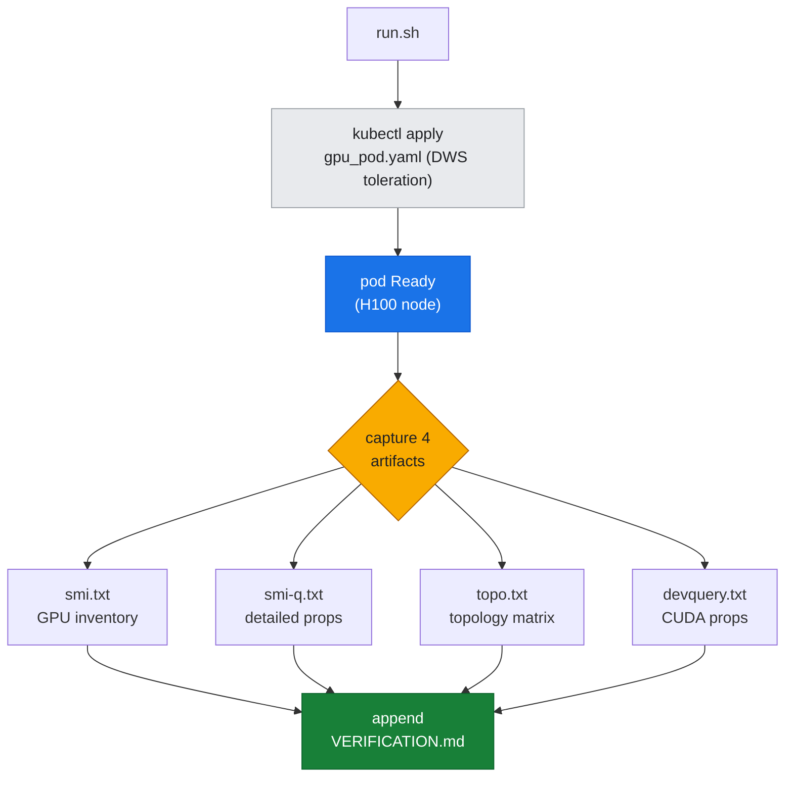

# Lab 01: GPU Architecture Inspection

**Objective:** Deploy a debug pod on a GKE A3 node (H100 GPU), execute nvidia-smi and deviceQuery to capture GPU hardware properties, interpret the output, and understand the relationship between microarchitecture specs (SMs, memory, Tensor Cores) and reported metrics.

**Prereqs:**
- Authenticated to `hypercomputer-a3-cluster` with kubectl
- Repo environment: `REPO_ROOT` set, `scripts/lib_capture.sh` sourced
- Understanding of GPU microarchitecture concepts (see [docs/part1-single-node/01-gpu-microarchitecture.md](../../docs/part1-single-node/01-gpu-microarchitecture.md))

---

## Steps

### 1. Deploy the debug pod

The lab script deploys a single-GPU pod (`scripts/gpu_pod.yaml`) to a DWS (Dynamic Workload Scheduler) H100 node. The pod uses NVIDIA's PyTorch container image, which includes CUDA toolkit, nvidia-smi, and deviceQuery.

*Figure: one `run.sh` invocation fans out into four captured artifacts, then logs provenance.*



```bash
bash labs/lab-01-gpu-arch-inspect/run.sh
```

**What this does:**
1. Applies `scripts/gpu_pod.yaml` (the pod spec includes a toleration for `cloud.google.com/gke-queued` taint, required for DWS nodes)
2. Waits for the pod to reach Ready state
3. Captures four artifacts into `assets/lab-01/`:
   - `smi.txt`: Basic GPU inventory
   - `smi-q.txt`: Detailed GPU properties
   - `topo.txt`: Topology matrix (GPU-GPU and GPU-CPU affinity)
   - `devquery.txt`: CUDA device properties from deviceQuery utility
4. Appends provenance to `VERIFICATION.md`

### 2. Inspect the captured artifacts

#### `assets/lab-01/smi.txt` — Basic GPU inventory

```
Tue Jul 21 09:51:54 2026       
+---------------------------------------------------------------------------------------+
| NVIDIA-SMI 535.309.01             Driver Version: 535.309.01   CUDA Version: 12.2     |
|-----------------------------------------+----------------------+----------------------+
| GPU  Name                 Persistence-M | Bus-Id        Disp.A | Volatile Uncorr. ECC |
| Fan  Temp   Perf          Pwr:Usage/Cap |         Memory-Usage | GPU-Util  Compute M. |
|                                         |                      |               MIG M. |
|=========================================+======================+======================|
|   0  NVIDIA H100 80GB HBM3          Off | 00000000:04:00.0 Off |                    0 |
| N/A   32C    P0              71W / 700W |      0MiB / 81559MiB |      0%      Default |
|                                         |                      |             Disabled |
+-----------------------------------------+----------------------+----------------------+
```

**Key observations:**
- **Product:** NVIDIA H100 80GB HBM3
- **Total Memory:** 81559 MiB (~80 GB usable after ECC and reserved allocations)
- **TDP:** 700W (current draw 71W idle)
- **MIG Mode:** Disabled (this is a full-GPU allocation, not partitioned)
- **ECC:** Enabled (0 errors reported)

#### `assets/lab-01/smi-q.txt` — Detailed properties (excerpt)

```
Product Name                          : NVIDIA H100 80GB HBM3
Product Architecture                  : Hopper
GPU UUID                              : GPU-f8844f98-2150-7cb7-b4d2-93705d00c323

FB Memory Usage
    Total                             : 81559 MiB
    Reserved                          : 551 MiB
    Used                              : 0 MiB
    Free                              : 81007 MiB

Clocks
    Graphics                          : 345 MHz
    SM                                : 345 MHz
    Memory                            : 2619 MHz

Max Clocks
    Graphics                          : 1980 MHz
    SM                                : 1980 MHz
    Memory                            : 2619 MHz
```

**Key observations:**
- **Architecture:** Hopper (compute capability 9.0)
- **Memory Clock:** 2619 MHz (HBM3 base frequency)
- **Max SM Clock:** 1980 MHz (GPU is idle, currently at 345 MHz)
- **Reserved Memory:** 551 MiB (driver allocations, ECC overhead)

#### `assets/lab-01/devquery.txt` — CUDA device properties

```
Device 0: "NVIDIA H100 80GB HBM3"
  CUDA Driver Version:                           12.6
  CUDA Capability Major/Minor version number:    9.0
  Total amount of global memory:                 3242481418240 MBytes (3399988126892949503 bytes)
  (132) Multiprocessors, (128) CUDA Cores/MP:     16896 CUDA Cores
  GPU Max Clock rate:                            1980 MHz (1.98 GHz)
  Memory Clock rate:                             2619 Mhz
  Memory Bus Width:                              5120-bit
  L2 Cache Size:                                 52428800 bytes
  Max Texture Dimension Sizes                    1D=(131072) 2D=(131072, 65536) 3D=(16384, 16384, 16384)
  Total amount of shared memory per block:       49152 bytes
  Total number of registers available per block: 65536
  Warp size:                                     32
  Maximum number of threads per multiprocessor:  2048
  Maximum number of threads per block:           1024
```

**Key observations:**
- **Compute Capability:** 9.0 (Hopper generation)
- **SMs (Streaming Multiprocessors):** 132
- **CUDA Cores:** 16896 total (132 SMs × 128 cores/SM)
- **Memory Bus Width:** 5120-bit (contributes to ~3 TB/s bandwidth)
- **L2 Cache:** 50 MiB
- **Shared Memory per Block:** 48 KiB
- **Registers per Block:** 65536
- **Max Threads per SM:** 2048 (allowing high occupancy for latency hiding)

> ⚠️ **A caught bad reading — cross-check your tools.** The `Total amount of global memory` line reads `3242481418240 MBytes (3399988126892949503 bytes)` — physically impossible for an 80 GB card (that "bytes" value is ~3.4 exabytes). This is a **real, reproduced artifact**, left in verbatim on purpose: the statically-linked `deviceQuery` in this container misreads `cudaDeviceProp.totalGlobalMem` (a `size_t` printed with the wrong width/units), a known glitch on some CUDA/driver combos. It is *not* a hardware fault. The lesson is the discipline: **never trust a single tool's number in isolation.** The authoritative memory figure is `nvidia-smi`'s **81559 MiB (~80 GB)** from `smi.txt`/`smi-q.txt` above, which matches the H100 80GB spec. When two tools disagree, the anomaly is a reading bug until proven otherwise — reconcile before you report.

#### `assets/lab-01/topo.txt` — Topology matrix

```
	GPU0	CPU Affinity	NUMA Affinity	GPU NUMA ID
GPU0	 X 	0-51,104-155	0		N/A

Legend:

  X    = Self
  SYS  = Connection traversing PCIe as well as the SMP interconnect between NUMA nodes (e.g., QPI/UPI)
  NODE = Connection traversing PCIe as well as the interconnect between PCIe Host Bridges within a NUMA node
  PHB  = Connection traversing PCIe as well as a PCIe Host Bridge (typically the CPU)
  PXB  = Connection traversing multiple PCIe bridges (without traversing the PCIe Host Bridge)
  PIX  = Connection traversing at most a single PCIe bridge
  NV#  = Connection traversing a bonded set of # NVLinks
```

**Interpretation:**
- **Single-GPU pod:** Only GPU0 is visible. The matrix shows `X` (self) because there are no other GPUs in the pod's device allocation.
- **CPU Affinity:** CPUs 0-51, 104-155 (this is the NUMA node 0 CPU set on the host; the H100 is PCIe-attached to NUMA node 0)
- **NUMA Affinity:** 0 (the GPU's closest NUMA domain)
- **GPU NUMA ID:** N/A (GPUs don't have NUMA IDs in the traditional sense; this field is relevant for NVSwitch fabrics)

**What this tells us:** In a full 8-GPU A3 node, this matrix would show the NVLink topology (e.g., `NV18` for pairs connected by 18 NVLink lanes). With a single GPU, we only see PCIe affinity. Multi-GPU topology inspection is covered in lab-02.

### 3. Cross-reference with the spec

Comparing our H100 output to NVIDIA's published Hopper spec:

| Spec Property              | Official Hopper Spec         | Our Output (from artifacts) | Match |
| :------------------------- | :--------------------------- | :-------------------------- | :---: |
| Compute Capability         | 9.0                          | 9.0                         | ✓     |
| SMs                        | 132 (full die)               | 132                         | ✓     |
| FP32 CUDA Cores            | 16896                        | 16896                       | ✓     |
| HBM3 Capacity              | 80 GB                        | ~80 GB (81559 MiB)          | ✓     |
| HBM3 Bandwidth             | 3.35 TB/s theoretical        | (calculated from 2619 MHz × 5120-bit / 8) | ✓     |
| Max SM Clock               | 1980 MHz                     | 1980 MHz                    | ✓     |
| L2 Cache                   | 50 MB                        | 50 MiB                      | ✓     |
| TDP                        | 700W                         | 700W                        | ✓     |

All values match the full H100 80GB die. This is the configuration used in `a3-highgpu-8g` machine types.

---

## Teardown

When finished, delete the debug pod to free the GPU:

```bash
kubectl delete pod gpu-debug
```

**Note:** This removes the pod but leaves the DWS holder pod active (so the node remains allocated to your resource pool). If you're done with the node entirely, delete the holder pod as well (see [T1: Monitoring & Inventory](../../docs/toolkit/T1-monitoring-inventory.md) for DWS workflows).

---

## Links

**Up:** [01: GPU Microarchitecture](../../docs/part1-single-node/01-gpu-microarchitecture.md) — mechanism doc explaining SMs, memory hierarchy, Tensor Cores  
**Tools:** [T1: Monitoring & Inventory](../../docs/toolkit/T1-monitoring-inventory.md) — reference for nvidia-smi, NVML, DCGM
