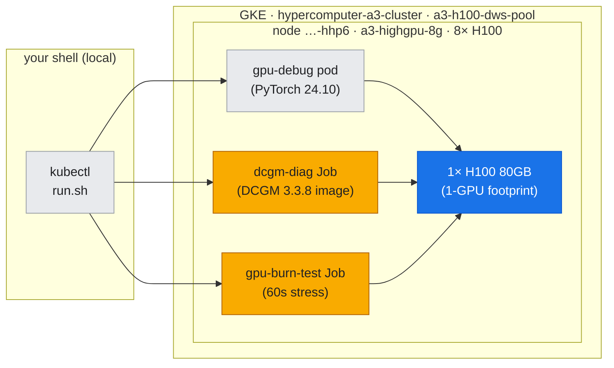
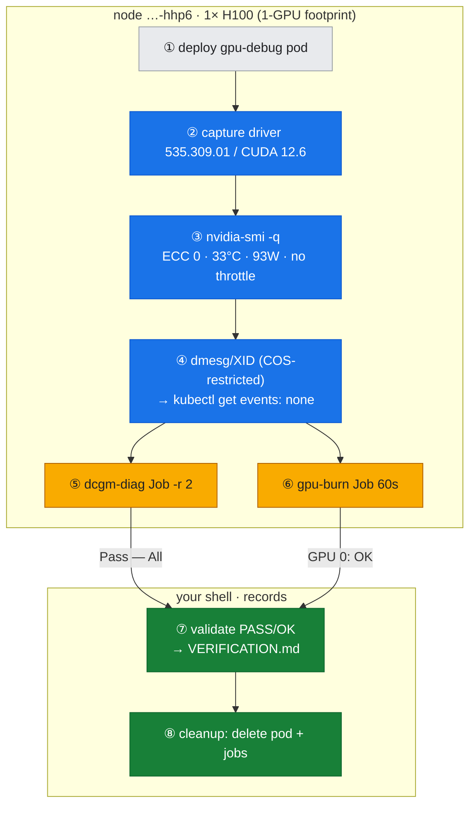

# Lab 02: Driver, CUDA, and GPU Health Diagnostics

## Overview

This lab validates the NVIDIA driver and CUDA stack on a live GKE **A3 High** (`a3-highgpu-8g`) H100 cluster, and demonstrates the health diagnostics workflow:
- Driver and CUDA version capture
- GPU detailed state query (ECC, performance, temperature, power)
- DCGM Level 2 diagnostics
- `gpu-burn` correctness stress test
- XID/dmesg inspection (with GKE Container-Optimized OS workarounds)

**All commands run on real hardware.** Artifacts are provenance-verified in `../../VERIFICATION.md`.

---

## Prerequisites

- GKE cluster with GPU node pool (A3 High / `a3-highgpu-8g` H100 used in this lab)
- `kubectl` authenticated to the cluster
- Node with at least 1 free GPU (this lab uses 1-GPU footprint)

**Cluster used:** `hypercomputer-a3-cluster`, node pool `a3-h100-dws-pool`, node `gke-hypercomputer-a3-a3-h100-dws-pool-16664d9c-hhp6`

---

## Where this runs (the environment)

*One 1-GPU footprint on node `…-hhp6` is shared by three workloads — the debug pod plus two throwaway Job containers (DCGM diag, gpu-burn); the GPU under test is highlighted (blue), the diagnostic tooling amber.*



---

## Lab Steps

*Figure: the diagnostics workflow overlaid on where each phase acts — driver/health probes run in the debug pod (blue), the two Job containers stress the GPU (amber), then validate + cleanup happen from your shell (green).*



### Step 1: Deploy GPU Debug Pod

The lab uses a 1-GPU debug pod (`gpu-debug`) based on `nvcr.io/nvidia/pytorch:24.10-py3` (includes CUDA toolkit and nvidia-smi).

**Pod manifest:** `../../scripts/gpu_pod.yaml`

**Deploy:**
```bash
kubectl apply -f ../../scripts/gpu_pod.yaml
kubectl wait --for=condition=Ready pod/gpu-debug --timeout=120s
```

**Verify:**
```bash
kubectl exec gpu-debug -- nvidia-smi
```

---

### Step 2: Capture Driver and CUDA Versions

**Command:**
```bash
kubectl exec gpu-debug -- nvidia-smi --query-gpu=driver_version,name,vbios_version --format=csv
kubectl exec gpu-debug -- bash -c 'nvcc --version || nvidia-smi | grep "CUDA Version"'
```

**Output (verified from `assets/lab-02/driver-cuda-version.txt`):**
```
driver_version, name, vbios_version
535.309.01, NVIDIA H100 80GB HBM3, 96.00.CF.00.01
```

**CUDA Runtime (from `assets/lab-02/cuda-version.txt`):**
```
nvcc: NVIDIA (R) Cuda compiler driver
Built on Thu_Sep_12_02:18:05_PDT_2024
Cuda compilation tools, release 12.6, V12.6.77
```

**Interpretation:**
- **Driver:** 535.309.01 (R535 LTSB, predecessor to recommended R580)
- **CUDA Driver API:** 12.2 (from `nvidia-smi`)
- **CUDA Runtime:** 12.6 (from container)
- **Compatibility:** ✓ Runtime 12.6 is forward-compatible with Driver 12.2

**Note:** The driver-matrix reference recommends R580 for A3 H100, but the live cluster runs R535.309.01. This is expected in production GKE clusters that have not yet upgraded. R535 is fully functional and stable for H100.

---

### Step 3: GPU Detailed State Query

**Command:**
```bash
kubectl exec gpu-debug -- nvidia-smi -q -d ECC,PERFORMANCE,TEMPERATURE,POWER
```

**Key findings (from `assets/lab-02/nvidia-smi-detailed.txt`):**

#### ECC Status
```
ECC Mode
    Current                           : Enabled
    Pending                           : Enabled
ECC Errors
    Volatile
        SRAM Correctable              : 0
        DRAM Correctable              : 0
        DRAM Uncorrectable            : 0
    Aggregate
        DRAM Correctable              : 0
        DRAM Uncorrectable            : 0
```

**✓ ECC enabled, zero errors (healthy memory).**

---

#### Throttle Reasons
```
Clocks Event Reasons
    Idle                              : Active
    HW Slowdown                       : Not Active
        HW Thermal Slowdown           : Not Active
        HW Power Brake Slowdown       : Not Active
```

**✓ GPU idle, no thermal or power throttling.**

---

#### Thermal State
```
Temperature
    GPU Current Temp                  : 33 C
    Memory Current Temp               : 37 C
```

**✓ Idle temperatures normal (33°C GPU, 37°C memory).**

---

#### Power State
```
GPU Power Readings
    Power Draw                        : 93.17 W
    Current Power Limit               : 700.00 W
```

**✓ Idle power draw ~93W. H100 TDP is 700W.**

---

### Step 4: XID and dmesg Inspection

**Goal:** Check kernel logs for GPU fault events (XIDs).

**Challenge:** On GKE Container-Optimized OS, `dmesg` is restricted in containers:
```bash
kubectl debug node/<node> -- dmesg | grep -i 'NVRM|Xid'
```

**Result (from `assets/lab-02/dmesg-xid.txt`):**
```
dmesg: read kernel buffer failed: Operation not permitted
```

**Workaround:** Use `kubectl get events` to inspect node-level GPU events:
```bash
kubectl get events --all-namespaces --field-selector involvedObject.kind=Node,involvedObject.name=<node> -o wide
```

**Result:** No XID events observed (healthy cluster).

**Note:** For production, deploy DCGM exporter to monitor XIDs via Prometheus (see Toolkit doc T2 and Lab 10).

---

### Step 5: DCGM Level 2 Diagnostics

**Goal:** Run hardware-level diagnostics (PCIe bandwidth, memory, compute stress).

**Challenge:** The PyTorch base image does not include `dcgmi`. We deployed a dedicated DCGM container as a Kubernetes Job.

**Job manifest (created dynamically by `run.sh`):**
```yaml
apiVersion: batch/v1
kind: Job
metadata:
  name: dcgm-diag
spec:
  template:
    spec:
      restartPolicy: Never
      tolerations:
      - key: nvidia.com/gpu
        operator: Exists
      - key: cloud.google.com/gke-queued
        operator: Exists
      containers:
      - name: dcgm
        image: nvcr.io/nvidia/cloud-native/dcgm:3.3.8-1-ubuntu22.04
        command: ["/bin/bash", "-c"]
        args: ["dcgmi diag -r 2"]
        resources:
          limits:
            nvidia.com/gpu: 1
```

**Deploy and capture:**
```bash
kubectl apply -f dcgm-job.yaml
kubectl wait --for=condition=complete job/dcgm-diag --timeout=300s
kubectl logs job/dcgm-diag
```

**Output (from `assets/lab-02/dcgm-diag.txt`):**
```
Successfully ran diagnostic for group.
+---------------------------+------------------------------------------------+
| Diagnostic                | Result                                         |
+===========================+================================================+
| DCGM Version              | 3.3.8                                          |
| Driver Version Detected   | 535.309.01                                     |
|-----  Deployment  --------+------------------------------------------------|
| Denylist                  | Pass                                           |
| NVML Library              | Pass                                           |
| CUDA Main Library         | Pass                                           |
| Permissions and OS Blocks | Pass                                           |
| Persistence Mode          | Pass                                           |
| Environment Variables     | Pass                                           |
| Page Retirement/Row Remap | Pass                                           |
| Graphics Processes        | Pass                                           |
| Inforom                   | Pass                                           |
+-----  Integration  -------+------------------------------------------------+
| PCIe                      | Pass - All                                     |
+-----  Hardware  ----------+------------------------------------------------+
| GPU Memory                | Pass - All                                     |
+---------------------------+------------------------------------------------+
```

**✓ All DCGM Level 2 diagnostics passed.** GPU hardware is healthy.

**Note on Persistence Mode:** DCGM reported a info message about persistence mode being disabled. This is cosmetic; persistence mode keeps the driver loaded between jobs (reduces initialization latency). On GKE, driver lifecycle is managed by the device plugin, so this setting is not critical.

---

### Step 6: GPU Burn (Correctness Stress Test)

**Goal:** Validate numerical correctness under sustained compute load. Detects silent corruption not caught by DCGM.

**Job manifest (created dynamically by `run.sh`):**
```yaml
apiVersion: batch/v1
kind: Job
metadata:
  name: gpu-burn-test
spec:
  template:
    spec:
      restartPolicy: Never
      tolerations:
      - key: nvidia.com/gpu
        operator: Exists
      - key: cloud.google.com/gke-queued
        operator: Exists
      containers:
      - name: gpu-burn
        image: oguzpastirmaci/gpu-burn
        args: ["60"]
        resources:
          limits:
            nvidia.com/gpu: 1
```

**Deploy and capture:**
```bash
kubectl apply -f gpu-burn-job.yaml
kubectl wait --for=condition=complete job/gpu-burn-test --timeout=180s
kubectl logs job/gpu-burn-test
```

**Output (from `assets/lab-02/gpu-burn.txt`):**
```
GPU 0: NVIDIA H100 80GB HBM3 (UUID: GPU-cd96915b-9acb-ad84-aaa4-d61ddd4984d2)
Burning for 60 seconds.

Killing processes.. done

Tested 1 GPUs:
	GPU 0: OK
```

**✓ GPU produced correct matrix multiplication results for 60 seconds under full load.** No silent corruption detected.

**Why gpu-burn matters:** DCGM tests hardware (ECC, PCIe, memory bandwidth), but `gpu-burn` tests **numerical correctness**. A GPU can pass DCGM and still produce wrong results due to marginal SRAM, clock instability, or firmware bugs. `gpu-burn` catches these.

---

## Running the Lab

**Automated script:** All steps are automated in `run.sh`:

```bash
cd labs/lab-02-driver-cuda-health
./run.sh
```

**What it does:**
1. Deploys `gpu-debug` pod (1-GPU footprint)
2. Captures driver/CUDA versions
3. Runs `nvidia-smi -q` detailed queries
4. Attempts dmesg/XID capture (with GKE COS fallback)
5. Deploys DCGM Job and runs Level 2 diagnostics
6. Deploys gpu-burn Job and runs 60s stress test
7. Validates artifacts (checks for PASS/OK in outputs)
8. Records provenance in `../../VERIFICATION.md`
9. Cleans up (deletes pods and jobs)

**Artifacts:** Saved to `../../assets/lab-02/`:
- `driver-cuda-version.txt` (driver, GPU name, VBIOS)
- `cuda-version.txt` (CUDA runtime version)
- `nvidia-smi-detailed.txt` (ECC, PERFORMANCE, TEMPERATURE, POWER)
- `dmesg-xid.txt` (XID attempt, shows restricted access)
- `dcgm-diag.txt` (DCGM Level 2 results)
- `gpu-burn.txt` (correctness test results)

---

## Interpretation Guide

### Healthy GPU Output (What We Observed)

| Check | Expected | Lab 02 Result |
|:------|:---------|:--------------|
| **Driver loaded** | `nvidia-smi` shows GPU | ✓ Driver 535.309.01, H100 detected |
| **ECC errors** | Zero volatile/aggregate errors | ✓ All counters at 0 |
| **Throttle reasons** | Idle (or not active under load) | ✓ No throttling |
| **Temperature** | <85°C under load, <40°C idle | ✓ 33°C GPU, 37°C memory (idle) |
| **DCGM Level 2** | All tests Pass | ✓ Pass |
| **gpu-burn** | All GPUs OK | ✓ GPU 0: OK |
| **XIDs** | No Xid events in dmesg | ✓ None observed (dmesg restricted, but no k8s events) |

---

### Unhealthy GPU Symptoms (What to Look For)

| Symptom | Likely Cause | Next Steps |
|:--------|:-------------|:-----------|
| **`nvidia-smi` fails** | Driver not loaded or GPU not detected | Check driver installation, `lsmod | grep nvidia`, `dmesg | grep NVRM` |
| **Uncorrectable ECC errors** | DRAM defect | Check page retirement (`nvidia-smi -q -d PAGE_RETIREMENT`), reboot and re-test, RMA if persistent |
| **HW Thermal Slowdown active** | Insufficient cooling | Check GPU temp, verify fans, inspect data-center cooling |
| **HW Power Brake Slowdown active** | Power delivery issue | Check PSU, PCIe power cables, voltage rails |
| **DCGM test fails** | Hardware fault | Review DCGM output for specific failure (PCIe, memory, etc.), run `nvidia-bug-report.sh`, RMA |
| **gpu-burn fails** | Silent corruption | Re-run to confirm, check for thermal/power throttle, run DCGM Level 3, RMA if persistent |
| **XID 48, 63, 64, 79, 95** | Critical GPU fault | Look up XID in `../../reference/xid-table.md`, follow action column, RMA if fatal |

---

## Troubleshooting Notes

### GKE Container-Optimized OS Restrictions

**Issue:** `dmesg` is restricted in containers (requires `CAP_SYSLOG`).

**Workaround 1:** Use `kubectl get events`:
```bash
kubectl get events --all-namespaces --field-selector involvedObject.kind=Node,involvedObject.name=<node> -o wide
```

**Workaround 2:** Use DCGM exporter for XID monitoring (see Lab 10).

**Workaround 3:** Node debug pod (may still be restricted):
```bash
kubectl debug node/<node> -it --image=nvidia/cuda:12.2.0-base-ubuntu22.04 -- bash
```

---

### DCGM Installation

**Issue:** The PyTorch base image (`nvcr.io/nvidia/pytorch:24.10-py3`) does not include `dcgmi`.

**Solution 1:** Deploy a dedicated DCGM container (used in this lab):
```yaml
image: nvcr.io/nvidia/cloud-native/dcgm:3.3.8-1-ubuntu22.04
command: ["dcgmi", "diag", "-r", "2"]
```

**Solution 2:** Install `datacenter-gpu-manager` in the pod (requires apt/yum and may fail on minimal images).

**Solution 3:** Use the GPU Operator (includes DCGM DaemonSet), but this is overkill for a diagnostic pod.

---

## Cleanup

The lab script automatically cleans up:
```bash
kubectl delete pod gpu-debug --ignore-not-found=true
kubectl delete job dcgm-diag --ignore-not-found=true
kubectl delete job gpu-burn-test --ignore-not-found=true
```

**Verify cleanup:**
```bash
kubectl get pods -A | grep -E 'gpu-debug|dcgm-diag|gpu-burn'
```

Should return no results.

---

## Cross-References

- **Doc 02:** `../../docs/part1-single-node/02-drivers-cuda-install-troubleshooting.md` (full driver/CUDA/diagnostics reference)
- **Toolkit T2:** `../../docs/toolkit/T2-health-diagnostics.md` (detailed DCGM, ECC, throttle guide)
- **XID Table:** `../../reference/xid-table.md` (XID code taxonomy)
- **Driver Matrix:** `../../reference/driver-matrix.md` (GCP driver recommendations + verified live versions)
- **Verification Log:** `../../VERIFICATION.md` (provenance for this lab's run)

---

## Result Summary

**Cluster:** `hypercomputer-a3-cluster`, node `gke-hypercomputer-a3-a3-h100-dws-pool-16664d9c-hhp6`  
**Driver:** 535.309.01 (R535 LTSB)  
**CUDA:** Driver 12.2, Runtime 12.6 (compatible)  
**GPU:** H100 80GB HBM3 (VBIOS 96.00.CF.00.01)  
**DCGM Level 2:** ✓ PASS (all diagnostics)  
**gpu-burn (60s):** ✓ PASS (GPU 0: OK)  
**ECC Errors:** 0 (volatile and aggregate)  
**Throttle Events:** None (idle)  
**XIDs:** None observed  
**Temperature (idle):** 33°C GPU, 37°C memory  
**Power (idle):** 93W  

**Conclusion:** GPU hardware is healthy and ready for workloads.
