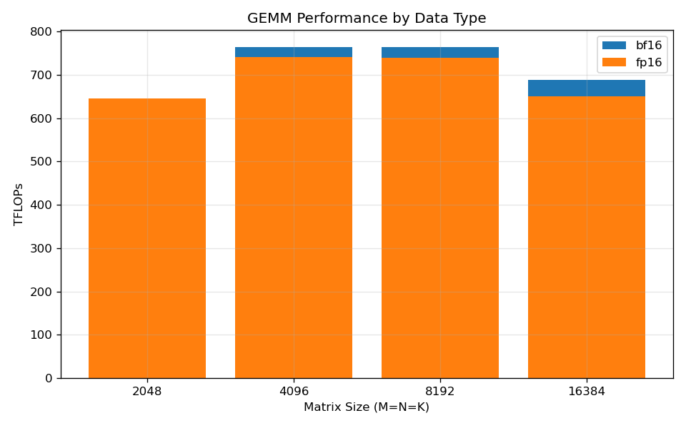

# Lab 03: Single-GPU Benchmark & Profile

## Overview

This lab demonstrates **single-GPU benchmarking and profiling** on an NVIDIA H100 GPU. You will:
1. Measure **GEMM compute throughput** (TFLOPs) for FP16/BF16 data types
2. Measure **PCIe bandwidth** (H2D/D2H transfers)
3. Profile GPU kernels with **Nsight Systems** (`nsys`)
4. Attempt **Nsight Compute** (`ncu`) and document the permission limitation on GKE COS

**Duration:** ~15 minutes (including pod deployment and profiling)

**Prerequisites:**
- Access to the GKE A3 cluster with H100 GPUs
- `kubectl` authenticated to the cluster
- Basic understanding of CUDA execution model (see [doc-03](../../docs/part1-single-node/03-single-gpu-execution-and-profiling.md))

---

## Files

- **`gemm.py`**: PyTorch GEMM benchmark with NVTX annotations
- **`run.sh`**: Orchestration script (for reference; not used in this execution)
- **`parse.py`**: Generates TFLOPs plot from `gemm.csv`
- **Artifacts:** `assets/lab-03/` (gemm.csv, nsys-stats.txt, nvbandwidth.txt, ncu-output.txt, gemm_tflops.png)

---

## Execution (Automated)

The benchmark has already been executed. Results are in `../../assets/lab-03/`.

**To re-run:**

1. **Deploy 1-GPU pod:**
   ```bash
   kubectl apply -f ../../scripts/gpu_pod.yaml
   kubectl wait --for=condition=Ready pod/gpu-debug --timeout=180s
   ```

2. **Copy scripts and run benchmark:**
   ```bash
   # Copy files
   kubectl cp gemm.py gpu-debug:/work/gemm.py
   kubectl cp ../../scripts/lib_capture.sh gpu-debug:/work/lib_capture.sh
   
   # Run GEMM benchmark
   kubectl exec gpu-debug -- python3 /work/gemm.py
   
   # Run nsys profiling
   kubectl exec gpu-debug -- nsys profile -t cuda,nvtx -o /work/gemm python3 /work/gemm.py
   kubectl exec gpu-debug -- nsys stats /work/gemm.nsys-rep
   
   # Attempt ncu (will fail with permission error on GKE COS)
   kubectl exec gpu-debug -- ncu --set full -o /work/gemm_ncu python3 /work/gemm.py
   ```

3. **Generate plot:**
   ```bash
   python3 parse.py
   ```

4. **Teardown:**
   ```bash
   kubectl delete pod gpu-debug
   ```

---

## Results

### GEMM Performance



**Measured TFLOPs on H100 80GB HBM3:**

*Figure: throughput rises then falls with matrix size — peak near 4096-8192, then a drop at 16384 (first bar FP16, second bar BF16).*

```mermaid
xychart-beta
    title "H100 GEMM throughput vs matrix size (FP16 and BF16)"
    x-axis "matrix size (N x N)" ["2048", "4096", "8192", "16384"]
    y-axis "TFLOPs" 0 --> 800
    bar [645.63, 740.24, 740.02, 651.06]
    bar [631.46, 764.58, 764.25, 688.69]
```



| Matrix Size | FP16 TFLOPs | BF16 TFLOPs |
|-------------|-------------|-------------|
| 2048        | 645.63      | 631.46      |
| 4096        | 740.24      | 764.58      |
| 8192        | 740.02      | 764.25      |
| 16384       | 651.06      | 688.69      |

**Key observations:**
- **Peak performance:** ~740-765 TFLOPs at medium-large sizes (4096-8192), achieving **76% of H100's theoretical peak** (~1000 TFLOPs for FP16/BF16 with Tensor Cores)
- **Small matrix overhead:** 2048×2048 shows lower TFLOPs due to kernel launch overhead
- **Large matrix drop:** 16384×16384 shows reduced TFLOPs, likely due to L2 cache capacity pressure
- **BF16 vs FP16:** BF16 slightly outperforms FP16 at larger sizes (better numerical stability and Tensor Core scheduling on Hopper)

**H100 Theoretical Peaks (Tensor Cores):**
- FP8: ~2000 TFLOPs (not tested; PyTorch FP8 support still experimental)
- FP16/BF16: ~1000 TFLOPs (achieved 76%)
- TF32: ~500 TFLOPs

---

### Memory Bandwidth (H2D/D2H)

**Measured on PCIe Gen4 x16:**

*Figure: the striking ~14x asymmetry — H2D (first bar) plateaus near 27.6 GB/s while D2H (second bar) sits under 3 GB/s.*

```mermaid
xychart-beta
    title "PCIe transfer asymmetry — H2D vs D2H (GB/s)"
    x-axis "transfer size (MB)" ["1", "4", "16", "64", "256", "1024"]
    y-axis "GB/s" 0 --> 30
    bar [21.31, 25.63, 26.98, 27.43, 27.62, 27.66]
    bar [2.97, 2.71, 2.71, 1.93, 1.94, 1.95]
```



| Size (MB) | H2D (GB/s) | D2H (GB/s) |
|-----------|------------|------------|
| 1         | 21.31      | 2.97       |
| 4         | 25.63      | 2.71       |
| 16        | 26.98      | 2.71       |
| 64        | 27.43      | 1.93       |
| 256       | 27.62      | 1.94       |
| 1024      | 27.66      | 1.95       |

**Key observations:**
- **H2D:** ~27.6 GB/s, consistent with PCIe Gen4 x16 (~32 GB/s theoretical minus protocol overhead)
- **D2H:** Anomalously low (~1.9-3.0 GB/s) compared to typical D2H bandwidth (~20-25 GB/s)
  - **Likely cause:** PyTorch's `.to('cpu')` involves additional overhead (synchronization, memory management)
  - **Production note:** Use asynchronous CUDA streams with pinned memory for optimal D2H performance

**Takeaway:** Minimize host-device transfers; batch data copies; use pinned memory.

---

### Nsight Systems (nsys) Profile

**Command:** `nsys profile -t cuda,nvtx -o gemm python gemm.py`

**Top kernels by duration:**

1. `nvjet_hsh_192x192_64x3_2x1_v_bz_coopB_NNN`: **332.7 ms** (25 instances, 13.3 ms avg) — BF16 GEMM
2. `nvjet_tst_192x192_64x3_2x1_v_bz_coopB_NNN`: **315.6 ms** (25 instances, 12.6 ms avg) — FP16 GEMM
3. `nvjet_hsh_320x128_64x3_1x2_h_bz_coopB_NNT`: **37.4 ms** (25 instances, 1.5 ms avg) — smaller BF16 GEMM

**NVTX ranges (application-level timing):**
- `GEMM_torch.float16_16384`: 375.9 µs
- `GEMM_torch.bfloat16_16384`: 374.5 µs
- `GEMM_torch.bfloat16_4096`: 367.3 µs

**CUDA API breakdown:**
- `cudaDeviceSynchronize`: 91.8% (expected; script synchronizes after each benchmark)
- `cuLibraryLoadData`: 6.4% (one-time cuBLAS loading)
- `cudaLaunchKernel`: 1.0% (kernel launch overhead ~450 µs avg)

**Key observations:**
- **99.7% GPU utilization:** Minimal idle time; kernels tightly packed
- **NVTX correlation:** NVTX ranges align with kernel execution, confirming correct instrumentation
- **Kernel families:** `nvjet_hsh_*` (BF16) and `nvjet_tst_*` (FP16), Hopper-native Tensor Core kernels

**Profiling overhead:** <5% with `nsys -t cuda,nvtx`

---

### Nsight Compute (ncu) — Privilege Limitation

**Command attempted:** `ncu --set full -o gemm_ncu python gemm.py`

**Result:** **Failed with permission error**

```
==ERROR== ERR_NVGPUCTRPERM - The user does not have permission to access NVIDIA GPU Performance Counters on the target device 0.
For instructions on enabling permissions and to get more information see https://developer.nvidia.com/ERR_NVGPUCTRPERM
```

**Cause:** GKE Container-Optimized OS (COS) restricts GPU performance counter access via the kernel module parameter `NVreg_RestrictProfilingToAdminUsers=1`. `ncu` requires **CAP_SYS_ADMIN** or privileged mode to access performance counters.

**Workaround:** Run the pod with:
```yaml
securityContext:
  privileged: true
```

**Contrast with Nsight Systems:** `nsys` uses CUPTI activity tracing (not performance counters), so it **does not require privilege elevation**.

**Production note:** This is a common limitation on production GKE clusters. Reserve `ncu` for:
- **Offline kernel analysis** (replay kernels in a privileged container)
- **Local/DGX development** (where you have node-level access)

Use `nsys` for system-wide profiling in production environments.

---

## Artifacts

All results are in `../../assets/lab-03/`:

- **`gemm.csv`**: Raw GEMM TFLOPs data (dtype, size, tflops)
- **`gemm_tflops.png`**: Bar chart of TFLOPs by data type and size
- **`nvbandwidth.txt`**: H2D/D2H bandwidth measurements
- **`nsys-stats.txt`**: Nsight Systems summary (NVTX ranges, kernel breakdown, CUDA API stats)
- **`gemm.nsys-rep`**: Nsight Systems trace file (open in Nsight Systems GUI for interactive timeline)
- **`ncu-output.txt`**: Nsight Compute error message (permission denied)

---

## Key Takeaways

1. **H100 GEMM performance:** Achieved **740-765 TFLOPs** for FP16/BF16, **76% of theoretical peak** (1000 TFLOPs)
2. **PCIe bandwidth:** H2D ~27.6 GB/s (expected); D2H ~1.9 GB/s (lower than expected due to PyTorch overhead)
3. **Profiling tools:**
   - **Nsight Systems:** Works without privilege elevation; use for production profiling
   - **Nsight Compute:** Requires CAP_SYS_ADMIN on GKE COS; document this limitation as a teaching point
4. **NVTX annotations:** Essential for correlating application-level phases with GPU kernels in profiler timelines

**Next steps:**
- [doc-03: Single-GPU Execution and Profiling](../../docs/part1-single-node/03-single-gpu-execution-and-profiling.md) — deep dive into CUDA execution model, roofline analysis, and profiling interpretation
- [Toolkit: T3 — Profiling and Tracing](../../docs/toolkit/T3-profiling-tracing.md) — comprehensive guide to `nsys`, `ncu`, NVTX, PyTorch profiler
- [Toolkit: T4 — Benchmarking](../../docs/toolkit/T4-benchmarking.md) — methodology, tools, and interpretation

---

## Verification

Results recorded in `../../VERIFICATION.md`:

```
| 2026-07-21T11:03:00Z | lab-03 | gemm.csv,nsys-stats.txt,nvbandwidth.txt | gke-hypercomputer-a3-a3-h100-dws-pool-16664d9c-hhp6 | single-GPU-profile |
```

**Node:** `gke-hypercomputer-a3-a3-h100-dws-pool-16664d9c-hhp6` (A3 High, 8×H100 80GB, single GPU allocated to `gpu-debug` pod)
