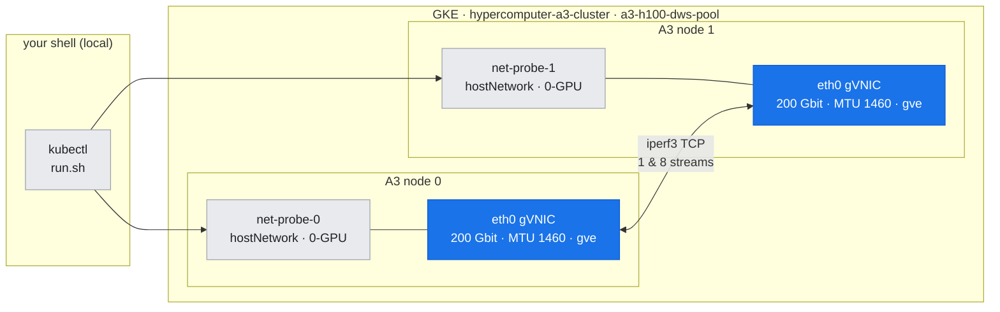
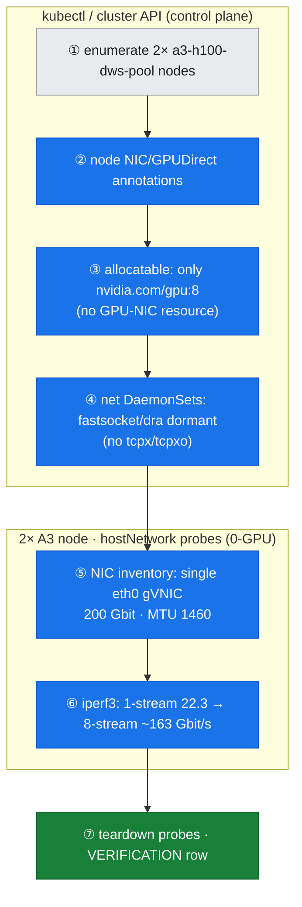

# Lab 05: Inter-node Network-Path Inspection (0-GPU)

**Objective:** Characterize the **actual** inter-node network path on this A3 cluster — the NICs, the extended resources, the installed (or absent) NCCL network plugins — and measure a raw TCP bandwidth baseline between the two GPU nodes. This proves, with machine-checkable evidence, that the cluster runs **plain TCP over a single gVNIC** with **no GPUDirect**, which is the premise doc-06's ~28.6 GB/s floor rests on.

**Duration:** ~3 minutes.

**Safety:** This lab **requests zero GPUs**. The probe pods use `hostNetwork: true` and `nodeName` to land on the GPU nodes, but claim no `nvidia.com/gpu`, so they run safely alongside the DWS capacity holders and any GPU workload. Nothing is modified on the node pool.

**Prerequisites:** Read [doc-05](../../docs/part2-inter-node/05-nic-rdma-gpudirect.md); tools background in [T5](../../docs/toolkit/T5-networking-fabric-tools.md).

---

## Where this runs (the environment)

*A 0-GPU lab across two `a3-h100-dws-pool` nodes: `hostNetwork` probe pods measure the one path that exists — a single `eth0` gVNIC per node (blue) — with no GPU-NIC rails present.*



---

## Run

```bash
bash labs/lab-05-network-path-inspect/run.sh
```

*Figure: the runner's phases overlaid on where they act — control-plane queries prove no GPU-NIC/plugin exists, then the hostNetwork probes measure the single gVNIC (blue) before teardown (green).*



The runner:
1. Enumerates the two `a3-h100-dws-pool` nodes.
2. Captures node **NIC/GPUDirect annotations** (`node-annotations.txt`).
3. Captures **allocatable extended resources** (`allocatable.txt`) — is a GPU-NIC resource present?
4. Greps all namespaces for **tcpx/tcpxo/fastsocket/rdma/nccl network DaemonSets** (`net-daemonsets.txt`).
5. Reads the **per-node NIC inventory** via a `hostNetwork` probe pod (`links.txt`, from `/sys/class/net` + `/proc/net/dev` — the `networkstatic/iperf3` image has no `ip`).
6. Runs **iperf3** node-to-node, 1 stream and 8 streams (`iperf3-1stream.txt`, `iperf3-8streams.txt`).
7. Tears down the probe pods and appends a `VERIFICATION.md` row.

---

## What was measured (real output)

### 1. A single host gVNIC — no GPU-NICs — `assets/lab-05/links.txt`

```
eth0            speed=200000  mtu=1460  DRIVER=gve      <- the one physical NIC
gke7ead1e36a16  speed=10000   mtu=1460                  <- pod veth
gke860e357b7c9  speed=10000   mtu=1460                  <- pod veth
docker0 / lo
```

One NIC, `gve` driver, 200 Gbit/s, **MTU 1460** (not the 8244 jumbo used for GPUDirect). A GPUDirect-TCPX-provisioned A3 High node shows **four additional GPU-NIC rails** at MTU 8244 — absent here. That is no longer a hypothetical: [lab-18](../lab-18-enable-gpudirect-tcpx/) built exactly such a node and measured `eth1-4` at `mtu=8244` (`192.168.{0,1,2,3}.35`) alongside `eth0` at 1460, carrying **83.27 GB/s** busbw versus this path's **23.70**. So read the absence here as the *cause* of lab-06's `NET/Socket` floor, not as a defect.

### 2. Only `nvidia.com/gpu` is advertised — `assets/lab-05/allocatable.txt`

```
Allocatable:
  nvidia.com/gpu:  8      <- no GPU-NIC / tcpx / rdma extended resource
```

### 3. The NCCL plugin installers are dormant — `assets/lab-05/net-daemonsets.txt`

```
nccl-fastsocket-installer   DESIRED=0  CURRENT=0   <- installs no plugin here
networking-dra-driver       DESIRED=0  CURRENT=0   <- dranet DRA, dormant
```

No `tcpx`/`tcpxo` installer exists at all. NCCL therefore finds no `libnccl-net.so` and falls back to `NET/Socket` (see lab-06).

### 4. Raw TCP baseline over the single gVNIC — `assets/lab-05/iperf3-*.txt`

| Test | Throughput |
| :--- | :--- |
| 1 stream | **22.3 Gbit/s** |
| 8 streams | **~163 Gbit/s** aggregate (~82% of 200 Gbit/s line rate) |

That ~20 GB/s goodput is the same order as NCCL's ~15 GB/s algorithm bandwidth in [lab-06](../lab-06-2node-nccl-collectives/) — both funnel through this one NIC, staged through host memory.

---

## Interpretation

- **The path is rung 0** of the acceleration ladder in [doc-05](../../docs/part2-inter-node/05-nic-rdma-gpudirect.md): plain TCP, host in the loop, no RDMA.
- The single-stream vs. 8-stream gap (22 → 163 Gbit/s) shows why NCCL Fast Socket / multi-flow TCP exists: one flow can't saturate the NIC.
- **Nothing here is a defect** — it is how a GPU VM without the GPU-NIC network stack behaves. Enabling GPUDirect-TCPX (doc-05, "Optional") would add rails and lift the floor; this lab deliberately does not modify the DWS-held pool to force it.

## Teardown

The runner deletes `net-probe-0` / `net-probe-1` automatically. To confirm:

```bash
kubectl get pods | grep net-probe    # expect none
```

---

**Mechanism →** [doc-05: NICs, RDMA, GPUDirect](../../docs/part2-inter-node/05-nic-rdma-gpudirect.md)
**Next lab →** [lab-06: 2-node NCCL collectives](../lab-06-2node-nccl-collectives/)
**Tools →** [T5: Networking & Fabric Tools](../../docs/toolkit/T5-networking-fabric-tools.md)
