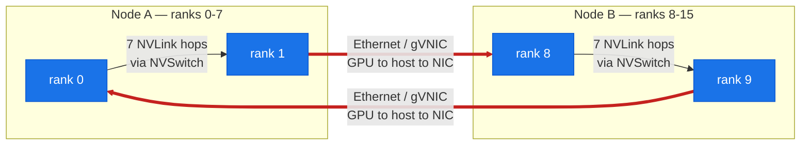

# Lab 06: 2-node, 16-GPU NCCL All-Reduce (the inter-node path)

**Objective:** Measure the **inter-node** collective bandwidth — an all-reduce across **two** A3 nodes (8 GPUs each, 16 ranks total) — and, critically, **record the actual NCCL transport** so the data path is proven rather than assumed. Then quantify the intra-vs-inter gap against lab-04.

**Duration:** ~10 minutes (inside two existing 8-GPU pods)

**Prerequisites:**
- Two 8-GPU pods, one per A3 node (this run used `nccl-workbench-a` / `-b`, both `hostNetwork: true` so pod IP = node IP)
- Read [doc-06](../../docs/part2-inter-node/06-nccl-collectives.md) and [doc-04](../../docs/part1-single-node/04-intranode-nvlink-nvswitch-hgx.md)

---

## Run

```bash
LAB06_POD_A=nccl-workbench-a LAB06_POD_B=nccl-workbench-b \
  bash labs/lab-06-2node-nccl-collectives/run.sh
```

**Files:**
- `allreduce_bench.py` — torch.distributed all-reduce sweep; computes `algbw` and `busbw = algbw·2(n-1)/n` (same definition as nccl-tests)
- `launch_node.sh` — manual c10d `env://` launcher (one process per GPU); no MPI, no SSH
- assets: `allreduce_2node.txt` (results table), `nccl_transport.txt` (transport evidence), `allreduce_2node_rank0_full.log` (full rank-0 log incl. NCCL INFO)

### Why torch.distributed instead of `mpirun all_reduce_perf`?

The NGC image ships the `nccl-tests` binaries **and** OpenMPI, but **no `sshd`** — a 2-node `mpirun` launch would need SSH plumbing between pods. `torch.distributed`'s c10d `env://` rendezvous needs neither MPI nor SSH, uses the **identical NCCL library**, and computes busbw with the same formula. So the measurement is equivalent to nccl-tests while being robust across two independently-launched Kubernetes pods. (Single-node lab-04 *does* use `all_reduce_perf` directly, since one process with `-g 8` needs no launcher.)

---

## What was measured (real output)

### 1. The transport is plain TCP sockets over gVNIC — `assets/lab-06/nccl_transport.txt`

This is the headline finding. With `NCCL_DEBUG=INFO`, the rank-0 log states exactly how the 16 GPUs are wired together across the two nodes:

*Figure: the 16-rank ring — 14 NVLink hops stay inside each node; the 2 ring hops that cross the node boundary (red) are TCP over gVNIC, staged GPU to host to NIC (no RDMA). The 480-vs-28 GB/s cliff this causes is bar-charted in [doc-04](../../docs/part1-single-node/04-intranode-nvlink-nvswitch-hgx.md).*



```
NCCL INFO NCCL version 2.22.3+cuda12.6
NCCL INFO NET/IB : No device found.
NCCL INFO NET/Socket : Using [0]eth0:10.128.0.52<0>
NCCL INFO Using network Socket
NCCL INFO NET/Socket : GPU Direct RDMA Disabled for HCA 0 'eth0'
NCCL INFO Channel 00/16 :  0  7  6  5  4  3  2  1  8 15 14 13 12 11 10  9
```

- **`NET/IB : No device found`** — no InfiniBand/RDMA NIC on the node.
- **`Using network Socket` / `eth0`** — NCCL falls back to **TCP sockets over the gVNIC** (`10.128.0.x`). There is **no GPUDirect-TCPX plugin** loaded on this cluster.
- **`GPU Direct RDMA Disabled`** — inter-node transfers stage through host memory (GPU→host→NIC→…→host→GPU), not GPU-direct.
- The **16-channel ring** lists all ranks 0–15: ranks 0–7 live on node A, 8–15 on node B; the ring crosses the node boundary at `1→8` and `9→0`. Those two hops are the Ethernet links; the other 14 are NVLink.

### 2. Inter-node all-reduce bandwidth curve — `assets/lab-06/allreduce_2node.txt`

`busbw` vs. message size, 16 ranks over 2 nodes (NCCL 2.22.3):

| size | algbw (GB/s) | busbw (GB/s) |
| ---: | ---: | ---: |
| 8 B | ~0.00 | ~0.00 (latency floor ~257 µs) |
| 1 MB | 2.18 | 4.09 |
| 16 MB | 7.58 | 14.21 |
| 128 MB | 11.70 | 21.93 |
| 512 MB | 15.19 | 28.48 |
| 1 GB | 15.26 | **28.60** |

- **Peak busbw ≈ 28.6 GB/s** at 1 GiB — the whole 16-GPU collective is throttled by the two Ethernet hops in the ring.
- **Latency floor ≈ 257 µs** for tiny messages — vs. ~34 µs single-node (lab-04). Crossing the node boundary is **~7.6× higher latency** even before bandwidth matters.

### 3. The intra-vs-inter cliff (vs. lab-04)

| all-reduce, 1 GB | fabric | peak busbw |
| :--- | :--- | ---: |
| 8-GPU single node (lab-04) | NVLink4 / NVSwitch | ~480 GB/s |
| 16-GPU two nodes (this lab) | TCP / gVNIC | **~28.6 GB/s** |

**≈ 17× slower** the instant the ring crosses the node boundary. This is *the* number Part II exists to explain — and the reason GPUDirect-TCPX/TCPXO (A3 High/Mega), GPUDirect-RDMA/RoCE (A3 Ultra/A4), and InfiniBand+SHARP (reference platforms) exist. On this cluster none of those are enabled, so we measure the honest floor: plain TCP.

### From cliff to curve (the third data point)

Two points prove the cliff *exists*; they cannot show its **shape**. [lab-12](../lab-12-scaling-sweep/) adds a **third** node (24 GPUs on the `asia-east1-c` cluster) and finds the inter-node number is a **descending curve**, not a floor: peak busbw drops a *further* ~37% (2→3 nodes) as the ring gains a third serial TCP hop, and the latency floor keeps climbing. See [doc-15: shape of the cliff](../../docs/15-scaling-shape-of-the-cliff.md).

> **Cross-cluster caveat:** lab-06's ~28.6 GB/s is on `us-central1`; lab-12's 2-node point is 23.70 GB/s on `asia-east1-c`. Same fabric *class* (TCP/gVNIC), different cluster — a ~20% cross-cluster artifact, **not** a point on any single scaling curve. lab-12's curve stays entirely on one cluster.

---

## What this lab does **not** claim

- It does **not** use GPUDirect-TCPX, TCPXO, RDMA, or SHARP — the NCCL log proves none are active here. The ~28 GB/s is the **standard-gVNIC/TCP** floor, **not** the A3 High ceiling with the TCPX plugin enabled (which would be materially higher; see [doc-05](../../docs/part2-inter-node/05-nic-rdma-gpudirect.md)).
- It reports `busbw` from a PyTorch/NCCL all-reduce, not the `all_reduce_perf` binary — same NCCL, same formula, noted above for full transparency.

---

**Concepts →** [doc-06 NCCL collectives](../../docs/part2-inter-node/06-nccl-collectives.md) · [doc-05 NIC/RDMA/GPUDirect](../../docs/part2-inter-node/05-nic-rdma-gpudirect.md)
**Contrast →** [lab-04 intra-node ceiling](../lab-04-intranode-nvlink-hgx/) · [lab-09 DDP/FSDP over this path](../lab-09-ddp-fsdp/)
**Tools →** [T4 Benchmarking](../../docs/toolkit/T4-benchmarking.md) · [T5 Networking/Fabric](../../docs/toolkit/T5-networking-fabric-tools.md) · [reference/nccl-tunables](../../reference/nccl-tunables.md)
