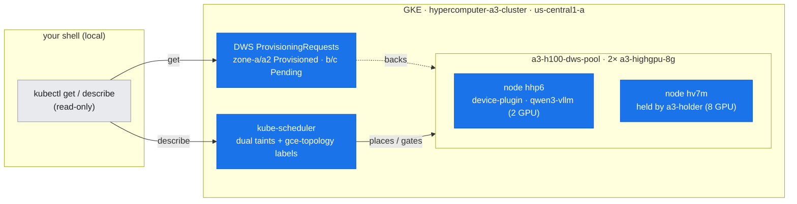
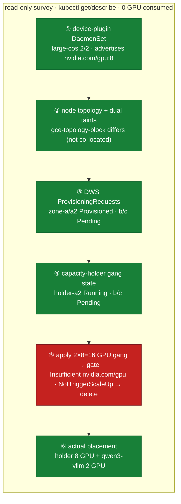

# Lab 07: GKE GPU Scheduling, Topology & Gang Admission (0-GPU-consumed)

**Objective:** Survey — with machine-checkable evidence — **how a pod lands on a GPU node** on this DWS-provisioned A3 H100 cluster: the device plugin that advertises `nvidia.com/gpu`, the two taints that fence the nodes, the GCE topology labels that reveal (im)perfect co-location, the DWS `ProvisioningRequest` gang objects and their capacity holders, and the scheduling gate a too-large distributed job hits. This is the admission layer above doc-06's ~28.6 GB/s inter-node floor.

**Duration:** ~2 minutes.

**Safety:** This lab **consumes no GPU**. Steps 1–4 and 6 are read-only `kubectl get/describe`. Step 5 submits a 2×8-GPU demo Job (`manifests/gang-pending-demo.yaml`) that **cannot fit** and therefore **never runs** — it is applied only long enough to capture its `FailedScheduling` event, then deleted immediately. No holder, no vLLM, and no running workload is disturbed, and the `NotTriggerScaleUp` event confirms it never even triggered a pool scale-up. Nothing on the DWS-held node pool is modified.

**Prerequisites:** Read [doc-07](../../docs/part3-clustering-execution/07-gke-scheduling-topology.md); the inter-node floor it builds on is [doc-06](../../docs/part2-inter-node/06-nccl-collectives.md).

---

## Where this runs (the environment)

*The scheduling/admission layer of the 2-node us-central1 cluster, surveyed read-only: the device plugin, node taints/topology labels, DWS ProvisioningRequests, and the capacity holders that keep the provisioned nodes held. No GPU is consumed.*



## Run

```bash
bash labs/lab-07-gke-gang-schedule/run.sh
```

The runner:
1. Captures the **GPU device-plugin** DaemonSet and its running pods (`device-plugin.txt`).
2. Captures both GPU nodes' **topology labels + taints** (`node-topology.txt`).
3. Captures the **DWS ProvisioningRequests** and their status conditions (`provisioning-requests.txt`).
4. Captures the live **capacity-holder** gang state (`holder-gang-state.txt`).
5. Applies the **Pending gang demo** Job (2×8 GPU), waits ~15 s, captures the `FailedScheduling` gate (`gang-pending-events.txt`), then **deletes** the Job.
6. Captures **what is actually scheduled** on the GPU nodes (`gpu-pod-placement.txt`).

*The six steps: five read-only captures plus one apply-and-delete probe (⑤, red) — a 16-GPU gang that cannot fit, so it never runs and is deleted immediately.*



---

## What was captured (real output)

### 1. The device plugin advertises `nvidia.com/gpu: 8` — `assets/lab-07/device-plugin.txt`

```
NAME                                  DESIRED   CURRENT   READY   ...
nvidia-gpu-device-plugin-large-cos    2         2         2      ...   <- active
nvidia-gpu-device-plugin-large-ubuntu 0         0         0      ...
nvidia-gpu-device-plugin-small-cos    0         0         0      ...
...
### running device-plugin pods:
nvidia-gpu-device-plugin-large-cos-9hpbr  3/3  Running ... gke-...-hhp6
nvidia-gpu-device-plugin-large-cos-ndsz7  3/3  Running ... gke-...-hv7m
```

GKE ships size/OS variants (small/medium/large × cos/ubuntu); only **`large-cos`** matches an a3-highgpu-8g COS node, so only it runs (2/2, one pod per GPU node). Each running pod advertises **`nvidia.com/gpu: 8`** for its node.

### 2. Dual taints + topology labels — `assets/lab-07/node-topology.txt`

```
### ...-hhp6 labels
  beta.kubernetes.io/instance-type = a3-highgpu-8g
  cloud.google.com/gce-topology-block = b507111e53ee24d6bd15dd9720d58829
  cloud.google.com/gce-topology-subblock = 2cd87b066ececf8554f79cdc6e374a4c
  cloud.google.com/gke-accelerator = nvidia-h100-80gb
  topology.gke.io/zone = us-central1-a
 taints:
  nvidia.com/gpu=present:NoSchedule
  cloud.google.com/gke-queued=true:NoSchedule

### ...-hv7m labels
  cloud.google.com/gce-topology-block = d97ad0f3cdd5ab02d889f5cf5e31a25d
  cloud.google.com/gce-topology-subblock = 915f03607bfcf9c91fdbd7f0007252b3
  ...
 taints:
  nvidia.com/gpu=present:NoSchedule
  cloud.google.com/gke-queued=true:NoSchedule
```

Both nodes are `a3-highgpu-8g` / `nvidia-h100-80gb` in `us-central1-a`, and both carry **two** taints — a GPU pod must tolerate `nvidia.com/gpu` (auto-added for GPU pods) **and** `cloud.google.com/gke-queued` (must be tolerated explicitly). Their `gce-topology-block` values **differ** (`b507…` vs `d97a…`), so the two nodes are **in different blocks** — not co-located, not rail-aligned.

### 3. DWS ProvisioningRequests — `assets/lab-07/provisioning-requests.txt`

```
NAME                  ACCEPTED   PROVISIONED   FAILED   AGE
a3-h100-req-zone-a    True       True                   5d17h
a3-h100-req-zone-a2   True       True                   2d5h
a3-h100-req-zone-b    True       False                  5d17h
a3-h100-req-zone-c    True       False                  5d17h
### conditions:
  a3-h100-req-zone-a:  [Accepted=True, Provisioned=True, BookingExpired=True]
  a3-h100-req-zone-b:  [Accepted=True, Provisioned=False]
```

zone-a / zone-a2 provisioned (our two live nodes) and are now `BookingExpired`; zone-b / zone-c have been `Accepted` but `Provisioned=False` for 5d17h — DWS never found capacity for them.

### 4. Capacity holders keep the nodes held — `assets/lab-07/holder-gang-state.txt`

```
NAME                          STATUS    NODE           AGE
a3-holder-zone-a2-...-6hcfn   Running   gke-...-hv7m   147m    <- holds 8 GPUs
a3-holder-zone-b-...-4rdbj    Pending   <none>         5d17h   <- waits on req-zone-b
a3-holder-zone-c-...-2jhx7    Pending   <none>         5d17h   <- waits on req-zone-c
```

`holder-zone-a2` holds all 8 GPUs on hv7m so the node is never left idle; holders b/c are stuck Pending because their backing requests are `Provisioned=False`. (Standing rule: a provisioned DWS GPU node is always held.)

### 5. The gang Pending gate — `assets/lab-07/gang-pending-events.txt`

```
### pods (expect Pending):
gang-pending-demo-0-l49j8   0/1   Pending   ...
gang-pending-demo-1-cwllv   0/1   Pending   ...
### describe (one pod):
  Warning  FailedScheduling   default-scheduler   0/3 nodes are available:
      1 node(s) didn't match ... , 2 Insufficient nvidia.com/gpu. ...
  Normal   NotTriggerScaleUp  cluster-autoscaler  Pod didn't trigger scale-up ...
```

Two pods × `nvidia.com/gpu: 8` = **16 GPUs** requested, but one node is fully held and the other is running vLLM on 2 GPUs — nowhere near 16 free. Both pods stay Pending with **`Insufficient nvidia.com/gpu`**, and **`NotTriggerScaleUp`** proves a bare Pending pod does *not* grow a DWS pool. The Job **never ran** and was deleted immediately.

### 6. What is actually scheduled — `assets/lab-07/gpu-pod-placement.txt`

```
default/a3-holder-zone-a2-...  gpu=8  node=gke-...-hv7m  phase=Running
default/a3-holder-zone-b-...   gpu=8  node=-             phase=Pending
default/a3-holder-zone-c-...   gpu=8  node=-             phase=Pending
inference/qwen3-vllm-...       gpu=2  node=gke-...-hhp6  phase=Running
```

Only the holder on hv7m (8 GPUs) and qwen3-vllm on hhp6 (2 GPUs) are running — exactly why a 16-GPU gang cannot fit.

---

## Interpretation

- **Device plugin → resource:** physical H100s become the schedulable extended resource `nvidia.com/gpu: 8`; requests must equal limits. Only the `large-cos` DaemonSet variant is active.
- **Dual taints:** GPU pods must tolerate **both** `nvidia.com/gpu` and `cloud.google.com/gke-queued`; the second gates DWS queued-provisioning nodes and is not auto-tolerated.
- **Topology:** the two nodes are in **different `gce-topology-block`s** — a real, slightly-imperfect placement that (together with the plain-TCP path of doc-05/06) explains why cross-node all-reduce sits at the ~28.6 GB/s floor.
- **DWS lifecycle:** `ProvisioningRequest` runs `Accepted → Provisioned → BookingExpired`; only zone-a/a2 ever provisioned. Holders keep those nodes held so they aren't reclaimed.
- **Scheduling gate:** the default scheduler places pods independently, so a too-large gang is simply `Pending` with `Insufficient nvidia.com/gpu`; `NotTriggerScaleUp` shows Pending pods don't provision — you need a ProvisioningRequest, and true gang admission needs Kueue/JobSet ([doc-08](../../docs/part3-clustering-execution/08-job-frameworks-jobset-kueue.md)).

## Teardown

Teardown is **automatic** — `run.sh` deletes the demo Job in step 5. To confirm nothing lingers:

```bash
kubectl get pods -l job-name=gang-pending-demo    # expect none
```

The capacity holders (`a3-holder-*`) and any running workload are intentionally left untouched.

---

**Mechanism →** [doc-07: GKE scheduling, topology & gang admission](../../docs/part3-clustering-execution/07-gke-scheduling-topology.md)
**Builds on →** [doc-06: NCCL collectives](../../docs/part2-inter-node/06-nccl-collectives.md)
**Next →** [doc-08: Job frameworks — JobSet & Kueue](../../docs/part3-clustering-execution/08-job-frameworks-jobset-kueue.md)
**Tools →** [T5: Networking & Fabric Tools](../../docs/toolkit/T5-networking-fabric-tools.md) · [T1: Monitoring & Inventory](../../docs/toolkit/T1-monitoring-inventory.md)
