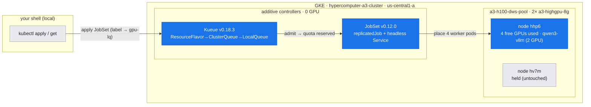
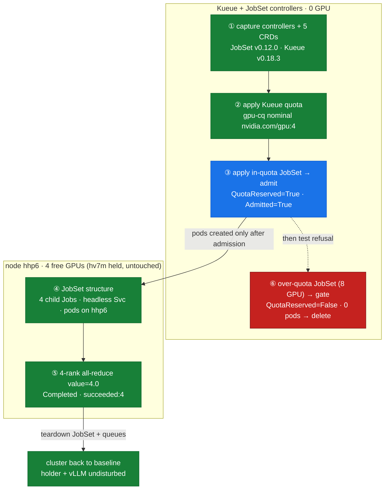

# Lab 08: JobSet Multi-Node NCCL via Kueue (4 GPUs, real collective)

**Objective:** Show — end to end, with a **real NCCL all-reduce** — how a distributed GPU job is *admitted* and *wired* on GKE: **Kueue** gang-admits the job against a quota pool, **JobSet** fans it out to N ranks joined by a headless-service pod-DNS rendezvous, and the ranks complete a collective. Then show Kueue **refusing** an over-quota job (no pods created). This is the all-or-nothing gang-admission layer that doc-07's raw scheduler could not provide.

**Duration:** ~2–3 minutes.

**Safety:** This lab **uses 4 GPUs of hhp6's free headroom only**. The ClusterQueue quota is set to `nvidia.com/gpu: 4` and the JobSet requests exactly 4 (4 workers × 1 GPU), which fits inside the free GPUs on `hhp6` and **never touches the DWS-held node `hv7m` or the running qwen3-vllm**. The workers run a ~10 s all-reduce and exit; the admitted JobSet and the over-quota demo JobSet are both **deleted at the end**, returning the cluster to its prior state. Kueue and JobSet controllers are installed **additively** (they consume no GPU); teardown is documented below.

**Prerequisites:** Read [doc-08](../../docs/part3-clustering-execution/08-job-frameworks-jobset-kueue.md); the scheduling substrate it builds on is [doc-07](../../docs/part3-clustering-execution/07-gke-scheduling-topology.md). JobSet & Kueue controllers and CRDs must be installed (see Setup).

---

## Setup (one-time, additive)

```bash
# JobSet controller + CRDs
kubectl apply --server-side -f https://github.com/kubernetes-sigs/jobset/releases/download/v0.12.0/manifests.yaml
# Kueue controller + CRDs
kubectl apply --server-side -f https://github.com/kubernetes-sigs/kueue/releases/download/v0.18.3/manifests.yaml
```

Both land as `1/1` controller Deployments in `jobset-system` / `kueue-system` and register their CRDs (`assets/lab-08/controllers.txt`). They consume **no GPU**.

## Where this runs (the environment)

*The additive Kueue + JobSet control plane on the 2-node us-central1 cluster; the admitted 4-GPU JobSet lands only in hhp6's free headroom — the DWS-held node hv7m and qwen3-vllm are never touched.*



## Run

```bash
bash labs/lab-08-jobset-multinode/run.sh
```

The runner:
1. Captures the **JobSet + Kueue controllers** and their CRDs (`controllers.txt`).
2. Applies the **Kueue quota objects** (`manifests/kueue-gpu-queues.yaml`) and captures them (`queues.txt`).
3. Applies the **in-quota JobSet** (`manifests/jobset-nccl.yaml`) and captures Kueue's **admission** decision (`admission.txt`).
4. Captures the JobSet **structure** — child Jobs, headless Service, pod→node placement (`jobset-structure.txt`).
5. Waits for completion and captures the **4-rank all-reduce result** (`allreduce-result.txt`) and the JobSet's **terminal state** (`jobset-final.txt`).
6. Applies the **over-quota JobSet** (`manifests/jobset-overquota.yaml`), captures the **gate** (`overquota-gate.txt`), then deletes it.
7. (Separately) the admitted JobSet is torn down after capture.

*The flow across two zones: the controller plane admits (or refuses ⑥, red) the job, and only after admission are worker pods placed on hhp6 to run the real collective (⑤, green success value=4.0).*



---

## What was captured (real output)

### 1. Both controllers + CRDs — `assets/lab-08/controllers.txt`

```
jobset-controller-manager   1/1  ... registry.k8s.io/jobset/jobset:v0.12.0
kueue-controller-manager    1/1  ... registry.k8s.io/kueue/kueue:v0.18.3
### CRDs
clusterqueues.kueue.x-k8s.io  jobsets.jobset.x-k8s.io  localqueues.kueue.x-k8s.io
resourceflavors.kueue.x-k8s.io  workloads.kueue.x-k8s.io
```

JobSet **v0.12.0** and Kueue **v0.18.3**, both `1/1` Available; the five CRDs registered.

### 2. Kueue quota objects — `assets/lab-08/queues.txt`

```
NAME     COHORT   STRATEGY         PENDING WORKLOADS   ADMITTED WORKLOADS
gpu-cq            BestEffortFIFO   0                   0
NAME     CLUSTERQUEUE   PENDING WORKLOADS   ADMITTED WORKLOADS
gpu-lq   gpu-cq         0                   0
```

`ResourceFlavor a3-h100` (selects `gke-accelerator=nvidia-h100-80gb`) → `ClusterQueue gpu-cq` (nominal `nvidia.com/gpu: 4`, Active/"Can admit new workloads") → `LocalQueue gpu-lq` in `default`. Quota is small **on purpose** so 4 GPUs fit and 8 do not.

### 3. Kueue admits the in-quota JobSet — `assets/lab-08/admission.txt`

```
NAME                       QUEUE    RESERVED IN   ADMITTED   AGE
jobset-nccl-jobset-b8196   gpu-lq   gpu-cq        True       8s
  jobset-nccl-jobset-b8196: cq=gpu-cq conds=[('QuotaReserved','True'),('Admitted','True')]
```

Kueue auto-created a **Workload** for the labelled JobSet and admitted it: `QuotaReserved=True` (4 GPUs booked in `gpu-cq`) + `Admitted=True`. Only *then* are pods created.

### 4. JobSet structure — `assets/lab-08/jobset-structure.txt`

```
### child Jobs (one per replica)
nccl-jobset-worker-0 ... nccl-jobset-worker-3   (image nvcr.io/nvidia/pytorch:24.10-py3)
### headless Service (provides pod DNS)
nccl-jobset   ClusterIP   None    <none>    ...      <- None = headless
### pods -> node placement
nccl-jobset-worker-0-0-rjg9d  10.36.0.39  gke-...-hhp6
nccl-jobset-worker-1-0-kvbps  10.36.0.38  gke-...-hhp6
nccl-jobset-worker-2-0-6fszb  10.36.0.37  gke-...-hhp6
nccl-jobset-worker-3-0-dxkvs  10.36.0.36  gke-...-hhp6
```

Four child Jobs (one per replica); a **headless** Service (`CLUSTER-IP: None`) so `nccl-jobset-worker-0-0.nccl-jobset` resolves straight to rank 0's pod IP; all four pods on **hhp6** (the free node) — never on the held `hv7m`.

### 5. The real 4-rank all-reduce — `assets/lab-08/allreduce-result.txt`

```
RANK 0/4 all_reduce done value=4.0 (expect 4.0)   MASTER=nccl-jobset-worker-0-0.nccl-jobset
RANK 1/4 all_reduce done value=4.0 (expect 4.0)
RANK 2/4 all_reduce done value=4.0 (expect 4.0)
RANK 3/4 all_reduce done value=4.0 (expect 4.0)
```

Every rank all-reduced a 1 GiB tensor of ones and got **4.0** — the arithmetically-correct sum over 4 ranks. This one number proves admission + placement + pod-DNS rendezvous + NCCL collective all worked. Terminal state (`jobset-final.txt`): `Completed=True`, `succeeded: 4`.

### 6. Kueue gates the over-quota JobSet — `assets/lab-08/overquota-gate.txt`

```
workload: jobset-nccl-jobset-overquota-fc214 conds= [('QuotaReserved','False','Pending')]
### pods for over-quota jobset (expect NONE):
No resources found in default namespace.
```

The 8-GPU JobSet exceeds the quota of 4, so Kueue leaves it **suspended**: `QuotaReserved=False` and **zero pods created**. Contrast doc-07, where an over-large gang produced *Pending pods* — here nothing is placed at all.

---

## Interpretation

- **JobSet = shape + rendezvous:** one `replicatedJob` → N child Jobs, joined by an auto-created **headless Service** giving each pod a stable DNS name `<jobset>-<job>-<idx>-0.<jobset>`. That is the rendezvous point NCCL/`torch.distributed` needs.
- **Kueue = gate:** `ResourceFlavor → ClusterQueue → LocalQueue`, one **Workload** per job. Admission is **atomic** — the whole gang's quota is reserved before any pod exists, so partial placement (doc-07) cannot occur.
- **Within quota → admitted** (`QuotaReserved=True, Admitted=True`, pods on hhp6, all-reduce `4.0`). **Over quota → held** (`QuotaReserved=False`, no pods). This is the decisive upgrade over the raw scheduler.
- The collective ran across 4 GPUs **within one node** (intra-node NVLink); the machinery is identical for many nodes — this lab isolates the admission/rendezvous layer, not the cross-node bandwidth of doc-06.

## Teardown

`run.sh` deletes the over-quota JobSet automatically. Then remove the admitted JobSet, the queues, and (optionally) the controllers:

```bash
kubectl delete jobset nccl-jobset --ignore-not-found            # admitted job (already Completed)
kubectl delete -f manifests/kueue-gpu-queues.yaml               # gpu-lq, gpu-cq, a3-h100
# optional: remove the controllers entirely
kubectl delete -f https://github.com/kubernetes-sigs/kueue/releases/download/v0.18.3/manifests.yaml
kubectl delete -f https://github.com/kubernetes-sigs/jobset/releases/download/v0.12.0/manifests.yaml
```

Confirm nothing lingers and the holder + vLLM are untouched:

```bash
kubectl get jobset,workloads -A                                 # expect none in default
kubectl get pods -A -o wide | grep -E 'holder|vllm'             # still Running, undisturbed
```

---

**Mechanism →** [doc-08: Job frameworks — JobSet & Kueue](../../docs/part3-clustering-execution/08-job-frameworks-jobset-kueue.md)
**Builds on →** [doc-07: GKE scheduling, topology & gang admission](../../docs/part3-clustering-execution/07-gke-scheduling-topology.md)
**Next →** [doc-09: Distributed training — DDP & FSDP](../../docs/part3-clustering-execution/09-distributed-training-ddp-fsdp.md)
**Tools →** [T1: Monitoring & Inventory](../../docs/toolkit/T1-monitoring-inventory.md) · [T6: Portability Matrix](../../docs/toolkit/T6-portability-matrix.md)
