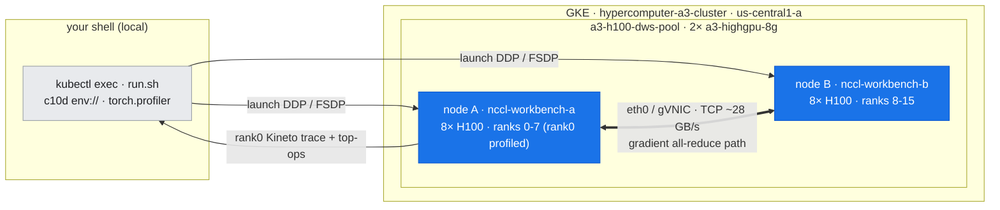
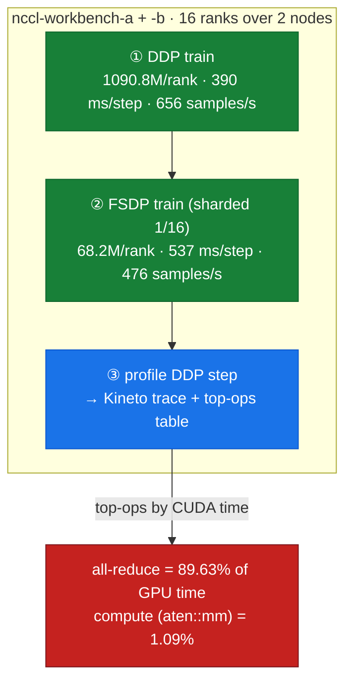
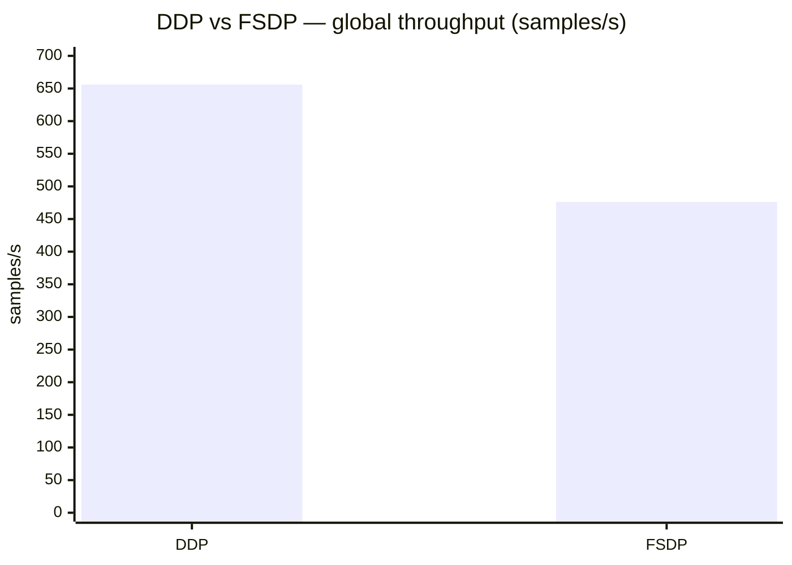

# Lab 09: 2-node DDP vs FSDP training (communication, profiled)

**Objective:** Run real distributed training across **two** A3 nodes (16 GPUs) under two parallelism strategies — **DDP** and **FSDP** — and use `torch.profiler` to show, from a captured trace, that on this cluster the step is **dominated by the inter-node all-reduce** measured in lab-06. This is where the ~28 GB/s network floor stops being a microbenchmark and starts costing training throughput.

**Duration:** ~10 minutes (inside two existing 8-GPU pods)

**Prerequisites:**
- Two 8-GPU pods, one per A3 node (`nccl-workbench-a` / `-b`, `hostNetwork: true`)
- Read [doc-09](../../docs/part3-clustering-execution/09-distributed-training-ddp-fsdp.md), and [lab-06](../lab-06-2node-nccl-collectives/) for the underlying collective bandwidth

---

## Where this runs (the environment)

*Same two 8-GPU pods as lab-06 on the 2-node us-central1 cluster; each training step's gradient collective crosses the node boundary over the ~28 GB/s TCP/gVNIC path, and rank 0 exports a profiler trace.*



## Run

```bash
LAB09_POD_A=nccl-workbench-a LAB09_POD_B=nccl-workbench-b \
  bash labs/lab-09-ddp-fsdp/run.sh
```

**Files:**
- `train_ddp_fsdp.py` — `--mode ddp|fsdp`, synthetic data (8× `Block` MLP stack, dim 4096); prints per-step loss/`step_ms`/samples-per-s and a steady-state summary (skips the first 5 steps). `--profile` wraps the loop in `torch.profiler` and, on rank 0, exports a Chrome trace + a top-ops table.
- Reuses lab-06's `launch_node.sh` via its `BENCH_SCRIPT`/`BENCH_ARGS` hooks — same manual c10d `env://` launch, no MPI/SSH.
- assets: `ddp_2node.txt`, `fsdp_2node.txt`, `ddp_profiler_top_ops.txt`, `ddp_trace_rank0.json.gz` (open in `chrome://tracing` or Perfetto)

*The lab's phases: run both strategies, then profile the DDP step — the profiler makes the bottleneck unambiguous (red = all-reduce dominates GPU time).*



---

## What was measured (real output)

### 1. DDP vs FSDP throughput — `assets/lab-09/{ddp,fsdp}_2node.txt`

Identical model, 16 ranks over 2 nodes, batch 16/rank, dim 4096, 8 layers:

*Figure: DDP is faster here (656 vs 476 samples/s) even though FSDP is 16x lighter per rank (68.2 M vs 1090.8 M params) — over a 28 GB/s TCP path, FSDP's extra collective costs throughput.*



| mode | params **per rank** | steady-state ms/step | global samples/s |
| :--- | ---: | ---: | ---: |
| **DDP** | ~1090.8 M (full replica) | **390.26** | **656.0** |
| **FSDP** | ~68.2 M (sharded 1/16) | 537.56 | 476.2 |

Two honest takeaways, both counterintuitive until you look at the network:

1. **FSDP is *slower* here, not faster.** FSDP shards parameters to **1/16** the per-rank memory (1090.8 M → 68.2 M), but it pays for that with **two** inter-node collectives per step (all-gather on forward, reduce-scatter on backward) instead of DDP's **one** (gradient all-reduce). Over a **28 GB/s TCP** path (lab-06), that extra communication costs ~38% throughput. On a fast fabric the gap shrinks or flips — and the size of that effect is now measured, not assumed: the same all-reduce runs **3.5×** faster on GPUDirect-TCPX ([lab-18](../lab-18-enable-gpudirect-tcpx/), 83.27 GB/s) and **13.4×** on TCPXO ([lab-22](../lab-22-fabric-diagnostics/), 317.84 GB/s). FSDP's extra collective is precisely the term those multipliers divide.
2. **FSDP's value is memory, not speed** — on *this* small model it's a net loss, but it's the only way to train a model whose parameters don't fit in one GPU. The trade is **memory ↔ communication**, and the exchange rate is set by the network. See [doc-09](../../docs/part3-clustering-execution/09-distributed-training-ddp-fsdp.md).

### 2. The step is dominated by the all-reduce — `assets/lab-09/ddp_profiler_top_ops.txt`

The DDP profiler top-ops table (sorted by CUDA time) makes the bottleneck unambiguous:

```
                                   Name              Self CUDA   Self CUDA %   # of Calls
                        c10d::allreduce_                 1.902s       89.63%           85
ncclDevKernel_AllReduce_Sum_f32_TREE_LL(...)             1.902s       89.63%           85
              Optimizer.step#AdamW.step               152.077ms        7.17%            5
                               aten::mm                23.105ms        1.09%          165
Self CUDA time total: 2.122s
```

- **The gradient all-reduce is 89.63% of GPU time** — `1.902 s` across 85 calls (~22.4 ms each). The compute (`aten::mm`, the actual matmuls) is **1.09%**. The optimizer (AdamW) is 7.17%.
- This is the lab-06 result showing up *inside a real training step*: with the collective pinned to ~28 GB/s over TCP, the GPUs spend the overwhelming majority of each step **waiting on the network**, not computing.
- Note `ncclDevKernel_AllReduce_Sum_f32_TREE_LL` — NCCL picked its **TREE** algorithm with the **LL** (low-latency) protocol for this 2-node shape, consistent with lab-06's transport log.

> **Read the trace yourself:** `gunzip -c assets/lab-09/ddp_trace_rank0.json.gz > trace.json` and open it in `chrome://tracing` or [Perfetto](https://ui.perfetto.dev). The NCCL all-reduce stream visibly overlaps (and gates) the backward pass — DDP's bucketing exists precisely to maximize that overlap.

---

## What this lab does **not** claim

- Throughput numbers reflect **this synthetic model on this TCP-only cluster** — they are illustrative of the *communication pattern*, not a benchmark of A3 High's achievable training speed with GPUDirect-TCPX enabled.
- The "FSDP slower than DDP" result is specific to a model small enough to fit under DDP; for models that don't fit, DDP is simply not an option.

---

**Concepts →** [doc-09 DDP/FSDP](../../docs/part3-clustering-execution/09-distributed-training-ddp-fsdp.md) · [doc-06 NCCL collectives](../../docs/part2-inter-node/06-nccl-collectives.md)
**Depends on →** [lab-06 2-node NCCL](../lab-06-2node-nccl-collectives/) (the collective this step is bound by)
**Tools →** [T3 Profiling/Tracing](../../docs/toolkit/T3-profiling-tracing.md) · [T4 Benchmarking](../../docs/toolkit/T4-benchmarking.md)
