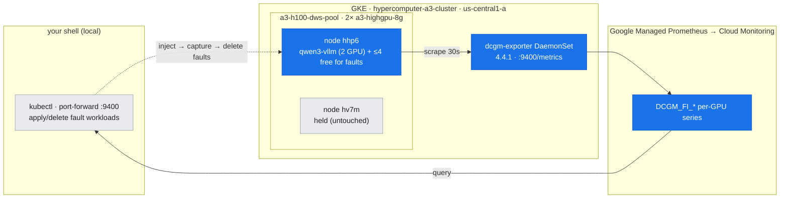
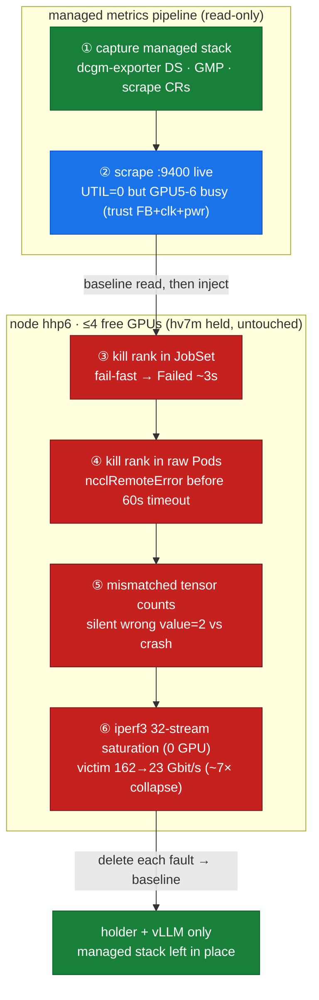

# Lab 10: Fleet Observability & Fault Debugging (real metrics + 4 fault signatures)

**Objective:** Read the **GKE-managed** GPU metrics pipeline live (DCGM → `dcgm-exporter` → GMP → Cloud Monitoring), with genuine nonzero data from the running vLLM workload — then inject **four real, reversible faults** and capture the exact signature each leaves, so you can triage symptom → signature → root cause → fix.

**Duration:** ~8–10 minutes (metrics are instant; each fault runs a short collective, is captured, and is deleted).

**Safety:** Part A is **read-only** (the managed stack is already deployed by GKE — nothing is installed). Part B injects faults **on hhp6's free GPUs only** (≤4 of 6 free), each applied → captured → **deleted within seconds**. The NIC-saturation probe is `hostNetwork` iperf3 using **0 GPU**. Nothing touches the **DWS-held node hv7m** or the **qwen3-vllm** workload; after the run only the holder + vLLM remain as GPU consumers.

**Prerequisites:** Read [doc-10](../../docs/part3-clustering-execution/10-observability-debugging.md). Builds on the gang machinery ([doc-08](../../docs/part3-clustering-execution/08-job-frameworks-jobset-kueue.md)), the NCCL floor ([doc-06](../../docs/part2-inter-node/06-nccl-collectives.md)), and the shared-gVNIC path ([doc-05](../../docs/part2-inter-node/05-nic-rdma-gpudirect.md)). JobSet installed from lab-08.

---

## Where this runs (the environment)

*The GKE-managed metrics pipeline (DCGM → dcgm-exporter → GMP → Cloud Monitoring) reading the live cluster, plus fault injections confined to hhp6's free GPUs; the DWS-held node hv7m and qwen3-vllm are never touched.*



## Run

```bash
bash labs/lab-10-observability-fleet-debug/run.sh
```

The runner does two parts:

**Part A — the managed metrics pipeline (read-only):**
1. Captures the `dcgm-exporter` DaemonSet, GMP collectors, and scrape CRs (`managed-stack.txt`).
2. Port-forwards the exporter pod on `hhp6` and scrapes `:9400/metrics` live (`dcgm-metrics-raw.txt`), then curates a per-GPU table (`dcgm-per-gpu-summary.txt`).
3. Captures the `ClusterPodMonitoring` scrape config (`scrape-config.txt`).

**Part B — four fault injections (each captured, then deleted):**
4. **Fault (a) sig#1** — a JobSet all-reduce with one rank force-deleted → JobSet **fail-fast** (`fault-kill-rank-jobset-signature.txt`).
5. **Fault (a) sig#2** — the same kill against **raw Pods** (no gang controller) so survivors reach NCCL's `ncclRemoteError` path (`fault-nccl-hang-signature.txt`).
6. **Fault (c)** — two ranks with mismatched tensor counts → silent wrong answer vs crash (`fault-env-mismatch-signature.txt`).
7. **Fault (b)** — two `hostNetwork` iperf3 probes: a victim flow measured alone, then during a 32-stream saturating load (`fault-nic-saturation.txt`).

> The kill/mismatch faults depend on **timing** (kill a rank mid-collective), so the runner sleeps between apply and kill; the committed asset files are the curated views of those real runs.

*Two phases: read the live metrics baseline (blue), then inject four reversible faults on hhp6 (red), each captured and deleted — returning the cluster to holder + vLLM only.*



---

## What was captured (real output)

### 1. GKE-managed stack — `assets/lab-10/managed-stack.txt`

```
dcgm-exporter   2/2   ...   gke-dcgm-exporter:4.4.1-4.6.0-gke.17   (:9400/metrics)
clusterpodmonitoring   gke-managed-dcgm-exporter   (interval 30s, port metrics)
```

A DaemonSet (one pod per GPU node) plus a `ClusterPodMonitoring` CR — the default GKE GPU posture. Not installed by the lab.

### 2. Live per-GPU metrics — `assets/lab-10/dcgm-per-gpu-summary.txt`

```
GPU  SM_CLK   PWR_W   UTIL%  FB_USED_MiB  POD
0–4,7  345    ~70     0      0            —            (idle)
5    1980     126.6   0      77581        qwen3-vllm-...
6    1980     122.4   0      77581        qwen3-vllm-...
```

**Every GPU reads `UTIL=0`, yet GPUs 5–6 are busy** — `SM_CLK 1980`, `~125 W`, `FB_USED 77581 MiB`, labelled `qwen3-vllm`. Lesson: trust **FB + clock + power** (and `PROF_*` fields), not `GPU_UTIL`, for occupancy. The exporter joins each GPU to its consuming pod.

### 3. Fault (a) sig#1 — JobSet fail-fast — `assets/lab-10/fault-kill-rank-jobset-signature.txt`

```
(rank 3 force-deleted)  →  ~3s later: terminalState=Failed, reason=FailedJobs, restarts=0
```

Default `failurePolicy` is fail-fast: one dead rank fails the **whole gang** in ~3 s. Set `maxRestarts` to retry the gang.

### 4. Fault (a) sig#2 — `ncclRemoteError` on survivors — `assets/lab-10/fault-nccl-hang-signature.txt`

```
[rank0]:[E722 08:55:15 ProcessGroupNCCL.cpp:1605] ... NCCL error: remote process exited...
ncclRemoteError: ... a remote process exiting prematurely.   (SeqNum=19 ALLREDUCE, Timeout=60000)
[nccl-hang-0:1 :0:98] Caught signal 11
```

Rank 0 (healthy) reports a **peer's** death — and abort came in ~5 s, **well before** the 60 s timeout, which distinguishes a *crash* from a true *hang*. Triage by finding the rank that exited first (OOMKilled / XID / NotReady).

### 5. Fault (c) — mismatched config — `assets/lab-10/fault-env-mismatch-signature.txt`

```
rank 1 (2^27 elems):  value=2  exit 0  (Succeeded)   <- silent WRONG answer
rank 0 (2^28 elems):  signal 11  exit 139 (Failed)
```

The most dangerous class: one rank returns a plausible-but-wrong value and exits 0. Pin one image/NCCL/CUDA, assert equal shapes/`world_size`.

### 6. Fault (b) — NIC saturation — `assets/lab-10/fault-nic-saturation.txt`

```
victim alone (8 streams):        162 Gbit/s
noisy neighbour (32 streams):    163 Gbit/s   <- gVNIC ceiling
victim DURING saturation:         23 Gbit/s   <- ~7× collapse
```

A co-tenant saturating the single shared gVNIC steals ~7× of a cross-node collective's bandwidth, GPUs perfectly healthy. (Live cross-node NCCL not run — hv7m is held; iperf3 over the identical gVNIC is the GPU-free proxy for the lab-06 busbw floor.)

---

## Interpretation — the triage rule

| Symptom | Root cause | First check |
| :--- | :--- | :--- |
| Slow & variable collective, GPUs healthy | NIC saturation / noisy neighbour | host NIC throughput, co-tenant pods |
| Hang → abort at **exactly** the PG timeout | true stall (deadlock / straggler) | mismatched collective order, one slow rank |
| `ncclRemoteError` **before** timeout | a **peer** died first | earliest exit; OOMKilled / XID / NotReady |
| One rank exit 0 wrong value, another crashes | per-rank config/shape mismatch | pin image; assert shapes & world_size |
| Whole JobSet Failed in ~seconds, restarts=0 | JobSet fail-fast (expected) | set `maxRestarts` to retry the gang |

**Before blaming your code, read the metrics:** healthy DCGM + slow collective ⇒ the problem is *between* the GPUs (network or a dead/straggling peer), not inside them.

## Teardown

`run.sh` deletes every fault workload as it finishes. Confirm the cluster is back to baseline:

```bash
kubectl get jobset,pods -l app -A                       # expect no nccl-hang / nccl-mismatch / fault-* pods
kubectl get pods -A -o wide | grep -E 'holder|vllm'     # still Running, undisturbed
```

The managed metrics stack (`gke-managed-system`, `gmp-system`) is GKE-owned — leave it in place.

---

**Mechanism →** [doc-10: Observability & debugging](../../docs/part3-clustering-execution/10-observability-debugging.md)
**Builds on →** [doc-08: Job frameworks — JobSet & Kueue](../../docs/part3-clustering-execution/08-job-frameworks-jobset-kueue.md)
**Tools →** [T1: Monitoring & Inventory](../../docs/toolkit/T1-monitoring-inventory.md) · [T2: Health & Diagnostics](../../docs/toolkit/T2-health-diagnostics.md) · [T3: Profiling & Tracing](../../docs/toolkit/T3-profiling-tracing.md)
