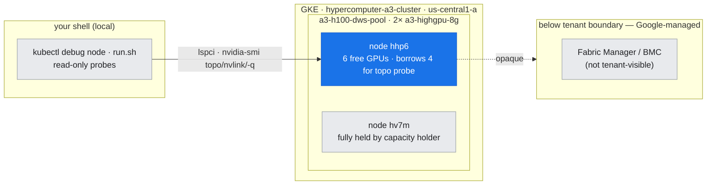
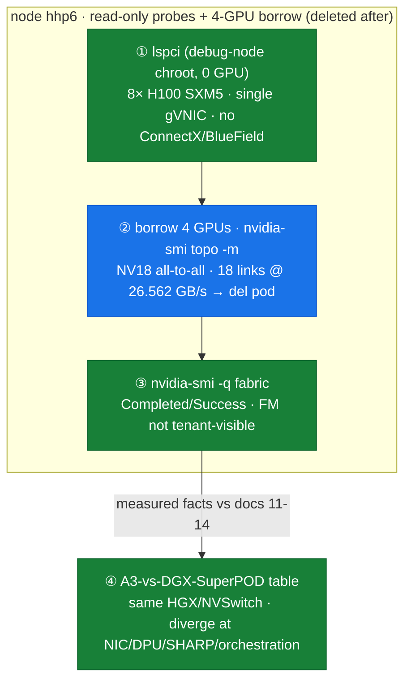
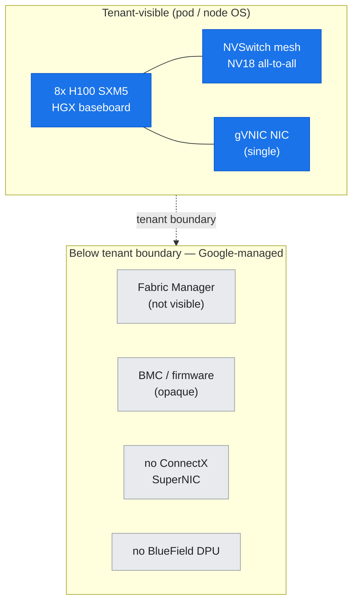
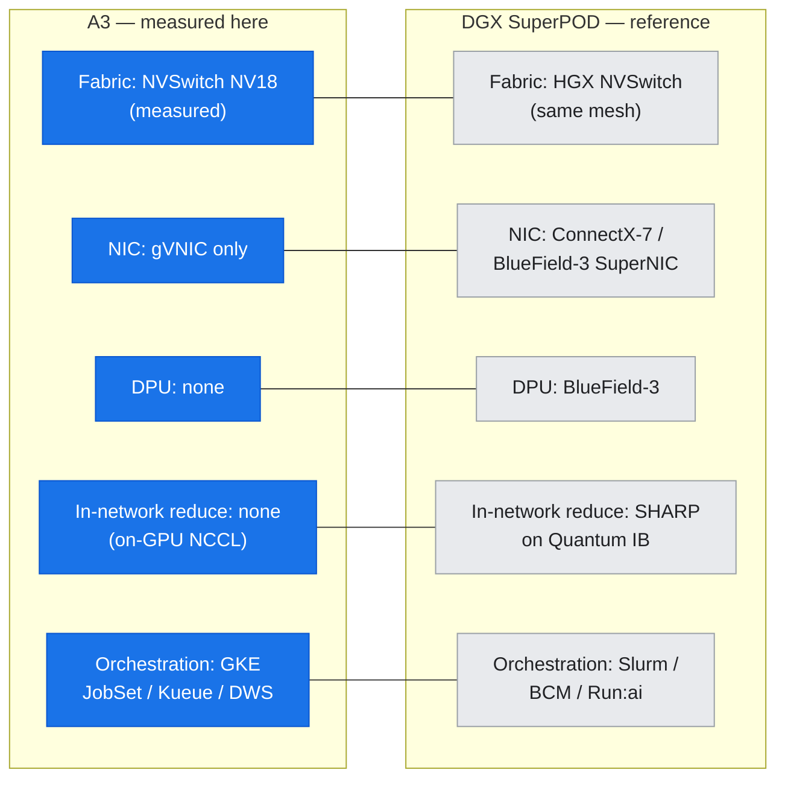

# Lab 11: Platform Compare — A3 Tenant View vs. DGX SuperPOD

**runnable-here = the probes below; read-only = the DGX/SuperPOD reference material** (docs [11](../../docs/part4-platform-reference-arch/11-dgx-hgx-systems.md)–[14](../../docs/part4-platform-reference-arch/14-dgx-superpod.md)).

**Objective:** Ground Part IV's knowledge-first content in observable cluster facts. Using only read-only probes — that do **not** touch any capacity holder or the running inference/Jupyter workloads — confirm what the live GCP A3 node *is* (an HGX H100 8-GPU baseboard with a trained NVSwitch mesh) and what it *is not* (no tenant-visible Fabric Manager, BlueField DPU, or Mellanox/ConnectX SuperNIC). The output is an A3-vs-DGX-SuperPOD comparison table that separates **measured facts** from **reference knowledge**.

**Prereqs:**
- Authenticated to `hypercomputer-a3-cluster` with `kubectl`
- `REPO_ROOT` set, `scripts/lib_capture.sh` sourced
- Read [§11 DGX/HGX](../../docs/part4-platform-reference-arch/11-dgx-hgx-systems.md), [§13 Spectrum-X](../../docs/part4-platform-reference-arch/13-spectrum-x-and-fabrics.md), [§14 SuperPOD](../../docs/part4-platform-reference-arch/14-dgx-superpod.md)

---

## Where this runs (the environment)

*Where the probed node sits: your shell reaches one A3 node in the 2-node us-central1 cluster; the probe lands on hhp6 (6 free GPUs, borrows 4) while hv7m stays fully held. The DGX-style system-management layer sits below the tenant boundary. (The node's internal 8-GPU baseboard is drawn separately below.)*



## Run

```bash
bash labs/lab-11-platform-compare/run.sh
```

**GPU safety:** the script targets a node with **free** GPUs, borrows **4 GPUs** only to query the NVLink mesh, and **deletes the pod immediately** afterward. It never targets a fully-held capacity-holder node and never evicts a running workload. (In this environment `hv7m` is fully held by a capacity holder and `hhp6` has 6 free GPUs; the probe lands on `hhp6`.)

*The probe sequence: identify the hardware read-only, borrow 4 GPUs to prove the NVLink mesh (then delete the pod), confirm fabric state, and compile the A3-vs-DGX comparison table from measured facts + docs 11–14.*



---

## What was actually measured here

### 1. The node is an HGX H100 8-GPU baseboard — `assets/lab-11/node-probes.txt`

`lspci` (via a read-only `kubectl debug node` chroot, no GPU allocation needed) enumerates **8× H100 SXM5** and exactly **one** network controller — Google gVNIC:

*Figure: what the tenant can see (above the boundary) vs. what Google manages below it — no ConnectX, no BlueField, and Fabric Manager / BMC are opaque.*



```
00:0c.0 Ethernet controller: Google, Inc. Compute Engine Virtual Ethernet [gVNIC]
04:00.0 3D controller: NVIDIA Corporation GH100 [H100 SXM5 80GB] (rev a1)
... (8 total GH100 devices) ...
8b:00.0 3D controller: NVIDIA Corporation GH100 [H100 SXM5 80GB] (rev a1)
```

- **8× GH100 SXM5** → the SXM (baseboard) form factor, i.e. an HGX H100 assembly — identical GPU hardware to a DGX H100 node.
- **Only gVNIC** — no Mellanox/ConnectX and no BlueField on the bus. There is no tenant-visible GPUDirect-RDMA NIC or Spectrum-X SuperNIC.
- **`nv-fabricmanager`** returns nothing → the Fabric Manager daemon is not present/visible in the tenant node OS (Google runs it below the tenant boundary — see [§11 §2.3](../../docs/part4-platform-reference-arch/11-dgx-hgx-systems.md)).

### 2. The NVSwitch NVLink mesh is real and trained — `topo-4gpu.txt`, `nvlink-status.txt`

Borrowing 4 GPUs, `nvidia-smi topo -m` shows an **all-to-all NV18 mesh** (every GPU pair connected by 18 bonded NVLink4 links via the on-baseboard NVSwitches):

```
      GPU0  GPU1  GPU2  GPU3
GPU0   X    NV18  NV18  NV18
GPU1  NV18   X    NV18  NV18
GPU2  NV18  NV18   X    NV18
GPU3  NV18  NV18  NV18   X
```

`nvidia-smi nvlink --status` confirms **18 links/GPU @ 26.562 GB/s** each → ~900 GB/s bidirectional per GPU, matching the Hopper NVLink4 spec in [§01](../../docs/part1-single-node/01-gpu-microarchitecture.md) and [§11](../../docs/part4-platform-reference-arch/11-dgx-hgx-systems.md). (The full 8-GPU mesh needs an 8-GPU allocation — deferred to lab-04, which is blocked on GPU capacity; the 4-GPU slice proves the mesh topology and per-link rate.)

### 3. The fabric is healthy — but Fabric Manager is invisible — `fabric-state.txt`

Every GPU reports:

```
    Fabric
        State                             : Completed
        Status                            : Success
```

This is the **result** of Fabric Manager training the NVSwitch fabric — the tenant sees `Completed/Success`, but (per probe 1) cannot run `nv-fabricmanager`, read `/var/log/fabricmanager.log`, or restart the service. **This is the crux of Part IV's platform contrast:** identical HGX hardware and trained fabric, but the DGX system-management layer (NVSM, Fabric Manager, BMC) is Google-managed and not exposed.

---

## A3 (measured) vs. DGX SuperPOD (reference)

Full machine-readable table: [`assets/lab-11/a3-vs-dgx-superpod.csv`](../../assets/lab-11/a3-vs-dgx-superpod.csv). Highlights:

*Figure: same HGX GPU/fabric on both sides; the platforms diverge at the NIC, DPU, in-network reduction, and orchestration layers (A3 measured = blue, DGX reference = grey).*



| Dimension | A3 — observed here | DGX SuperPOD — reference |
| :--- | :--- | :--- |
| GPU / baseboard | 8× H100 SXM5, HGX baseboard ✔ measured | 8× H100/H200 HGX baseboard |
| Intra-node fabric | NVSwitch all-to-all **NV18** (~900 GB/s) ✔ measured | Same HGX NVSwitch mesh |
| GPU fabric state | **Completed/Success** ✔ measured | Completed (admin-run Fabric Manager) |
| Fabric Manager | **not tenant-visible** ✔ measured | admin daemon + logs |
| Inter-node NIC | **Google gVNIC only** ✔ measured | ConnectX-7 / BlueField-3 SuperNIC |
| BlueField DPU | **absent** ✔ measured | optional BlueField-3 DPU |
| Inter-node GPU transport | GPUDirect-TCPX (not enabled here) | Quantum InfiniBand / Spectrum-X RoCE |
| In-network reduction | none (on-GPU NCCL) | **SHARP** on Quantum IB |
| NVLink scale-up | single 8-GPU baseboard | GB200 **NVL72** (A4X-class) |
| Orchestration | GKE + JobSet + Kueue + DWS | BCM / Run:ai / Slurm |
| BMC / firmware | Google-managed, opaque | admin IPMI + NVSM |

✔ measured = captured live in `assets/lab-11/`; all other rows are reference knowledge from docs 11–14.

---

## What this lab does **not** claim

- It does **not** run DGX OS, NVSM, Fabric Manager, BlueField/DOCA, Spectrum-X, or a SuperPOD — none exist on this cluster (see the Part IV knowledge-first banners).
- The full **8-GPU** NVLink mesh and any **2-node** inter-node NCCL numbers are **not** captured here — those require the 8-/16-GPU labs (lab-04, lab-06), currently blocked on GPU capacity. This lab proves the mesh *topology* with a 4-GPU slice and defers the full sweep.

---

**Concepts →** [§11 DGX/HGX](../../docs/part4-platform-reference-arch/11-dgx-hgx-systems.md) · [§12 BlueField/DOCA](../../docs/part4-platform-reference-arch/12-bluefield-dpu-doca.md) · [§13 Spectrum-X](../../docs/part4-platform-reference-arch/13-spectrum-x-and-fabrics.md) · [§14 SuperPOD](../../docs/part4-platform-reference-arch/14-dgx-superpod.md)
**Tools →** [T1 Monitoring](../../docs/toolkit/T1-monitoring-inventory.md) · [T5 Networking/Fabric](../../docs/toolkit/T5-networking-fabric-tools.md) · [T6 Portability Matrix](../../docs/toolkit/T6-portability-matrix.md)
