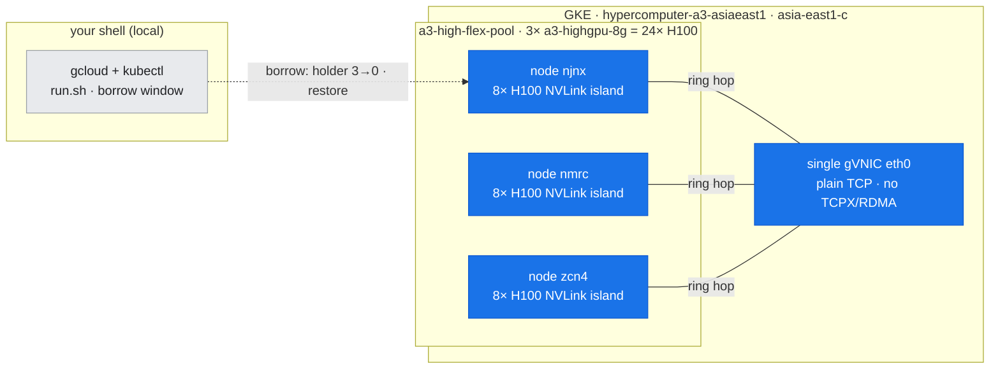
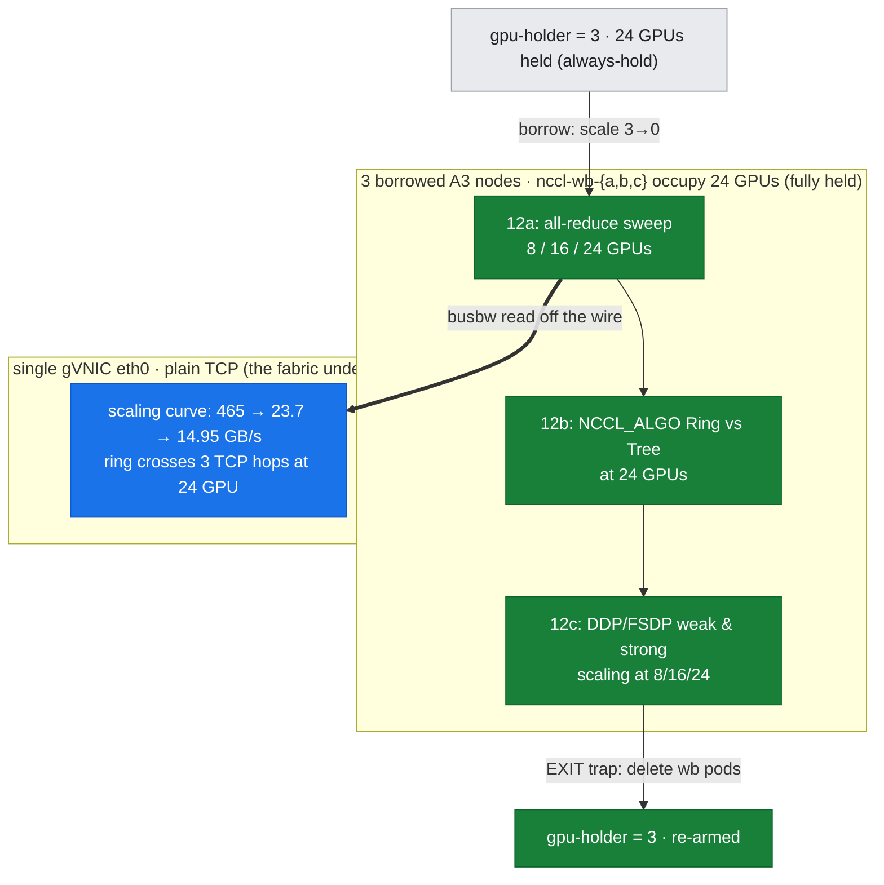
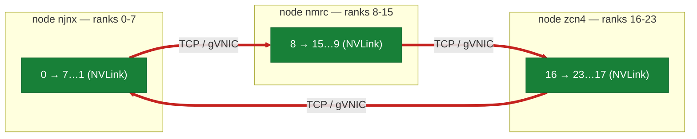
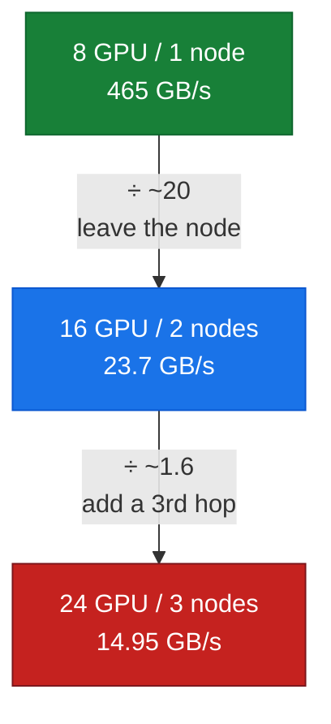

# Lab 12: Scaling the Cliff — all-reduce at 8 / 16 / 24 GPUs

**Objective:** Turn the two-point inter-node *cliff* (lab-06) into a three-point *curve*. Capture the all-reduce `busbw` sweep at **8, 16, and 24 GPUs (1, 2, 3 nodes)** on a **single cluster** (`asia-east1-c`), read the NCCL transport off the wire at each step, and show what a **third node** does to peak bandwidth and the latency floor — something two nodes physically cannot express.

**Duration:** ~15 minutes inside a guarded GPU-borrow window (image pull dominates)

**Prerequisites:**
- The 3-node `hypercomputer-a3-asiaeast1` cluster (`a3-high-flex-pool`, 3 × `a3-highgpu-8g` = 24 × H100), context `gke_hdlab-elideng_asia-east1-c_hypercomputer-a3-asiaeast1`
- Read [doc-06](../../docs/part2-inter-node/06-nccl-collectives.md) (busbw, ring/tree, reading the transport) and [doc-15](../../docs/15-scaling-shape-of-the-cliff.md) (the scaling narrative this lab feeds)
- Contrast: [lab-04](../lab-04-intranode-nvlink-hgx/) (intra-node ceiling) and [lab-06](../lab-06-2node-nccl-collectives/) (the 2-node point, on a *different* cluster)

> **Why 3 nodes?** One inter-node point proves a cliff *exists*; it cannot show the cliff's **shape**. Does peak busbw hold as the ring gains a third TCP hop, or degrade further? Does the small-message latency floor keep climbing? Those are slopes — they need a third point. At 24 GPUs the NCCL ring crosses **three** node boundaries instead of one, and that is captured, not assumed.

---

## Where this runs (the environment)

*This lab borrows **all three** nodes at once (holder 3→0) and drives the all-reduce across them — so the star of the environment is the **inter-node fabric**: a single gVNIC `eth0` carrying plain TCP (no TCPX/RDMA). Blue = what this lab exercises; grey = context. The scaling curve is read off exactly this fabric as the ring grows from 1 to 3 nodes.*



---

## Run

```bash
bash labs/lab-12-scaling-sweep/run.sh
```

The script targets the asia cluster by exporting `KUBE_CONTEXT` and `LAB_NODEPOOL` before sourcing `scripts/lib_capture.sh`, then reuses lab-06's **unmodified** `allreduce_bench.py` + `launch_node.sh` (same NCCL library, same `busbw = algbw·2(n-1)/n` definition) so the 8/16/24-GPU points are directly comparable to lab-04 and lab-06.

**Files:**
- `run.sh` — **12a:** orchestrates the borrow window and the three (8/16/24-GPU) sweeps; stages lab-06's benchmark into each pod via `kubectl cp`
- `run_ringtree.sh` — **12b:** forces `NCCL_ALGO=Ring` vs `Tree` at 24 GPUs (same borrow window) to compare algorithms
- `run_training.sh` — **12c:** DDP/FSDP weak & strong scaling at 8/16/24 GPUs (reuses lab-09's `train_ddp_fsdp.py`)
- assets: `allreduce_{8,16,24}gpu.txt` (busbw tables), `nccl_transport_24gpu.txt` (transport + 3-node ring), `scaling_curve.csv` + `scaling_peak_busbw.png` (the curve), `ringtree_{ring,tree}.txt` + `ringtree_crossover.csv` (12b), `train_{weak,strong}_scaling.csv` + `train_*_*gpu.txt` (12c), `*_full.log` (full rank-0 NCCL INFO)

```bash
bash labs/lab-12-scaling-sweep/run_ringtree.sh   # 12b: ring vs tree at 24 GPUs
bash labs/lab-12-scaling-sweep/run_training.sh   # 12c: DDP/FSDP scaling efficiency
```

### The sweep phases, mapped onto the environment (Flex-safe borrow)

This cluster's 24 H100s are normally fully held by the `gpu-holder` Deployment (3 × 8), honoring the standing *always hold the GPU* posture (Flex capacity is scarce). The lab **borrows** them and **always gives them back**.

*The same architecture as above, now with the run's steps overlaid. The three sub-labs (12a/b/c) drive the borrowed 3-node pool, while the scaling curve is **read off the plain-TCP fabric** (the thick edge). The whole run is bracketed by the guarded borrow (`gpu-holder` 3→0) and the `EXIT`-trap re-arm to 3.*



The workbench pods *are* the occupancy during the window — the nodes are never idle. The `EXIT` trap deletes the workbenches and scales `gpu-holder` back to 3 on any exit path, so the hold is re-armed whether the run succeeds, fails, or is interrupted.

---

## What was measured (real output)

### 1. The transport is still plain TCP — and the ring now crosses three nodes — `assets/lab-12/nccl_transport_24gpu.txt`

At 24 GPUs the `NCCL_DEBUG=INFO` log confirms the same transport as lab-06's 2-node run — no fabric magically appears with more nodes — but the ring is now longer and crosses **three** node boundaries:

```
NCCL INFO NCCL version 2.22.3+cuda12.6
NCCL INFO NET/IB : No device found.
NCCL INFO NET/Socket : Using [0]eth0:10.140.0.7<0>
NCCL INFO Using network Socket
NCCL INFO NET/Socket : GPU Direct RDMA Disabled for HCA 0 'eth0'
NCCL INFO Channel 00/16 :    0   7   6   5   4   3   2   1   8  15  14  13  12  11  10   9  16  23  22  21 ...
```

*Figure: the 24-rank ring — three 8-GPU NVLink islands (nodes njnx / nmrc / zcn4) stitched by THREE TCP-over-gVNIC hops (red). Two nodes have one crossing; three nodes have three, each staged GPU→host→NIC with no RDMA.*



- **`NET/IB : No device found`** + **`Using network Socket`** + **`GPU Direct RDMA Disabled`** — identical to lab-06: TCP sockets over a single gVNIC, host-staged. No TCPX/RDMA on this cluster either.
- **`Channel 00/16`** lists ranks `0 7 6 … 1` (node njnx), then `8 15 … 9` (node nmrc), then `16 23 … 17` (node zcn4). The ring crosses the boundary at `1→8`, `9→16`, and `17→0` — **three** Ethernet hops in series set the pace for all 24 GPUs. At 2 nodes there was exactly one such crossing (`1→8` and `9→0` share the single boundary); a third node adds genuinely new serial hops.

### 2. The scaling curve — `assets/lab-12/scaling_curve.csv`

Peak `busbw` (at 1 GiB) and the small-message latency floor (time for an 8 B all-reduce), all on `asia-east1-c`, NCCL 2.22.3:

| GPUs | Nodes | Fabric in play | Peak busbw (GB/s) | Latency floor (ms) |
| ---: | ---: | :--- | ---: | ---: |
| 8 | 1 | NVLink4 / NVSwitch (intra-node) | **465.43** | 0.040 |
| 16 | 2 | + 1 TCP / gVNIC hop | 23.70 | 0.175 |
| 24 | 3 | + 3 TCP / gVNIC hops | **14.95** | 0.325 |

*Figure: peak all-reduce busbw collapses ~20× the instant the ring leaves the node (8→16 GPUs), then keeps degrading as a third TCP hop joins the ring (16→24). The latency floor climbs monotonically. `scaling_peak_busbw.png`.*



**What the third point reveals (and two points cannot):**

1. **The cliff is not a floor — it keeps sloping.** Going 2→3 nodes drops peak busbw a *further* **~37%** (23.70 → 14.95 GB/s). A ring all-reduce is paced by its slowest link *and* serializes through every inter-node hop; a third TCP crossing adds another serial bottleneck rather than more parallel bandwidth. Two nodes would have you believe the inter-node number is a fixed ~24–28 GB/s "floor"; it is actually a **descending curve** in node count.
2. **The latency floor grows with every node.** 0.040 ms (intra-node) → 0.175 ms (2 nodes) → 0.325 ms (3 nodes): each added node lengthens the ring and adds a TCP round-trip to the critical path. Small-message collectives get monotonically worse as the gang grows — the case for gradient bucketing (doc-09) strengthens with scale.
3. **busbw isolates fabric efficiency, so this is real degradation.** Because `busbw = algbw·2(n-1)/n` already normalizes out the ring's inherent `2(n-1)/n` traffic growth, the 23.70 → 14.95 drop is **not** an artifact of moving more data — it is the fabric getting genuinely less efficient per byte as hops accumulate.

### 3. The per-size sweeps — `assets/lab-12/allreduce_{8,16,24}gpu.txt`

Each file is the full busbw-vs-message-size table. Reading across them shows the ramp shifting right and flattening lower as nodes are added — the 8-GPU run reaches 90 GB/s by 2 MB, while the 24-GPU run is still under 1.2 GB/s at 2 MB and never clears 15 GB/s even at 1 GiB. The message size at which the collective becomes bandwidth-bound (rather than latency-bound) moves out as the ring lengthens.

### 4. Ring vs. tree at 24 GPUs — `assets/lab-12/ringtree_crossover.csv` (12b)

Forcing `NCCL_ALGO=Ring` then `Tree` (same `NCCL_PROTO=Simple`, same sweep) at 24 GPUs. At 2 nodes the two share the single inter-node hop and land within noise; at **3** nodes they diverge sharply — and not in the textbook way:

| Message size | Ring (GB/s) | Tree (GB/s) | Tree advantage |
| ---: | ---: | ---: | ---: |
| 512 KB | 0.13 | 1.44 | ~11× |
| 4 MB | 1.01 | 4.54 | ~4.5× |
| 128 MB | 10.25 | 17.33 | ~1.7× |
| 1 GB | 14.24 | 17.98 | ~1.3× |

- **No crossover — Tree wins at every size.** Ring threads each chunk through **three serial inter-node TCP hops**; Tree's inter-node reduction is depth ~2 with a shallower critical path, which pays off most where latency dominates (mid-range, ~11×) and never reverses (~1.3× at 1 GiB). doc-06's "algorithm matters less than the link" was a 2-node truth; at ≥3 nodes the algorithm's inter-node hop count matters too.
- **The default under-picks.** 12a's auto-selected 24-GPU peak (14.95 GB/s) tracks **ring** — so on this fabric the default all-reduce is ~20–30% slower than an explicit `NCCL_ALGO=Tree`. An actionable tuning win that only exists at ≥3 nodes.
- **Forcing confirmed by the divergent curves:** with only `NCCL_ALGO` differing between the two runs, the ~40% peak-busbw gap (14.24 vs 19.87) is itself proof the env var took effect.

### 5. Training scaling efficiency — `assets/lab-12/train_{weak,strong}_scaling.csv` (12c)

`run_training.sh` reuses lab-09's 1B-param DDP/FSDP model at 8/16/24 GPUs. Efficiency doesn't step down — it **collapses as a curve**:

| Mode / scaling | 8 GPU | 16 GPU | 24 GPU |
| :--- | ---: | ---: | ---: |
| DDP weak (step ms) | 58 | 375 | 713 |
| DDP weak efficiency | 100% | **15.5%** | **8.2%** |
| FSDP weak efficiency | 100% | 6.7% | 5.7% |
| DDP strong efficiency | 100% | 6.8% | 2.7% |

- **The ~6.5× step-time jump at 8→16** is the ~4.3 GB fp32 gradient all-reduce leaving NVLink for the ~24 GB/s TCP fabric (~340 ms of the 375 ms step is the all-reduce). 16→24 declines further as the third hop joins — the training face of §2's busbw curve.
- **FSDP falls faster than DDP** (6.7% vs 15.5% at 2 nodes): it trades DDP's one all-reduce for all-gather + reduce-scatter — more inter-node traffic per step. On this TCP floor the extra collectives dominate its memory savings.
- **Strong scaling is worse than weak** (2.7% at 24 GPU): fixing the global batch shrinks per-GPU compute while comms grows, so there's less compute to hide the all-reduce behind.
- *Honest framing:* deliberately comms-bound (heavy model, TCP fabric, small compute) to isolate the fabric's effect. Production overlaps comms/compute and uses a faster fabric; the transferable lesson is the **shape**, which needs a third point.

---

## Cross-cluster note (why this curve is single-cluster)

This entire curve is captured on **`asia-east1-c`** so that node count is the *only* variable. lab-06's 2-node run measured **~28.6 GB/s** on the **`us-central1`** cluster; this lab's 2-node point (16 GPU) is **23.70 GB/s** on `asia-east1-c`. Both are the same fabric *class* (plain TCP over a single gVNIC, no GPUDirect), but they are **different clusters** with possibly different GKE/driver/NCCL builds — so the ~20% gap is a cross-cluster artifact, **not** a point on the scaling curve. Splicing them would confound node count with cluster version. They are compared side-by-side in [doc-15](../../docs/15-scaling-shape-of-the-cliff.md), never spliced.

---

## What this lab does **not** claim

- It does **not** use GPUDirect-TCPX, TCPXO, RDMA, or SHARP — the 24-GPU NCCL log proves none are active on `asia-east1-c` either. These are the **standard-gVNIC/TCP** numbers for this cluster.
- It does **not** mix clusters in the curve. The `us-central1` 2-node figure is a labeled cross-cluster comparison only.
- The 8-GPU point is an **intra-node** (NVLink) measurement included as the curve's left anchor; it is not an inter-node number.
- It reports `busbw` from a PyTorch/NCCL all-reduce (same NCCL, same formula as nccl-tests), per lab-06's rationale — not the `all_reduce_perf` binary.

---

**Concepts →** [doc-15 shape of the cliff](../../docs/15-scaling-shape-of-the-cliff.md) · [doc-06 NCCL collectives](../../docs/part2-inter-node/06-nccl-collectives.md)
**Contrast →** [lab-04 intra-node ceiling](../lab-04-intranode-nvlink-hgx/) · [lab-06 2-node cliff](../lab-06-2node-nccl-collectives/)
**Tools →** [T4 Benchmarking](../../docs/toolkit/T4-benchmarking.md) · [reference/nccl-tunables](../../reference/nccl-tunables.md)
