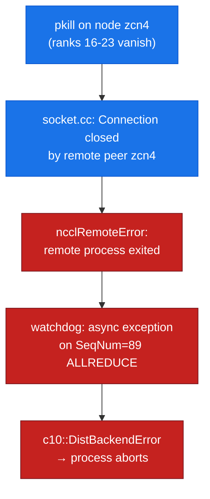

# Lab 13: Topology & Resilience — 3-node gang placement (13a) + the 16-GPU survivor set (13b)

This lab has two independent parts, each capturing something a two-node pool physically cannot show:

- **lab-13a — the 24-GPU gang** (`run_gang.sh`): a **non-power-of-2** 24-GPU gang admitted by **JobSet + Kueue** as *one* Workload and placed **one 8-GPU pod per node across all three nodes**, then a **32-GPU** gang gang-**gated** by the 24-GPU quota. Two nodes can express neither a 24-way gang nor a 3-node all-or-nothing placement.
- **lab-13b — the survivor set** (`run_nodeloss.sh`): kill one node's ranks mid-run and watch the surviving 16 ranks fault fast, then rerun a **16-GPU / 2-node survivor set** to completion. Lose 1 of 2 nodes → 0 survivors; the survivor story needs N ≥ 3.

---

## lab-13b — the 16-GPU survivor set

**Objective:** Run a **24-GPU** all-reduce job across all three nodes, **kill the ranks on one node mid-run** (a job-level fault — never a node drain or delete, so scarce Flex capacity is never released), and capture two things a two-node pool physically cannot show:

1. the **fault signature** the surviving 16 ranks emit the instant a peer node disappears — read off the wire, not asserted; and
2. a **16-GPU / 2-node *survivor set*** that reschedules and runs a real all-reduce **to completion** on the two nodes that remain.

**Duration:** ~10 minutes inside a guarded GPU-borrow window (image pull dominates)

**Prerequisites:**
- The 3-node `hypercomputer-a3-asiaeast1` cluster (`a3-high-flex-pool`, 3 × `a3-highgpu-8g` = 24 × H100), context `gke_hdlab-elideng_asia-east1-c_hypercomputer-a3-asiaeast1`
- Read [lab-10](../lab-10-observability-fleet-debug/) (fault signatures on the fleet) and [doc-15](../../docs/15-scaling-shape-of-the-cliff.md) (the 3-node scaling context)
- Contrast: [lab-06](../lab-06-2node-nccl-collectives/) (the 2-node job — where losing a node leaves *no* distributed remnant)

> **Why 3 nodes?** Resilience is about what *survives*. Kill one node of a **two**-node job and the remnant is a single, non-distributed node — there is nothing multi-node left to observe or reschedule onto. Only at **N ≥ 3** does killing a node leave a genuine **distributed survivor set** (here, 16 GPUs across 2 nodes). The whole survivor/elastic story is invisible below three nodes.

---

## Run

```bash
bash labs/lab-13-topology-resilience/run_nodeloss.sh
```

The script reuses lab-06's **unmodified** `launch_node.sh` to start one process per GPU, and runs a small purpose-built loop, `nodeloss_bench.py`, in place of the finite sweep. Two settings make the fault **diagnosable in seconds** instead of a silent 30-minute NCCL hang:

- `init_process_group(timeout=90s)` — bounds how long a collective blocks on a vanished peer before the group aborts;
- `TORCH_NCCL_ASYNC_ERROR_HANDLING=1` — the NCCL watchdog tears the process down with a logged error the moment a peer socket breaks.

**Files:**
- `run_nodeloss.sh` — **13b:** orchestrates the borrow window, launches the 24-GPU loop, kills one node's ranks, captures the survivor fault + reruns the 16-GPU survivor set
- `nodeloss_bench.py` — long-running fixed-size (268 MB fp32) all-reduce loop with per-node heartbeats and a bounded, async-handled fault path
- assets: `nodeloss_fault_survivor_rank0.txt` (full survivor NCCL/watchdog trace), `nodeloss_victim_rank16.txt` (victim heartbeats that stop at the kill), `survivor_set_rerun_16gpu.txt` (the 16-GPU rerun sweep → `# done`), `nodeloss_timeline.txt` (distilled timeline)

### GPU safety — a guarded, gap-free hold handoff (Flex-safe)

Identical posture to [lab-12](../lab-12-scaling-sweep/): the 24 H100s are normally fully held by the `gpu-holder` Deployment (3 × 8). The lab **borrows** them, and an `EXIT` trap **always gives them back**. Crucially, the injected fault is **`pkill` of the job's processes on one node — not a node drain, cordon, or delete** — so the node stays held and Flex capacity is never released.

```mermaid
flowchart LR
  H0["gpu-holder = 3<br/>(24 GPUs held)"] -->|"scale 3→0"| W["nccl-wb-{a,b,c}<br/>occupy 24 GPUs"]
  W --> J["24-GPU loop<br/>(3 nodes, healthy)"]
  J -->|"pkill -9 on<br/>node zcn4 (job only)"| K["16 ranks survive<br/>8 ranks gone"]
  K --> F["survivors fault<br/>(NCCL remote error)"]
  F --> RR["16-GPU / 2-node<br/>survivor-set rerun → # done"]
  RR -->|"EXIT trap:<br/>delete pods"| R["gpu-holder = 3<br/>(re-armed)"]
  classDef ctx fill:#e8eaed,stroke:#9aa0a6,color:#202124;
  classDef meas fill:#1a73e8,stroke:#0b57d0,color:#ffffff;
  classDef crit fill:#c5221f,stroke:#7a161c,color:#ffffff;
  classDef good fill:#188038,stroke:#0d652d,color:#ffffff;
  class H0,W ctx; class J,K meas; class F crit; class RR,R good;
```



---

## What was measured (real output)

Nodes this run: `…njnx` (ranks 0-7), `…nmrc` (ranks 8-15), `…zcn4` (ranks 16-23, the **victim**). Buffer 268 MB fp32, `world_size=24`, NCCL 2.22.3, PG timeout 90 s.

### 1. The victim: heartbeats simply stop — `assets/lab-13/nodeloss_victim_rank16.txt`

The victim node's local rank 0 (global rank 16) prints a heartbeat every 5 iterations, right up until the `pkill`:

```
# heartbeat rank=16 node=…zcn4 iter=75 elapsed=19.6s
# heartbeat rank=16 node=…zcn4 iter=80 elapsed=20.8s
# heartbeat rank=16 node=…zcn4 iter=85 elapsed=21.9s
```

No shutdown, no error — the log ends mid-stream. That is the killed-node view: from the victim's side a node loss is simply *absence*, which is exactly why the surviving ranks must be the ones to detect it.

### 2. The fault signature on the survivors — `assets/lab-13/nodeloss_fault_survivor_rank0.txt`

Survivor rank 0 (on `…njnx`) is mid-`all_reduce` when rank 16-23's sockets close. The root cause appears first at the socket layer, then propagates up through the NCCL watchdog to a fatal PyTorch exception (verbatim, de-duplicated):

```
…njnx:110:697 misc/socket.cc:50 NCCL WARN socketProgress: Connection closed by remote peer …zcn4.c.hdlab-elideng.internal<55912>
ncclRemoteError: A call failed possibly due to a network error or a remote process exiting prematurely.
[rank0]:[E ProcessGroupNCCL.cpp:542] [Rank 0] Collective WorkNCCL(SeqNum=89, OpType=ALLREDUCE, NumelIn=67108864, Timeout(ms)=90000) raised the following async exception: NCCL error: remote process exited or there was a network error
[rank0]:[E ProcessGroupNCCL.cpp:1795] Exception (either an error or timeout) detected by watchdog at work: 89 …
[Rank 0] Process group watchdog thread terminated with exception: NCCL error: remote process exited or there was a network error
terminate called after throwing an instance of 'c10::DistBackendError'
```

*Figure: a node-loss fault propagates bottom-up — a closed TCP socket becomes an `ncclRemoteError`, which the watchdog escalates to a fatal `DistBackendError` on every surviving rank.*



Two things worth reading closely:

- **The fault is a *remote* error, not a local timeout.** NCCL names the cause precisely — `remote process exited or there was a network error` — because the peer's TCP socket closed cleanly on `pkill`. A survivor cannot tell "the node crashed" from "the network died"; both present identically as a closed peer socket. That ambiguity is the real-world triage lesson.
- **It fired in *seconds*, far short of the 90 s ceiling.** The async handler raised on the very next collective (`SeqNum=89`, moments after the victim's last heartbeat at iter 85), not after a 90 s block. Without `TORCH_NCCL_ASYNC_ERROR_HANDLING=1` the survivors would have hung until the timeout — the difference between a fast, diagnosable failure and a stalled job holding 16 GPUs idle.

### 3. The survivor set reruns to completion — `assets/lab-13/survivor_set_rerun_16gpu.txt`

The two surviving nodes (`…njnx` + `…nmrc`) are still held and healthy, so the job is relaunched as a **16-GPU / 2-node** all-reduce. It runs the full sweep and prints `# done`:

```
# world_size=16  backend=nccl  warmup=5 iters=10
       128MB     33554432     13.009        10.32        19.35
       256MB     67108864     25.075        10.71        20.07
# done
```

- **A genuine distributed job survived the loss.** 16 GPUs across 2 nodes is still a real multi-node collective (peak busbw **20.07 GB/s** at 256 MB — in family with lab-12's 16-GPU point of 23.70 GB/s at 1 GiB on this same cluster). This is the whole point: at 3 nodes a single-node loss degrades the job to a smaller-but-still-distributed survivor set, rather than destroying it. At 2 nodes there would be no such set to fall back to.
- *(The trailing `proxy.cc … NCCL WARN` lines after `# done` are benign process-group teardown noise — the sweep had already completed and rank 0 exited 0.)*

---

## What this lab does **not** claim

- It does **not** drain, cordon, or delete a node. The fault is `pkill -9` of the job's processes on one node only — a **job-level** fault chosen deliberately so the Flex hold is never released (**Flex-safe**). It therefore models *workload* loss on a node, not a hardware node-down event (a real node-down would present the same closed-socket signature to survivors, plus a `NotReady` node).
- It does **not** perform *automatic* elastic recovery. The survivor-set rerun is an operator-driven relaunch on the surviving nodes; it demonstrates that a reschedulable distributed remnant **exists** at N ≥ 3, not that a controller reformed the group in place. (Automatic gang re-admission is the JobSet/Kueue story — see below.)
- It does **not** use GPUDirect-TCPX/RDMA — the same plain-TCP/gVNIC fabric as lab-06/lab-12; the closed-socket signature is a TCP-transport observation.

---

## lab-13a — the 24-GPU / 3-node gang (JobSet + Kueue)

**Objective:** Admit a **24-GPU non-power-of-2 gang** as a single Kueue Workload, place it **one 8-GPU pod per node across all three nodes**, run a real 24-rank all-reduce to completion, and prove the quota gate by submitting a **32-GPU** gang that Kueue refuses to admit.

> **Why 3 nodes?** 24 is not a power of two and does not fit in a 16-GPU/2-node pool at all. The interesting scheduling behaviour — *all-or-nothing* admission of a gang that must land on **three** nodes simultaneously, and a quota boundary (24) that sits **exactly** at the full pool — only exists at N ≥ 3. A 2-node pool can neither express the 24-way gang nor demonstrate the 3-node atomic placement.

```bash
bash labs/lab-13-topology-resilience/run_gang.sh
```

The runner uses the same guarded borrow window (scale `gpu-holder` 3→0; the gang pods *are* the occupancy; EXIT trap deletes the JobSet/queues and re-arms the holder to 3). It applies a 24-GPU `ClusterQueue`/`LocalQueue` ([`manifests/kueue-gpu-queues-24.yaml`](../../manifests/kueue-gpu-queues-24.yaml)) and a 3-replica JobSet ([`manifests/jobset-nccl-24.yaml`](../../manifests/jobset-nccl-24.yaml)), then a 4-replica (32-GPU) copy to hit the quota gate.

**Prerequisites (one-time infra):** the **JobSet** (v0.12.0) and **Kueue** (v0.18.3) controllers, installed on `asia-east1-c` on 2026-07-24 to match the `us-central1` lab-08 versions.

> **hostNetwork gotcha (why this needs the downward API).** The pods run `hostNetwork: true`, so inside a pod `hostname` returns the **node** name, not the pod name — there is no way to recover "which replica am I" from the hostname. The node-rank is instead read from the JobSet-injected **`jobset.sigs.k8s.io/job-index` annotation** via the downward API (with a pod-name parse as fallback). Each pod then launches 8 local ranks with manual `RANK=$((NODE_RANK*8+i))` env — the same c10d bypass lab-06/12/13b use, avoiding torchrun's fragile multi-pod rendezvous.

### What was measured (real output)

**1. Gang admitted as ONE Workload — `assets/lab-13/gang_admission.txt`**

```
NAME                     QUEUE       RESERVED IN   ADMITTED   FINISHED   AGE
jobset-nccl-gang-51855   gpu-lq-24   gpu-cq-24     True                  11s
  jobset-nccl-gang-51855: cq=gpu-cq-24 conds=[('QuotaReserved','True'),('Admitted','True')]
```

The entire 3-Job JobSet is a **single** Kueue Workload — Kueue reserves all 24 GPUs together (`QuotaReserved=True`) and admits atomically (captured 11 s in, before the run finished). That is the gang guarantee: all 24 or none.

**2. One 8-GPU pod per node, all three nodes — `assets/lab-13/gang_placement.txt`**

```
NAME                         NODE
nccl-gang-worker-0-0-…       …-q0qn
nccl-gang-worker-1-0-…       …-d7j7
nccl-gang-worker-2-0-…       …-lq6m     ← 3 pods, 3 distinct nodes, 8 GPU each
```

**3. The 24-rank all-reduce completes — `assets/lab-13/gang_allreduce_result.txt`**

```
host=…-q0qn node_rank=0 master=nccl-gang-worker-0-0.nccl-gang world=24
GANG all_reduce OK value=24.0 (expect 24.0) world_size=24
node_rank=0 done rc=0
… node_rank=1 done rc=0 … node_rank=2 done rc=0
```

All 24 ranks rendezvous on the JobSet headless service, run a 1 GiB all-reduce, and the reduced value is exactly `24.0` (sum of 24 all-ones tensors). The JobSet reaches `Completed=True`.

**4. A 32-GPU gang is gang-GATED — `assets/lab-13/gang_overquota_gate.txt`**

```
workload: jobset-nccl-gang-overquota-…  conds=[('QuotaReserved','False','Pending')]
### pods for over-quota jobset (expect NONE):
No resources found in default namespace.
```

Bumping the JobSet to 4 replicas (32 GPU) exceeds the 24-GPU `ClusterQueue` quota, so Kueue holds the Workload `Pending` with `QuotaReserved=False` and **creates zero pods** — the gang waits as a unit rather than partially scheduling. This is the all-or-nothing quota boundary that a 24-GPU quota on a 24-GPU pool makes crisp.

### What lab-13a does **not** claim

- It does **not** use GPUDirect-TCPX/RDMA — same plain-TCP/gVNIC fabric as the rest of the guide; this lab is about **scheduling/placement**, not fabric bandwidth.
- The 32-GPU gate is a **quota** gate (24-GPU `ClusterQueue`), demonstrated on a 24-GPU pool; it is not a claim about physical capacity beyond 24 GPUs.

---

**Concepts →** [doc-15 shape of the cliff](../../docs/15-scaling-shape-of-the-cliff.md) · [doc-10 observability & debugging](../../docs/part3-clustering-execution/10-observability-debugging.md)
**Contrast →** [lab-06 2-node job](../lab-06-2node-nccl-collectives/) · [lab-10 fleet fault signatures](../lab-10-observability-fleet-debug/)
**Tools →** [reference/nccl-tunables](../../reference/nccl-tunables.md) · [T4 Benchmarking](../../docs/toolkit/T4-benchmarking.md)
