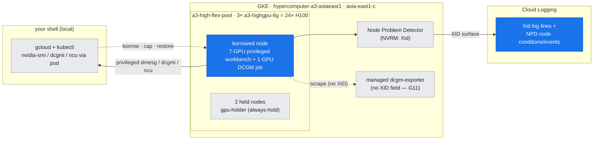
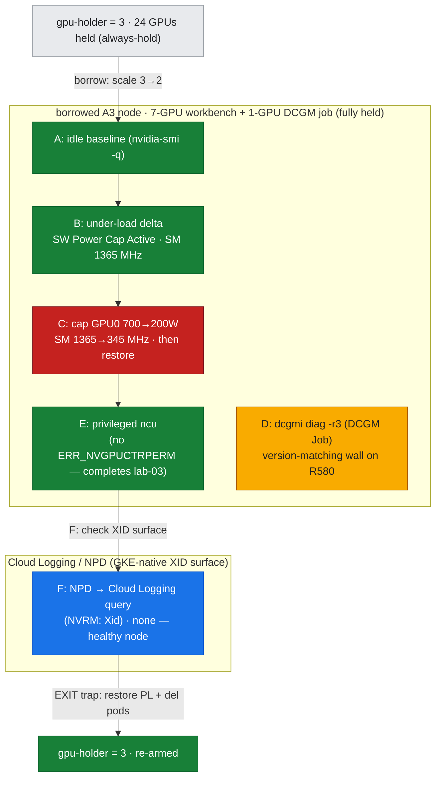

# Lab 14: Single-GPU & Node Health Triage — read a GPU under load, and *why* it's slow

**Objective:** Answer the day-2 question the healthy-path labs never ask. Labs 01–03 confirmed a GPU *exists* and benchmarked it once; this lab reads a GPU's **health under sustained load** and, when it's slow, tells you **why** — by inducing a *real, reversible* throttle and reading the clock collapse off the wire. Six captures, all on **one** borrowed node inside a guarded window:

1. **Idle health baseline** — `nvidia-smi -q` for ECC, row-remapper, clocks, power, temp, and throttle reasons: the reference read every fault is measured against.
2. **Under-load delta** — drive the node's GPUs with sustained fp16 GEMMs and re-read: clocks at boost, power at TDP, `SW Power Cap: Active`, plus a `nvidia-smi dmon` time series.
3. **Deterministic reversible throttle** — cap device-0's power limit to its 200 W floor, load it, and read a **real** throttle reason with a **measured clock collapse** — then restore. This is the controlled fault that makes "the GPU is slow, why?" concrete.
4. **`dcgmi diag -r 3`** — the deployment-grade suite (lab-02 ran `-r 2`). On this node's R580/CUDA-13 driver it captures an honest **version-matching failure** instead (gotchas G12/G13).
5. **Privileged `ncu` rerun** — the half of profiling **lab-03 could not finish**: with `CAP_SYS_ADMIN`, `ncu` collects real per-kernel metrics instead of `ERR_NVGPUCTRPERM`.
6. **XID GKE-native surface** — where an Xid *actually* shows up on managed GKE (NPD → Cloud Logging), why the managed `dcgm-exporter` doesn't carry it, and the privileged-`dmesg` contrast.

This is the [doc-16 diagnostic method](../../docs/part5-operations-diagnostics/16-diagnostic-method.md) applied to the **single-device/node** layer, and it is written up in [doc-17](../../docs/part5-operations-diagnostics/17-single-gpu-node-health.md).

**Duration:** ~7 minutes inside a guarded GPU-borrow window (image pull dominates)

**Prerequisites:**
- The 3-node `hypercomputer-a3-asiaeast1` cluster (`a3-high-flex-pool`, 3 × `a3-highgpu-8g` = 24 × H100), context `gke_hdlab-elideng_asia-east1-c_hypercomputer-a3-asiaeast1`. Node driver: **580.126.20** (Open Kernel Module, CUDA-13 era).
- Read [doc-16](../../docs/part5-operations-diagnostics/16-diagnostic-method.md) (the triage loop, the two lenses) and [doc-17](../../docs/part5-operations-diagnostics/17-single-gpu-node-health.md).
- Builds directly on [lab-02](../lab-02-driver-cuda-health/) (health/`dcgmi`/XID basics) and [lab-03](../lab-03-single-gpu-benchmark-profile/) (the `ncu` run that hit `ERR_NVGPUCTRPERM`).

> **Why only ONE node (and why that's the point)?** Single-GPU and single-node health does **not** need three nodes — so, unlike the scaling and comms labs, this one borrows just **one** node (scale `gpu-holder` 3→2) and keeps the **other two held** (the always-hold rule). Borrowing more would waste GPUs the fault can't use. The subtlety is the opposite of lab-15's: here the discipline is *not* over-borrowing.

---

## Where this runs (the environment)

*This lab works on **one borrowed node** (7-GPU privileged workbench + 1-GPU DCGM job; the other two stay held), reading the device with the local lenses — `nvidia-smi`, `dcgmi`, `ncu`, privileged `dmesg`. The one side system it touches is the **GKE-native XID surface** (NPD → Cloud Logging) — because the managed `dcgm-exporter` carries no XID field (G11). Blue = what this lab exercises; grey = held/context.*



---

## Run

```bash
bash labs/lab-14-single-gpu-health-triage/run_health.sh
```

The runner opens a **guarded, gap-free borrow window**: it scales `gpu-holder` 3→2 (freeing exactly one node's 8 GPUs), identifies the freed node (the one with no `gpu-holder` pod on it), and schedules a **privileged** workbench requesting **7** GPUs there, plus a 1-GPU **DCGM diag Job** on the 8th — so the whole node stays held (no idle GPU) while the workbench drives phases A/B/C/E/F. An `EXIT` trap restores the power limit **and** the holder to 3 on every path.

**Flex-safe.** The only device-state change is a **power-limit cap** that is explicitly restored (Phase C) *and* re-restored by the trap. No node is drained, cordoned, or deleted, and every phase is wall-clock-bounded. `set +e` is used deliberately: several phases run intentionally-failing / time-bounded commands (see gotcha G1).

**Files:**
- `run_health.sh` — orchestrates the borrow window and six phases; distils each into `assets/lab-14/`
- `load_gpu.py` — sustained fp16 GEMM on `cuda:0` (device selected via `CUDA_VISIBLE_DEVICES`, so one process per device loads the whole node)
- assets: `health_idle_*` / `health_load_*` (idle→load delta), `dmon_under_load.txt`, `throttle_powercap_*` (the induced throttle + `throttle_powercap_restored.txt`), `dcgm_diag_r3.txt` (version-matching gotcha), `ncu_privileged_full.txt` / `ncu_privileged_metrics.txt` (completes lab-03), `dmesg_nvrm.txt`, `dcgm_xid_metric.txt`, `node_events_xid.txt`, `health_timeline.txt`

### The six phases, mapped onto the environment (Flex-safe borrow)

*The run's phases overlaid on the environment: A/B/C/E drive the borrowed node's GPUs (③ caps GPU0 700→200 W — the induced throttle, red), the DCGM Job runs D (the R580 version-matching wall, amber), and F reads the **GKE-native XID surface** (NPD → Cloud Logging). The whole run is bracketed by the single-node borrow (`gpu-holder` 3→2) and the `EXIT`-trap re-arm to 3.*



---

## What was measured (real output)

Borrowed node this run: `…q0qn` (holder held the other two). Device 0 unless noted. All numbers below are copied from `assets/lab-14/`.

### A → B: the idle→load delta (the reference every fault is read against)

| Signal | Idle (Phase A) | Under load, 700 W limit (Phase B) |
|---|---|---|
| `Idle` throttle reason | `Active` | `Not Active` |
| `SW Power Cap` | **`Not Active`** | **`Active`** |
| `HW Slowdown` / `HW Thermal` | `Not Active` | `Not Active` |
| SM clock | 345 MHz (idle floor) | **1365 MHz** |
| Power draw (avg / inst) | 72.12 W / 72.23 W | **697.02 W / 701.23 W** |
| GPU temp | 36 °C | 63 °C |
| ECC (SRAM/DRAM, corr + uncorr) | all `0` | — |
| Remapped Rows / Failure | `0` / `No` | — |

The teaching point is in the `SW Power Cap` row. Under full load it goes **`Active`** — and that is **not a fault**: it's the power governor holding the card at its 700 W TDP, which is exactly why the SM clock sits at **1365 MHz**, *below* the 1980 MHz max application clock. Severity is read from the **clock delta**, never from the boolean. `nvidia-smi dmon -s pucvmet` (`dmon_under_load.txt`) shows the seven driven GPUs at ~700 W / 100 % SM / 56–64 °C, with the `pviol` (power-violation %) column ticking up — and GPU 7 sitting idle at 67 W (the GPU the DCGM Job holds).

### C: a *real*, reversible throttle — cap 700 → 200 W, watch the clock collapse

```
Current Power Limit : 200.00 W     Default Power Limit : 700.00 W
SW Power Cap        : Active
SM (Graphics) clock : 345 MHz      ← collapsed from 1365 MHz under the same load
```

Capping device-0's power limit to its **200 W floor** and re-loading it drops the SM clock to **345 MHz** — a *severe* `SW Power Cap` throttle, the same signature a real power/thermal problem would produce, induced deterministically. It is then restored: `throttle_powercap_restored.txt` reads **`700.00 W`** (and the EXIT trap would restore it again on any failure). This is the controlled experiment that turns "the GPU is slow" into "the GPU is power-capped — read the limit."

### E: the privileged `ncu` rerun — completing lab-03

lab-03's `ncu` died with `ERR_NVGPUCTRPERM` (GKE COS sets `NVreg_RestrictProfilingToAdminUsers=1`, so perf counters need `CAP_SYS_ADMIN`). Here the **privileged** workbench profiles three `nvjet_hsh_256x128` cuBLAS kernels (37 passes each) with **no permission error** — real per-kernel metrics at last:

```
SM Frequency            1.36 GHz     Compute (SM) Throughput   73.44 %
Memory Throughput      57.21 %       DRAM Throughput           16.34 %
Duration               31.68 us      Achieved Occupancy        14.14 %
```

Compute-bound (73 % SM vs 16 % DRAM), as a large GEMM should be; the same run reports fp16 8192 = **751.78 TFLOPS**, bf16 8192 = **776.46 TFLOPS**. (Scope trap from G5: `--set full` profiles *every* kernel, so it is bounded with `--launch-count 3 --launch-skip 20`, or it looks like a hang.)

### F: where an XID actually surfaces on managed GKE

- **Privileged `dmesg`** (`dmesg_nvrm.txt`) *works* here — it reads driver `580.126.20` and benign `refcnt` lines, **no Xid** (healthy node). This is the contrast to lab-02's unprivileged pod, where `dmesg` is blocked (G6). You should **not** depend on this in production tooling.
- **The managed `dcgm-exporter` does *not* export `DCGM_FI_DEV_XID_ERRORS`** (`dcgm_xid_metric.txt`): the 19 fields it does export are FB/temp/util/power/clock + the PROF_* pipe/DRAM/NVLink/PCIe metrics — **no XID field** (gotcha G11). This corrects the tidy "just scrape `DCGM_FI_DEV_XID_ERRORS`" story.
- **The real GKE-native path** is **Node Problem Detector → Cloud Logging** (`NVRM: Xid` log lines) plus the NPD node condition/event. `node_events_xid.txt` shows none (healthy node) — but that is the query you run.

### D: `dcgmi diag -r 3` — an honest version-matching wall

The deployment-grade diag **could not run** on this node. The 3.3.8 image (lab-02's, works on the older us-central1 driver) fails `Detected unsupported Cuda version` (G12); the 4.4.0 image gets past that but can't load plugins — `plugins/cuda13/: No such file or directory` (G13). No stock public DCGM image ships cuda13 diag plugins for R580 yet, so `dcgm_diag_r3.txt` captures the **failure**, honestly, and lab-02's `-r 2` on the older driver stays the reference for a green diag. **Pin your DCGM image — daemon *and* diag plugins — to the node's CUDA generation.**

---

## Gotchas hit building this lab

All are in the cross-lab index [reference/lab-build-gotchas.md](../../reference/lab-build-gotchas.md):
- **G10** — `nvidia-smi -q -d ROW_REMAP`/`PCIE` are invalid group tokens (one typo rejects the whole list); use `ROW_REMAPPER`, drop `PCIE`.
- **G11** — the managed `dcgm-exporter` has no XID field; use NPD → Cloud Logging.
- **G12 / G13** — DCGM 3.3.8 → "unsupported Cuda version"; DCGM 4.4.0 → missing `plugins/cuda13/`. No stock diag image runs on R580.
- Also relevant: **G1** (`set -e` inheritance → `set +e`), **G5** (`ERR_NVGPUCTRPERM` → privileged + bounded passes), **G6** (`dmesg` blocked unprivileged), **G7** (`dcgmi` not in the PyTorch image → DCGM Job).

## Cleanup

Automatic. The `EXIT` trap restores device-0's power limit to its default, deletes the workbench pod and the DCGM Job, and scales `gpu-holder` back to **3**. Verify:

```bash
kubectl --context gke_hdlab-elideng_asia-east1-c_hypercomputer-a3-asiaeast1 \
  get deploy gpu-holder -o jsonpath='{.status.readyReplicas}/{.spec.replicas}'   # → 3/3
```
