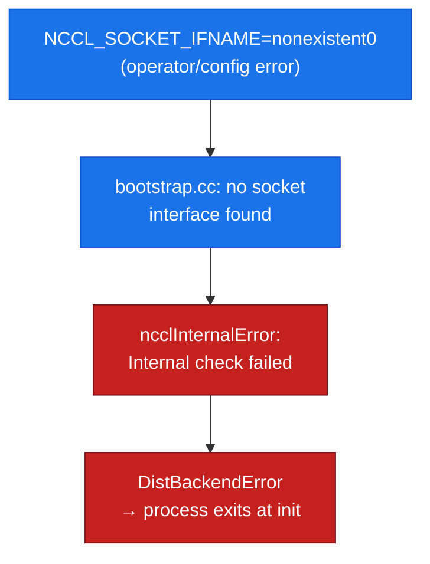
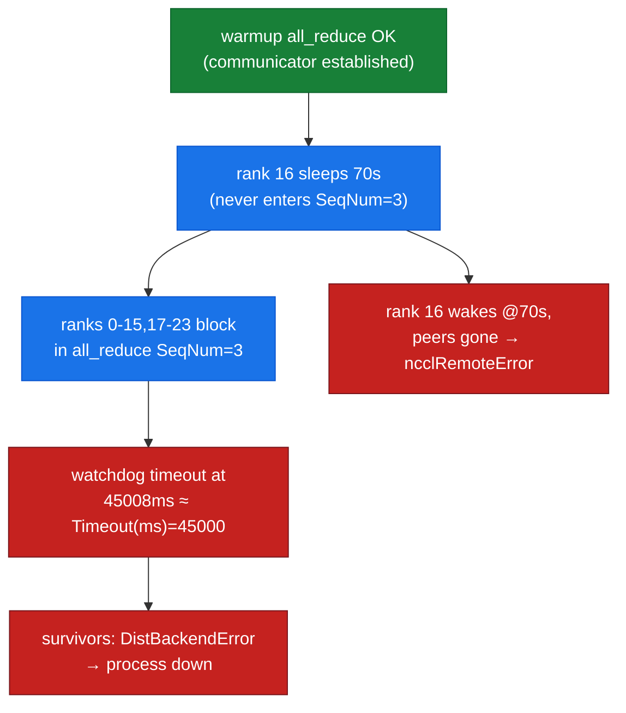

# Lab 15: Inter-node Comms Debug — read what NCCL chose, then localize two faults

**Objective:** Turn a slow-or-dead distributed collective into a **localized root cause at the comms layer**. This lab does the one thing every prior lab skipped: it runs `NCCL_DEBUG=INFO` and *reads what NCCL actually chose* — the transport, the algorithm, the channels — then injects two comms-specific faults and reads their distinct signatures off the wire:

1. **Healthy baseline** — a 24-GPU all-reduce with `NCCL_DEBUG=INFO NCCL_DEBUG_SUBSYS=INIT,NET,GRAPH`, so you can see the fabric NCCL selected (`Socket`, not TCPX), the rings/trees it built, and the inter-node hops going `via NET/Socket`.
2. **Fault A — a wrong `NCCL_SOCKET_IFNAME`** (a non-existent interface): NCCL can't find a usable NIC and dies at **bootstrap/init** with a precise, named error.
3. **Fault B — a straggler** (one rank arrives at a collective 70 s late, *after* the communicator is up): the other 23 ranks block and the watchdog aborts them at **exactly** the PG timeout — the **hang** signature, and its cascade shows why the loudest error is rarely the culprit.

This is the [doc-16 diagnostic method](../../docs/part5-operations-diagnostics/16-diagnostic-method.md) applied to the **NIC/fabric** layer. Where lab-10 showed *what* a broken collective looks like from the fleet metrics, this lab shows *how you localize it to the transport* and *read the timing to tell a crash from a hang.*

**Duration:** ~6 minutes inside a guarded GPU-borrow window (image pull dominates)

**Prerequisites:**
- The 3-node `hypercomputer-a3-asiaeast1` cluster (`a3-high-flex-pool`, 3 × `a3-highgpu-8g` = 24 × H100), context `gke_hdlab-elideng_asia-east1-c_hypercomputer-a3-asiaeast1`
- Read [doc-16](../../docs/part5-operations-diagnostics/16-diagnostic-method.md) (the triage loop, the two lenses, crash-vs-hang timing) and [doc-06](../../docs/part2-inter-node/06-nccl-collectives.md) (the NCCL collective floor)
- Contrast: [lab-10](../lab-10-observability-fleet-debug/) (fleet fault signatures) and [lab-13b](../lab-13-topology-resilience/) (node-loss remote-error signature)

> **Why 3 nodes?** A comms fault is only meaningful when there is a real **inter-node fabric** to misconfigure and **multiple peers** to strand. Two of the three signatures here are inherently multi-node: the transport read only shows a `via NET/Socket` inter-node hop when ranks span nodes, and the straggler cascade (survivors abort while the culprit reports a *remote* error) needs peers on *other* nodes to strand. Using all 24 GPUs also means **no node sits idle** during the borrow window (the always-hold rule).

---

## Run

```bash
bash labs/lab-15-internode-comms-debug/run_comms.sh
```

The runner uses the same **guarded, gap-free borrow window** as lab-12/lab-13b (scale `gpu-holder` 3→0, occupy all 3 nodes with `nccl-wb-{a,b,c}`, an `EXIT` trap restores the holder to 3 on every path). It reuses lab-06's **unmodified** `launch_node.sh` (manual `RANK`/`WORLD_SIZE` c10d launch) and a small purpose-built `comms_bench.py`.

Every fault is **Flex-safe** — injected as a per-run **env var** (`NCCL_SOCKET_IFNAME`) or a **job-level sleep** (the straggler). No node is drained, cordoned, or deleted, and each phase is **bounded in wall-clock** (`PG_TIMEOUT=45s`, plus a guard that force-returns the phase) so the borrow window always closes and the GPUs come back.

**Files:**
- `run_comms.sh` — orchestrates the borrow window and the three phases; distils each phase's signature into `assets/lab-15/`
- `comms_bench.py` — a few fixed-size all-reduces with per-rank `ARRIVE` markers and a **warmup all-reduce** that forms the communicator *before* any straggler sleep (so the straggler stalls a *collective*, not comm init — see the gotcha below); optional `STRAGGLER_RANK`/`STRAGGLER_SLEEP`
- assets: `comms_healthy_transport.txt` / `comms_healthy_rank0_full.txt` (what NCCL chose), `comms_fault_badiface_signature.txt` (Fault A), `comms_fault_straggler_rank0.txt` (survivor abort) + `comms_fault_straggler_rank16.txt` (the culprit's *remote* error), `comms_timeline.txt`

### GPU safety — a guarded, gap-free hold handoff (Flex-safe)

```mermaid
flowchart LR
  H0["gpu-holder = 3<br/>(24 GPUs held)"] -->|"scale 3→0"| W["nccl-wb-{a,b,c}<br/>occupy 24 GPUs"]
  W --> P1["Phase 1: healthy<br/>NCCL_DEBUG=INFO<br/>(read transport/algo)"]
  P1 --> P2["Phase 2: FAULT A<br/>NCCL_SOCKET_IFNAME=<br/>nonexistent0 (init fails)"]
  P2 --> P3["Phase 3: FAULT B<br/>straggler rank 16<br/>(hang to PG timeout)"]
  P3 -->|"EXIT trap:<br/>delete pods"| R["gpu-holder = 3<br/>(re-armed)"]
  classDef ctx fill:#e8eaed,stroke:#9aa0a6,color:#202124;
  classDef meas fill:#1a73e8,stroke:#0b57d0,color:#ffffff;
  classDef crit fill:#c5221f,stroke:#7a161c,color:#ffffff;
  classDef good fill:#188038,stroke:#0d652d,color:#ffffff;
  class H0,W ctx; class P1 good; class P2,P3 crit; class R good;
```



> **hostNetwork / warmup gotcha (why the bench does a warmup all-reduce first).** NCCL builds the communicator **lazily on the first collective** (`ncclCommInitRank`). If a straggler sleeps before the *first* all-reduce, it stalls comm **init**, which is gated by NCCL's own long bootstrap timeout — *not* the PG-work timeout — so the group just waits the full straggler delay and then proceeds (no abort). `comms_bench.py` therefore runs a **warmup all-reduce with all ranks present** to build the communicator, and only then lets the straggler sleep, so the stall lands on an established collective and the watchdog fires at exactly `PG_TIMEOUT`. This is itself a real lesson: *init hangs and collective hangs have different clocks.*

---

## What was measured (real output)

Nodes this run: `…d7j7` (ranks 0-7), `…lq6m` (ranks 8-15), `…q0qn` (ranks 16-23). `world_size=24`, `nNodes=3`, NCCL 2.22.3, plain-TCP/gVNIC fabric.

### 1. The healthy baseline — *read what NCCL chose* — `assets/lab-15/comms_healthy_transport.txt`

With `NCCL_DEBUG=INFO NCCL_DEBUG_SUBSYS=INIT,NET,GRAPH`, rank 0's log states the transport decisions outright — no guessing:

```
NCCL INFO Bootstrap : Using eth0:10.140.0.12<0>
NCCL INFO NET/IB : No device found.
NCCL INFO NET/Socket : Using [0]eth0:10.140.0.12<0>
NCCL INFO Using network Socket
NCCL INFO NET/Socket : GPU Direct RDMA Disabled for HCA 0 'eth0'
NCCL INFO comm 0x… rank 0 nRanks 24 nNodes 3 localRanks 8 localRank 0 MNNVL 0
NCCL INFO Channel 00/16 :    0   7   6   5   4   3   2   1   8  15  14  13 …
NCCL INFO Ring 00 : 17 -> 0 -> 7
NCCL INFO Trees [0] 1/16/-1->0->-1 …
NCCL INFO Channel 00/0 : 17[1] -> 0[0] [receive] via NET/Socket/0
NCCL INFO NET/Socket: Using 4 threads and 1 sockets per thread
```

Read top to bottom, this is the entire fabric story of the job:

- **`NET/IB : No device found` → `Using network Socket`.** NCCL looked for an InfiniBand/RoCE HCA, found none, and fell back to **TCP sockets over `eth0`**. This is the single-gVNIC / plain-TCP fabric — *not* GPUDirect-TCPX — confirmed again by **`GPU Direct RDMA Disabled`**. If you ever wonder "am I actually on the fast fabric?", this is the line that answers it. (Enabling TCPX is [lab-18](../lab-18-gpudirect-tcpx/)'s job.)
- **`nNodes 3 localRanks 8`.** NCCL correctly sees 3 nodes × 8 local GPUs — the topology it will optimize the rings/trees for.
- **`Channel 00/16` + `Ring`/`Trees`.** It built **16 channels** and both ring and tree schedules; intra-node hops ride NVLink (`NVL` in the GRAPH lines), and the **inter-node** hop is the telling one: `… [receive] via NET/Socket/0` — every cross-node byte goes over a TCP socket. That `via NET/Socket` is the exact string that tells you *where the inter-node bottleneck lives.*

The all-reduce then completes: `COMMS all_reduce OK value=24.0 (expect 24.0)`. **This baseline is the reference every fault below is read against.**

### 2. Fault A — a wrong `NCCL_SOCKET_IFNAME` — `assets/lab-15/comms_fault_badiface_signature.txt`

Re-run with `NCCL_SOCKET_IFNAME=nonexistent0` (a NIC that doesn't exist). NCCL fails **at bootstrap**, before a single collective runs, and says exactly why:

```
NCCL INFO NCCL_SOCKET_IFNAME set to nonexistent0
bootstrap.cc:48 NCCL WARN Bootstrap : no socket interface found
torch.distributed.DistBackendError: NCCL error in: …ProcessGroupNCCL.cpp:2261, internal error…
ncclInternalError: Internal check failed.
Last error:
Bootstrap : no socket interface found
```

*Figure: an interface-selection fault fails **up front** at init — no rings, no channels, no collective — and names the missing interface.*



The triage lesson: **this fault never reaches a collective.** There is no ring, no channel, no `busbw` — the job dies during `ncclCommInitRank`. Compare to the healthy log: the first thing missing is the `NET/Socket : Using [0]eth0` line, replaced by `no socket interface found`. When a job dies at init and you see this, the fix is at the **iface/routing** layer (`NCCL_SOCKET_IFNAME`, DNS, firewall) — *not* in your model code. A wrong-but-*existing* interface (e.g. a management NIC) would instead present as the *hang* below, because NCCL would select it and then black-hole traffic on it.

### 3. Fault B — a straggler: the hang that aborts at *exactly* the timeout — `assets/lab-15/comms_fault_straggler_rank0.txt`

Warmup completes (`# warmup done, communicator established`), then rank 16 sleeps 70 s before the next all-reduce. The other 23 ranks enter that all-reduce and block. At **exactly** the 45 s PG timeout, the watchdog on every survivor aborts:

```
# warmup done, communicator established 08:33:15.013
[Rank 0] Watchdog caught collective operation timeout: WorkNCCL(SeqNum=3, OpType=ALLREDUCE,
  NumelIn=67108864, …, Timeout(ms)=45000) ran for 45008 milliseconds before timing out.
[Rank 0] To avoid data inconsistency, we are taking the entire process down.
terminate called after throwing an instance of 'c10::DistBackendError'
```

`ran for 45008 milliseconds before timing out` with `Timeout(ms)=45000` is the signature of a **true hang**: the abort clock reads the PG timeout almost exactly, because a straggling rank *never sends* — there is nothing to detect until the timer expires. Contrast lab-13b's peer-death, which aborted in **seconds** (a closed socket is detected immediately). **Timing alone tells the two apart** ([doc-16](../../docs/part5-operations-diagnostics/16-diagnostic-method.md)).

**The cascade — and the earliest-exit trap in miniature** — `assets/lab-15/comms_fault_straggler_rank16.txt`. Rank 16 (the *actual culprit*) wakes at +70 s, tries its all-reduce, and finds the peers already gone:

```
# STRAGGLER rank=16 … sleeping 70s before all_reduce 08:33:15.014
misc/socket.cc:50 NCCL WARN socketProgress: Connection closed by remote peer …lq6m…
[Rank 16] … raised the following async exception: NCCL error: remote process exited or there was a network error
ncclRemoteError: A call failed possibly due to a network error or a remote process exiting prematurely.
```

The rank that **caused** the stall reports `ncclRemoteError` — "someone else exited" — because by the time it showed up, the survivors had already torn themselves down. If you triaged by the loudest/last error you would chase the *survivors' peers*; the real culprit is the rank whose `ARRIVE` marker is present but which never logged an `iter=`. **Absence, not error, marks the straggler** — exactly doc-16's earliest-exit rule.

*Figure: a straggler stalls an established collective; survivors abort at the PG-timeout, and the culprit — arriving late — sees only a closed socket.*



---

## What this lab does **not** claim

- It does **not** use GPUDirect-TCPX/RDMA — the healthy baseline confirms the plain-TCP/`NET/Socket` fabric (`GPU Direct RDMA Disabled`, `NET/IB : No device found`). Reading that transport line *is* the point; enabling TCPX and re-reading it is [lab-18](../lab-18-gpudirect-tcpx/).
- The straggler is a **job-level `time.sleep`**, not a hardware slowdown. It faithfully reproduces the *timing signature* of a real straggler (thermal throttle, a slow disk read, a contended NIC), but it is not itself any of those root causes — it is the **shape** of the failure, injected safely.
- Fault A uses a **non-existent** interface for a clean, fast, deterministic init failure. A wrong-but-existing interface (management NIC, wrong subnet) black-holes into the **hang** signature instead — same first-check (`NCCL_DEBUG=INFO`, the chosen iface), different timing.
- No node is drained, cordoned, or deleted; the `gpu-holder` is verified back at 3/3 after the run (Flex-safe).

---

**Concepts →** [doc-16 the diagnostic method](../../docs/part5-operations-diagnostics/16-diagnostic-method.md) · [doc-18 inter-node comms troubleshooting](../../docs/part5-operations-diagnostics/18-internode-comms-troubleshooting.md) · [doc-06 NCCL collectives](../../docs/part2-inter-node/06-nccl-collectives.md)
**Contrast →** [lab-10 fleet fault signatures](../lab-10-observability-fleet-debug/) · [lab-13b node-loss resilience](../lab-13-topology-resilience/)
**Tools →** [reference/nccl-tunables](../../reference/nccl-tunables.md) · [reference/tool-cheatsheets](../../reference/tool-cheatsheets.md) · [T5 networking & fabric tools](../../docs/toolkit/T5-networking-fabric-tools.md)
