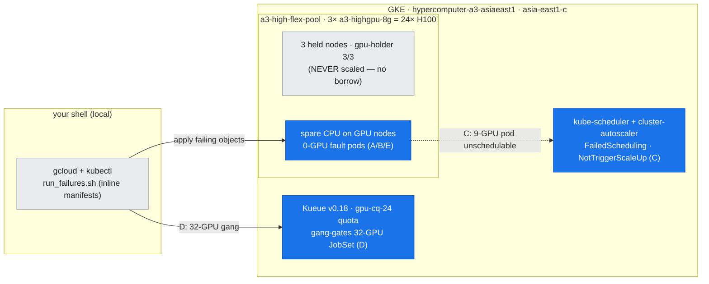
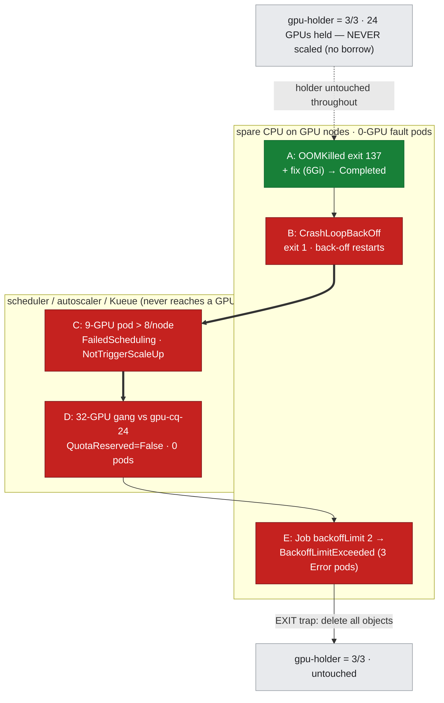

# Lab 16: Cluster & Job Failure Triage — the failures that never reach the GPU

**Objective:** Answer the other half of the day-2 question. lab-14 read a GPU that *is* running and lab-15 read a collective that *is* connecting; this lab captures the failures where the job **never runs, keeps crashing, or gives up** — the ones whose signature lives in `kubectl` / Kueue / JobSet state, not in `nvidia-smi`. Five faults, each induced live and read with the same ordered triage loop (`get` → `describe`/events → `logs` → framework condition):

1. **OOMKilled (exit 137)** — a container that allocates past its memory limit — plus the one-line **fix** (raise the limit → `Completed`).
2. **CrashLoopBackOff** — a container that keeps exiting non-zero, restarted with exponential back-off.
3. **Unschedulable (`Pending` forever)** — a pod requesting 9 GPUs (> 8/node): the scheduler can never place it *and* the autoscaler can never grow into it.
4. **Kueue-inadmissible gang** — a 32-GPU JobSet gated by a 24-GPU `ClusterQueue`: `QuotaReserved=False`, **zero pods created**.
5. **Job retry → `BackoffLimitExceeded`** — the retry-then-give-up mechanism (one pod per attempt).

This is the [doc-16 diagnostic method](../../docs/part5-operations-diagnostics/16-diagnostic-method.md) applied to the **scheduler / quota / framework** layer, written up in [doc-19](../../docs/part5-operations-diagnostics/19-cluster-job-failure-triage.md).

**Duration:** ~4 minutes. **No GPU-borrow window** (see below).

**Prerequisites:**
- The 3-node `hypercomputer-a3-asiaeast1` cluster (`a3-high-flex-pool`, 3 × `a3-highgpu-8g` = 24 × H100), context `gke_hdlab-elideng_asia-east1-c_hypercomputer-a3-asiaeast1`.
- **JobSet** (v0.12.0) and **Kueue** (v0.18.3) controllers installed (they are, from lab-13a). The runner applies `manifests/kueue-gpu-queues-24.yaml` (the `gpu-cq-24` 24-GPU `ClusterQueue` + `gpu-lq-24` + `a3-high-flex` flavor) for Phase D and deletes it on exit.
- Read [doc-16](../../docs/part5-operations-diagnostics/16-diagnostic-method.md) and [doc-19](../../docs/part5-operations-diagnostics/19-cluster-job-failure-triage.md).
- Builds on [lab-07](../lab-07-gke-gang-schedule/) (scheduling/`FailedScheduling`), [lab-08](../lab-08-jobset-multinode/) / [lab-13](../lab-13-topology-resilience/) (JobSet + Kueue gang admission).

> **Why NO GPU-borrow window (and why that's the point)?** Every prior Part V lab borrows a node. This one borrows **nothing** — because its failures are, by definition, jobs that *don't* consume a GPU. Faults A/B/E run as **0-GPU pods** on spare CPU on the GPU nodes; C requests **9 GPUs** (> 8/node) so it can *never* schedule *and* the autoscaler can never satisfy it (guaranteed `Pending`, no scale-up); D is gated on **quota** (32 > 24) *before* scheduling, so zero pods are created and no GPU is touched. The `gpu-holder` stays **3/3 throughout** — verified start and end. That a whole class of "my job won't run" incidents reproduces at zero GPU is itself the localization lesson (doc-19, Step 0).

---

## Where this runs (the environment)

*Unlike every other Part V lab, this one **borrows nothing** — the `gpu-holder` stays **3/3** the whole time (grey, untouched). The failures live in the **scheduler / autoscaler / Kueue** control plane and on **spare CPU** of the GPU nodes (0-GPU fault pods) — never on a GPU. Blue = what this lab exercises; grey = held/untouched.*



---

## Run

```bash
bash labs/lab-16-cluster-job-failure-triage/run_failures.sh
```

The runner is self-contained (inline manifests). It sources `scripts/lib_capture.sh` then `set +e` (this lab submits intentionally-failing / never-scheduling objects and manages their exit codes explicitly — gotcha G1). Each phase applies an object, waits for it to reach its failure state, and distils the signature into `assets/lab-16/`. An `EXIT` trap deletes every object it created (pods, the retry Job, the over-quota JobSet, and the Kueue queues) — the `gpu-holder` is **never** referenced except to read its replica count for provenance.

**Flex-safe.** No device state is changed, no node is drained/cordoned/deleted, no `ProvisioningRequest` is created (nothing scales the Flex pool), and the holder is never scaled. The two never-scheduling objects (C's 9-GPU pod, D's 32-GPU gang) are *designed* to be unsatisfiable, so they cannot trigger a scale-up.

**Files:**
- `run_failures.sh` — the five phases + timeline; distils each into `assets/lab-16/`
- assets: `oom_*` (OOMKilled + `oom_fixed_get.txt`), `crashloop_*`, `unschedulable_*`, `quota_clusterqueue.txt` + `gang_inadmissible.txt` (the Kueue-gated gang), `retry_*`, `failures_timeline.txt`

### The five faults, mapped onto the environment (no borrow)

*The five faults overlaid on the environment — **no borrow bracket**, because the `gpu-holder` is never scaled (grey, untouched throughout). A/B/E are 0-GPU pods on spare CPU; C/D never reach a GPU (scheduler and Kueue gate them). A ends green (the fix runs to `Completed`); the rest stay red. The run order is A→B→C→D→E, crossing between the CPU-pod zone and the scheduler/Kueue zone.*



---

## What was measured (real output)

`gpu-holder` start=**3/3** end=**3/3** — no borrow window. All strings below are copied from `assets/lab-16/`.

### A — OOMKilled (exit 137), and the fix

A container allocating **4 GiB under a `256Mi` limit** is killed by the kernel OOM killer:

```
State:      Terminated
  Reason:   OOMKilled
  Exit Code: 137          ← 128 + SIGKILL(9): killed for exceeding limits.memory, not a segfault
Limits:   memory: 256Mi
```

`Exit Code: 137` + `Reason: OOMKilled` is unambiguous. The fix is a one-liner, and the lab **proves** it: the *same* workload under a `6Gi` limit runs to `Completed` (`oom_fixed_get.txt`). The code never changed — the limit was the bug.

### B — CrashLoopBackOff

A container that `exit 1`s two seconds after start (`restartPolicy: Always`) is restarted with exponential back-off:

```
STATUS             RESTARTS      AGE
CrashLoopBackOff   1 (15s ago)   20s

Last State:  Terminated   Reason: Error   Exit Code: 1
Events:  Warning  BackOff  ...  Back-off restarting failed container flaky
```

`CrashLoopBackOff` is the kubelet's *reaction*; the cause is in **`Last State: Terminated / Error / Exit Code 1`** (and `kubectl logs --previous`). The `RESTARTS` count climbing + the `BackOff` event are the signature.

### C — Unschedulable (`Pending` forever)

A pod requesting **9 GPUs** on 8-GPU nodes never schedules, and the scheduler + autoscaler both say why:

```
STATUS: Pending
Warning  FailedScheduling   default-scheduler   0/4 nodes are available:
  1 node(s) didn't match Pod's node affinity/selector, 3 Insufficient nvidia.com/gpu. ...
Normal   NotTriggerScaleUp  cluster-autoscaler   Pod didn't trigger scale-up:
  1 max node group size reached
```

`FailedScheduling … Insufficient nvidia.com/gpu` = no node fits; `NotTriggerScaleUp … max node group size reached` = the autoscaler can't grow its way out (9 > 8/node is unsatisfiable at any node count — which is also *why* this fault is Flex-safe: it can never trigger a scale-up).

### D — Kueue-inadmissible 32-GPU gang (24-GPU quota) — the multi-node signature

A **32-GPU** JobSet (4 replicas × 8) submitted against the **24-GPU** `gpu-cq-24` `ClusterQueue` is held by Kueue **before any pod is created**:

```
NAME                              QUEUE       RESERVED IN   ADMITTED   AGE
jobset-lab16-overquota-32-5f7a6   gpu-lq-24                            12s

workload: jobset-lab16-overquota-32-5f7a6
  ('QuotaReserved', 'False', 'Pending',
     "couldn't assign flavors to pod set worker: insufficient quota for nvidia.com/gpu in flavor")

### pods for the gated JobSet:
No resources found in default namespace.
```

The signal is in the **`Workload` condition** (`QuotaReserved=False`, reason `Pending`, "insufficient quota") — there is **no pod to describe** (contrast Phase C, which *has* a pod + a `FailedScheduling` event). Kueue gang-gates the whole 32-GPU request atomically rather than scheduling a partial, deadlock-prone gang. This is the one fault that genuinely **needs the 3-node cluster + a real quota** to express — and the holder keeps all 24 GPUs the whole time because nothing is ever scheduled. (The *at-quota* 24-GPU gang **is** admitted and runs live — that's [lab-13a](../lab-13-topology-resilience/); not re-run here, to keep the holder 3/3.)

### E — Job retry → `BackoffLimitExceeded`

A `Job` with `backoffLimit: 2` (`restartPolicy: Never`) creates a **new pod per attempt**; after 3 failed attempts the Job is `Failed`:

```
NAME          STATUS   COMPLETIONS   DURATION
retry-fault   Failed   0/1           43s

Failed=True  reason=BackoffLimitExceeded  msg=Job has reached the specified backoff limit

### one pod per attempt (all Error):
retry-fault-6t47q   Error   ...
retry-fault-gqzm5   Error   ...
retry-fault-xx6gg   Error   ...
```

The **`Job` condition** `Failed=True / BackoffLimitExceeded` is the verdict; the **three `Error` pods** (one per attempt) are the evidence trail. This is the third distinct retry mechanism — container `restartPolicy` (Phase B) vs. Job `backoffLimit` (here) vs. JobSet `failurePolicy.maxRestarts` (doc-08/lab-10) — and matching the knob to the symptom is the skill (doc-19, Step 4).

---

## Gotchas hit building this lab

In the cross-lab index [reference/lab-build-gotchas.md](../../reference/lab-build-gotchas.md):
- **G14** (new) — under `set -u` (inherited from `lib_capture.sh`, G1), a single-line `local pod=… max="${3:-60}" end=$((SECONDS + max))` fails with `max: unbound variable`: the initializers in one `local` statement aren't in scope for each other yet. Fix = split the dependent arithmetic onto its own `local` line.
- Also relevant: **G1** (`set -e` inheritance → `set +e` for intentionally-failing objects).

By design this lab hit **no** GPU/driver gotchas — it runs entirely in the scheduler/quota/framework layer.

## Cleanup

Automatic. The `EXIT` trap deletes all five objects (the four pods, the `retry-fault` Job, the `lab16-overquota-32` JobSet) and the Kueue queues. The `gpu-holder` was never touched. Verify:

```bash
kubectl --context gke_hdlab-elideng_asia-east1-c_hypercomputer-a3-asiaeast1 \
  get deploy gpu-holder -o jsonpath='{.status.readyReplicas}/{.spec.replicas}'   # → 3/3
```
