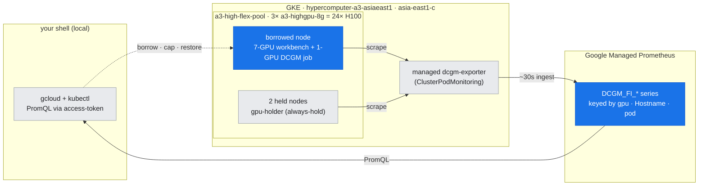
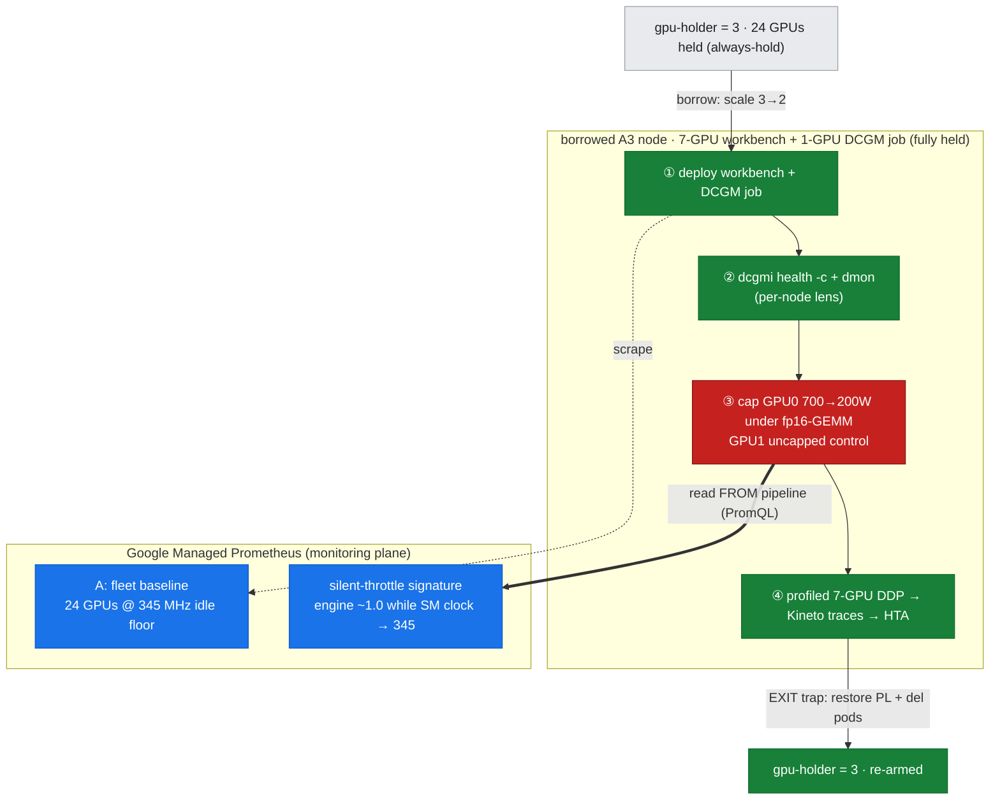

# Lab 17: Performance Monitoring & Day-2 Operations — catch the regression *from the pipeline*

**Objective:** Every prior lab reads **one** tool at a **point in time** — `nvidia-smi` here, `NCCL_DEBUG` there, `kubectl describe` for a crash. Day-2 operations is the **pipeline view**: a baseline you can alert against, a dashboard, and the discipline of catching a regression **on the monitoring plane before it becomes a crash or an SLO miss**. This lab does exactly that on **one** borrowed node inside a guarded window — four captures, and the marquee one reads a silent throttle straight off Google Managed Prometheus (GMP), not off the device:

1. **Baseline via the monitoring pipeline** — live PromQL against GMP across the fleet (all 24 GPUs at the idle floor), plus the exact `DCGM_FI_*` field catalog the managed `dcgm-exporter` scrapes. This is the reference an alert rule fires against.
2. **`dcgmi` in anger** — `dcgmi discovery` / `dcgmi health -c` / `dcgmi dmon` from a DCGM container (the local per-node lens; `dcgmi` isn't in the PyTorch image — gotcha G7).
3. **Regression detection from monitoring** — drive load on 7 GPUs, then cap device-0's power 700→200 W (lab-14's proven-safe reversible throttle) and **read the silent throttle back off GMP**: engine-active stays pinned high while the SM clock collapses and power pins at the cap — with a healthy neighbor GPU under identical load as the control. Then restore.
4. **HTA** — a profiled 7-GPU DDP run → per-rank Kineto traces → **Holistic Trace Analysis**: the temporal breakdown (compute vs. comm vs. idle) and comm/compute overlap — *where the step time actually goes*, which a throughput number alone can't show.

It ships two **portable, validated artifacts** alongside the live capture: [`grafana-dashboard.json`](./grafana-dashboard.json) and [`prometheus-alert-rules.yaml`](./prometheus-alert-rules.yaml), both keyed on the real exported labels.

This is the [doc-16 diagnostic method](../../docs/part5-operations-diagnostics/16-diagnostic-method.md) applied to the **steady-state / observability** layer, written up in [doc-20](../../docs/part5-operations-diagnostics/20-performance-monitoring-day2-ops.md).

**Duration:** ~12 minutes inside a guarded GPU-borrow window (the throttle hold + GMP ingestion lag + HTA install dominate).

**Prerequisites:**
- The 3-node `hypercomputer-a3-asiaeast1` cluster (`a3-high-flex-pool`, 3 × `a3-highgpu-8g` = 24 × H100), context `gke_hdlab-elideng_asia-east1-c_hypercomputer-a3-asiaeast1`. Node driver **580.126.20** (R580/CUDA-13).
- **Google Managed Prometheus enabled** with the managed `dcgm-exporter` running (`ClusterPodMonitoring gke-managed-dcgm-exporter` in `gke-managed-system`). Query access = `roles/monitoring.viewer` on the project.
- Read [doc-16](../../docs/part5-operations-diagnostics/16-diagnostic-method.md) (the triage loop, the two lenses). Builds on [lab-10](../lab-10-observability-fleet-debug/) (the metrics stack) and reuses [lab-14](../lab-14-single-gpu-health-triage/)'s reversible-throttle technique and `load_gpu.py`.

> **Why only ONE node (and why that's the point)?** Fleet monitoring, per-node DCGM, a single-device throttle, and a single-node DDP profile do **not** need three nodes — so this lab borrows just **one** (scale `gpu-holder` 3→2) and keeps the **other two held** (the always-hold rule). The 24-GPU *fleet baseline*, however, is read across all three nodes at once from GMP — because a baseline is a fleet property, and the monitoring plane sees every node whether or not this lab is driving it.

---

## Where this runs (the environment)

*The lab drives GPUs on **one borrowed A3 node**, but reads them back off the **monitoring plane** — the whole point of day-2 ops. Blue = what this lab touches; grey = held/context. The `dcgm-exporter` scrapes every node whether this lab is driving it or not, which is why the fleet baseline (Phase A) sees all 24 GPUs.*



---

## Run

```bash
bash labs/lab-17-perf-monitoring-day2-ops/run_monitoring.sh
```

The runner opens a **guarded, gap-free borrow window**: scales `gpu-holder` 3→2 (freeing one node's 8 GPUs), identifies the freed node, and schedules a **privileged 7-GPU workbench** + a **1-GPU DCGM Job** on it (node stays fully held). An `EXIT` trap restores the power limit **and** the holder to 3 on every path.

**Flex-safe.** The only device-state change is the **power-limit cap**, explicitly restored in Phase C *and* re-restored by the trap. No node is drained, cordoned, or deleted. `set +e` is used deliberately (bounded/best-effort tools — gotcha G1). PromQL is run from the **local** shell with `gcloud auth print-access-token`; the token is **never** written into a captured asset (the query helpers echo only the query text).

**Files:**
- `run_monitoring.sh` — orchestrates the borrow window + four phases into `assets/lab-17/`
- `load_gpu.py` — sustained fp16 GEMM (from lab-14); one process per device drives GPUs 0–6
- `profiled_ddp.py` — a profiled 7-GPU DDP step loop that exports one Kineto trace per rank for HTA
- `grafana-dashboard.json` — a portable 7-panel DCGM fleet-health dashboard (schemaVersion 39)
- `prometheus-alert-rules.yaml` — 5 portable alert rules (marquee: `GPUSilentThrottle`)
- assets: `baseline_promql.txt` (+ `baseline_sm_clock/power/engine.txt`), `dcgm_prof_fields.txt`, `dcgmi_dmon_health.txt`, `throttle_local_crosscheck.txt`, `regression_promql.txt`, `hta_profiled_run.txt`, `hta_trace_files.txt`, `hta_analysis.txt`, `monitoring_timeline.txt`

### The four phases, mapped onto the environment (Flex-safe borrow)

*The same architecture as above, now with the run's steps overlaid. The four phases sit **inside the zone they act on** — ①②③④ drive the borrowed node, while the fleet baseline and the silent-throttle verdict are **read off the GMP plane** (the thick edge is the marquee: the throttle is caught on the monitoring plane, not the device). The whole run is bracketed by the guarded borrow (`gpu-holder` 3→2) and the `EXIT`-trap re-arm to 3.*



---

## What was measured (real output)

Borrowed node this run: `…lq6m` (holder held the other two; end state **3/3**). All numbers below are copied from `assets/lab-17/`.

### A: the fleet baseline, read from the pipeline (not the device)

`DCGM_FI_DEV_SM_CLOCK` across the whole fleet returns **every GPU at 345 MHz** — the idle clock floor — straight from GMP (`baseline_promql.txt`). That flat idle baseline is what the regression in Phase C is read *against*. The managed exporter's field catalog (`dcgm_prof_fields.txt`) is **21 `DCGM_FI_*` fields** — 10 `DCGM_FI_DEV_*` (FB free/total/used, GPU/mem temp, GPU/mem-copy util, power, SM clock, energy) + 11 `DCGM_FI_PROF_*` (DRAM/GR-engine/SM active, the FP16/32/64 + tensor pipes, NVLink & PCIe RX/TX) — and **no XID or ECC field** (gotcha G11; XID surfaces via NPD → Cloud Logging, see doc-19/doc-17). Every series is keyed by `gpu` + `Hostname` (and, usefully, `pod`/`container` — see below).

### C: a silent throttle, caught on the monitoring plane

The crux. Under identical fp16-GEMM load, device-0's power limit was capped 700→200 W while device-1 ran uncapped as the control. Read back from GMP over the window (`regression_promql.txt`, `gpu0`/`gpu1` = the `[bench]` workbench series):

| Signal (from GMP) | GPU 0 — **capped** | GPU 1 — control (same load) |
|---|---|---|
| `DCGM_FI_DEV_SM_CLOCK` | boost 1980 → **collapses to 345 MHz** | holds **1365–1380 MHz** |
| `DCGM_FI_DEV_POWER_USAGE` | **pins at ~215 W** (the 200 W cap) | ~700 W |
| `DCGM_FI_PROF_GR_ENGINE_ACTIVE` | **stays ~1.0** (SMs busy) | ~1.0 |

That is the **silent-throttle signature**: engine-active high (real work in flight) *while* the clock has collapsed and power is pinned at the cap. Idle would show engine ≈ 0; a healthy GPU shows a high clock. Only the pipeline, watching both fields together, distinguishes "throttling under load" from "idle" — a single throughput number can't. It clears the moment the cap is lifted (clock recovers to 1350–1380 MHz). This is exactly the `GPUSilentThrottle` rule in `prometheus-alert-rules.yaml` (`GR_ENGINE_ACTIVE > 0.5 and SM_CLOCK < 1000`, `for: 2m`).

The **local lens agrees** (`throttle_local_crosscheck.txt`, `nvidia-smi -q` at the capped moment): `SW Power Cap: Active`, `HW Slowdown / HW Thermal: Not Active`, `Current Power Limit: 200.00 W`, avg draw 215.82 W, SM 345 MHz. Two lenses (doc-16), one conclusion: **power-capped, not thermal, not idle.**

> **A GMP subtlety worth knowing (gotcha note):** a borrowed GPU returns **two** series per metric, split by the `container`/`pod` label — `[bench]` (this lab's workbench, under load) and `[holder]` (the `gpu-holder` that reclaims the node *after* cleanup, idle at 345 MHz/71 W). GMP inherits the DCGM device-plugin's Kubernetes attribution, so filter by `pod`/`container` to isolate the workload — and note it's *useful*: `DCGM_FI_*{pod="…"}` attributes throttle/util/OOM to a specific workload (what the `GPUIdleButAllocated` cost alert keys on).

### B: `dcgmi` in anger — the per-node lens

From the DCGM container: `dcgmi health -c` → **`Overall Health: Healthy`**, and `dcgmi dmon -e 100,155,203,1002,1004,1005` streams a 15-sample SMCLK/POWER/GPUTL/SMACT/TENSO/DRAMA time series (`dcgmi_dmon_health.txt`). **Honest note:** the background `dcgmproftester -t 1004` meant to drive load **no-op'd** on this R580 image (SMACT/TENSO stayed `0.000`, clock at the 345 MHz idle floor) — gotcha G16. So the `dmon` series here demonstrates the *tool and its field IDs* on an idle GPU; the real under-load DCGM data is the GMP capture in Phase C, driven by the `load_gpu.py` GEMM.

### D: HTA — where the step time goes

`profiled_ddp.py` ran a profiled 7-GPU DDP loop and exported 7 per-rank Kineto traces (~1.1 MB each); HTA parsed them and produced (`hta_analysis.txt`):

- **Comm/compute overlap ≈ 28%** across every rank — 28% of communication is hidden behind compute; the rest is exposed.
- **Kernel breakdown:** COMMUNICATION **43.7%**, COMPUTATION **26.7%**, compute-overlapping-comm **20.1%**, comm-overlapping-memory 6.7%, memory 2.9% — communication-dominated, as expected for a small model with large gradient all-reduces on a single node.
- **Temporal breakdown:** ranks 2–5 are compute-heavy (~7–13% idle) while ranks 0/1/6 show 68–73% idle — a real rank imbalance (NCCL waiting on the critical path).

**Honest caveat (kept in the asset):** HTA warns `ProfilerStep not found in the trace` — `profiled_ddp.py` profiles a plain step loop without `torch.profiler.schedule()` step markers, so HTA can't bucket by optimizer step; the percentages are over the whole profiled region. Add a `schedule=` with `prof.step()` per iteration for step-accurate bucketing.

---

## Portable artifacts (validated, not just captured)

- **`grafana-dashboard.json`** — 7 panels (SM clock, power, the silent-throttle correlate `engine-active vs clock/max`, tensor-pipe active, NVLink+PCIe throughput, FB-used %, temp), templated on `$ds` (datasource) + `$node` (`label_values(DCGM_FI_DEV_SM_CLOCK, Hostname)`). Import → pick a Prometheus/GMP datasource.
- **`prometheus-alert-rules.yaml`** — `GPUSilentThrottle` (the Phase-C signature), `GPUThermalRisk`, `GPUMemoryNearFull` (predicts the lab-16 OOM), `GPUIdleButAllocated` (the always-hold cost guard), `DCGMExporterDown`. Deploy via self-hosted `rule_files:` or a GMP `Rules` CR. Every expression uses only fields the managed exporter really exports (no XID/ECC — G11).

---

## Gotchas hit building this lab

All are in the cross-lab index [reference/lab-build-gotchas.md](../../reference/lab-build-gotchas.md):
- **G15** — backslash-escaped quotes inside an f-string expression break `python3 -c` on Python < 3.12 (`unexpected character after line continuation character`); use concatenation or a named format var. GMP retains data, so the throttle window was re-queryable after the fix — no re-borrow needed.
- **G16** — `dcgmproftester` is a no-op in the DCGM 4.4.0 image on R580 (drives no load); use a real CUDA workload and read DCGM against it.
- Also relevant: **G1** (`set -e` inheritance → `set +e`), **G7** (`dcgmi` not in the PyTorch image → DCGM Job), **G11** (managed exporter has no XID field).

## Cleanup

Automatic. The `EXIT` trap restores device-0's power limit, deletes the workbench pod and DCGM Job, and scales `gpu-holder` back to **3**. Verify:

```bash
kubectl --context gke_hdlab-elideng_asia-east1-c_hypercomputer-a3-asiaeast1 \
  get deploy gpu-holder -o jsonpath='{.status.readyReplicas}/{.spec.replicas}'   # → 3/3
```
