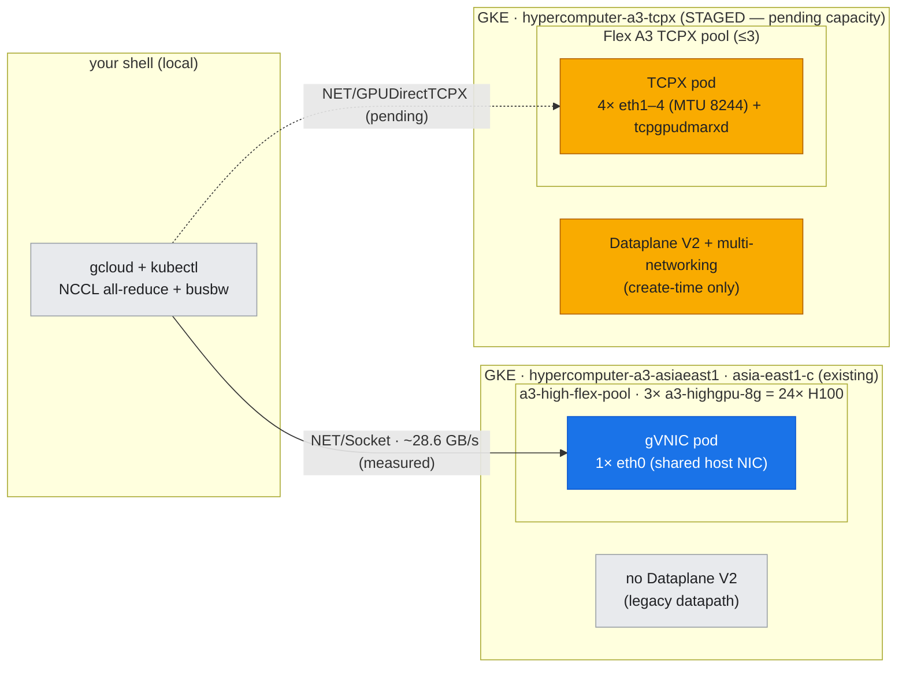
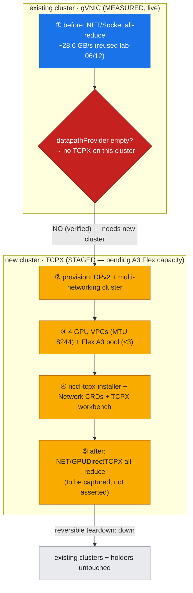

# Lab 18: Enable GPUDirect-TCPX — *close the cliff* (flagship, before/after)

**Objective:** Every earlier inter-node measurement in this guide rides the **single-gVNIC / TCP** path and honestly reports the **~28.6 GB/s** floor (lab-06) and the descending **465 → 23.7 → 14.95 GB/s** 1/2/3-node curve (lab-12). That floor is not physics — it's an *architecture choice*. This lab is the **design counterpart**: provision the **multi-network GPUDirect-TCPX** fabric that A3 High was built for, re-run the same NCCL all-reduce, and read the transport change off the wire — **`NET/Socket` → `NET/GPUDirectTCPX`**, GPU Direct enabled. It is the one lab that changes the *fabric*, not the workload.

> ### ⚠️ Status: BEFORE measured live · fabric now PROVISIONED · AFTER still capacity-gated
> **Updated 2026-07-28.** The **before** (gVNIC) half is **measured live** — reused from [lab-06](../lab-06-2node-nccl-collectives/) and [lab-12](../lab-12-scaling-sweep/), not re-run.
>
> **The architectural blocker described below is now CLEARED.** A purpose-built cluster
> `hypercomputer-a3-tcpx` (asia-east1-c) exists with **Dataplane V2 + multi-networking**, an
> A3 High Flex pool carrying **4 `--additional-node-network` attachments**, and the
> `Network`/`GKENetworkParamSet` CRDs **applied live** (previously staged-only).
> [`scripts/verify_gpu_fabric.sh`](../../scripts/verify_gpu_fabric.sh) reports every
> checkable layer PASS at `tier=TCPX`. The sibling [lab-22](../lab-22-fabric-diagnostics/)
> did the same one rung up and got an A3 Mega node with **8 GPU NICs** and the plugin
> installed, which proves the recipe end-to-end.
>
> **What remains pending is only the number, and only for one reason: capacity.** The
> `after` needs *two* A3 High nodes up *simultaneously* in the same zone, and asia-east1-c
> returned `FailedScaleUp: GCE out of resources`. A holder is armed to claim nodes the
> moment they free up. So:
> - ✅ *Architecture* — no longer a blocker. The create-time gate is satisfied.
> - ⏳ *Throughput* — awaiting concurrent Flex capacity. **Not fabricated here.**
>
> Original blocker, kept for the record (it is the lesson, and it still applies to the two
> production clusters) — evidence in [`assets/lab-18/blocker_dataplane_v2.txt`](../../assets/lab-18/blocker_dataplane_v2.txt):
> - GKE GPUDirect-TCPX needs **multi-networking**, which needs **Dataplane V2**, which is a **create-time-only** cluster setting. `hypercomputer-a3-asiaeast1` was created without it (`networkConfig.datapathProvider` empty; no anetd/cilium DaemonSet), so **TCPX cannot be added to it** — it requires a **new cluster**. That is exactly what was done.
> - The project has **no on-demand H100 quota** (the existing 3 A3 nodes came via scarce **Flex-start**); a new 2-node TCPX pool is capacity-gated.
>
> Tooling to land the `after` the moment capacity appears: [`scripts/provision_tcpx_pool.sh`](../../scripts/provision_tcpx_pool.sh) (reversible new-cluster + VPCs + pool + plugin — note its flex-start flags were **broken until 2026-07-28**; see lab-22 §"what running it actually taught us"), the [`manifests/tcpx/`](../../manifests/tcpx/) CRDs/installer/workbench, and [`run_tcpx_beforeafter.sh`](./run_tcpx_beforeafter.sh).

This is the [doc-16 diagnostic method](../../docs/part5-operations-diagnostics/16-diagnostic-method.md) inverted into a **design decision**, written up in [doc-21](../../docs/part6-architecture-gcp-integration/21-gke-network-design.md).

---

## What "enabling TCPX" actually means (the three deltas from gVNIC)

The gVNIC baseline Pod (lab-06) is an ordinary Pod: one `eth0`, no annotations, and NCCL falls back to `NET/Socket`. A **TCPX** Pod differs in exactly three places — captured in [`manifests/tcpx/workbench-tcpx.yaml`](../../manifests/tcpx/workbench-tcpx.yaml):

1. **Four dedicated GPU networks.** `a3-highgpu-8g` exposes **4 GPU NICs**; each binds to its own VPC/subnet at **jumbo MTU 8244**. On GKE these are `Network` + `GKENetworkParamSet` CRDs ([`network-crds.yaml`](../../manifests/tcpx/network-crds.yaml)) attached via the Pod's `networking.gke.io/interfaces` annotation. **This is the create-time gate:** multi-networking ⇒ Dataplane V2 ⇒ a new cluster.
2. **The receive-datapath sidecar** (`tcpgpudmarxd`) sharing the Pod netns, installed onto the node by the [`nccl-tcpx-installer`](../../manifests/tcpx/nccl-tcpx-installer.yaml) DaemonSet.
3. **The NCCL plugin selection** — `NCCL_GPUDIRECTTCPX_SOCKET_IFNAME=eth1,eth2,eth3,eth4`, the TX/RX CPU bindings, and the unix-client prefix — which makes NCCL load `libnccl-net-gpudirecttcpx.so` instead of the socket transport.

| | gVNIC baseline (lab-06/12, **measured**) | TCPX (this lab, **pending capacity**) |
|---|---|---|
| NICs for GPU traffic | 1 (`eth0`, shared with host) | 4 (`eth1–4`, dedicated, MTU 8244) |
| NCCL transport | `NET/Socket` | `NET/GPUDirectTCPX` |
| GPU Direct | `Disabled for HCA 0 'eth0'` | enabled (DMA NIC↔GPU, host bytes bypassed) |
| Cluster requirement | any | Dataplane V2 + multi-networking (create-time) |

---

## Where this runs (the environment)

*This lab changes the **fabric**, not the workload. Blue = the gVNIC path measured live today (reused from lab-06/12); amber = the GPUDirect-TCPX path — fully scripted but **staged**, pending a Dataplane-V2 cluster + A3 Flex capacity. The two rungs live on two different clusters because multi-networking is a create-time-only setting. Everything grey is context.*



---

## Run

```bash
# BEFORE — already live; writes the evidence pointer (no cluster needed)
bash labs/lab-18-enable-gpudirect-tcpx/run_tcpx_beforeafter.sh before

# AFTER — once a TCPX cluster exists:
scripts/provision_tcpx_pool.sh up          # new cluster (DPv2+multinet) + 4 GPU VPCs + Flex A3 pool + plugin
KUBE_CONTEXT=gke_hdlab-elideng_asia-east1-c_hypercomputer-a3-tcpx \
  bash labs/lab-18-enable-gpudirect-tcpx/run_tcpx_beforeafter.sh after
scripts/provision_tcpx_pool.sh down         # reversible teardown
```

**Files:**
- `run_tcpx_beforeafter.sh` — points at the live gVNIC baseline (before) and drives the TCPX transport + busbw capture (after)
- `../../scripts/provision_tcpx_pool.sh` — reversible: 4 GPU VPCs (MTU 8244) + Dataplane-V2/multi-network cluster + Flex A3 TCPX pool + `nccl-tcpx-installer`; `{up|verify|down}`
- `../../manifests/tcpx/{network-crds,nccl-tcpx-installer,workbench-tcpx}.yaml`
- assets: `before_gvnic_summary.txt` (live evidence pointer), `blocker_dataplane_v2.txt` (why after is pending); `after_tcpx_*.txt` land when capacity does

### The before/after, as steps overlaid on the two clusters (reversible, holder-safe)

*The measured rung (blue) is the gVNIC floor read live on the existing cluster; the create-time Dataplane-V2 gate (red) is what forces a **new** cluster for the staged TCPX rung (amber). The `after` number is captured, never asserted — and the whole staged path tears down reversibly, leaving the existing clusters and their holders untouched.*



---

## What was measured (real) vs. what's pending

### BEFORE — the gVNIC floor (live, reused honestly)
From [`assets/lab-06/nccl_transport.txt`](../../assets/lab-06/nccl_transport.txt): `NET/IB : No device found` → `NET/Socket : Using [0]eth0` → `Using network Socket` → `GPU Direct RDMA Disabled for HCA 0 'eth0'`. Busbw: **~28.6 GB/s** (2-node, lab-06) and the **465 → 23.7 → 14.95 GB/s** 1/2/3-node curve (lab-12). This is the cliff the design closes.

### AFTER — TCPX (pending a TCPX cluster)
Expected on the enabled fabric (to be captured, not asserted): NCCL logs `NET/GPUDirectTCPX`, the 4 GPU NICs enumerated, and a materially higher inter-node busbw. The provisioning + capture path is scripted and validated; only live A3 Flex capacity + a new DPv2 cluster stand between here and the number. **Cross-tie:** once live, the [lab-12](../lab-12-scaling-sweep/) 8/16/24-GPU sweep re-runs on this pool to produce the *enabled scaling curve*.

---

## Gotchas hit building this lab

In the cross-lab index [reference/lab-build-gotchas.md](../../reference/lab-build-gotchas.md):
- **G17** — GKE **multi-networking requires Dataplane V2, and both are create-time-only**. You cannot add GPUDirect-TCPX to a cluster that wasn't created with `--enable-dataplane-v2 --enable-multi-networking`; verify with `gcloud container clusters describe … --format='value(networkConfig.datapathProvider)'` (empty = legacy = no TCPX). Provision a new cluster instead.
- **G18** — A3 High **H100 has no on-demand quota** in this project/region; capacity comes via **Flex-start** (queued, scarce). A new TCPX pool can queue/stock-out; never free capacity by shrinking the holders.

## Cleanup

`scripts/provision_tcpx_pool.sh down` deletes the TCPX pool, cluster, firewall rules, subnets, and VPCs in reverse order. The existing `hypercomputer-a3-*` clusters and their holders are never touched by this lab.
