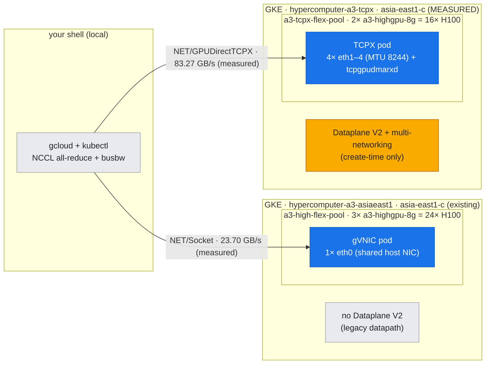
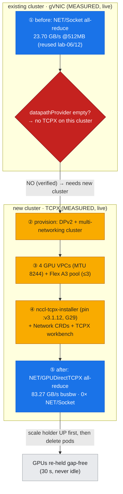

# Lab 18: Enable GPUDirect-TCPX — *close the cliff* (flagship, before/after)

**Objective:** Every earlier inter-node measurement in this guide rides the **single-gVNIC / TCP** path and honestly reports the **~28.6 GB/s** floor (lab-06) and the descending **465 → 23.7 → 14.95 GB/s** 1/2/3-node curve (lab-12). That floor is not physics — it's an *architecture choice*. This lab is the **design counterpart**: provision the **multi-network GPUDirect-TCPX** fabric that A3 High was built for, re-run the same NCCL all-reduce, and read the transport change off the wire — **`NET/Socket` → `NET/GPUDirectTCPX`**, GPU Direct enabled. It is the one lab that changes the *fabric*, not the workload.

> ### ✅ Status: COMPLETE — before **and** after measured live on A3 High
> **Updated 2026-07-31.** Both halves are now real measurements on real hardware. The
> **before** (gVNIC) half is reused from [lab-06](../lab-06-2node-nccl-collectives/) and
> [lab-12](../lab-12-scaling-sweep/); the **after** was captured on
> `hypercomputer-a3-tcpx` (asia-east1-c) on **2 × a3-highgpu-8g (16 × H100)** over a live
> GPUDirect-TCPX fabric.
>
> **Headline:** `Using network GPUDirectTCPX_v7` on all 16 ranks, **920 ×**
> `NET/GPUDirectTCPX` log lines, **zero** `NET/Socket` lines, all 4 rails balanced, and
> **83.27 GB/s busbw** peak — against **23.70 GB/s** on the single-gVNIC 2-node path at the
> same message size (**3.09×**, or **3.51×** comparing each path's own peak).
>
> This closes the last measurement gap in the guide. The thesis — *the floor is an
> architecture choice, not physics* — is now measured **at both rungs**: TCPX here (3.5×) and
> TCPXO in [lab-22](../lab-22-fabric-diagnostics/) (13.4×).
>
> Evidence: [`after_tcpx_allreduce.txt`](../../assets/lab-18/after_tcpx_allreduce.txt) ·
> [`after_tcpx_transport.txt`](../../assets/lab-18/after_tcpx_transport.txt) ·
> [`after_tcpx_inpod_fabric.txt`](../../assets/lab-18/after_tcpx_inpod_fabric.txt) ·
> [`after_tcpx_monitoring.txt`](../../assets/lab-18/after_tcpx_monitoring.txt) ·
> [`tcpx_failure_dmabuf_regmr.txt`](../../assets/lab-18/tcpx_failure_dmabuf_regmr.txt) ·
> [`checker_bug4_layer6_controls.txt`](../../assets/lab-18/checker_bug4_layer6_controls.txt)
>
> **Two hard-won caveats before you copy anything from this lab:**
> 1. **Do not pin the plugin to `:latest`.** On this tier it resolves to a 2023 build that is
>    incompatible with the node's R580 driver and **aborts NCCL outright** at memory
>    registration. Use `:v3.1.12`. The fix tag is *invisible* to the registry's `tags/list`.
>    See **G29** — this cost most of the bring-up.
> 2. **The installer's `pause` image from the GKE docs 404s** (`gcr.io/google-containers/pause:3.9`),
>    leaving the DaemonSet not-Ready *while the plugin is already installed*. See **G27**.
>
> Original blocker, kept for the record (it is the lesson, and it still applies to the two
> production clusters) — evidence in [`assets/lab-18/blocker_dataplane_v2.txt`](../../assets/lab-18/blocker_dataplane_v2.txt):
> - GKE GPUDirect-TCPX needs **multi-networking**, which needs **Dataplane V2**, which is a **create-time-only** cluster setting. `hypercomputer-a3-asiaeast1` was created without it (`networkConfig.datapathProvider` empty; no anetd/cilium DaemonSet), so **TCPX cannot be added to it** — it requires a **new cluster**. That is exactly what was done.
> - The project has **no on-demand H100 quota** (capacity comes via scarce **Flex-start**), which is why the `after` waited on two A3 High nodes being alive in the same zone at the same time.

This is the [doc-16 diagnostic method](../../docs/part5-operations-diagnostics/16-diagnostic-method.md) inverted into a **design decision**, written up in [doc-21](../../docs/part6-architecture-gcp-integration/21-gke-network-design.md).

---

## What "enabling TCPX" actually means (the three deltas from gVNIC)

The gVNIC baseline Pod (lab-06) is an ordinary Pod: one `eth0`, no annotations, and NCCL falls back to `NET/Socket`. A **TCPX** Pod differs in exactly three places — captured in [`manifests/tcpx/workbench-tcpx.yaml`](../../manifests/tcpx/workbench-tcpx.yaml), which carries a PROVENANCE block recording the exact run below:

1. **Four dedicated GPU networks.** `a3-highgpu-8g` exposes **4 GPU NICs**; each binds to its own VPC/subnet at **jumbo MTU 8244**. On GKE these are `Network` + `GKENetworkParamSet` CRDs ([`network-crds.yaml`](../../manifests/tcpx/network-crds.yaml)) attached via the Pod's `networking.gke.io/interfaces` annotation. **This is the create-time gate:** multi-networking ⇒ Dataplane V2 ⇒ a new cluster.
2. **The receive-datapath sidecar** (`tcpgpudmarxd`) sharing the Pod netns, installed onto the node by the [`nccl-tcpx-installer`](../../manifests/tcpx/nccl-tcpx-installer.yaml) DaemonSet.
3. **The NCCL plugin selection** — `NCCL_GPUDIRECTTCPX_SOCKET_IFNAME=eth1,eth2,eth3,eth4`, the TX/RX CPU bindings, and the unix-client prefix — which makes NCCL load the TCPX net plugin instead of the socket transport. **On this tier you must write the NIC list by hand:** unlike TCPXO, the TCPX plugin ships **no** `nccl-env-profile.sh` to source (**G28**).

| | gVNIC baseline (lab-06/12, **measured**) | TCPX (this lab, **measured**) |
|---|---|---|
| NICs for GPU traffic | 1 (`eth0`, shared with host) | 4 (`eth1–4`, dedicated, MTU 8244) |
| NCCL transport | `NET/Socket` | `Using network GPUDirectTCPX_v7` |
| GPU Direct | `Disabled for HCA 0 'eth0'` | enabled (DMA NIC↔GPU, host bytes bypassed) |
| busbw @ 512 MB, 16 GPUs | **23.70 GB/s** | **73.19 GB/s** (3.09×) |
| peak busbw, 16 GPUs | 23.70 GB/s | **83.27 GB/s** @ 2 GB (3.51×) |
| Cluster requirement | any | Dataplane V2 + multi-networking (create-time) |

---

## Where this runs (the environment)

*This lab changes the **fabric**, not the workload. Blue = measured live. Both rungs are now measured; they live on two different clusters because multi-networking is a create-time-only setting. Everything grey is context.*



---

## Run

```bash
# BEFORE — already live; writes the evidence pointer (no cluster needed)
bash labs/lab-18-enable-gpudirect-tcpx/run_tcpx_beforeafter.sh before

# AFTER — on the TCPX cluster (see the script header for the gap-free holder handover)
KUBE_CONTEXT=gke_hdlab-elideng_asia-east1-c_hypercomputer-a3-tcpx \
  bash labs/lab-18-enable-gpudirect-tcpx/run_tcpx_beforeafter.sh after
```

**Files:**
- `run_tcpx_beforeafter.sh` — points at the live gVNIC baseline (before) and drives the TCPX transport + busbw capture (after)
- `../../scripts/provision_tcpx_pool.sh` — reversible: 4 GPU VPCs (MTU 8244) + Dataplane-V2/multi-network cluster + Flex A3 TCPX pool + `nccl-tcpx-installer`; `{up|verify|down}`
- `../../manifests/tcpx/{network-crds,nccl-tcpx-installer,workbench-tcpx}.yaml`
- assets: `before_gvnic_summary.txt`, `blocker_dataplane_v2.txt` (the create-time gate), `after_tcpx_{allreduce,transport,inpod_fabric,monitoring}.txt`, `tcpx_failure_dmabuf_regmr.txt`, `checker_bug4_layer6_controls.txt`

### The before/after, as steps overlaid on the two clusters (reversible, holder-safe)

*The gVNIC floor (blue) was read live on the existing cluster; the create-time Dataplane-V2 gate (red) is what forced a **new** cluster for the TCPX rung — also now measured (blue). Every number is captured, never asserted, and the holders are restored before teardown.*



---

## What was measured

### BEFORE — the gVNIC floor (live, reused honestly)
From [`assets/lab-06/nccl_transport.txt`](../../assets/lab-06/nccl_transport.txt): `NET/IB : No device found` → `NET/Socket : Using [0]eth0` → `Using network Socket` → `GPU Direct RDMA Disabled for HCA 0 'eth0'`. Busbw: **~28.6 GB/s** (2-node, lab-06) and the **465 → 23.7 → 14.95 GB/s** 1/2/3-node curve (lab-12). This is the cliff the design closes.

### AFTER — TCPX enabled (live, this lab)

Environment, as measured rather than assumed: **2 × a3-highgpu-8g** (H100-80GB) on
`hypercomputer-a3-tcpx` / asia-east1-c, GKE **1.35.6-gke.1250000**, driver **580.159.04**
(NVIDIA open kernel module), plugin **`nccl-plugin-gpudirecttcpx-dev:v3.1.12`**, rxdm
**`tcpgpudmarxd-dev:v2.0.15`**, NCCL **2.19.4**, 4 GPU rails `eth1–4` at **MTU 8244**
(`192.168.{0,1,2,3}.35`), `eth0` at MTU 1460. Harness: the **same**
[`allreduce_bench.py`](../lab-06-2node-nccl-collectives/allreduce_bench.py) as lab-06 and
lab-12, `NCCL_ALGO=Ring NCCL_PROTO=Simple`, 20 iters / 5 warmup, so the numbers are directly
comparable across the guide.

**Transport — the decisive read.** Not an inference from throughput; read off the wire:

```
     920  NET/GPUDirectTCPX             <- plugin in use on every rank
       8  Using network GPUDirectTCPX   <- one per local rank
       0  NET/Socket                    <- the fallback did NOT happen
          Using network GPUDirectTCPX_v7
     264  192.168.0    264  192.168.1   <- all 4 rails carrying traffic,
     264  192.168.2    264  192.168.3      evenly (264 refs each)
```

**busbw sweep — 16 GPUs, ring all-reduce** (full table in
[`after_tcpx_allreduce.txt`](../../assets/lab-18/after_tcpx_allreduce.txt)):

| size | time (ms) | algbw (GB/s) | busbw (GB/s) |
|---|---|---|---|
| 32 MB | 2.212 | 15.17 | 28.44 |
| 64 MB | 2.538 | 26.45 | 49.59 |
| 128 MB | 3.986 | 33.68 | 63.14 |
| 256 MB | 6.967 | 38.53 | 72.25 |
| 512 MB | 13.754 | 39.03 | **73.19** ← same size as the lab-12 gVNIC row (23.70) |
| 1 GB | 26.493 | 40.53 | 75.99 |
| 2 GB | 48.356 | 44.41 | **83.27** ← peak |

**The three-rung fabric ladder, all measured, same harness:**

| fabric | rails | 16-GPU busbw | vs gVNIC |
|---|---|---|---|
| single gVNIC / `NET/Socket` (lab-12) | 1 | 23.70 GB/s | 1× |
| **GPUDirect-TCPX, A3 High (this lab)** | **4** | **83.27 GB/s** | **3.5×** |
| GPUDirect-TCPXO / FasTrak, A3 Mega (lab-22) | 8 | 317.84 GB/s | 13.4× |

Note the ladder tracks rail count more than it tracks tiers: 1 → 4 → 8 rails gives
1× → 3.5× → 13.4×. TCPX is **not** "TCPXO minus a bit" — it is a different fabric with half
the rails and a different plugin, which is exactly why this number was never back-filled from
lab-22's.

> **Honesty note — this is a floor, not A3 High's ceiling.** The run is **untuned**: TX/RX
> bindings are set, but ranks are not NUMA-pinned, and no per-size chunk tuning was done.
> Treat 83.27 GB/s as a *conservative, reproducible* figure for this shape.

**Does it show up in monitoring?** Yes, and — unlike TCPXO — on *both* planes. In-pod
`/sys/class/net/eth[1-4]/statistics/tx_bytes` read **~50.4 GB per rail**, balanced to within
**0.05%**, so on A3 High a plain NIC-counter read **is** a valid rail-balance check.
`DCGM_FI_PROF_PCIE_TX_BYTES` peaked at **~1.81 GB/s per GPU under load vs ~254 KB/s idle
(~7000×)**. This **narrows the guide's own G25**, which had generalised "GPUDirect traffic is
invisible to NIC counters" from TCPXO to all GPUDirect fabrics — it is a FasTrak/kernel-bypass
property, not a GPUDirect one. Details:
[`after_tcpx_monitoring.txt`](../../assets/lab-18/after_tcpx_monitoring.txt).

**Cross-tie:** the [lab-12](../lab-12-scaling-sweep/) 8/16/24-GPU sweep can now re-run on this
pool to produce the *enabled* scaling curve.

---

## Gotchas hit building this lab

In the cross-lab index [reference/lab-build-gotchas.md](../../reference/lab-build-gotchas.md):
- **G17** — GKE **multi-networking requires Dataplane V2, and both are create-time-only**. You cannot add GPUDirect-TCPX to a cluster that wasn't created with `--enable-dataplane-v2 --enable-multi-networking`; verify with `gcloud container clusters describe … --format='value(networkConfig.datapathProvider)'` (empty = legacy = no TCPX). Provision a new cluster instead.
- **G18** — A3 High **H100 has no on-demand quota** in this project/region; capacity comes via **Flex-start** (queued, scarce). A new TCPX pool can queue/stock-out; never free capacity by shrinking the holders.
- **G27** — the GKE-documented **`pause:3.9` image 404s**, so the installer DaemonSet sits at 0 Ready *while the plugin is already on the node*. Pin `gke.gcr.io/pause:3.8@sha256:880e63f9…`.
- **G28** — **TCPX ships no `nccl-env-profile.sh`.** lab-22 §5's "always source the vendor profile, never hand-write the NIC list" rule is **TCPXO-only**; on TCPX you must set `NCCL_GPUDIRECTTCPX_SOCKET_IFNAME` explicitly.
- **G29** — the plugin's **`:latest` tag is a 2023 build incompatible with R580 drivers**; it fails *hard* at GPU memory registration (`ioctl get dma_buf frags: Inappropriate ioctl for device` → `gpu_tx_reg_mr failed -5` → `Connect res=3`), and disabling dmabuf only moves the failure. Pin **`:v3.1.12`** — a tag the registry's `tags/list` does not even show.
- **D1–D6** — this lab also falsified **six claims in the guide's own text** (counter visibility,
  A3 High rail exposure, the plugin install path, a transport pattern that does not exist, two
  guessed bandwidth figures, and two internal inconsistencies). They are tabulated as **D1–D6** in
  [lab-build-gotchas.md](../../reference/lab-build-gotchas.md) — worth reading *before* you trust any
  single-tier statement in this guide.
- **G30** — this lab's bring-up exposed **checker bug #4**: `verify_gpu_fabric.sh` blamed a nodeSelector mismatch for what was actually the G27 image pull. Fixed and validated against both injected faults ([`checker_bug4_layer6_controls.txt`](../../assets/lab-18/checker_bug4_layer6_controls.txt)).

## Cleanup

The workbench Pods were deleted and the GPUs handed **straight back to the capacity holder**:
scale `gpu-holder-tcpx` **up first** so its Pods are already `Pending`, *then* delete the
workbench Pods — the holder claimed both nodes within **30 s**, so the Flex nodes were never
left idle. `scripts/provision_tcpx_pool.sh down` deletes the TCPX pool, cluster, firewall
rules, subnets, and VPCs in reverse order. The existing `hypercomputer-a3-*` clusters and
their holders are never touched by this lab.
