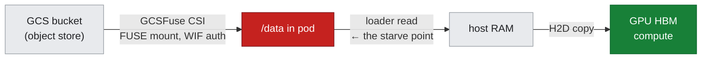
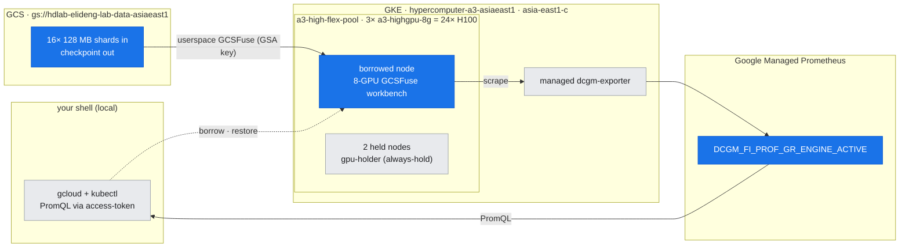
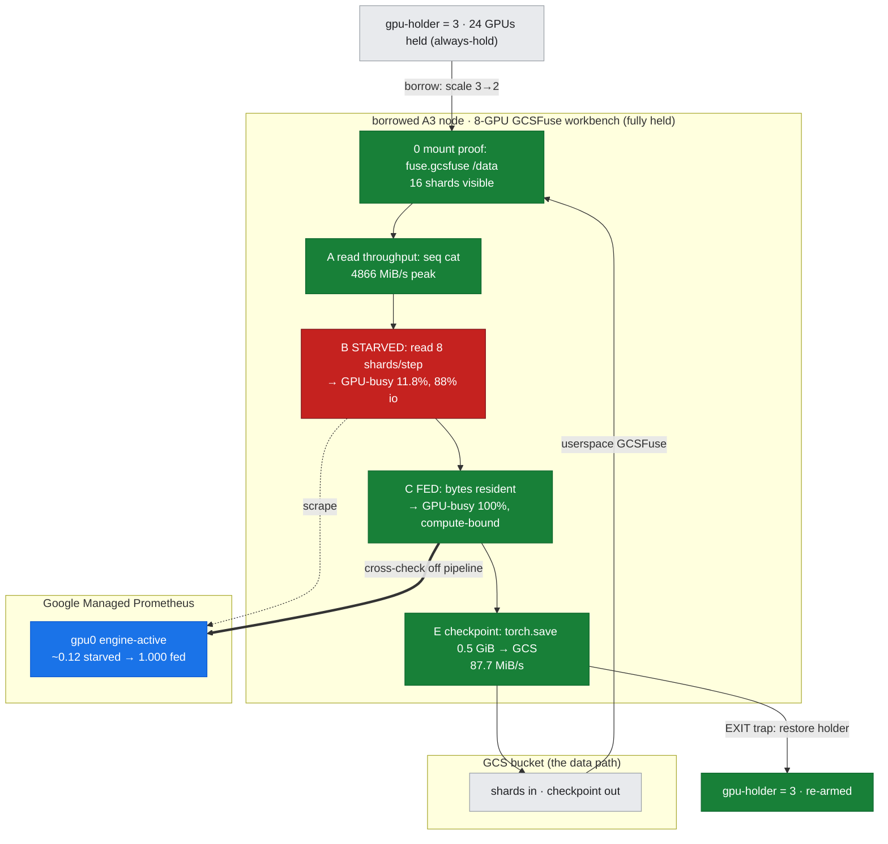
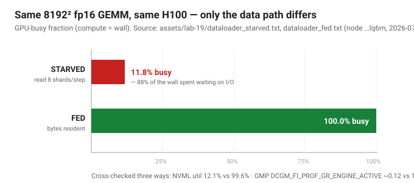

# Lab 19: Storage & the Data Path — *is the GPU starved, or slow?*

**Objective:** Every training lab so far fed the GPUs from **synthetic in-memory tensors** — a deliberate simplification that hides the single most common cause of low GPU utilization in real jobs: the **data path**. This lab mounts a **GCS bucket** into the pod through the **GCSFuse CSI driver** and makes the data path visible *as a GPU signal*. The same tiny GEMM step runs two ways:

- **STARVED** — read a fresh 128 MB shard off GCSFuse **every step**, then compute → the GPU **idles waiting on I/O**.
- **FED** — the shard is already resident (compute-bound) → the GPU **stays busy**.

Then we read the **GCSFuse sequential-read throughput** (the ceiling that does the starving), **write a checkpoint back** to the bucket (the other half of the data path), and **cross-check the GPU busy-fraction on the monitoring pipeline** (Google Managed Prometheus / DCGM) — exactly the lab-17 tooling — so *"training is slow"* gets diagnosed as a **storage** symptom, not a GPU one.

This is the [doc-16 diagnostic method](../../docs/part5-operations-diagnostics/16-diagnostic-method.md) applied to the data path, and the applied half of [doc-22](../../docs/part6-architecture-gcp-integration/22-storage-and-data-path.md).

> ### Why fewer GPUs / one node can't show this
> The starved-vs-fed contrast only *means something* against a **real cloud object store mounted the production way** (GCSFuse CSI + Workload Identity), on a **real A3 GPU** whose utilization you can read back off the managed monitoring pipeline. A laptop with a local SSD would never starve; a single synthetic-tensor benchmark never touches storage at all. This runs on **one borrowed A3 node** (8×H100) with the bucket mounted exactly as a JobSet training pod would mount it.

---

## What "the data path" is (and the three things this lab measures)



1. **Read throughput** — how fast bytes come off GCSFuse sequentially (`gcsfuse_read_throughput.txt`). This is the ceiling; if a step needs more than this, the GPU waits.
2. **The GPU signal** — `dataloader_bench.py` reports **mean GPU busy-fraction** (NVML) + the wall-time split into **io%** vs **compute%**. STARVED → low util, high io%; FED → high util. Same GEMM, same GPU — only the data path changed.
3. **Checkpoint write** — `torch.save` a ~1 GiB state-dict **back to the bucket** through GCSFuse (`checkpoint_write.txt`), the write half every real job does every N steps.

The **cross-check** (`dcgm_crosscheck.txt`) reads `DCGM_FI_PROF_GR_ENGINE_ACTIVE` for the workbench's GPU 0 straight from **GMP** — the monitoring pipeline confirms the local NVML story: engine-active is low while starved, high while fed.

---

## Prerequisites & the auth path (honest note)

> ### ⚠️ Why userspace GCSFuse + a GSA key, not the managed CSI driver
> The **production** data path is the managed **GCSFuse CSI driver + Workload Identity** — shipped here as the reference manifest [`manifests/storage/gcsfuse-workbench.yaml`](../../manifests/storage/gcsfuse-workbench.yaml). But it needs WIF at the **node** level (`workloadMetadataConfig=GKE_METADATA`), and switching that on this **pre-WIF Flex-start A3 pool recreates the nodes** — unacceptable for scarce Flex GPU capacity (gotcha **G20**, same class of blocker as lab-18's Dataplane-V2 gate). So this lab mounts **GCSFuse in userspace** inside a privileged pod, authenticated by a **GSA key** Secret — **zero node changes**, real numbers, identical data path. All measurements below are live.

| Prereq | Why | State |
|---|---|---|
| **Bucket data** | 16 × 128 MB `shard_*.bin` to read | `gs://hdlab-elideng-lab-data-asiaeast1/shards/` ✓ |
| **GSA + IAM** | `lab19-gcs@…` with `roles/storage.objectAdmin` on the bucket | ✓ |
| **GSA key Secret** | `lab19-gcs-key` — `GOOGLE_APPLICATION_CREDENTIALS` for userspace gcsfuse (ignores node oauth scope + metadata mode) | ✓ |
| Workload Identity + GCSFuse CSI | enabled cluster-wide (for the CSI reference path / lab-20) but **not** used here — node-gated (G20) | enabled |

`run_storage.sh` assumes the bucket data + `lab19-gcs-key` Secret exist; it installs userspace gcsfuse into the pod itself.

## Where this runs (the environment)

*The lab drives **one borrowed A3 node**, but the story is the edge between **GCS and the GPU**. Blue = what this lab touches (the bucket shards, the workbench GPU, and the DCGM engine-active series it cross-checks on GMP); grey = held/context. Note the GCSFuse mount is **userspace** (GSA-key auth, no node change) — the managed CSI path is node-gated (G20).*



## Run

```bash
KUBE_CONTEXT=gke_hdlab-elideng_asia-east1-c_hypercomputer-a3-asiaeast1 \
  bash labs/lab-19-storage-data-path/run_storage.sh
```

The script borrows one node (holder 3→2), applies the [GCSFuse workbench](../../manifests/storage/gcsfuse-workbench.yaml) (8 GPUs → node stays fully held), runs Phases 0/A/B/C/E, and the EXIT trap restores `gpu-holder=3`.

**Files:**
- `dataloader_bench.py` — the starved-vs-fed GPU-utilization probe (NVML busy-fraction + io/compute split)
- `run_storage.sh` — borrow-window orchestrator (mount proof → read throughput → starved → fed → checkpoint write → DCGM crosscheck)
- `../../manifests/storage/gcsfuse-workbench.yaml` — reference pod (GCSFuse CSI inline volume + WIF KSA)
- assets: `mount_proof.txt`, `gcsfuse_read_throughput.txt`, `dataloader_starved.txt`, `dataloader_fed.txt`, `dcgm_crosscheck.txt`, `checkpoint_write.txt`, `checkpoint_verify.txt`

### The phases, overlaid on the data path (Flex-safe borrow)

*The five phases (0/A/B/C/E) run on the borrowed node reading from / writing to GCS. The headline is the same GEMM two ways: **STARVED** (red — GPU idles on I/O) vs **FED** (green — compute-bound), and the verdict is confirmed independently on the GMP pipeline (blue). Bracketed by the guarded borrow (`gpu-holder` 3→2) and the EXIT-trap re-arm to 3.*



---

## What was measured (live, node `…lq6m`, 2026-07-27)

The headline is the **data-path contrast with identical compute** (8192² fp16 GEMM, 40 iters/step) — only whether the step waits on storage changes:

| | STARVED (read 8 shards/step) | FED (bytes resident) |
|---|---|---|
| wall-time I/O split | **88%** io / 12% compute | 0% io / **100%** compute |
| **GPU-busy (compute/wall)** | **11.8%** | **100.0%** |
| NVML sampled util (secondary) | 12.1% | 99.6% |
| GMP `DCGM_FI_PROF_GR_ENGINE_ACTIVE` gpu0 | plateau **~0.12** | ramp to **1.000** |

Three independent meters agree — the GPU idles ~88% of the wall while starved, and is fully compute-bound when fed. (`dataloader_starved.txt`, `dataloader_fed.txt`, `dcgm_crosscheck.txt`)



Supporting captures:
- **GCSFuse sequential read** — **4866 MiB/s** peak (single `cat` of all 16 shards; gcsfuse 3.11 parallel downloads, auto-tuned for `a3-highgpu-8g`). Per-step re-reads in the loop sustained ~2.3 GiB/s. (`gcsfuse_read_throughput.txt`)
- **Checkpoint write** — 0.50 GiB `torch.save` → GCS at **87.7 MiB/s** (`checkpoint_write.txt`), verified as an object in the bucket (`checkpoint_verify.txt`).
- **Mount proof** — `fuse.gcsfuse` mount of the bucket at `/data`, 16 shards visible (`mount_proof.txt`).

**The honest lesson (G21):** GCSFuse on A3 is *fast* — a single 128 MB read can't starve a heavy step. Starvation is about **arithmetic intensity**: when per-step data (here 1 GiB) exceeds what storage delivers inside the compute window, the GPU idles — even at multi-GB/s.

---

## Gotchas hit building this lab

In the cross-lab index [reference/lab-build-gotchas.md](../../reference/lab-build-gotchas.md):
- **G19** — the **GCSFuse CSI driver requires Workload Identity first**; enabling the addon before WIF fails with `Workload Identity must be enabled for GCS Fuse CSI driver addon`. Enable WIF (a slow cluster update), *then* the addon.
- **G20** — cluster-level WIF is **not enough**: the CSI mount also needs the node pool on `GKE_METADATA`, and switching that **recreates the nodes** — unsafe for a scarce Flex A3 pool. Flex-safe workaround: userspace gcsfuse + a GSA-key Secret (no node changes).
- **G21** — measuring a starved GPU honestly: GCSFuse on A3 reads fast (~4.9 GiB/s), and NVML instantaneous util is noisy for short kernels — key the verdict off **GPU-busy = compute/wall**, cross-checked with DCGM.

## Cleanup

The EXIT trap deletes the workbench and restores `gpu-holder=3`. The bucket, GSA, GSA-key Secret, WIF, and the CSI addon are left in place (reusable by lab-20). To fully revert: delete the checkpoint (`gcloud storage rm gs://…/checkpoints/**`), `kubectl delete secret lab19-gcs-key`, and `--update-addons GcsFuseCsiDriver=DISABLED`.
