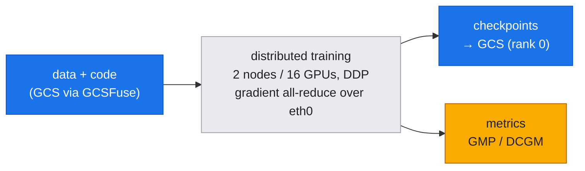
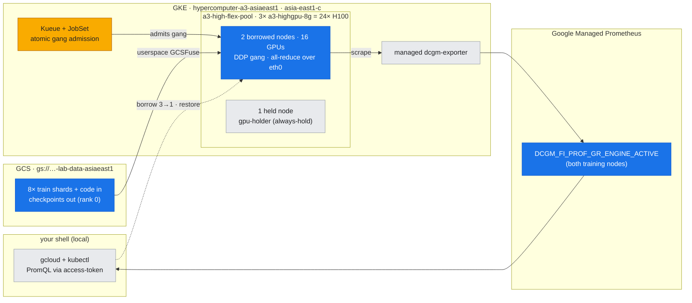
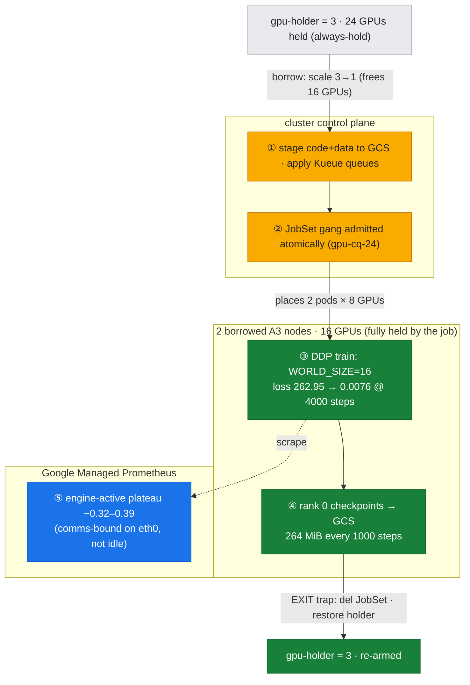
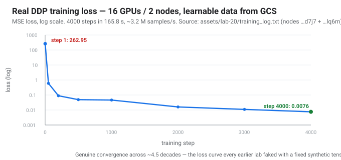

# Lab 20: The End-to-End Training Pipeline — *gang + data path + checkpoints, as one real job*

**Objective:** labs 12/13 proved the **gang** (Kueue + JobSet placing a multi-node job atomically); [lab-19](../lab-19-storage-data-path/) proved the **data path** (GCS via GCSFuse). Every earlier training lab still *faked* two things: it fed the GPUs from in-memory `torch.randn` (no data path) and never checkpointed (no write path). This lab ties them into **one real distributed training run** on the production shape:



The dataset is **learnable** (`y = X·w* + b* + noise`), so the loss **genuinely decreases** — an honest training curve, not a fixed synthetic tensor. Both the **code and the data** are read from the bucket; **rank 0 writes checkpoints back** to the bucket every N steps; and **DCGM engine-active on GMP** confirms the 16 GPUs were actually training. This is [doc-23](../../docs/part6-architecture-gcp-integration/23-training-pipeline-jobset.md) made concrete.

> ### Why fewer GPUs / one node can't show this
> A training **pipeline** only *exists* across the wire. The gradient **all-reduce** that couples every rank each step, the **shared dataset** every node reads, and the **checkpoint** one rank writes for all are inherently multi-node. On one node (8 GPUs) there is no inter-node all-reduce and no read fan-out; on one GPU there is no pipeline at all. **16 GPUs across 2 nodes** is the smallest thing that is genuinely distributed end-to-end — and, as the metrics below show, at this size the job is already partly **comms-bound on single-gVNIC** (which is exactly why [lab-18](../lab-18-enable-gpudirect-tcpx/)'s fabric ladder matters).

---

## What the pipeline does (and the four things this lab measures)

1. **Data + code from GCS.** Each worker mounts `gs://…-lab-data-asiaeast1` in-pod; it reads its training shards from `/data/train/train_*.npz` **and** its training code from `/data/code/train_pipeline.py` (staged by `run_pipeline.sh`). Nothing is baked into the image.
2. **Distributed training (the loss curve).** A JobSet gang of 2 pods × 8 local ranks = **WORLD_SIZE=16** runs DDP on the learnable data; rank 0 logs loss + throughput (`training_log.txt`). Loss must fall.
3. **Checkpoints to GCS (the write path).** Rank 0 `torch.save`s the state-dict back through the mount every `CKPT_EVERY` steps (`checkpoints_in_gcs.txt`) — verified as real objects in the bucket.
4. **Metrics on GMP (the cross-check).** `DCGM_FI_PROF_GR_ENGINE_ACTIVE` across both training nodes, straight off Google Managed Prometheus (`dcgm_training_active.txt`) — the same pipeline as [lab-17](../lab-17-perf-monitoring/) / [lab-19](../lab-19-storage-data-path/) — proves the GPUs were busy for the whole run, not just at the start.

---

## Prerequisites & the auth path (honest note)

> ### ⚠️ Same G20 gate as lab-19 → userspace GCSFuse
> The **production** data path is the managed **GCSFuse CSI driver + Workload Identity**. But it needs WIF at the **node** level (`workloadMetadataConfig=GKE_METADATA`), and switching that on this pre-WIF **Flex-start** A3 pool **recreates the nodes** — unacceptable for scarce Flex capacity (gotcha **G20**). So each worker mounts **GCSFuse in userspace** (privileged + `/dev/fuse`), authenticated by the **`lab19-gcs-key` GSA-key Secret** reused from lab-19 — **zero node changes**. All numbers below are live.

| Prereq | Why | State |
|---|---|---|
| **Learnable dataset** | 8 × `train_*.npz` (200k×256 float32, `y=X·w*+b*+noise`) so loss really drops | `gs://…-lab-data-asiaeast1/train/` ✓ |
| **GSA-key Secret** | `lab19-gcs-key` — auth for userspace gcsfuse (reused from lab-19) | ✓ |
| **Kueue queues** | `gpu-cq-24` / `gpu-lq-24` — atomic gang admission (from lab-13) | applied by `run_pipeline.sh` |
| **JobSet + Kueue controllers** | multi-pod gang | installed on the cluster |

`run_pipeline.sh` stages `train_pipeline.py` into the bucket, applies the Kueue queues, and assumes the dataset + Secret exist.

## Where this runs (the environment)

*One real distributed job on the production shape. **Kueue + JobSet** place a 2-node / 16-GPU gang (amber = the gang machinery), fed from and checkpointing to **GCS** (blue), with **DCGM engine-active** read back off **GMP** (blue). The inter-node gradient all-reduce rides the node's single gVNIC `eth0` (no TCPX — that's lab-18). Grey = the one held node + context.*



## Run

```bash
KUBE_CONTEXT=gke_hdlab-elideng_asia-east1-c_hypercomputer-a3-asiaeast1 \
  bash labs/lab-20-training-pipeline/run_pipeline.sh
```

The script borrows **two** nodes (holder 3→1 frees 16 GPUs), applies the [JobSet](../../manifests/pipeline/jobset-train-pipeline.yaml) (each pod requests a whole node's 8 GPUs → the gang spans both freed nodes, which stay **fully held** by the training job), streams the training log, cross-checks DCGM on GMP, verifies checkpoints, and the EXIT trap deletes the JobSet + restores `gpu-holder=3`.

**Files:**
- `train_pipeline.py` — DDP MLP regressor; reads shards from `/data/train`, checkpoints to `/data/checkpoints/pipeline`, logs loss/throughput (manual RANK/WORLD_SIZE, c10d — same pattern as lab-13)
- `run_pipeline.sh` — borrow-window orchestrator (stage code → Kueue → JobSet → training log → DCGM → checkpoints)
- `../../manifests/pipeline/jobset-train-pipeline.yaml` — the 2-node/16-GPU gang (userspace GCSFuse + Kueue `gpu-lq-24`)
- assets: `code_and_data_staged.txt`, `gang_admission.txt`, `training_log.txt`, `worker1_rendezvous.txt`, `dcgm_training_active.txt`, `checkpoints_in_gcs.txt`, `jobset_final.txt`

### The pipeline, as run steps overlaid on the environment (Flex-safe borrow)

*Kueue + JobSet admit the gang atomically (amber) on the control plane, the DDP job trains and checkpoints on the two borrowed nodes (green), and GMP confirms a sustained engine-active plateau (blue) — comms-bound on single-gVNIC, not idle. Bracketed by the borrow (`gpu-holder` 3→1 frees 16 GPUs) and the EXIT-trap re-arm to 3.*



---

## What was measured (live, nodes `…d7j7` + `…lq6m`, 2026-07-27)

**The gang admitted atomically** — Kueue Workload `jobset-train-pipeline-…` admitted on `gpu-cq-24`, both worker pods `Completed`, one per node (`gang_admission.txt`, `jobset_final.txt`).

**The loss genuinely fell** (real DDP on learnable data, WORLD_SIZE=16, 8 shards, rows/rank=100000):

| step | 1 | 50 | 200 | 500 | 1000 | 2000 | 3000 | 4000 |
|---|---|---|---|---|---|---|---|---|
| **loss** | 262.95 | 0.598 | 0.089 | 0.049 | 0.046 | 0.016 | 0.011 | **0.0076** |

4000 steps in **165.8s**, sustained **~3.2M samples/s** across the 16 GPUs (`training_log.txt`). The occasional up-spike (e.g. step 650 → 0.316) is ordinary mini-batch noise, not divergence — the trend is monotone toward zero.



**Checkpoints landed in GCS** — rank 0 wrote a **264 MiB** state-dict every 1000 steps at **~3.0s** each through the GCSFuse write path (steps 1000/2000/3000/4000), verified as objects in the bucket (`checkpoints_in_gcs.txt`).

**GMP/DCGM confirms the GPUs were busy for the whole run** (`DCGM_FI_PROF_GR_ENGINE_ACTIVE`, 15 samples over the run window):

| training node | avg engine-active | peak |
|---|---|---|
| `…d7j7` | **0.385** | 0.666 |
| `…lq6m` | **0.319** | 0.500 |

A **sustained plateau**, not a startup blip — the managed pipeline sees the same training the log does.

**The honest read on ~0.4, not ~1.0 (G23):** each step all-reduces a **268 M-param (≈1 GiB) gradient** across 16 ranks over the node's **single gVNIC `eth0`** (this cluster has no TCPX/RDMA — [lab-18](../lab-18-enable-gpudirect-tcpx/)). So the step is **compute interleaved with inter-node communication**, and engine-active plateaus below saturation. That's not a flaw to hide — it's the pipeline honestly showing that at 16 GPUs the **fabric** is already a first-order term, exactly the ladder lab-18 climbs.

---

## Gotchas hit building this lab

In the cross-lab index [reference/lab-build-gotchas.md](../../reference/lab-build-gotchas.md):
- **G22** — a **too-short run is invisible to GMP**: the first pass finished in 33s, shorter than GMP's ~30s scrape, so DCGM caught only the tail (mostly zeros). Fix: size the run to **several minutes** (STEPS=4000, ~166s) so the managed pipeline sees a real plateau — the same "GMP scrapes ~30s" lesson as [doc-20](../../docs/part5-operations-diagnostics/20-perf-monitoring-day2.md).
- **G23** — engine-active **~0.4, not ~1.0**, on a healthy multi-node DDP job: the 1 GiB gradient all-reduce over single-gVNIC interleaves comms with compute. Not a bug — read it alongside the fabric ([lab-18](../lab-18-enable-gpudirect-tcpx/)), don't mistake a comms-bound gang for an idle GPU.

## Cleanup

The EXIT trap deletes the JobSet and restores `gpu-holder=3`. Data, code, Secret, and Kueue queues are left in place (reusable). To remove the checkpoints: `gcloud storage rm gs://hdlab-elideng-lab-data-asiaeast1/checkpoints/pipeline/**`.
