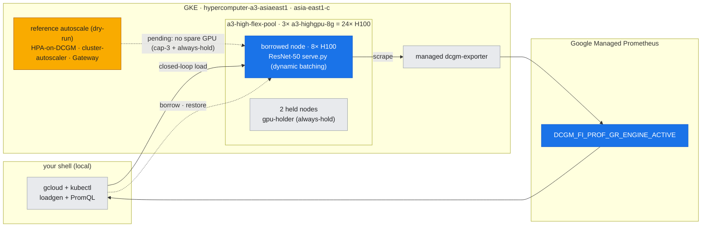
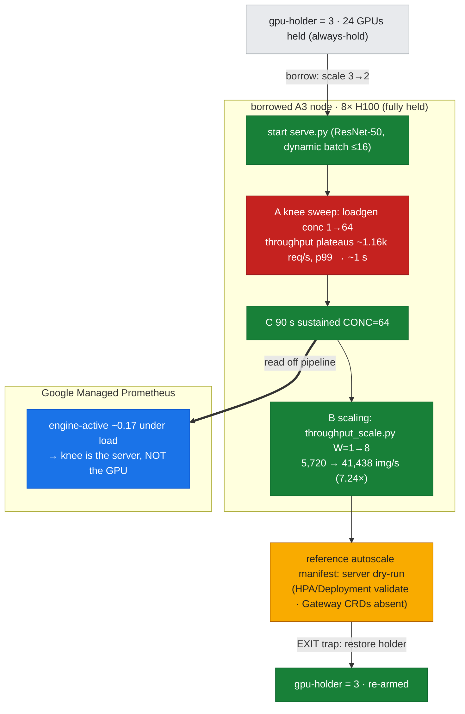

# Lab 21: Inference Serving & Autoscale — *the other workload, and why it scales sideways*

**Objective:** [lab-20](../lab-20-training-pipeline/) was **training** — one long, throughput-bound job that wants every FLOP. **Serving** is the opposite workload: many small, **latency-bound** requests arriving at a bursty rate, where the metric that matters is p99 under an SLO, not samples/sec. This lab measures the two facts that the entire serving architecture — batching, replicas, autoscaling, gateways — is built on, on real H100s:

- **A. The saturation knee** — sweep client concurrency against a real GPU model server (ResNet-50 + server-side dynamic batching). Throughput rises with load, then plateaus while tail latency explodes. This is the curve an autoscaler watches.
- **B. Horizontal throughput scaling** — run the same inference on 1→8 GPUs. Aggregate throughput scales **~linearly**, so N replicas ≈ N× QPS. *This is the thing a single GPU cannot show*, and the reason replica autoscaling is the right answer to load.
- **C. The GPU signal under load** — `DCGM_FI_PROF_GR_ENGINE_ACTIVE` off GMP, the metric an HPA scales on — read exactly as [lab-17](../lab-17-perf-monitoring-day2-ops/)/[lab-19](../lab-19-storage-data-path/)/[lab-20](../lab-20-training-pipeline/).

The production **autoscale topology** (HPA-on-DCGM, cluster-autoscaler node scale-up, GKE Inference Gateway, Vertex AI) ships as the reference manifest [`manifests/serving/inference-autoscale.yaml`](../../manifests/serving/inference-autoscale.yaml). This is [doc-24](../../docs/part6-architecture-gcp-integration/24-inference-serving-autoscale.md) made concrete.

> ### Why fewer GPUs / one node can't show this
> The core result — **throughput scales ~linearly with GPU count** (Phase B) — is *by definition* a multi-GPU measurement: one GPU gives you one data point and no slope. And the whole *point* of the lab, autoscaling, is a fleet behaviour: you scale replicas across a node and nodes across a pool. This runs on **one borrowed A3 node (8×H100)** so the 1→8 scaling curve is real; the cross-node/cross-pool tier is the reference topology (see the honest note below).

> ### ⚠️ Why the autoscale topology is reference, not live
> The **always-hold** rule keeps all 24 GPUs of the 3-node Flex pool occupied, and the **Flex-start cap-of-3** means there is **no spare GPU capacity for an HPA to scale into** and no room for the cluster autoscaler to add a GPU node. So lab-21 **measures the serving workload live** (the knee + the 1→8 scaling + DCGM) and ships the autoscale/gateway path as a **server-validated reference** — the same measured-rung / reference-rung split as [lab-18](../lab-18-enable-gpudirect-tcpx/) (fabric) and [lab-19](../lab-19-storage-data-path/) (CSI). Nothing about the fleet behaviour is asserted from a number we didn't read.

---

## Where this runs (the environment)

*The serving workload runs **live** on one borrowed A3 node (blue = the 8-GPU ResNet-50 server + the DCGM signal an HPA would scale on); the full **autoscale topology** (amber) is **dry-run only** — the always-hold rule + Flex cap-of-3 leave no spare GPU to scale into. Grey = held/context.*



---

## Run

```bash
KUBE_CONTEXT=gke_hdlab-elideng_asia-east1-c_hypercomputer-a3-asiaeast1 \
  bash labs/lab-21-inference-serving/run_serving.sh
```

Borrows one node (holder 3→2), pins a pod holding all 8 GPUs, then: Phase A (start `serve.py`, sweep `loadgen.py` concurrency), Phase C (90s sustained load + DCGM off GMP), Phase B (`throughput_scale.py` W=1→8), and a **server dry-run** of the reference autoscale manifest. EXIT trap restores `gpu-holder=3`.

**Files:**
- `serve.py` — ResNet-50 inference server with server-side **dynamic batching** (the central serving knob)
- `loadgen.py` — closed-loop concurrency load generator → req/s + p50/p95/p99
- `throughput_scale.py` — multiprocess 1→8-GPU throughput probe (horizontal scaling)
- `../../manifests/serving/inference-autoscale.yaml` — **reference** Deployment + HPA-on-DCGM + Gateway/HTTPRoute (not applied live)
- assets: `latency_vs_concurrency.txt`, `throughput_scaling.txt`, `dcgm_under_load.txt`, `reference_autoscale_dryrun.txt`

### The phases, overlaid on the node (Flex-safe borrow)

*serve.py starts, the concurrency sweep finds the **knee** (red — p99 explodes to ~1 s), 90 s of sustained load reads engine-active off GMP (blue — only ~17%, so the knee is the **server**, not the GPU), and the 1→8-GPU scaling proves near-linear replica headroom (green). The autoscale manifest is **dry-run only** (amber). Bracketed by the borrow (`gpu-holder` 3→2) and the EXIT-trap re-arm to 3.*



---

## What was measured (live, node `…d7j7`, 2026-07-27)

### A. The serving saturation knee (ResNet-50, fp16, dynamic batch ≤16)

| concurrency | throughput | p50 | p95 | p99 |
|---|---|---|---|---|
| 1 | 113.5 req/s | 8.7 ms | 9.6 ms | 10.1 ms |
| 4 | 414.0 req/s | 9.5 ms | 10.2 ms | 10.6 ms |
| 8 | 726.6 req/s | 10.6 ms | 12.0 ms | 12.8 ms |
| 16 | 800.8 req/s | 11.3 ms | 13.9 ms | **104.5 ms** |
| 32 | 1094.1 req/s | 12.2 ms | 22.3 ms | **1027.8 ms** |
| 64 | 1159.8 req/s | 21.2 ms | 33.8 ms | **1059.4 ms** |

Throughput scales cleanly to ~8 in-flight (flat ~10 ms), then **plateaus at ~1.1k req/s while p99 blows up to ~1 s** — the classic knee. Past the knee you are not serving faster, only queueing longer.


### B. Horizontal throughput scaling (the multi-GPU result)

| GPUs | aggregate | per-GPU | scaling |
|---|---|---|---|
| 1 | 5,720 img/s | 5,720 | 1.00× |
| 2 | 10,222 img/s | 5,111 | 1.79× |
| 4 | 21,308 img/s | 5,327 | 3.73× |
| 8 | **41,438 img/s** | 5,180 | **7.24×** |

Per-GPU throughput stays flat as GPUs are added → **near-linear aggregate scaling (7.24× on 8 GPUs)**. This is the empirical justification for replica autoscaling: to serve 8× the load, run 8× the replicas.


### C. The GPU signal under load — *and the honest lesson*

Under sustained `CONC=64` load, `DCGM_FI_PROF_GR_ENGINE_ACTIVE` on the serving GPU averaged **~0.17** (0.13–0.19, `dcgm_under_load.txt`). That is the punchline the two tables set up:

> **The p99 knee is NOT GPU saturation.** The GPU was only ~17% busy when p99 hit 1 s — because the bottleneck at high concurrency is the **serving stack** (single-thread request dispatch + one batching worker + Python), not the H100. A single 5,720-img/s GPU has enormous headroom (Phase B); the latency SLO breaks in the *server*, not the silicon. This is [doc-16](../../docs/part5-operations-diagnostics/16-diagnostic-method.md) discipline again: "GPU util is low, latency is terrible" means **scale the serving layer** (more replicas / better batching), not "buy a bigger GPU." lab-21 gotcha **G24**.

**Reference topology** (`reference_autoscale_dryrun.txt`): the Deployment + Service + HPA-on-DCGM validate server-side; the Gateway/HTTPRoute correctly report the **Gateway API CRDs aren't installed** on this cluster — an honest inventory of what the production path additionally requires.

---

## Gotchas hit building this lab

In the cross-lab index [reference/lab-build-gotchas.md](../../reference/lab-build-gotchas.md):
- **G24** — a serving **latency knee is not a GPU-saturation signal**: DCGM engine-active sat at ~0.17 while p99 hit ~1 s. The bottleneck was the single-threaded serving/batching stack, not the H100. Read the GPU meter *and* the latency curve together before concluding "need more/bigger GPU"; the fix here is horizontal replicas (Phase B), which is what the autoscaler adds.

## Cleanup

The EXIT trap deletes the workbench pod and restores `gpu-holder=3`. Nothing else is created live (the autoscale topology is dry-run only).
