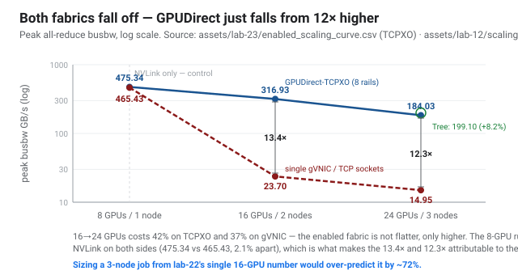
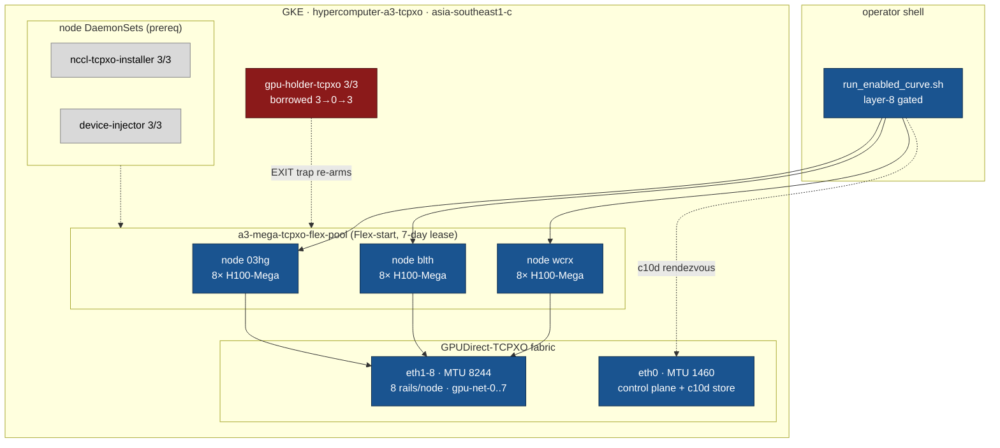
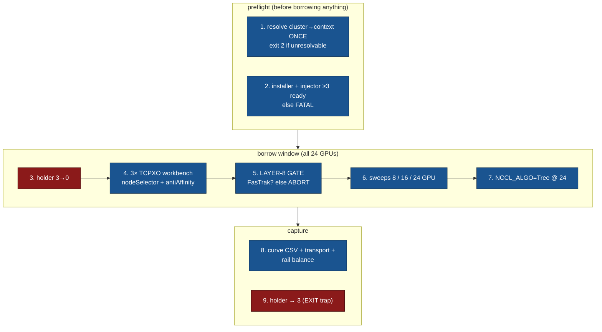

# lab-23 — The enabled scaling curve, and the tuning that isn't allowed

**Objective:** The guide's scaling story has been asymmetric. `doc-15` and [lab-12](../lab-12-scaling-sweep/)
measure a **three-point** curve — 465 → 23.7 → 14.95 GB/s across 8/16/24 GPUs — on the
fabric nobody should deploy (single-gVNIC TCP). [lab-18](../lab-18-enable-gpudirect-tcpx/)
(TCPX, 83.27 GB/s) and [lab-22](../lab-22-fabric-diagnostics/) (TCPXO, 317.84 GB/s) then proved
the cliff is an architecture choice, not physics — but each measured only **one** inter-node
point, at 2 nodes. So the guide could say *how fast* an enabled fabric is, and could not say
what it does *as you scale*. This lab measures the third rung on the enabled fabric, and
answers the "what is tuning worth" question both earlier labs left open.

> ### ✅ Status: COMPLETE — 8/16/24-GPU curve measured on live TCPXO, layer-8 gated
> **2026-08-02.** 3 × `a3-megagpu-8g` (24 × H100-Mega) on `asia-southeast1-c`, cluster
> `hypercomputer-a3-tcpxo`. Same `allreduce_bench.py` as lab-06/12/22, so the comparison
> against the gVNIC curve is apples-to-apples by construction. Every rung carries a
> `NET/FasTrak` transport read — **292 FasTrak lines, 0 `NET/Socket`** on the 24-GPU run (640 and 0 on the pre-curve gate probe).
>
> The tuning question turned out to have a **different answer than expected**, and a more
> useful one: on TCPXO the environment is **not tunable at all**. See §4.

---

## 1. The result — the enabled curve

`assets/lab-23/enabled_scaling_curve.csv`. gVNIC column is lab-12's measured peak.

| GPUs | Nodes | **TCPXO peak busbw** | latency floor | gVNIC peak | **speedup** |
|---|---|---|---|---|---|
| 8 | 1 | **475.34 GB/s** | 0.043 ms | 465.43 | 1.02× |
| 16 | 2 | **316.93 GB/s** | 0.123 ms | 23.70 | **13.37×** |
| 24 | 3 | **184.03 GB/s** | 0.138 ms | 14.95 | **12.31×** |

Three things this says that a 2-node measurement cannot:

1. **The 8-GPU rung is a control, and it passes.** 475.34 vs lab-12's 465.43 GB/s (2.1%) is
   intra-node NVLink on both sides — no fabric involved. Two different clusters, two
   different zones, same number. That is the evidence that the 13× and 12× below are the
   *fabric* changing and not the cluster, the driver, or the harness.

2. **16-GPU reproduces lab-22 to 0.3%** — 316.93 here vs **317.84** there, measured five days
   apart on a re-provisioned pool. An independent reproduction of the guide's headline
   fabric number.

3. **The enabled fabric still has a cliff — it is just a much higher one.** 316.93 → 184.03
   going from 2 to 3 nodes is a **42% drop**, against gVNIC's 23.70 → 14.95 (**37%**). The
   shape of the descent is *not* fixed by the fabric: TCPXO falls at least as steeply in
   percentage terms. What changes is the altitude — 184 GB/s at 24 GPUs is still **12.3×**
   the TCP fabric's 14.95.

> **The honest headline is therefore narrower than "GPUDirect fixes scaling."** It doesn't.
> Adding the third node costs 42% of your per-GPU bandwidth on the best fabric A3 offers.
> GPUDirect buys you an order of magnitude of *headroom*; it does not buy you flatness.
> Anyone sizing a job from lab-22's single 317.84 GB/s data point would over-predict a
> 3-node run by ~72%.



*Both curves descend. The enabled one descends from far higher — and the gap is why the
fabric is worth provisioning, while the slope is why it does not remove the scaling problem.*

---

## 2. Where this runs (the environment)



*Blue = exercised by this lab. Red = the capacity holder, whose restoration is the lab's
hard safety requirement. The split between `eth0` (control) and `eth1-8` (data) is not
decoration — it is what §3 gets wrong.*

---

## 3. Run

```bash
bash labs/lab-23-enabled-scaling-curve/run_enabled_curve.sh
# reuse an existing curve and re-run only the algorithm comparison:
SKIP_CURVE=1 bash labs/lab-23-enabled-scaling-curve/run_enabled_curve.sh
```



**The layer-8 gate is the design point.** A 16-GPU probe runs *before* any curve rung, and the
script aborts unless the log shows `NET/FasTrak` with **zero** `NET/Socket`. Without it, a
silent fallback (doc-25 §3) would quietly reproduce lab-12's TCP curve on a cluster
advertised as TCPXO — a plausible-looking set of numbers that is wrong by 12×. **A benchmark
harness that cannot prove which transport it measured is a rumour generator.**

---

## 4. What tuning is worth on TCPXO: nothing, and that is the finding

Both lab-18 and lab-22 §5.1 shipped the same disclaimer — *"this is a floor, not a ceiling…
the run is untuned"* — because the untuned run logged `CPU affinity … is not a subset`
advisories. Closing that was this lab's second goal. It closed in an unexpected direction.

The plugin loads a shim layer — **`Guest Config Checker`** — that validates the NCCL
environment against `a3plus_guest_config.textproto` and **refuses to initialize** on a
mismatch. Not a warning; the job dies before the first collective:

```
NCCL WARN NCCL/NET (shim) mismatch enforced: NCCL_FASTRAK_NUM_FLOWS=4 (expected 2)
NCCL WARN NCCL/NET (shim) mismatch enforced: NCCL_MIN_NCHANNELS=8 (expected 4)
```

**14 variables carry `POLICY_ENFORCED`** (`assets/lab-23/guest_config_enforced.txt`) — and they
are precisely the throughput surface anyone would reach for:

| Enforced | Value | Enforced | Value |
|---|---|---|---|
| `NCCL_PROTO` | `Simple,LL128` | `NCCL_FASTRAK_NUM_FLOWS` | `2` |
| `NCCL_MIN_NCHANNELS` | `4` | `NCCL_FASTRAK_USE_SNAP` | `1` |
| `NCCL_BUFFSIZE` | `8388608` | `NCCL_FASTRAK_USE_LLCM` | `1` |
| `NCCL_CROSS_NIC` | `0` | `NCCL_FASTRAK_ENABLE_CONTROL_CHANNEL` | `0` |
| `NCCL_NET_GDR_LEVEL` | `PIX` | `NCCL_FASTRAK_ENABLE_HOTPATH_LOGGING` | `0` |
| all four `*_CHUNKSIZE` | fixed | | |

Only `NCCL_TUNER_PLUGIN` and `NCCL_FASTRAK_PLUGIN_ACCEPT_TIMEOUT_MS` are merely
`POLICY_RECOMMENDED`.

> **So "317.84 is an untuned floor" was the wrong frame for TCPXO.** There is no env-tuning
> headroom to find: `nccl-env-profile.sh` is not a starting point to improve on, it is an
> enforced contract, and the shim is the enforcement. The guide should stop implying a
> reader can tune their way past these numbers. This also *reframes* the CPU-affinity
> advisory — it is real, but it is not addressable through the NCCL env.
>
> **Corollary for support:** an escalation that recommends "try raising `NCCL_MIN_NCHANNELS`"
> on A3 Mega is recommending a job crash. Read the policy file first (**G34**).

### 4.1 What *is* left: algorithm selection

`NCCL_ALGO` is **absent** from the policy file — so the one live tuning question is the one
lab-12 already asked on TCP, where **Tree beat Ring at every size** at 3 nodes (~11× in the
mid-range) and doc-15 concluded *"NCCL's default under-picks."* Does that survive a fabric
12× faster? `assets/lab-23/algo_delta.csv`:

| 24-GPU config | algo | peak busbw |
|---|---|---|
| default | ring (auto) | 184.03 GB/s |
| `NCCL_ALGO=Tree` | tree | **199.10 GB/s** |

**Tree still wins — but by 8.2%, not 11×.** The direction of lab-12's finding holds; its
*magnitude* was a property of the starving TCP fabric, not of NCCL's chooser. On a healthy
fabric the default is nearly right, and the mid-range blowout disappears.

> This is worth stating carefully, because doc-15's "the default under-picks" is the kind of
> claim that gets quoted as a tuning rule. On TCPXO it is worth **8%**, not an order of
> magnitude. A reader who carried the TCP-era advice onto A3 Mega expecting ~11× would be
> disappointed by a factor of ~134.

---

## 5. Rail balance at three nodes

`assets/lab-23/rail_balance_24gpu.txt` — a skewed spread would be doc-25 §4.7 (throughput
~1/N of expected) and would explain a disappointing 24-GPU rung:

```
eth1 10   eth2 7   eth3 3   eth4 3   eth5 3   eth6 3   eth7 3   eth8 3
```

All eight rails are referenced; `eth1`/`eth2` carry extra mentions because they also appear in
bootstrap and control-path lines, not because traffic is skewed to them. **The 42% drop from
16 to 24 GPUs is not a rail-imbalance artefact** — it is the cost of a third NVLink island in
the ring. Ruling this out is why the check runs.

---

## 6. Bugs this lab found (all in the harness, all now guarded)

Four failures, three of which are traps for anyone driving a multi-NIC pod:

- **G32 — `hostname -I` returns a GPU *rail* IP on a 9-NIC pod.** The first run set
  `MASTER_ADDR=192.169.0.2`, a rail address on an isolated per-rail /24 with no inter-node
  route. Every rank died at c10d init with **no fabric error anywhere** — the fabric was
  fine; the rendezvous was unreachable. Read `eth0` explicitly; the control plane and the
  data path are different NICs *by design* on TCPXO.
  Evidence: `assets/lab-23/failure_rail_ip_master.txt`.
- **G33 — neither `ip` nor `ifconfig` exists in `nvcr.io/nvidia/pytorch`.** The obvious fix
  for G32 fails on a stock container. Resolved via a `python3` `SIOCGIFADDR` ioctl. A
  `command -v ip` guard would have silently fallen back to the wrong NIC — worse than
  crashing.
- **G31 — `launch_node.sh` hardcodes `/workspace/w_<rank>.log`.** Staging the harness into
  the pod's `/work` emptyDir ran the benchmark perfectly and wrote every log to a
  nonexistent directory: rc=0, zero recoverable output. Keeping the launcher unmodified
  (it is the file lab-06/12 measured with) means staging into `/workspace`.
- **G34 — the enforced-config shim**, above.

Two guards were added because of these: a sweep producing **no data rows** now warns loudly
instead of becoming a silently-missing row in the curve CSV, and the CSV builders tolerate a
missing comparison run so one failed retry cannot discard three good rungs.

---

## 7. Flex safety

The lab needs **all 24 GPUs**, so it takes the whole cluster: `gpu-holder-tcpxo` 3→0, three
workbenches occupy the nodes, EXIT trap restores the holder to 3. No node is drained,
cordoned, or deleted — a Flex-start node that leaves does not come back. The trap fired on
**all four** runs including three failures, and the holder was verified `3/3` after each.

Per the TCPXO pod contract, workbenches use `nodeSelector` + `podAntiAffinity` and **never**
`nodeName`: pinning makes kubelet reject a GPU Pod outright (doc-25 §4.11) instead of letting
it queue, which is exactly what breaks a gap-free handover from the holder.

---

## 8. What support should take from this lab

1. **Never quote a single-node-pair fabric number as a scaling prediction.** 317.84 GB/s at
   16 GPUs became 184.03 at 24. Same fabric, same harness, −42%.
2. **Prove the transport before trusting the throughput.** The gate exists because a
   fallback produces a plausible curve, not an error.
3. **On A3 Mega, do not recommend NCCL env tuning.** 14 variables are enforced by a shim
   that kills the job. Read `a3plus_guest_config.textproto`, then recommend `NCCL_ALGO` —
   worth ~8% — or nothing.
4. **On a multi-NIC node, "the pod's IP" is ambiguous.** Control plane is `eth0`; rails are
   unroutable between nodes. Most "NCCL hangs at init" tickets on these shapes are
   rendezvous bugs, not fabric bugs.

---

**Prereqs:** `manifests/tcpxo/` applied (installer + injector + network CRDs) — see
[lab-22 §2](../lab-22-fabric-diagnostics/). **Assets:** `assets/lab-23/`.
**Related:** [lab-12](../lab-12-scaling-sweep/) (the gVNIC curve) ·
[lab-18](../lab-18-enable-gpudirect-tcpx/) (TCPX rung) ·
[lab-22](../lab-22-fabric-diagnostics/) (TCPXO bring-up + diagnostics) ·
[doc-15](../../docs/15-scaling-shape-of-the-cliff.md) ·
[doc-25](../../docs/part5-operations-diagnostics/25-fabric-diagnostics-playbook.md)
